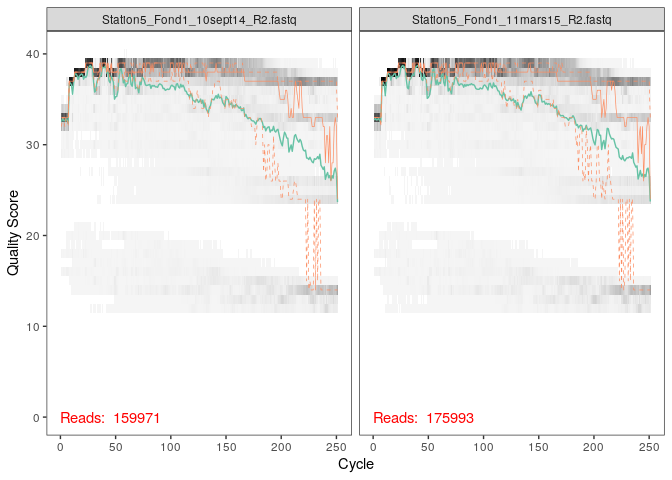
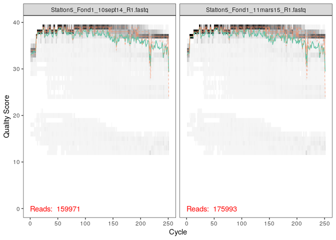
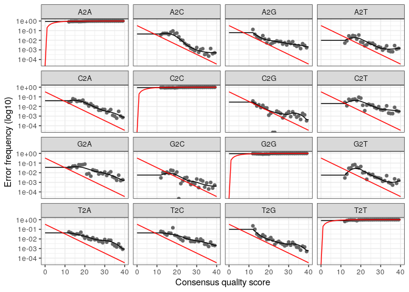
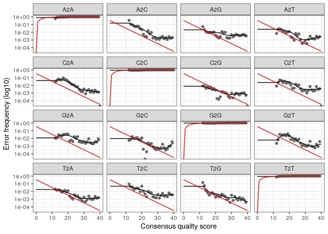
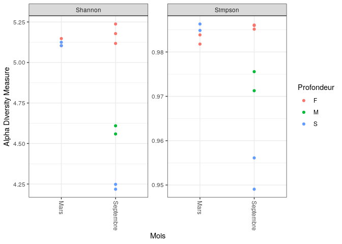
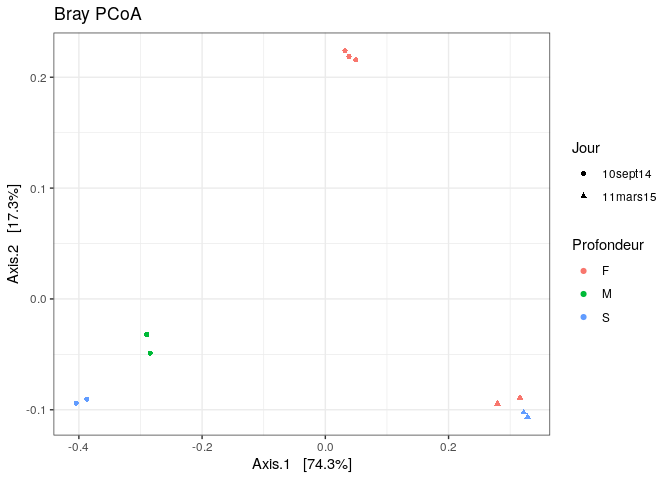
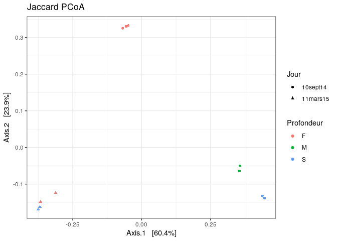
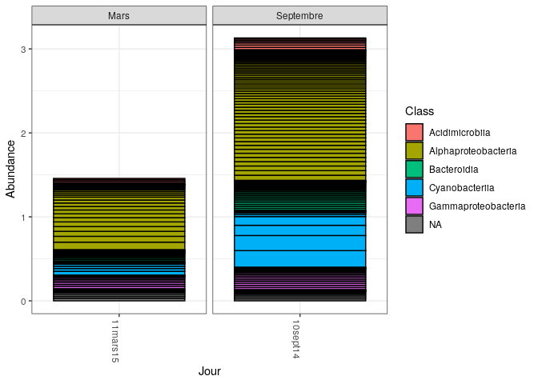
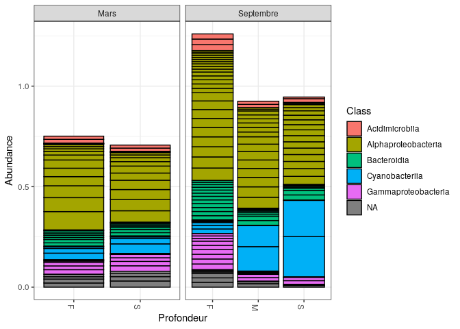

CC2 Rade De Brest
================

``` bash
sudo apt-get update -y
sudo apt-get install -y libglpk-dev
sudo apt-get install -y liblzma-dev libbz2-dev
#sudo apt-get install libxtst6
sudo apt-get install libxt6
```

\#question a répondre : qu’elle est la contribution de la profondeur et
de la saison dans la structuration des communautés micorbiennes
planctoniques de la RADE Brest (station5)

\#charger toutes les librairies

``` r
library(phyloseq)
library(dada2)
```

    ## Loading required package: Rcpp

``` r
library(DECIPHER)
```

    ## Loading required package: Biostrings

    ## Loading required package: BiocGenerics

    ## 
    ## Attaching package: 'BiocGenerics'

    ## The following objects are masked from 'package:stats':
    ## 
    ##     IQR, mad, sd, var, xtabs

    ## The following objects are masked from 'package:base':
    ## 
    ##     anyDuplicated, aperm, append, as.data.frame, basename, cbind,
    ##     colnames, dirname, do.call, duplicated, eval, evalq, Filter, Find,
    ##     get, grep, grepl, intersect, is.unsorted, lapply, Map, mapply,
    ##     match, mget, order, paste, pmax, pmax.int, pmin, pmin.int,
    ##     Position, rank, rbind, Reduce, rownames, sapply, setdiff, sort,
    ##     table, tapply, union, unique, unsplit, which.max, which.min

    ## Loading required package: S4Vectors

    ## Loading required package: stats4

    ## 
    ## Attaching package: 'S4Vectors'

    ## The following objects are masked from 'package:base':
    ## 
    ##     expand.grid, I, unname

    ## Loading required package: IRanges

    ## 
    ## Attaching package: 'IRanges'

    ## The following object is masked from 'package:phyloseq':
    ## 
    ##     distance

    ## Loading required package: XVector

    ## Loading required package: GenomeInfoDb

    ## 
    ## Attaching package: 'Biostrings'

    ## The following object is masked from 'package:base':
    ## 
    ##     strsplit

    ## Loading required package: RSQLite

    ## Loading required package: parallel

``` r
library(phangorn)
```

    ## Loading required package: ape

    ## 
    ## Attaching package: 'ape'

    ## The following object is masked from 'package:Biostrings':
    ## 
    ##     complement

``` r
library(ggplot2)
library(gridExtra)
```

    ## 
    ## Attaching package: 'gridExtra'

    ## The following object is masked from 'package:BiocGenerics':
    ## 
    ##     combine

``` r
library(shiny)
library(miniUI)
library(caret)
```

    ## Loading required package: lattice

``` r
library(pls)
```

    ## 
    ## Attaching package: 'pls'

    ## The following object is masked from 'package:caret':
    ## 
    ##     R2

    ## The following object is masked from 'package:ape':
    ## 
    ##     mvr

    ## The following object is masked from 'package:stats':
    ## 
    ##     loadings

``` r
library(e1071)
library(ggplot2)
library(randomForest)
```

    ## randomForest 4.7-1.1

    ## Type rfNews() to see new features/changes/bug fixes.

    ## 
    ## Attaching package: 'randomForest'

    ## The following object is masked from 'package:gridExtra':
    ## 
    ##     combine

    ## The following object is masked from 'package:ggplot2':
    ## 
    ##     margin

    ## The following object is masked from 'package:BiocGenerics':
    ## 
    ##     combine

``` r
library(dplyr)
```

    ## 
    ## Attaching package: 'dplyr'

    ## The following object is masked from 'package:randomForest':
    ## 
    ##     combine

    ## The following object is masked from 'package:gridExtra':
    ## 
    ##     combine

    ## The following objects are masked from 'package:Biostrings':
    ## 
    ##     collapse, intersect, setdiff, setequal, union

    ## The following object is masked from 'package:GenomeInfoDb':
    ## 
    ##     intersect

    ## The following object is masked from 'package:XVector':
    ## 
    ##     slice

    ## The following objects are masked from 'package:IRanges':
    ## 
    ##     collapse, desc, intersect, setdiff, slice, union

    ## The following objects are masked from 'package:S4Vectors':
    ## 
    ##     first, intersect, rename, setdiff, setequal, union

    ## The following objects are masked from 'package:BiocGenerics':
    ## 
    ##     combine, intersect, setdiff, union

    ## The following objects are masked from 'package:stats':
    ## 
    ##     filter, lag

    ## The following objects are masked from 'package:base':
    ## 
    ##     intersect, setdiff, setequal, union

``` r
library(ggrepel)
#library(nlme)
library(devtools)
```

    ## Loading required package: usethis

``` r
library(reshape2)
library(PMA)
#library(structSSI)
library(ade4)
```

    ## 
    ## Attaching package: 'ade4'

    ## The following object is masked from 'package:Biostrings':
    ## 
    ##     score

    ## The following object is masked from 'package:BiocGenerics':
    ## 
    ##     score

``` r
library(ggnetwork)
library(intergraph)
library(scales)
#library(genefilter)
#library(impute)
library(phyloseqGraphTest)
library(Biostrings)
```

``` bash
wget pagesperso.univ-brest.fr/~maignien/teaching/M1-MFA/UE-Ecogenomique2/EcoG2_data_cc2.tar.gz
tar xzvf EcoG2_data_cc2.tar.gz
```

    ## --2022-12-17 22:18:43--  http://pagesperso.univ-brest.fr/~maignien/teaching/M1-MFA/UE-Ecogenomique2/EcoG2_data_cc2.tar.gz
    ## Resolving pagesperso.univ-brest.fr (pagesperso.univ-brest.fr)... 195.83.247.112
    ## Connecting to pagesperso.univ-brest.fr (pagesperso.univ-brest.fr)|195.83.247.112|:80... connected.
    ## HTTP request sent, awaiting response... 200 OK
    ## Length: 333839543 (318M) [application/x-gzip]
    ## Saving to: ‘EcoG2_data_cc2.tar.gz.14’
    ## 
    ##      0K .......... .......... .......... .......... ..........  0% 1.31M 4m2s
    ##     50K .......... .......... .......... .......... ..........  0% 2.56M 3m3s
    ##    100K .......... .......... .......... .......... ..........  0% 33.0M 2m5s
    ##    150K .......... .......... .......... .......... ..........  0% 2.86M 2m2s
    ##    200K .......... .......... .......... .......... ..........  0% 28.4M 1m40s
    ##    250K .......... .......... .......... .......... ..........  0%  101M 84s
    ##    300K .......... .......... .......... .......... ..........  0%  102M 72s
    ##    350K .......... .......... .......... .......... ..........  0% 2.87M 77s
    ##    400K .......... .......... .......... .......... ..........  0% 68.2M 69s
    ##    450K .......... .......... .......... .......... ..........  0% 77.7M 62s
    ##    500K .......... .......... .......... .......... ..........  0% 40.1M 57s
    ##    550K .......... .......... .......... .......... ..........  0% 67.4M 53s
    ##    600K .......... .......... .......... .......... ..........  0% 29.6M 50s
    ##    650K .......... .......... .......... .......... ..........  0%  114M 46s
    ##    700K .......... .......... .......... .......... ..........  0% 3.79M 49s
    ##    750K .......... .......... .......... .......... ..........  0% 61.2M 46s
    ##    800K .......... .......... .......... .......... ..........  0% 34.2M 44s
    ##    850K .......... .......... .......... .......... ..........  0%  107M 42s
    ##    900K .......... .......... .......... .......... ..........  0% 62.5M 40s
    ##    950K .......... .......... .......... .......... ..........  0% 71.2M 38s
    ##   1000K .......... .......... .......... .......... ..........  0% 61.5M 36s
    ##   1050K .......... .......... .......... .......... ..........  0% 94.6M 35s
    ##   1100K .......... .......... .......... .......... ..........  0% 31.7M 34s
    ##   1150K .......... .......... .......... .......... ..........  0% 91.1M 33s
    ##   1200K .......... .......... .......... .......... ..........  0% 78.3M 31s
    ##   1250K .......... .......... .......... .......... ..........  0% 51.3M 30s
    ##   1300K .......... .......... .......... .......... ..........  0% 95.4M 29s
    ##   1350K .......... .......... .......... .......... ..........  0%  114M 28s
    ##   1400K .......... .......... .......... .......... ..........  0% 6.26M 29s
    ##   1450K .......... .......... .......... .......... ..........  0% 28.1M 29s
    ##   1500K .......... .......... .......... .......... ..........  0% 22.9M 28s
    ##   1550K .......... .......... .......... .......... ..........  0% 99.2M 27s
    ##   1600K .......... .......... .......... .......... ..........  0% 36.8M 27s
    ##   1650K .......... .......... .......... .......... ..........  0% 76.4M 26s
    ##   1700K .......... .......... .......... .......... ..........  0% 68.0M 25s
    ##   1750K .......... .......... .......... .......... ..........  0% 57.1M 25s
    ##   1800K .......... .......... .......... .......... ..........  0% 71.1M 24s
    ##   1850K .......... .......... .......... .......... ..........  0%  111M 24s
    ##   1900K .......... .......... .......... .......... ..........  0% 42.8M 23s
    ##   1950K .......... .......... .......... .......... ..........  0% 30.1M 23s
    ##   2000K .......... .......... .......... .......... ..........  0% 96.3M 23s
    ##   2050K .......... .......... .......... .......... ..........  0% 34.9M 22s
    ##   2100K .......... .......... .......... .......... ..........  0% 62.6M 22s
    ##   2150K .......... .......... .......... .......... ..........  0%  105M 21s
    ##   2200K .......... .......... .......... .......... ..........  0% 66.6M 21s
    ##   2250K .......... .......... .......... .......... ..........  0%  109M 21s
    ##   2300K .......... .......... .......... .......... ..........  0% 13.4M 21s
    ##   2350K .......... .......... .......... .......... ..........  0%  115M 20s
    ##   2400K .......... .......... .......... .......... ..........  0%  120M 20s
    ##   2450K .......... .......... .......... .......... ..........  0%  114M 20s
    ##   2500K .......... .......... .......... .......... ..........  0% 38.6M 19s
    ##   2550K .......... .......... .......... .......... ..........  0% 97.7M 19s
    ##   2600K .......... .......... .......... .......... ..........  0% 90.7M 19s
    ##   2650K .......... .......... .......... .......... ..........  0% 72.0M 19s
    ##   2700K .......... .......... .......... .......... ..........  0%  102M 18s
    ##   2750K .......... .......... .......... .......... ..........  0% 88.6M 18s
    ##   2800K .......... .......... .......... .......... ..........  0% 92.8M 18s
    ##   2850K .......... .......... .......... .......... ..........  0%  103M 17s
    ##   2900K .......... .......... .......... .......... ..........  0% 79.5M 17s
    ##   2950K .......... .......... .......... .......... ..........  0% 90.5M 17s
    ##   3000K .......... .......... .......... .......... ..........  0% 75.4M 17s
    ##   3050K .......... .......... .......... .......... ..........  0% 76.3M 17s
    ##   3100K .......... .......... .......... .......... ..........  0% 83.2M 16s
    ##   3150K .......... .......... .......... .......... ..........  0%  104M 16s
    ##   3200K .......... .......... .......... .......... ..........  0% 49.3M 16s
    ##   3250K .......... .......... .......... .......... ..........  1% 43.9M 16s
    ##   3300K .......... .......... .......... .......... ..........  1% 68.7M 16s
    ##   3350K .......... .......... .......... .......... ..........  1% 77.6M 16s
    ##   3400K .......... .......... .......... .......... ..........  1% 97.3M 15s
    ##   3450K .......... .......... .......... .......... ..........  1% 64.3M 15s
    ##   3500K .......... .......... .......... .......... ..........  1% 30.1M 15s
    ##   3550K .......... .......... .......... .......... ..........  1%  100M 15s
    ##   3600K .......... .......... .......... .......... ..........  1% 63.2M 15s
    ##   3650K .......... .......... .......... .......... ..........  1% 35.2M 15s
    ##   3700K .......... .......... .......... .......... ..........  1% 77.5M 15s
    ##   3750K .......... .......... .......... .......... ..........  1% 18.4M 15s
    ##   3800K .......... .......... .......... .......... ..........  1% 73.9M 14s
    ##   3850K .......... .......... .......... .......... ..........  1% 84.4M 14s
    ##   3900K .......... .......... .......... .......... ..........  1%  102M 14s
    ##   3950K .......... .......... .......... .......... ..........  1% 43.9M 14s
    ##   4000K .......... .......... .......... .......... ..........  1% 21.8M 14s
    ##   4050K .......... .......... .......... .......... ..........  1% 71.2M 14s
    ##   4100K .......... .......... .......... .......... ..........  1% 99.6M 14s
    ##   4150K .......... .......... .......... .......... ..........  1% 31.9M 14s
    ##   4200K .......... .......... .......... .......... ..........  1% 47.4M 14s
    ##   4250K .......... .......... .......... .......... ..........  1% 62.7M 14s
    ##   4300K .......... .......... .......... .......... ..........  1%  104M 13s
    ##   4350K .......... .......... .......... .......... ..........  1% 78.7M 13s
    ##   4400K .......... .......... .......... .......... ..........  1% 52.2M 13s
    ##   4450K .......... .......... .......... .......... ..........  1%  101M 13s
    ##   4500K .......... .......... .......... .......... ..........  1% 52.8M 13s
    ##   4550K .......... .......... .......... .......... ..........  1% 78.4M 13s
    ##   4600K .......... .......... .......... .......... ..........  1% 81.9M 13s
    ##   4650K .......... .......... .......... .......... ..........  1%  118M 13s
    ##   4700K .......... .......... .......... .......... ..........  1%  117M 13s
    ##   4750K .......... .......... .......... .......... ..........  1% 78.7M 13s
    ##   4800K .......... .......... .......... .......... ..........  1% 98.1M 12s
    ##   4850K .......... .......... .......... .......... ..........  1% 77.3M 12s
    ##   4900K .......... .......... .......... .......... ..........  1%  109M 12s
    ##   4950K .......... .......... .......... .......... ..........  1%  107M 12s
    ##   5000K .......... .......... .......... .......... ..........  1% 99.4M 12s
    ##   5050K .......... .......... .......... .......... ..........  1% 93.0M 12s
    ##   5100K .......... .......... .......... .......... ..........  1% 52.4M 12s
    ##   5150K .......... .......... .......... .......... ..........  1%  107M 12s
    ##   5200K .......... .......... .......... .......... ..........  1% 73.9M 12s
    ##   5250K .......... .......... .......... .......... ..........  1% 66.0M 12s
    ##   5300K .......... .......... .......... .......... ..........  1% 23.4M 12s
    ##   5350K .......... .......... .......... .......... ..........  1% 40.7M 12s
    ##   5400K .......... .......... .......... .......... ..........  1% 47.0M 12s
    ##   5450K .......... .......... .......... .......... ..........  1% 67.5M 12s
    ##   5500K .......... .......... .......... .......... ..........  1% 33.7M 12s
    ##   5550K .......... .......... .......... .......... ..........  1% 56.8M 12s
    ##   5600K .......... .......... .......... .......... ..........  1% 63.8M 11s
    ##   5650K .......... .......... .......... .......... ..........  1% 22.3M 11s
    ##   5700K .......... .......... .......... .......... ..........  1% 73.8M 11s
    ##   5750K .......... .......... .......... .......... ..........  1%  100M 11s
    ##   5800K .......... .......... .......... .......... ..........  1% 37.6M 11s
    ##   5850K .......... .......... .......... .......... ..........  1% 99.7M 11s
    ##   5900K .......... .......... .......... .......... ..........  1% 67.0M 11s
    ##   5950K .......... .......... .......... .......... ..........  1%  114M 11s
    ##   6000K .......... .......... .......... .......... ..........  1% 87.1M 11s
    ##   6050K .......... .......... .......... .......... ..........  1% 63.4M 11s
    ##   6100K .......... .......... .......... .......... ..........  1%  107M 11s
    ##   6150K .......... .......... .......... .......... ..........  1% 76.4M 11s
    ##   6200K .......... .......... .......... .......... ..........  1%  123M 11s
    ##   6250K .......... .......... .......... .......... ..........  1% 94.7M 11s
    ##   6300K .......... .......... .......... .......... ..........  1%  102M 11s
    ##   6350K .......... .......... .......... .......... ..........  1%  109M 11s
    ##   6400K .......... .......... .......... .......... ..........  1% 79.2M 11s
    ##   6450K .......... .......... .......... .......... ..........  1% 68.0M 11s
    ##   6500K .......... .......... .......... .......... ..........  2% 68.9M 10s
    ##   6550K .......... .......... .......... .......... ..........  2% 86.3M 10s
    ##   6600K .......... .......... .......... .......... ..........  2% 90.7M 10s
    ##   6650K .......... .......... .......... .......... ..........  2% 83.9M 10s
    ##   6700K .......... .......... .......... .......... ..........  2% 36.5M 10s
    ##   6750K .......... .......... .......... .......... ..........  2% 65.4M 10s
    ##   6800K .......... .......... .......... .......... ..........  2% 76.5M 10s
    ##   6850K .......... .......... .......... .......... ..........  2% 25.1M 10s
    ##   6900K .......... .......... .......... .......... ..........  2% 58.5M 10s
    ##   6950K .......... .......... .......... .......... ..........  2% 63.4M 10s
    ##   7000K .......... .......... .......... .......... ..........  2% 48.4M 10s
    ##   7050K .......... .......... .......... .......... ..........  2% 60.7M 10s
    ##   7100K .......... .......... .......... .......... ..........  2% 37.5M 10s
    ##   7150K .......... .......... .......... .......... ..........  2% 53.1M 10s
    ##   7200K .......... .......... .......... .......... ..........  2% 55.2M 10s
    ##   7250K .......... .......... .......... .......... ..........  2% 31.4M 10s
    ##   7300K .......... .......... .......... .......... ..........  2% 92.1M 10s
    ##   7350K .......... .......... .......... .......... ..........  2%  112M 10s
    ##   7400K .......... .......... .......... .......... ..........  2% 28.3M 10s
    ##   7450K .......... .......... .......... .......... ..........  2%  110M 10s
    ##   7500K .......... .......... .......... .......... ..........  2%  120M 10s
    ##   7550K .......... .......... .......... .......... ..........  2% 91.1M 10s
    ##   7600K .......... .......... .......... .......... ..........  2% 45.4M 10s
    ##   7650K .......... .......... .......... .......... ..........  2% 66.4M 10s
    ##   7700K .......... .......... .......... .......... ..........  2% 95.8M 10s
    ##   7750K .......... .......... .......... .......... ..........  2% 88.2M 10s
    ##   7800K .......... .......... .......... .......... ..........  2% 67.1M 10s
    ##   7850K .......... .......... .......... .......... ..........  2% 84.9M 10s
    ##   7900K .......... .......... .......... .......... ..........  2% 89.2M 10s
    ##   7950K .......... .......... .......... .......... ..........  2% 65.3M 9s
    ##   8000K .......... .......... .......... .......... ..........  2% 84.2M 9s
    ##   8050K .......... .......... .......... .......... ..........  2% 87.3M 9s
    ##   8100K .......... .......... .......... .......... ..........  2% 69.4M 9s
    ##   8150K .......... .......... .......... .......... ..........  2% 76.6M 9s
    ##   8200K .......... .......... .......... .......... ..........  2% 59.0M 9s
    ##   8250K .......... .......... .......... .......... ..........  2% 72.6M 9s
    ##   8300K .......... .......... .......... .......... ..........  2% 69.6M 9s
    ##   8350K .......... .......... .......... .......... ..........  2% 93.1M 9s
    ##   8400K .......... .......... .......... .......... ..........  2% 70.7M 9s
    ##   8450K .......... .......... .......... .......... ..........  2% 69.2M 9s
    ##   8500K .......... .......... .......... .......... ..........  2% 21.9M 9s
    ##   8550K .......... .......... .......... .......... ..........  2% 65.0M 9s
    ##   8600K .......... .......... .......... .......... ..........  2% 36.1M 9s
    ##   8650K .......... .......... .......... .......... ..........  2%  102M 9s
    ##   8700K .......... .......... .......... .......... ..........  2%  108M 9s
    ##   8750K .......... .......... .......... .......... ..........  2% 81.7M 9s
    ##   8800K .......... .......... .......... .......... ..........  2% 47.0M 9s
    ##   8850K .......... .......... .......... .......... ..........  2% 89.9M 9s
    ##   8900K .......... .......... .......... .......... ..........  2% 79.0M 9s
    ##   8950K .......... .......... .......... .......... ..........  2% 76.2M 9s
    ##   9000K .......... .......... .......... .......... ..........  2% 37.6M 9s
    ##   9050K .......... .......... .......... .......... ..........  2% 81.4M 9s
    ##   9100K .......... .......... .......... .......... ..........  2%  100M 9s
    ##   9150K .......... .......... .......... .......... ..........  2% 60.1M 9s
    ##   9200K .......... .......... .......... .......... ..........  2% 65.4M 9s
    ##   9250K .......... .......... .......... .......... ..........  2% 49.5M 9s
    ##   9300K .......... .......... .......... .......... ..........  2% 41.9M 9s
    ##   9350K .......... .......... .......... .......... ..........  2% 90.9M 9s
    ##   9400K .......... .......... .......... .......... ..........  2% 96.5M 9s
    ##   9450K .......... .......... .......... .......... ..........  2% 87.4M 9s
    ##   9500K .......... .......... .......... .......... ..........  2% 47.8M 9s
    ##   9550K .......... .......... .......... .......... ..........  2% 72.6M 9s
    ##   9600K .......... .......... .......... .......... ..........  2% 66.9M 9s
    ##   9650K .......... .......... .......... .......... ..........  2% 88.4M 9s
    ##   9700K .......... .......... .......... .......... ..........  2% 61.1M 9s
    ##   9750K .......... .......... .......... .......... ..........  3% 41.6M 9s
    ##   9800K .......... .......... .......... .......... ..........  3%  104M 9s
    ##   9850K .......... .......... .......... .......... ..........  3% 65.2M 9s
    ##   9900K .......... .......... .......... .......... ..........  3% 69.9M 9s
    ##   9950K .......... .......... .......... .......... ..........  3% 29.7M 9s
    ##  10000K .......... .......... .......... .......... ..........  3%  101M 9s
    ##  10050K .......... .......... .......... .......... ..........  3%  102M 8s
    ##  10100K .......... .......... .......... .......... ..........  3% 83.6M 8s
    ##  10150K .......... .......... .......... .......... ..........  3% 80.9M 8s
    ##  10200K .......... .......... .......... .......... ..........  3% 69.0M 8s
    ##  10250K .......... .......... .......... .......... ..........  3% 69.4M 8s
    ##  10300K .......... .......... .......... .......... ..........  3% 50.6M 8s
    ##  10350K .......... .......... .......... .......... ..........  3% 56.1M 8s
    ##  10400K .......... .......... .......... .......... ..........  3%  109M 8s
    ##  10450K .......... .......... .......... .......... ..........  3% 51.7M 8s
    ##  10500K .......... .......... .......... .......... ..........  3%  106M 8s
    ##  10550K .......... .......... .......... .......... ..........  3% 54.4M 8s
    ##  10600K .......... .......... .......... .......... ..........  3% 97.9M 8s
    ##  10650K .......... .......... .......... .......... ..........  3% 64.3M 8s
    ##  10700K .......... .......... .......... .......... ..........  3% 67.6M 8s
    ##  10750K .......... .......... .......... .......... ..........  3% 30.1M 8s
    ##  10800K .......... .......... .......... .......... ..........  3%  117M 8s
    ##  10850K .......... .......... .......... .......... ..........  3% 51.3M 8s
    ##  10900K .......... .......... .......... .......... ..........  3% 98.9M 8s
    ##  10950K .......... .......... .......... .......... ..........  3% 81.1M 8s
    ##  11000K .......... .......... .......... .......... ..........  3% 80.3M 8s
    ##  11050K .......... .......... .......... .......... ..........  3% 68.6M 8s
    ##  11100K .......... .......... .......... .......... ..........  3% 25.0M 8s
    ##  11150K .......... .......... .......... .......... ..........  3% 65.8M 8s
    ##  11200K .......... .......... .......... .......... ..........  3% 87.3M 8s
    ##  11250K .......... .......... .......... .......... ..........  3% 91.6M 8s
    ##  11300K .......... .......... .......... .......... ..........  3% 60.2M 8s
    ##  11350K .......... .......... .......... .......... ..........  3%  113M 8s
    ##  11400K .......... .......... .......... .......... ..........  3% 56.8M 8s
    ##  11450K .......... .......... .......... .......... ..........  3%  100M 8s
    ##  11500K .......... .......... .......... .......... ..........  3% 79.7M 8s
    ##  11550K .......... .......... .......... .......... ..........  3% 82.7M 8s
    ##  11600K .......... .......... .......... .......... ..........  3% 73.9M 8s
    ##  11650K .......... .......... .......... .......... ..........  3% 77.0M 8s
    ##  11700K .......... .......... .......... .......... ..........  3% 81.2M 8s
    ##  11750K .......... .......... .......... .......... ..........  3% 93.3M 8s
    ##  11800K .......... .......... .......... .......... ..........  3% 17.5M 8s
    ##  11850K .......... .......... .......... .......... ..........  3%  128M 8s
    ##  11900K .......... .......... .......... .......... ..........  3% 61.0M 8s
    ##  11950K .......... .......... .......... .......... ..........  3% 86.2M 8s
    ##  12000K .......... .......... .......... .......... ..........  3% 72.2M 8s
    ##  12050K .......... .......... .......... .......... ..........  3% 93.5M 8s
    ##  12100K .......... .......... .......... .......... ..........  3%  124M 8s
    ##  12150K .......... .......... .......... .......... ..........  3%  101M 8s
    ##  12200K .......... .......... .......... .......... ..........  3% 56.3M 8s
    ##  12250K .......... .......... .......... .......... ..........  3% 52.1M 8s
    ##  12300K .......... .......... .......... .......... ..........  3% 75.0M 8s
    ##  12350K .......... .......... .......... .......... ..........  3% 83.7M 8s
    ##  12400K .......... .......... .......... .......... ..........  3% 47.7M 8s
    ##  12450K .......... .......... .......... .......... ..........  3% 84.7M 8s
    ##  12500K .......... .......... .......... .......... ..........  3% 49.1M 8s
    ##  12550K .......... .......... .......... .......... ..........  3% 86.5M 8s
    ##  12600K .......... .......... .......... .......... ..........  3% 66.2M 8s
    ##  12650K .......... .......... .......... .......... ..........  3% 54.7M 8s
    ##  12700K .......... .......... .......... .......... ..........  3%  106M 8s
    ##  12750K .......... .......... .......... .......... ..........  3% 52.0M 8s
    ##  12800K .......... .......... .......... .......... ..........  3% 79.8M 8s
    ##  12850K .......... .......... .......... .......... ..........  3% 54.2M 8s
    ##  12900K .......... .......... .......... .......... ..........  3% 94.4M 8s
    ##  12950K .......... .......... .......... .......... ..........  3% 55.1M 8s
    ##  13000K .......... .......... .......... .......... ..........  4% 96.2M 8s
    ##  13050K .......... .......... .......... .......... ..........  4% 87.7M 8s
    ##  13100K .......... .......... .......... .......... ..........  4% 81.3M 8s
    ##  13150K .......... .......... .......... .......... ..........  4% 37.0M 8s
    ##  13200K .......... .......... .......... .......... ..........  4% 35.6M 8s
    ##  13250K .......... .......... .......... .......... ..........  4% 72.3M 8s
    ##  13300K .......... .......... .......... .......... ..........  4% 38.5M 8s
    ##  13350K .......... .......... .......... .......... ..........  4% 92.5M 7s
    ##  13400K .......... .......... .......... .......... ..........  4%  112M 7s
    ##  13450K .......... .......... .......... .......... ..........  4% 91.0M 7s
    ##  13500K .......... .......... .......... .......... ..........  4% 64.7M 7s
    ##  13550K .......... .......... .......... .......... ..........  4% 74.8M 7s
    ##  13600K .......... .......... .......... .......... ..........  4% 73.5M 7s
    ##  13650K .......... .......... .......... .......... ..........  4% 57.0M 7s
    ##  13700K .......... .......... .......... .......... ..........  4% 86.5M 7s
    ##  13750K .......... .......... .......... .......... ..........  4% 63.2M 7s
    ##  13800K .......... .......... .......... .......... ..........  4% 56.7M 7s
    ##  13850K .......... .......... .......... .......... ..........  4% 97.6M 7s
    ##  13900K .......... .......... .......... .......... ..........  4% 63.3M 7s
    ##  13950K .......... .......... .......... .......... ..........  4% 74.5M 7s
    ##  14000K .......... .......... .......... .......... ..........  4% 57.0M 7s
    ##  14050K .......... .......... .......... .......... ..........  4% 41.5M 7s
    ##  14100K .......... .......... .......... .......... ..........  4% 71.4M 7s
    ##  14150K .......... .......... .......... .......... ..........  4% 51.3M 7s
    ##  14200K .......... .......... .......... .......... ..........  4% 60.4M 7s
    ##  14250K .......... .......... .......... .......... ..........  4% 95.4M 7s
    ##  14300K .......... .......... .......... .......... ..........  4%  100M 7s
    ##  14350K .......... .......... .......... .......... ..........  4% 82.9M 7s
    ##  14400K .......... .......... .......... .......... ..........  4%  100M 7s
    ##  14450K .......... .......... .......... .......... ..........  4% 59.2M 7s
    ##  14500K .......... .......... .......... .......... ..........  4% 85.2M 7s
    ##  14550K .......... .......... .......... .......... ..........  4% 77.5M 7s
    ##  14600K .......... .......... .......... .......... ..........  4% 36.1M 7s
    ##  14650K .......... .......... .......... .......... ..........  4% 92.6M 7s
    ##  14700K .......... .......... .......... .......... ..........  4% 47.9M 7s
    ##  14750K .......... .......... .......... .......... ..........  4% 45.7M 7s
    ##  14800K .......... .......... .......... .......... ..........  4% 62.0M 7s
    ##  14850K .......... .......... .......... .......... ..........  4% 84.6M 7s
    ##  14900K .......... .......... .......... .......... ..........  4% 68.0M 7s
    ##  14950K .......... .......... .......... .......... ..........  4% 50.4M 7s
    ##  15000K .......... .......... .......... .......... ..........  4% 40.0M 7s
    ##  15050K .......... .......... .......... .......... ..........  4% 89.4M 7s
    ##  15100K .......... .......... .......... .......... ..........  4%  129M 7s
    ##  15150K .......... .......... .......... .......... ..........  4% 77.9M 7s
    ##  15200K .......... .......... .......... .......... ..........  4%  117M 7s
    ##  15250K .......... .......... .......... .......... ..........  4% 71.0M 7s
    ##  15300K .......... .......... .......... .......... ..........  4% 74.3M 7s
    ##  15350K .......... .......... .......... .......... ..........  4% 37.1M 7s
    ##  15400K .......... .......... .......... .......... ..........  4% 60.8M 7s
    ##  15450K .......... .......... .......... .......... ..........  4%  117M 7s
    ##  15500K .......... .......... .......... .......... ..........  4% 85.2M 7s
    ##  15550K .......... .......... .......... .......... ..........  4% 46.8M 7s
    ##  15600K .......... .......... .......... .......... ..........  4% 81.3M 7s
    ##  15650K .......... .......... .......... .......... ..........  4% 67.2M 7s
    ##  15700K .......... .......... .......... .......... ..........  4%  109M 7s
    ##  15750K .......... .......... .......... .......... ..........  4% 65.2M 7s
    ##  15800K .......... .......... .......... .......... ..........  4% 99.5M 7s
    ##  15850K .......... .......... .......... .......... ..........  4% 62.8M 7s
    ##  15900K .......... .......... .......... .......... ..........  4% 33.3M 7s
    ##  15950K .......... .......... .......... .......... ..........  4% 78.3M 7s
    ##  16000K .......... .......... .......... .......... ..........  4% 90.2M 7s
    ##  16050K .......... .......... .......... .......... ..........  4% 69.3M 7s
    ##  16100K .......... .......... .......... .......... ..........  4% 51.1M 7s
    ##  16150K .......... .......... .......... .......... ..........  4% 82.7M 7s
    ##  16200K .......... .......... .......... .......... ..........  4% 83.1M 7s
    ##  16250K .......... .......... .......... .......... ..........  4% 78.4M 7s
    ##  16300K .......... .......... .......... .......... ..........  5% 49.2M 7s
    ##  16350K .......... .......... .......... .......... ..........  5% 49.2M 7s
    ##  16400K .......... .......... .......... .......... ..........  5% 66.0M 7s
    ##  16450K .......... .......... .......... .......... ..........  5% 87.3M 7s
    ##  16500K .......... .......... .......... .......... ..........  5% 51.5M 7s
    ##  16550K .......... .......... .......... .......... ..........  5%  106M 7s
    ##  16600K .......... .......... .......... .......... ..........  5% 53.7M 7s
    ##  16650K .......... .......... .......... .......... ..........  5% 86.1M 7s
    ##  16700K .......... .......... .......... .......... ..........  5% 39.2M 7s
    ##  16750K .......... .......... .......... .......... ..........  5%  128M 7s
    ##  16800K .......... .......... .......... .......... ..........  5% 79.6M 7s
    ##  16850K .......... .......... .......... .......... ..........  5% 46.4M 7s
    ##  16900K .......... .......... .......... .......... ..........  5% 68.7M 7s
    ##  16950K .......... .......... .......... .......... ..........  5% 87.9M 7s
    ##  17000K .......... .......... .......... .......... ..........  5% 66.3M 7s
    ##  17050K .......... .......... .......... .......... ..........  5% 42.0M 7s
    ##  17100K .......... .......... .......... .......... ..........  5% 87.7M 7s
    ##  17150K .......... .......... .......... .......... ..........  5% 75.1M 7s
    ##  17200K .......... .......... .......... .......... ..........  5% 95.1M 7s
    ##  17250K .......... .......... .......... .......... ..........  5% 83.0M 7s
    ##  17300K .......... .......... .......... .......... ..........  5% 54.4M 7s
    ##  17350K .......... .......... .......... .......... ..........  5% 87.3M 7s
    ##  17400K .......... .......... .......... .......... ..........  5% 56.3M 7s
    ##  17450K .......... .......... .......... .......... ..........  5% 82.7M 7s
    ##  17500K .......... .......... .......... .......... ..........  5% 68.5M 7s
    ##  17550K .......... .......... .......... .......... ..........  5% 71.2M 7s
    ##  17600K .......... .......... .......... .......... ..........  5% 62.8M 7s
    ##  17650K .......... .......... .......... .......... ..........  5% 73.7M 7s
    ##  17700K .......... .......... .......... .......... ..........  5% 45.3M 7s
    ##  17750K .......... .......... .......... .......... ..........  5% 90.1M 7s
    ##  17800K .......... .......... .......... .......... ..........  5% 80.0M 7s
    ##  17850K .......... .......... .......... .......... ..........  5% 57.3M 7s
    ##  17900K .......... .......... .......... .......... ..........  5% 45.9M 7s
    ##  17950K .......... .......... .......... .......... ..........  5% 96.3M 7s
    ##  18000K .......... .......... .......... .......... ..........  5% 50.1M 7s
    ##  18050K .......... .......... .......... .......... ..........  5% 68.6M 7s
    ##  18100K .......... .......... .......... .......... ..........  5% 54.0M 7s
    ##  18150K .......... .......... .......... .......... ..........  5%  101M 7s
    ##  18200K .......... .......... .......... .......... ..........  5% 78.5M 7s
    ##  18250K .......... .......... .......... .......... ..........  5% 67.6M 7s
    ##  18300K .......... .......... .......... .......... ..........  5% 95.1M 7s
    ##  18350K .......... .......... .......... .......... ..........  5% 56.4M 7s
    ##  18400K .......... .......... .......... .......... ..........  5% 64.6M 7s
    ##  18450K .......... .......... .......... .......... ..........  5% 46.2M 7s
    ##  18500K .......... .......... .......... .......... ..........  5% 86.3M 7s
    ##  18550K .......... .......... .......... .......... ..........  5% 97.0M 7s
    ##  18600K .......... .......... .......... .......... ..........  5% 72.9M 7s
    ##  18650K .......... .......... .......... .......... ..........  5% 67.4M 7s
    ##  18700K .......... .......... .......... .......... ..........  5% 64.6M 7s
    ##  18750K .......... .......... .......... .......... ..........  5% 62.3M 7s
    ##  18800K .......... .......... .......... .......... ..........  5% 70.8M 7s
    ##  18850K .......... .......... .......... .......... ..........  5% 69.8M 7s
    ##  18900K .......... .......... .......... .......... ..........  5% 70.2M 7s
    ##  18950K .......... .......... .......... .......... ..........  5% 67.4M 7s
    ##  19000K .......... .......... .......... .......... ..........  5% 66.3M 7s
    ##  19050K .......... .......... .......... .......... ..........  5% 55.8M 7s
    ##  19100K .......... .......... .......... .......... ..........  5% 35.5M 7s
    ##  19150K .......... .......... .......... .......... ..........  5% 87.3M 6s
    ##  19200K .......... .......... .......... .......... ..........  5% 76.2M 6s
    ##  19250K .......... .......... .......... .......... ..........  5% 70.5M 6s
    ##  19300K .......... .......... .......... .......... ..........  5% 74.0M 6s
    ##  19350K .......... .......... .......... .......... ..........  5% 57.2M 6s
    ##  19400K .......... .......... .......... .......... ..........  5% 64.7M 6s
    ##  19450K .......... .......... .......... .......... ..........  5% 70.3M 6s
    ##  19500K .......... .......... .......... .......... ..........  5% 96.4M 6s
    ##  19550K .......... .......... .......... .......... ..........  6% 52.6M 6s
    ##  19600K .......... .......... .......... .......... ..........  6% 82.2M 6s
    ##  19650K .......... .......... .......... .......... ..........  6% 65.5M 6s
    ##  19700K .......... .......... .......... .......... ..........  6% 60.8M 6s
    ##  19750K .......... .......... .......... .......... ..........  6% 68.8M 6s
    ##  19800K .......... .......... .......... .......... ..........  6% 60.9M 6s
    ##  19850K .......... .......... .......... .......... ..........  6% 97.5M 6s
    ##  19900K .......... .......... .......... .......... ..........  6% 56.3M 6s
    ##  19950K .......... .......... .......... .......... ..........  6% 56.4M 6s
    ##  20000K .......... .......... .......... .......... ..........  6% 95.5M 6s
    ##  20050K .......... .......... .......... .......... ..........  6% 57.8M 6s
    ##  20100K .......... .......... .......... .......... ..........  6% 78.2M 6s
    ##  20150K .......... .......... .......... .......... ..........  6% 57.9M 6s
    ##  20200K .......... .......... .......... .......... ..........  6% 61.7M 6s
    ##  20250K .......... .......... .......... .......... ..........  6% 80.6M 6s
    ##  20300K .......... .......... .......... .......... ..........  6% 61.3M 6s
    ##  20350K .......... .......... .......... .......... ..........  6%  101M 6s
    ##  20400K .......... .......... .......... .......... ..........  6% 52.8M 6s
    ##  20450K .......... .......... .......... .......... ..........  6% 69.4M 6s
    ##  20500K .......... .......... .......... .......... ..........  6% 70.5M 6s
    ##  20550K .......... .......... .......... .......... ..........  6% 87.0M 6s
    ##  20600K .......... .......... .......... .......... ..........  6% 56.4M 6s
    ##  20650K .......... .......... .......... .......... ..........  6% 66.4M 6s
    ##  20700K .......... .......... .......... .......... ..........  6% 70.2M 6s
    ##  20750K .......... .......... .......... .......... ..........  6% 39.8M 6s
    ##  20800K .......... .......... .......... .......... ..........  6% 86.3M 6s
    ##  20850K .......... .......... .......... .......... ..........  6% 63.0M 6s
    ##  20900K .......... .......... .......... .......... ..........  6% 76.2M 6s
    ##  20950K .......... .......... .......... .......... ..........  6% 26.7M 6s
    ##  21000K .......... .......... .......... .......... ..........  6% 93.2M 6s
    ##  21050K .......... .......... .......... .......... ..........  6%  115M 6s
    ##  21100K .......... .......... .......... .......... ..........  6% 95.5M 6s
    ##  21150K .......... .......... .......... .......... ..........  6% 55.0M 6s
    ##  21200K .......... .......... .......... .......... ..........  6% 70.2M 6s
    ##  21250K .......... .......... .......... .......... ..........  6% 56.3M 6s
    ##  21300K .......... .......... .......... .......... ..........  6% 93.1M 6s
    ##  21350K .......... .......... .......... .......... ..........  6% 45.8M 6s
    ##  21400K .......... .......... .......... .......... ..........  6% 75.0M 6s
    ##  21450K .......... .......... .......... .......... ..........  6% 76.3M 6s
    ##  21500K .......... .......... .......... .......... ..........  6% 96.5M 6s
    ##  21550K .......... .......... .......... .......... ..........  6% 58.0M 6s
    ##  21600K .......... .......... .......... .......... ..........  6% 58.8M 6s
    ##  21650K .......... .......... .......... .......... ..........  6% 90.6M 6s
    ##  21700K .......... .......... .......... .......... ..........  6% 72.0M 6s
    ##  21750K .......... .......... .......... .......... ..........  6% 80.6M 6s
    ##  21800K .......... .......... .......... .......... ..........  6% 80.7M 6s
    ##  21850K .......... .......... .......... .......... ..........  6% 53.5M 6s
    ##  21900K .......... .......... .......... .......... ..........  6% 54.7M 6s
    ##  21950K .......... .......... .......... .......... ..........  6% 73.0M 6s
    ##  22000K .......... .......... .......... .......... ..........  6% 95.7M 6s
    ##  22050K .......... .......... .......... .......... ..........  6% 61.7M 6s
    ##  22100K .......... .......... .......... .......... ..........  6% 76.3M 6s
    ##  22150K .......... .......... .......... .......... ..........  6% 59.2M 6s
    ##  22200K .......... .......... .......... .......... ..........  6% 84.3M 6s
    ##  22250K .......... .......... .......... .......... ..........  6% 44.1M 6s
    ##  22300K .......... .......... .......... .......... ..........  6% 41.8M 6s
    ##  22350K .......... .......... .......... .......... ..........  6%  106M 6s
    ##  22400K .......... .......... .......... .......... ..........  6% 84.3M 6s
    ##  22450K .......... .......... .......... .......... ..........  6% 49.3M 6s
    ##  22500K .......... .......... .......... .......... ..........  6% 84.5M 6s
    ##  22550K .......... .......... .......... .......... ..........  6% 68.2M 6s
    ##  22600K .......... .......... .......... .......... ..........  6% 70.2M 6s
    ##  22650K .......... .......... .......... .......... ..........  6% 95.0M 6s
    ##  22700K .......... .......... .......... .......... ..........  6% 62.0M 6s
    ##  22750K .......... .......... .......... .......... ..........  6% 36.3M 6s
    ##  22800K .......... .......... .......... .......... ..........  7% 76.4M 6s
    ##  22850K .......... .......... .......... .......... ..........  7%  111M 6s
    ##  22900K .......... .......... .......... .......... ..........  7% 62.5M 6s
    ##  22950K .......... .......... .......... .......... ..........  7% 73.4M 6s
    ##  23000K .......... .......... .......... .......... ..........  7% 47.3M 6s
    ##  23050K .......... .......... .......... .......... ..........  7% 87.4M 6s
    ##  23100K .......... .......... .......... .......... ..........  7% 57.5M 6s
    ##  23150K .......... .......... .......... .......... ..........  7% 96.0M 6s
    ##  23200K .......... .......... .......... .......... ..........  7% 88.1M 6s
    ##  23250K .......... .......... .......... .......... ..........  7% 31.4M 6s
    ##  23300K .......... .......... .......... .......... ..........  7%  116M 6s
    ##  23350K .......... .......... .......... .......... ..........  7% 89.8M 6s
    ##  23400K .......... .......... .......... .......... ..........  7%  104M 6s
    ##  23450K .......... .......... .......... .......... ..........  7% 72.2M 6s
    ##  23500K .......... .......... .......... .......... ..........  7% 58.6M 6s
    ##  23550K .......... .......... .......... .......... ..........  7% 67.1M 6s
    ##  23600K .......... .......... .......... .......... ..........  7% 51.7M 6s
    ##  23650K .......... .......... .......... .......... ..........  7% 89.3M 6s
    ##  23700K .......... .......... .......... .......... ..........  7% 50.4M 6s
    ##  23750K .......... .......... .......... .......... ..........  7% 83.8M 6s
    ##  23800K .......... .......... .......... .......... ..........  7% 76.1M 6s
    ##  23850K .......... .......... .......... .......... ..........  7% 70.0M 6s
    ##  23900K .......... .......... .......... .......... ..........  7% 67.0M 6s
    ##  23950K .......... .......... .......... .......... ..........  7% 45.2M 6s
    ##  24000K .......... .......... .......... .......... ..........  7% 76.3M 6s
    ##  24050K .......... .......... .......... .......... ..........  7%  112M 6s
    ##  24100K .......... .......... .......... .......... ..........  7% 64.1M 6s
    ##  24150K .......... .......... .......... .......... ..........  7% 64.2M 6s
    ##  24200K .......... .......... .......... .......... ..........  7% 68.3M 6s
    ##  24250K .......... .......... .......... .......... ..........  7% 59.6M 6s
    ##  24300K .......... .......... .......... .......... ..........  7% 54.0M 6s
    ##  24350K .......... .......... .......... .......... ..........  7% 71.3M 6s
    ##  24400K .......... .......... .......... .......... ..........  7% 90.3M 6s
    ##  24450K .......... .......... .......... .......... ..........  7% 55.3M 6s
    ##  24500K .......... .......... .......... .......... ..........  7% 77.0M 6s
    ##  24550K .......... .......... .......... .......... ..........  7% 55.1M 6s
    ##  24600K .......... .......... .......... .......... ..........  7% 45.0M 6s
    ##  24650K .......... .......... .......... .......... ..........  7% 94.4M 6s
    ##  24700K .......... .......... .......... .......... ..........  7% 57.3M 6s
    ##  24750K .......... .......... .......... .......... ..........  7% 72.7M 6s
    ##  24800K .......... .......... .......... .......... ..........  7% 86.0M 6s
    ##  24850K .......... .......... .......... .......... ..........  7% 51.2M 6s
    ##  24900K .......... .......... .......... .......... ..........  7%  111M 6s
    ##  24950K .......... .......... .......... .......... ..........  7% 87.1M 6s
    ##  25000K .......... .......... .......... .......... ..........  7% 86.5M 6s
    ##  25050K .......... .......... .......... .......... ..........  7% 45.2M 6s
    ##  25100K .......... .......... .......... .......... ..........  7%  101M 6s
    ##  25150K .......... .......... .......... .......... ..........  7% 79.9M 6s
    ##  25200K .......... .......... .......... .......... ..........  7% 47.1M 6s
    ##  25250K .......... .......... .......... .......... ..........  7%  114M 6s
    ##  25300K .......... .......... .......... .......... ..........  7% 59.3M 6s
    ##  25350K .......... .......... .......... .......... ..........  7% 63.0M 6s
    ##  25400K .......... .......... .......... .......... ..........  7% 73.1M 6s
    ##  25450K .......... .......... .......... .......... ..........  7% 85.5M 6s
    ##  25500K .......... .......... .......... .......... ..........  7% 51.8M 6s
    ##  25550K .......... .......... .......... .......... ..........  7% 64.9M 6s
    ##  25600K .......... .......... .......... .......... ..........  7% 72.8M 6s
    ##  25650K .......... .......... .......... .......... ..........  7% 91.7M 6s
    ##  25700K .......... .......... .......... .......... ..........  7% 64.6M 6s
    ##  25750K .......... .......... .......... .......... ..........  7% 58.8M 6s
    ##  25800K .......... .......... .......... .......... ..........  7% 37.2M 6s
    ##  25850K .......... .......... .......... .......... ..........  7% 92.9M 6s
    ##  25900K .......... .......... .......... .......... ..........  7% 59.8M 6s
    ##  25950K .......... .......... .......... .......... ..........  7% 66.5M 6s
    ##  26000K .......... .......... .......... .......... ..........  7% 91.6M 6s
    ##  26050K .......... .......... .......... .......... ..........  8% 69.6M 6s
    ##  26100K .......... .......... .......... .......... ..........  8% 42.7M 6s
    ##  26150K .......... .......... .......... .......... ..........  8% 64.7M 6s
    ##  26200K .......... .......... .......... .......... ..........  8% 79.2M 6s
    ##  26250K .......... .......... .......... .......... ..........  8% 71.8M 6s
    ##  26300K .......... .......... .......... .......... ..........  8% 85.9M 6s
    ##  26350K .......... .......... .......... .......... ..........  8% 38.2M 6s
    ##  26400K .......... .......... .......... .......... ..........  8% 63.5M 6s
    ##  26450K .......... .......... .......... .......... ..........  8% 49.8M 6s
    ##  26500K .......... .......... .......... .......... ..........  8% 50.0M 6s
    ##  26550K .......... .......... .......... .......... ..........  8% 52.7M 6s
    ##  26600K .......... .......... .......... .......... ..........  8% 80.1M 6s
    ##  26650K .......... .......... .......... .......... ..........  8% 72.4M 6s
    ##  26700K .......... .......... .......... .......... ..........  8% 75.6M 6s
    ##  26750K .......... .......... .......... .......... ..........  8% 69.4M 6s
    ##  26800K .......... .......... .......... .......... ..........  8% 63.9M 6s
    ##  26850K .......... .......... .......... .......... ..........  8% 57.0M 6s
    ##  26900K .......... .......... .......... .......... ..........  8% 89.4M 6s
    ##  26950K .......... .......... .......... .......... ..........  8% 30.3M 6s
    ##  27000K .......... .......... .......... .......... ..........  8%  123M 6s
    ##  27050K .......... .......... .......... .......... ..........  8% 95.0M 6s
    ##  27100K .......... .......... .......... .......... ..........  8% 74.2M 6s
    ##  27150K .......... .......... .......... .......... ..........  8% 74.0M 6s
    ##  27200K .......... .......... .......... .......... ..........  8% 88.1M 6s
    ##  27250K .......... .......... .......... .......... ..........  8% 68.5M 6s
    ##  27300K .......... .......... .......... .......... ..........  8% 80.4M 6s
    ##  27350K .......... .......... .......... .......... ..........  8% 44.1M 6s
    ##  27400K .......... .......... .......... .......... ..........  8% 99.0M 6s
    ##  27450K .......... .......... .......... .......... ..........  8%  114M 6s
    ##  27500K .......... .......... .......... .......... ..........  8% 34.0M 6s
    ##  27550K .......... .......... .......... .......... ..........  8% 82.6M 6s
    ##  27600K .......... .......... .......... .......... ..........  8%  104M 6s
    ##  27650K .......... .......... .......... .......... ..........  8% 73.0M 6s
    ##  27700K .......... .......... .......... .......... ..........  8% 48.1M 6s
    ##  27750K .......... .......... .......... .......... ..........  8% 95.0M 6s
    ##  27800K .......... .......... .......... .......... ..........  8%  101M 6s
    ##  27850K .......... .......... .......... .......... ..........  8% 58.5M 6s
    ##  27900K .......... .......... .......... .......... ..........  8% 87.9M 6s
    ##  27950K .......... .......... .......... .......... ..........  8% 42.4M 6s
    ##  28000K .......... .......... .......... .......... ..........  8% 52.1M 6s
    ##  28050K .......... .......... .......... .......... ..........  8%  112M 6s
    ##  28100K .......... .......... .......... .......... ..........  8% 37.1M 6s
    ##  28150K .......... .......... .......... .......... ..........  8% 86.4M 6s
    ##  28200K .......... .......... .......... .......... ..........  8% 48.7M 6s
    ##  28250K .......... .......... .......... .......... ..........  8% 56.6M 6s
    ##  28300K .......... .......... .......... .......... ..........  8% 53.9M 6s
    ##  28350K .......... .......... .......... .......... ..........  8% 98.7M 6s
    ##  28400K .......... .......... .......... .......... ..........  8% 83.6M 6s
    ##  28450K .......... .......... .......... .......... ..........  8% 59.5M 6s
    ##  28500K .......... .......... .......... .......... ..........  8% 45.3M 6s
    ##  28550K .......... .......... .......... .......... ..........  8%  116M 6s
    ##  28600K .......... .......... .......... .......... ..........  8% 74.4M 6s
    ##  28650K .......... .......... .......... .......... ..........  8% 79.8M 6s
    ##  28700K .......... .......... .......... .......... ..........  8% 55.2M 6s
    ##  28750K .......... .......... .......... .......... ..........  8% 74.1M 6s
    ##  28800K .......... .......... .......... .......... ..........  8% 62.9M 6s
    ##  28850K .......... .......... .......... .......... ..........  8% 40.4M 6s
    ##  28900K .......... .......... .......... .......... ..........  8% 71.9M 6s
    ##  28950K .......... .......... .......... .......... ..........  8%  108M 6s
    ##  29000K .......... .......... .......... .......... ..........  8% 68.7M 6s
    ##  29050K .......... .......... .......... .......... ..........  8% 79.9M 6s
    ##  29100K .......... .......... .......... .......... ..........  8% 71.2M 6s
    ##  29150K .......... .......... .......... .......... ..........  8% 55.1M 6s
    ##  29200K .......... .......... .......... .......... ..........  8%  118M 6s
    ##  29250K .......... .......... .......... .......... ..........  8% 67.6M 6s
    ##  29300K .......... .......... .......... .......... ..........  9% 96.4M 6s
    ##  29350K .......... .......... .......... .......... ..........  9% 46.7M 6s
    ##  29400K .......... .......... .......... .......... ..........  9% 83.0M 6s
    ##  29450K .......... .......... .......... .......... ..........  9% 80.7M 6s
    ##  29500K .......... .......... .......... .......... ..........  9% 64.5M 6s
    ##  29550K .......... .......... .......... .......... ..........  9% 80.4M 6s
    ##  29600K .......... .......... .......... .......... ..........  9% 56.8M 6s
    ##  29650K .......... .......... .......... .......... ..........  9% 53.4M 6s
    ##  29700K .......... .......... .......... .......... ..........  9% 52.5M 6s
    ##  29750K .......... .......... .......... .......... ..........  9% 75.9M 6s
    ##  29800K .......... .......... .......... .......... ..........  9% 76.0M 6s
    ##  29850K .......... .......... .......... .......... ..........  9% 53.6M 6s
    ##  29900K .......... .......... .......... .......... ..........  9% 52.1M 6s
    ##  29950K .......... .......... .......... .......... ..........  9% 83.2M 6s
    ##  30000K .......... .......... .......... .......... ..........  9% 94.9M 6s
    ##  30050K .......... .......... .......... .......... ..........  9%  102M 6s
    ##  30100K .......... .......... .......... .......... ..........  9% 53.3M 6s
    ##  30150K .......... .......... .......... .......... ..........  9% 85.3M 6s
    ##  30200K .......... .......... .......... .......... ..........  9% 34.7M 6s
    ##  30250K .......... .......... .......... .......... ..........  9% 21.1M 6s
    ##  30300K .......... .......... .......... .......... ..........  9% 79.2M 6s
    ##  30350K .......... .......... .......... .......... ..........  9% 73.1M 6s
    ##  30400K .......... .......... .......... .......... ..........  9% 97.0M 6s
    ##  30450K .......... .......... .......... .......... ..........  9% 76.9M 6s
    ##  30500K .......... .......... .......... .......... ..........  9%  126M 6s
    ##  30550K .......... .......... .......... .......... ..........  9%  103M 6s
    ##  30600K .......... .......... .......... .......... ..........  9% 81.8M 6s
    ##  30650K .......... .......... .......... .......... ..........  9% 75.1M 6s
    ##  30700K .......... .......... .......... .......... ..........  9% 94.7M 6s
    ##  30750K .......... .......... .......... .......... ..........  9% 96.3M 6s
    ##  30800K .......... .......... .......... .......... ..........  9% 53.1M 6s
    ##  30850K .......... .......... .......... .......... ..........  9% 59.3M 6s
    ##  30900K .......... .......... .......... .......... ..........  9% 77.7M 6s
    ##  30950K .......... .......... .......... .......... ..........  9% 91.6M 6s
    ##  31000K .......... .......... .......... .......... ..........  9% 57.7M 6s
    ##  31050K .......... .......... .......... .......... ..........  9% 52.5M 6s
    ##  31100K .......... .......... .......... .......... ..........  9% 76.6M 6s
    ##  31150K .......... .......... .......... .......... ..........  9% 75.6M 6s
    ##  31200K .......... .......... .......... .......... ..........  9% 78.4M 6s
    ##  31250K .......... .......... .......... .......... ..........  9% 36.8M 6s
    ##  31300K .......... .......... .......... .......... ..........  9% 99.1M 6s
    ##  31350K .......... .......... .......... .......... ..........  9% 71.8M 6s
    ##  31400K .......... .......... .......... .......... ..........  9%  103M 6s
    ##  31450K .......... .......... .......... .......... ..........  9% 70.1M 6s
    ##  31500K .......... .......... .......... .......... ..........  9% 75.1M 6s
    ##  31550K .......... .......... .......... .......... ..........  9% 51.5M 6s
    ##  31600K .......... .......... .......... .......... ..........  9% 63.8M 6s
    ##  31650K .......... .......... .......... .......... ..........  9% 32.0M 6s
    ##  31700K .......... .......... .......... .......... ..........  9% 87.6M 6s
    ##  31750K .......... .......... .......... .......... ..........  9% 83.1M 5s
    ##  31800K .......... .......... .......... .......... ..........  9% 51.8M 5s
    ##  31850K .......... .......... .......... .......... ..........  9% 96.8M 5s
    ##  31900K .......... .......... .......... .......... ..........  9%  110M 5s
    ##  31950K .......... .......... .......... .......... ..........  9% 45.6M 5s
    ##  32000K .......... .......... .......... .......... ..........  9% 62.4M 5s
    ##  32050K .......... .......... .......... .......... ..........  9%  105M 5s
    ##  32100K .......... .......... .......... .......... ..........  9% 64.9M 5s
    ##  32150K .......... .......... .......... .......... ..........  9% 60.7M 5s
    ##  32200K .......... .......... .......... .......... ..........  9% 61.8M 5s
    ##  32250K .......... .......... .......... .......... ..........  9% 67.1M 5s
    ##  32300K .......... .......... .......... .......... ..........  9% 83.2M 5s
    ##  32350K .......... .......... .......... .......... ..........  9% 62.2M 5s
    ##  32400K .......... .......... .......... .......... ..........  9% 54.6M 5s
    ##  32450K .......... .......... .......... .......... ..........  9% 92.9M 5s
    ##  32500K .......... .......... .......... .......... ..........  9% 68.8M 5s
    ##  32550K .......... .......... .......... .......... ..........  9% 81.4M 5s
    ##  32600K .......... .......... .......... .......... .......... 10% 51.7M 5s
    ##  32650K .......... .......... .......... .......... .......... 10% 84.7M 5s
    ##  32700K .......... .......... .......... .......... .......... 10% 46.2M 5s
    ##  32750K .......... .......... .......... .......... .......... 10% 96.0M 5s
    ##  32800K .......... .......... .......... .......... .......... 10% 67.0M 5s
    ##  32850K .......... .......... .......... .......... .......... 10% 54.8M 5s
    ##  32900K .......... .......... .......... .......... .......... 10% 87.2M 5s
    ##  32950K .......... .......... .......... .......... .......... 10% 71.9M 5s
    ##  33000K .......... .......... .......... .......... .......... 10% 62.8M 5s
    ##  33050K .......... .......... .......... .......... .......... 10% 82.2M 5s
    ##  33100K .......... .......... .......... .......... .......... 10% 57.2M 5s
    ##  33150K .......... .......... .......... .......... .......... 10% 58.9M 5s
    ##  33200K .......... .......... .......... .......... .......... 10%  104M 5s
    ##  33250K .......... .......... .......... .......... .......... 10% 69.1M 5s
    ##  33300K .......... .......... .......... .......... .......... 10% 58.0M 5s
    ##  33350K .......... .......... .......... .......... .......... 10% 62.9M 5s
    ##  33400K .......... .......... .......... .......... .......... 10% 67.2M 5s
    ##  33450K .......... .......... .......... .......... .......... 10% 86.0M 5s
    ##  33500K .......... .......... .......... .......... .......... 10% 55.2M 5s
    ##  33550K .......... .......... .......... .......... .......... 10% 52.8M 5s
    ##  33600K .......... .......... .......... .......... .......... 10% 99.2M 5s
    ##  33650K .......... .......... .......... .......... .......... 10% 74.6M 5s
    ##  33700K .......... .......... .......... .......... .......... 10% 59.4M 5s
    ##  33750K .......... .......... .......... .......... .......... 10% 61.3M 5s
    ##  33800K .......... .......... .......... .......... .......... 10% 48.9M 5s
    ##  33850K .......... .......... .......... .......... .......... 10% 82.9M 5s
    ##  33900K .......... .......... .......... .......... .......... 10% 62.7M 5s
    ##  33950K .......... .......... .......... .......... .......... 10% 94.1M 5s
    ##  34000K .......... .......... .......... .......... .......... 10% 64.1M 5s
    ##  34050K .......... .......... .......... .......... .......... 10% 76.2M 5s
    ##  34100K .......... .......... .......... .......... .......... 10% 49.1M 5s
    ##  34150K .......... .......... .......... .......... .......... 10% 86.1M 5s
    ##  34200K .......... .......... .......... .......... .......... 10% 49.3M 5s
    ##  34250K .......... .......... .......... .......... .......... 10% 71.3M 5s
    ##  34300K .......... .......... .......... .......... .......... 10%  109M 5s
    ##  34350K .......... .......... .......... .......... .......... 10% 46.1M 5s
    ##  34400K .......... .......... .......... .......... .......... 10% 96.4M 5s
    ##  34450K .......... .......... .......... .......... .......... 10% 50.9M 5s
    ##  34500K .......... .......... .......... .......... .......... 10%  111M 5s
    ##  34550K .......... .......... .......... .......... .......... 10% 62.2M 5s
    ##  34600K .......... .......... .......... .......... .......... 10% 53.9M 5s
    ##  34650K .......... .......... .......... .......... .......... 10% 78.6M 5s
    ##  34700K .......... .......... .......... .......... .......... 10% 59.4M 5s
    ##  34750K .......... .......... .......... .......... .......... 10% 65.1M 5s
    ##  34800K .......... .......... .......... .......... .......... 10% 70.6M 5s
    ##  34850K .......... .......... .......... .......... .......... 10% 56.4M 5s
    ##  34900K .......... .......... .......... .......... .......... 10% 50.7M 5s
    ##  34950K .......... .......... .......... .......... .......... 10% 89.1M 5s
    ##  35000K .......... .......... .......... .......... .......... 10% 38.6M 5s
    ##  35050K .......... .......... .......... .......... .......... 10% 99.3M 5s
    ##  35100K .......... .......... .......... .......... .......... 10%  116M 5s
    ##  35150K .......... .......... .......... .......... .......... 10% 37.1M 5s
    ##  35200K .......... .......... .......... .......... .......... 10%  115M 5s
    ##  35250K .......... .......... .......... .......... .......... 10% 74.4M 5s
    ##  35300K .......... .......... .......... .......... .......... 10%  101M 5s
    ##  35350K .......... .......... .......... .......... .......... 10% 24.6M 5s
    ##  35400K .......... .......... .......... .......... .......... 10%  141M 5s
    ##  35450K .......... .......... .......... .......... .......... 10% 33.2M 5s
    ##  35500K .......... .......... .......... .......... .......... 10% 89.0M 5s
    ##  35550K .......... .......... .......... .......... .......... 10% 46.5M 5s
    ##  35600K .......... .......... .......... .......... .......... 10% 81.2M 5s
    ##  35650K .......... .......... .......... .......... .......... 10% 57.0M 5s
    ##  35700K .......... .......... .......... .......... .......... 10% 78.4M 5s
    ##  35750K .......... .......... .......... .......... .......... 10% 54.0M 5s
    ##  35800K .......... .......... .......... .......... .......... 10% 83.8M 5s
    ##  35850K .......... .......... .......... .......... .......... 11% 73.9M 5s
    ##  35900K .......... .......... .......... .......... .......... 11% 58.6M 5s
    ##  35950K .......... .......... .......... .......... .......... 11% 66.5M 5s
    ##  36000K .......... .......... .......... .......... .......... 11% 83.9M 5s
    ##  36050K .......... .......... .......... .......... .......... 11% 68.5M 5s
    ##  36100K .......... .......... .......... .......... .......... 11% 57.9M 5s
    ##  36150K .......... .......... .......... .......... .......... 11% 41.6M 5s
    ##  36200K .......... .......... .......... .......... .......... 11% 87.1M 5s
    ##  36250K .......... .......... .......... .......... .......... 11% 72.8M 5s
    ##  36300K .......... .......... .......... .......... .......... 11% 51.6M 5s
    ##  36350K .......... .......... .......... .......... .......... 11%  133M 5s
    ##  36400K .......... .......... .......... .......... .......... 11% 62.9M 5s
    ##  36450K .......... .......... .......... .......... .......... 11% 49.4M 5s
    ##  36500K .......... .......... .......... .......... .......... 11% 70.1M 5s
    ##  36550K .......... .......... .......... .......... .......... 11%  108M 5s
    ##  36600K .......... .......... .......... .......... .......... 11% 95.5M 5s
    ##  36650K .......... .......... .......... .......... .......... 11% 38.7M 5s
    ##  36700K .......... .......... .......... .......... .......... 11%  164M 5s
    ##  36750K .......... .......... .......... .......... .......... 11% 65.7M 5s
    ##  36800K .......... .......... .......... .......... .......... 11% 84.6M 5s
    ##  36850K .......... .......... .......... .......... .......... 11% 69.1M 5s
    ##  36900K .......... .......... .......... .......... .......... 11% 71.7M 5s
    ##  36950K .......... .......... .......... .......... .......... 11% 75.5M 5s
    ##  37000K .......... .......... .......... .......... .......... 11% 43.3M 5s
    ##  37050K .......... .......... .......... .......... .......... 11% 64.4M 5s
    ##  37100K .......... .......... .......... .......... .......... 11% 49.9M 5s
    ##  37150K .......... .......... .......... .......... .......... 11% 97.6M 5s
    ##  37200K .......... .......... .......... .......... .......... 11% 74.9M 5s
    ##  37250K .......... .......... .......... .......... .......... 11% 46.7M 5s
    ##  37300K .......... .......... .......... .......... .......... 11% 86.8M 5s
    ##  37350K .......... .......... .......... .......... .......... 11% 58.3M 5s
    ##  37400K .......... .......... .......... .......... .......... 11% 64.5M 5s
    ##  37450K .......... .......... .......... .......... .......... 11% 90.3M 5s
    ##  37500K .......... .......... .......... .......... .......... 11% 63.1M 5s
    ##  37550K .......... .......... .......... .......... .......... 11% 51.3M 5s
    ##  37600K .......... .......... .......... .......... .......... 11% 63.8M 5s
    ##  37650K .......... .......... .......... .......... .......... 11% 55.6M 5s
    ##  37700K .......... .......... .......... .......... .......... 11% 74.7M 5s
    ##  37750K .......... .......... .......... .......... .......... 11% 45.6M 5s
    ##  37800K .......... .......... .......... .......... .......... 11% 48.7M 5s
    ##  37850K .......... .......... .......... .......... .......... 11% 66.4M 5s
    ##  37900K .......... .......... .......... .......... .......... 11% 68.2M 5s
    ##  37950K .......... .......... .......... .......... .......... 11% 45.2M 5s
    ##  38000K .......... .......... .......... .......... .......... 11% 80.6M 5s
    ##  38050K .......... .......... .......... .......... .......... 11% 50.9M 5s
    ##  38100K .......... .......... .......... .......... .......... 11% 64.0M 5s
    ##  38150K .......... .......... .......... .......... .......... 11% 74.5M 5s
    ##  38200K .......... .......... .......... .......... .......... 11% 45.3M 5s
    ##  38250K .......... .......... .......... .......... .......... 11% 52.1M 5s
    ##  38300K .......... .......... .......... .......... .......... 11%  141M 5s
    ##  38350K .......... .......... .......... .......... .......... 11% 87.2M 5s
    ##  38400K .......... .......... .......... .......... .......... 11% 84.4M 5s
    ##  38450K .......... .......... .......... .......... .......... 11% 70.8M 5s
    ##  38500K .......... .......... .......... .......... .......... 11% 48.2M 5s
    ##  38550K .......... .......... .......... .......... .......... 11% 81.0M 5s
    ##  38600K .......... .......... .......... .......... .......... 11% 59.7M 5s
    ##  38650K .......... .......... .......... .......... .......... 11% 63.3M 5s
    ##  38700K .......... .......... .......... .......... .......... 11% 81.0M 5s
    ##  38750K .......... .......... .......... .......... .......... 11% 90.4M 5s
    ##  38800K .......... .......... .......... .......... .......... 11% 48.7M 5s
    ##  38850K .......... .......... .......... .......... .......... 11% 68.7M 5s
    ##  38900K .......... .......... .......... .......... .......... 11% 79.4M 5s
    ##  38950K .......... .......... .......... .......... .......... 11% 81.1M 5s
    ##  39000K .......... .......... .......... .......... .......... 11% 73.1M 5s
    ##  39050K .......... .......... .......... .......... .......... 11% 73.3M 5s
    ##  39100K .......... .......... .......... .......... .......... 12% 36.3M 5s
    ##  39150K .......... .......... .......... .......... .......... 12%  178M 5s
    ##  39200K .......... .......... .......... .......... .......... 12% 70.6M 5s
    ##  39250K .......... .......... .......... .......... .......... 12% 77.4M 5s
    ##  39300K .......... .......... .......... .......... .......... 12% 57.2M 5s
    ##  39350K .......... .......... .......... .......... .......... 12% 84.1M 5s
    ##  39400K .......... .......... .......... .......... .......... 12% 46.5M 5s
    ##  39450K .......... .......... .......... .......... .......... 12% 77.4M 5s
    ##  39500K .......... .......... .......... .......... .......... 12% 90.9M 5s
    ##  39550K .......... .......... .......... .......... .......... 12% 40.2M 5s
    ##  39600K .......... .......... .......... .......... .......... 12% 43.1M 5s
    ##  39650K .......... .......... .......... .......... .......... 12% 85.3M 5s
    ##  39700K .......... .......... .......... .......... .......... 12% 80.4M 5s
    ##  39750K .......... .......... .......... .......... .......... 12% 53.0M 5s
    ##  39800K .......... .......... .......... .......... .......... 12% 81.3M 5s
    ##  39850K .......... .......... .......... .......... .......... 12% 69.6M 5s
    ##  39900K .......... .......... .......... .......... .......... 12% 70.2M 5s
    ##  39950K .......... .......... .......... .......... .......... 12% 53.1M 5s
    ##  40000K .......... .......... .......... .......... .......... 12% 55.5M 5s
    ##  40050K .......... .......... .......... .......... .......... 12% 98.4M 5s
    ##  40100K .......... .......... .......... .......... .......... 12% 59.5M 5s
    ##  40150K .......... .......... .......... .......... .......... 12% 69.8M 5s
    ##  40200K .......... .......... .......... .......... .......... 12% 52.1M 5s
    ##  40250K .......... .......... .......... .......... .......... 12% 84.3M 5s
    ##  40300K .......... .......... .......... .......... .......... 12% 60.2M 5s
    ##  40350K .......... .......... .......... .......... .......... 12% 60.1M 5s
    ##  40400K .......... .......... .......... .......... .......... 12% 60.3M 5s
    ##  40450K .......... .......... .......... .......... .......... 12% 66.2M 5s
    ##  40500K .......... .......... .......... .......... .......... 12% 60.8M 5s
    ##  40550K .......... .......... .......... .......... .......... 12% 78.0M 5s
    ##  40600K .......... .......... .......... .......... .......... 12% 50.4M 5s
    ##  40650K .......... .......... .......... .......... .......... 12% 63.6M 5s
    ##  40700K .......... .......... .......... .......... .......... 12% 59.5M 5s
    ##  40750K .......... .......... .......... .......... .......... 12% 77.6M 5s
    ##  40800K .......... .......... .......... .......... .......... 12% 62.5M 5s
    ##  40850K .......... .......... .......... .......... .......... 12%  128M 5s
    ##  40900K .......... .......... .......... .......... .......... 12% 69.1M 5s
    ##  40950K .......... .......... .......... .......... .......... 12% 62.9M 5s
    ##  41000K .......... .......... .......... .......... .......... 12% 59.1M 5s
    ##  41050K .......... .......... .......... .......... .......... 12% 67.4M 5s
    ##  41100K .......... .......... .......... .......... .......... 12% 49.2M 5s
    ##  41150K .......... .......... .......... .......... .......... 12% 96.4M 5s
    ##  41200K .......... .......... .......... .......... .......... 12% 60.8M 5s
    ##  41250K .......... .......... .......... .......... .......... 12% 77.4M 5s
    ##  41300K .......... .......... .......... .......... .......... 12% 45.4M 5s
    ##  41350K .......... .......... .......... .......... .......... 12% 62.7M 5s
    ##  41400K .......... .......... .......... .......... .......... 12%  130M 5s
    ##  41450K .......... .......... .......... .......... .......... 12% 94.3M 5s
    ##  41500K .......... .......... .......... .......... .......... 12% 52.4M 5s
    ##  41550K .......... .......... .......... .......... .......... 12% 55.0M 5s
    ##  41600K .......... .......... .......... .......... .......... 12%  104M 5s
    ##  41650K .......... .......... .......... .......... .......... 12% 50.0M 5s
    ##  41700K .......... .......... .......... .......... .......... 12% 60.6M 5s
    ##  41750K .......... .......... .......... .......... .......... 12% 82.1M 5s
    ##  41800K .......... .......... .......... .......... .......... 12% 73.8M 5s
    ##  41850K .......... .......... .......... .......... .......... 12% 69.6M 5s
    ##  41900K .......... .......... .......... .......... .......... 12% 68.2M 5s
    ##  41950K .......... .......... .......... .......... .......... 12% 63.3M 5s
    ##  42000K .......... .......... .......... .......... .......... 12% 73.5M 5s
    ##  42050K .......... .......... .......... .......... .......... 12% 33.1M 5s
    ##  42100K .......... .......... .......... .......... .......... 12%  120M 5s
    ##  42150K .......... .......... .......... .......... .......... 12% 59.2M 5s
    ##  42200K .......... .......... .......... .......... .......... 12%  139M 5s
    ##  42250K .......... .......... .......... .......... .......... 12% 60.5M 5s
    ##  42300K .......... .......... .......... .......... .......... 12% 53.4M 5s
    ##  42350K .......... .......... .......... .......... .......... 13% 60.6M 5s
    ##  42400K .......... .......... .......... .......... .......... 13% 72.5M 5s
    ##  42450K .......... .......... .......... .......... .......... 13% 76.0M 5s
    ##  42500K .......... .......... .......... .......... .......... 13% 70.0M 5s
    ##  42550K .......... .......... .......... .......... .......... 13% 55.5M 5s
    ##  42600K .......... .......... .......... .......... .......... 13% 95.0M 5s
    ##  42650K .......... .......... .......... .......... .......... 13% 54.7M 5s
    ##  42700K .......... .......... .......... .......... .......... 13% 53.0M 5s
    ##  42750K .......... .......... .......... .......... .......... 13% 81.8M 5s
    ##  42800K .......... .......... .......... .......... .......... 13% 70.1M 5s
    ##  42850K .......... .......... .......... .......... .......... 13% 52.3M 5s
    ##  42900K .......... .......... .......... .......... .......... 13% 77.2M 5s
    ##  42950K .......... .......... .......... .......... .......... 13% 69.9M 5s
    ##  43000K .......... .......... .......... .......... .......... 13% 67.1M 5s
    ##  43050K .......... .......... .......... .......... .......... 13% 73.3M 5s
    ##  43100K .......... .......... .......... .......... .......... 13% 35.9M 5s
    ##  43150K .......... .......... .......... .......... .......... 13% 63.0M 5s
    ##  43200K .......... .......... .......... .......... .......... 13%  113M 5s
    ##  43250K .......... .......... .......... .......... .......... 13% 73.9M 5s
    ##  43300K .......... .......... .......... .......... .......... 13% 60.8M 5s
    ##  43350K .......... .......... .......... .......... .......... 13% 69.5M 5s
    ##  43400K .......... .......... .......... .......... .......... 13% 77.5M 5s
    ##  43450K .......... .......... .......... .......... .......... 13% 44.9M 5s
    ##  43500K .......... .......... .......... .......... .......... 13%  101M 5s
    ##  43550K .......... .......... .......... .......... .......... 13% 57.2M 5s
    ##  43600K .......... .......... .......... .......... .......... 13% 66.3M 5s
    ##  43650K .......... .......... .......... .......... .......... 13% 86.9M 5s
    ##  43700K .......... .......... .......... .......... .......... 13% 57.8M 5s
    ##  43750K .......... .......... .......... .......... .......... 13% 85.2M 5s
    ##  43800K .......... .......... .......... .......... .......... 13% 60.7M 5s
    ##  43850K .......... .......... .......... .......... .......... 13% 57.5M 5s
    ##  43900K .......... .......... .......... .......... .......... 13% 45.0M 5s
    ##  43950K .......... .......... .......... .......... .......... 13% 61.4M 5s
    ##  44000K .......... .......... .......... .......... .......... 13%  147M 5s
    ##  44050K .......... .......... .......... .......... .......... 13% 78.3M 5s
    ##  44100K .......... .......... .......... .......... .......... 13% 42.8M 5s
    ##  44150K .......... .......... .......... .......... .......... 13% 85.4M 5s
    ##  44200K .......... .......... .......... .......... .......... 13% 90.3M 5s
    ##  44250K .......... .......... .......... .......... .......... 13% 53.7M 5s
    ##  44300K .......... .......... .......... .......... .......... 13% 66.2M 5s
    ##  44350K .......... .......... .......... .......... .......... 13% 71.8M 5s
    ##  44400K .......... .......... .......... .......... .......... 13% 65.8M 5s
    ##  44450K .......... .......... .......... .......... .......... 13% 66.6M 5s
    ##  44500K .......... .......... .......... .......... .......... 13% 67.7M 5s
    ##  44550K .......... .......... .......... .......... .......... 13% 87.0M 5s
    ##  44600K .......... .......... .......... .......... .......... 13% 56.3M 5s
    ##  44650K .......... .......... .......... .......... .......... 13% 53.3M 5s
    ##  44700K .......... .......... .......... .......... .......... 13% 69.8M 5s
    ##  44750K .......... .......... .......... .......... .......... 13% 53.8M 5s
    ##  44800K .......... .......... .......... .......... .......... 13% 84.8M 5s
    ##  44850K .......... .......... .......... .......... .......... 13% 73.9M 5s
    ##  44900K .......... .......... .......... .......... .......... 13% 48.2M 5s
    ##  44950K .......... .......... .......... .......... .......... 13% 82.0M 5s
    ##  45000K .......... .......... .......... .......... .......... 13% 78.6M 5s
    ##  45050K .......... .......... .......... .......... .......... 13% 53.0M 5s
    ##  45100K .......... .......... .......... .......... .......... 13%  104M 5s
    ##  45150K .......... .......... .......... .......... .......... 13% 57.5M 5s
    ##  45200K .......... .......... .......... .......... .......... 13%  103M 5s
    ##  45250K .......... .......... .......... .......... .......... 13% 55.9M 5s
    ##  45300K .......... .......... .......... .......... .......... 13% 43.2M 5s
    ##  45350K .......... .......... .......... .......... .......... 13% 71.0M 5s
    ##  45400K .......... .......... .......... .......... .......... 13% 91.1M 5s
    ##  45450K .......... .......... .......... .......... .......... 13% 55.4M 5s
    ##  45500K .......... .......... .......... .......... .......... 13% 91.0M 5s
    ##  45550K .......... .......... .......... .......... .......... 13% 62.5M 5s
    ##  45600K .......... .......... .......... .......... .......... 14% 64.9M 5s
    ##  45650K .......... .......... .......... .......... .......... 14% 58.8M 5s
    ##  45700K .......... .......... .......... .......... .......... 14% 92.4M 5s
    ##  45750K .......... .......... .......... .......... .......... 14% 48.2M 5s
    ##  45800K .......... .......... .......... .......... .......... 14% 71.1M 5s
    ##  45850K .......... .......... .......... .......... .......... 14% 76.3M 5s
    ##  45900K .......... .......... .......... .......... .......... 14% 75.0M 5s
    ##  45950K .......... .......... .......... .......... .......... 14% 66.4M 5s
    ##  46000K .......... .......... .......... .......... .......... 14% 57.7M 5s
    ##  46050K .......... .......... .......... .......... .......... 14% 65.3M 5s
    ##  46100K .......... .......... .......... .......... .......... 14% 68.7M 5s
    ##  46150K .......... .......... .......... .......... .......... 14% 49.4M 5s
    ##  46200K .......... .......... .......... .......... .......... 14%  130M 5s
    ##  46250K .......... .......... .......... .......... .......... 14% 47.9M 5s
    ##  46300K .......... .......... .......... .......... .......... 14% 71.3M 5s
    ##  46350K .......... .......... .......... .......... .......... 14% 74.4M 5s
    ##  46400K .......... .......... .......... .......... .......... 14% 51.7M 5s
    ##  46450K .......... .......... .......... .......... .......... 14% 79.7M 5s
    ##  46500K .......... .......... .......... .......... .......... 14% 46.5M 5s
    ##  46550K .......... .......... .......... .......... .......... 14% 55.1M 5s
    ##  46600K .......... .......... .......... .......... .......... 14%  158M 5s
    ##  46650K .......... .......... .......... .......... .......... 14% 73.4M 5s
    ##  46700K .......... .......... .......... .......... .......... 14% 69.2M 5s
    ##  46750K .......... .......... .......... .......... .......... 14% 62.2M 5s
    ##  46800K .......... .......... .......... .......... .......... 14% 77.8M 5s
    ##  46850K .......... .......... .......... .......... .......... 14% 63.1M 5s
    ##  46900K .......... .......... .......... .......... .......... 14% 70.7M 5s
    ##  46950K .......... .......... .......... .......... .......... 14% 72.2M 5s
    ##  47000K .......... .......... .......... .......... .......... 14% 71.6M 5s
    ##  47050K .......... .......... .......... .......... .......... 14% 59.3M 5s
    ##  47100K .......... .......... .......... .......... .......... 14% 74.2M 5s
    ##  47150K .......... .......... .......... .......... .......... 14% 58.8M 5s
    ##  47200K .......... .......... .......... .......... .......... 14% 47.7M 5s
    ##  47250K .......... .......... .......... .......... .......... 14% 80.7M 5s
    ##  47300K .......... .......... .......... .......... .......... 14% 90.4M 5s
    ##  47350K .......... .......... .......... .......... .......... 14% 58.6M 5s
    ##  47400K .......... .......... .......... .......... .......... 14% 63.0M 5s
    ##  47450K .......... .......... .......... .......... .......... 14% 57.9M 5s
    ##  47500K .......... .......... .......... .......... .......... 14% 59.3M 5s
    ##  47550K .......... .......... .......... .......... .......... 14% 56.9M 5s
    ##  47600K .......... .......... .......... .......... .......... 14% 86.9M 5s
    ##  47650K .......... .......... .......... .......... .......... 14% 95.1M 5s
    ##  47700K .......... .......... .......... .......... .......... 14% 68.6M 5s
    ##  47750K .......... .......... .......... .......... .......... 14% 40.4M 5s
    ##  47800K .......... .......... .......... .......... .......... 14%  129M 5s
    ##  47850K .......... .......... .......... .......... .......... 14% 43.4M 5s
    ##  47900K .......... .......... .......... .......... .......... 14%  120M 5s
    ##  47950K .......... .......... .......... .......... .......... 14% 55.0M 5s
    ##  48000K .......... .......... .......... .......... .......... 14% 55.6M 5s
    ##  48050K .......... .......... .......... .......... .......... 14%  108M 5s
    ##  48100K .......... .......... .......... .......... .......... 14% 47.3M 5s
    ##  48150K .......... .......... .......... .......... .......... 14% 80.6M 5s
    ##  48200K .......... .......... .......... .......... .......... 14% 92.4M 5s
    ##  48250K .......... .......... .......... .......... .......... 14% 56.6M 5s
    ##  48300K .......... .......... .......... .......... .......... 14% 75.4M 5s
    ##  48350K .......... .......... .......... .......... .......... 14% 47.5M 5s
    ##  48400K .......... .......... .......... .......... .......... 14% 57.6M 5s
    ##  48450K .......... .......... .......... .......... .......... 14% 56.7M 5s
    ##  48500K .......... .......... .......... .......... .......... 14% 74.8M 5s
    ##  48550K .......... .......... .......... .......... .......... 14% 70.9M 5s
    ##  48600K .......... .......... .......... .......... .......... 14% 80.3M 5s
    ##  48650K .......... .......... .......... .......... .......... 14% 71.0M 5s
    ##  48700K .......... .......... .......... .......... .......... 14% 50.3M 5s
    ##  48750K .......... .......... .......... .......... .......... 14% 76.6M 5s
    ##  48800K .......... .......... .......... .......... .......... 14% 66.6M 5s
    ##  48850K .......... .......... .......... .......... .......... 14%  116M 5s
    ##  48900K .......... .......... .......... .......... .......... 15% 46.4M 5s
    ##  48950K .......... .......... .......... .......... .......... 15% 58.4M 5s
    ##  49000K .......... .......... .......... .......... .......... 15% 76.7M 5s
    ##  49050K .......... .......... .......... .......... .......... 15%  107M 5s
    ##  49100K .......... .......... .......... .......... .......... 15% 36.9M 5s
    ##  49150K .......... .......... .......... .......... .......... 15% 57.1M 5s
    ##  49200K .......... .......... .......... .......... .......... 15%  180M 5s
    ##  49250K .......... .......... .......... .......... .......... 15% 64.4M 5s
    ##  49300K .......... .......... .......... .......... .......... 15% 64.7M 5s
    ##  49350K .......... .......... .......... .......... .......... 15% 62.5M 5s
    ##  49400K .......... .......... .......... .......... .......... 15% 99.8M 5s
    ##  49450K .......... .......... .......... .......... .......... 15% 36.2M 5s
    ##  49500K .......... .......... .......... .......... .......... 15%  126M 5s
    ##  49550K .......... .......... .......... .......... .......... 15% 80.5M 5s
    ##  49600K .......... .......... .......... .......... .......... 15% 57.7M 5s
    ##  49650K .......... .......... .......... .......... .......... 15% 70.8M 5s
    ##  49700K .......... .......... .......... .......... .......... 15% 72.1M 5s
    ##  49750K .......... .......... .......... .......... .......... 15% 67.7M 5s
    ##  49800K .......... .......... .......... .......... .......... 15% 49.4M 5s
    ##  49850K .......... .......... .......... .......... .......... 15% 91.9M 5s
    ##  49900K .......... .......... .......... .......... .......... 15% 71.8M 5s
    ##  49950K .......... .......... .......... .......... .......... 15% 67.1M 5s
    ##  50000K .......... .......... .......... .......... .......... 15% 55.0M 5s
    ##  50050K .......... .......... .......... .......... .......... 15% 59.3M 5s
    ##  50100K .......... .......... .......... .......... .......... 15% 58.8M 5s
    ##  50150K .......... .......... .......... .......... .......... 15% 44.9M 5s
    ##  50200K .......... .......... .......... .......... .......... 15% 91.4M 5s
    ##  50250K .......... .......... .......... .......... .......... 15% 71.7M 5s
    ##  50300K .......... .......... .......... .......... .......... 15% 71.1M 5s
    ##  50350K .......... .......... .......... .......... .......... 15% 48.7M 5s
    ##  50400K .......... .......... .......... .......... .......... 15% 47.4M 5s
    ##  50450K .......... .......... .......... .......... .......... 15%  118M 5s
    ##  50500K .......... .......... .......... .......... .......... 15% 74.0M 5s
    ##  50550K .......... .......... .......... .......... .......... 15% 49.9M 5s
    ##  50600K .......... .......... .......... .......... .......... 15% 37.3M 5s
    ##  50650K .......... .......... .......... .......... .......... 15%  147M 5s
    ##  50700K .......... .......... .......... .......... .......... 15%  115M 5s
    ##  50750K .......... .......... .......... .......... .......... 15% 54.2M 5s
    ##  50800K .......... .......... .......... .......... .......... 15% 63.1M 5s
    ##  50850K .......... .......... .......... .......... .......... 15% 54.2M 5s
    ##  50900K .......... .......... .......... .......... .......... 15% 92.1M 5s
    ##  50950K .......... .......... .......... .......... .......... 15% 60.2M 5s
    ##  51000K .......... .......... .......... .......... .......... 15% 52.7M 5s
    ##  51050K .......... .......... .......... .......... .......... 15% 62.9M 5s
    ##  51100K .......... .......... .......... .......... .......... 15% 79.3M 5s
    ##  51150K .......... .......... .......... .......... .......... 15% 42.9M 5s
    ##  51200K .......... .......... .......... .......... .......... 15% 96.7M 5s
    ##  51250K .......... .......... .......... .......... .......... 15% 72.2M 5s
    ##  51300K .......... .......... .......... .......... .......... 15% 68.9M 5s
    ##  51350K .......... .......... .......... .......... .......... 15% 54.3M 5s
    ##  51400K .......... .......... .......... .......... .......... 15%  110M 5s
    ##  51450K .......... .......... .......... .......... .......... 15% 44.6M 5s
    ##  51500K .......... .......... .......... .......... .......... 15% 77.8M 5s
    ##  51550K .......... .......... .......... .......... .......... 15% 67.0M 5s
    ##  51600K .......... .......... .......... .......... .......... 15% 62.4M 5s
    ##  51650K .......... .......... .......... .......... .......... 15% 77.9M 5s
    ##  51700K .......... .......... .......... .......... .......... 15% 70.9M 5s
    ##  51750K .......... .......... .......... .......... .......... 15% 39.6M 5s
    ##  51800K .......... .......... .......... .......... .......... 15%  123M 5s
    ##  51850K .......... .......... .......... .......... .......... 15% 60.4M 5s
    ##  51900K .......... .......... .......... .......... .......... 15% 83.0M 5s
    ##  51950K .......... .......... .......... .......... .......... 15% 57.0M 5s
    ##  52000K .......... .......... .......... .......... .......... 15% 53.1M 5s
    ##  52050K .......... .......... .......... .......... .......... 15% 89.9M 5s
    ##  52100K .......... .......... .......... .......... .......... 15% 74.1M 5s
    ##  52150K .......... .......... .......... .......... .......... 16% 73.9M 5s
    ##  52200K .......... .......... .......... .......... .......... 16% 60.7M 5s
    ##  52250K .......... .......... .......... .......... .......... 16% 72.8M 5s
    ##  52300K .......... .......... .......... .......... .......... 16% 65.6M 5s
    ##  52350K .......... .......... .......... .......... .......... 16% 49.2M 5s
    ##  52400K .......... .......... .......... .......... .......... 16% 72.8M 5s
    ##  52450K .......... .......... .......... .......... .......... 16% 88.4M 5s
    ##  52500K .......... .......... .......... .......... .......... 16% 59.0M 5s
    ##  52550K .......... .......... .......... .......... .......... 16% 65.7M 5s
    ##  52600K .......... .......... .......... .......... .......... 16% 63.7M 5s
    ##  52650K .......... .......... .......... .......... .......... 16% 78.2M 5s
    ##  52700K .......... .......... .......... .......... .......... 16% 72.4M 5s
    ##  52750K .......... .......... .......... .......... .......... 16% 40.1M 5s
    ##  52800K .......... .......... .......... .......... .......... 16%  125M 5s
    ##  52850K .......... .......... .......... .......... .......... 16% 48.0M 5s
    ##  52900K .......... .......... .......... .......... .......... 16% 47.6M 5s
    ##  52950K .......... .......... .......... .......... .......... 16% 78.6M 5s
    ##  53000K .......... .......... .......... .......... .......... 16% 47.0M 5s
    ##  53050K .......... .......... .......... .......... .......... 16% 76.8M 5s
    ##  53100K .......... .......... .......... .......... .......... 16% 55.6M 5s
    ##  53150K .......... .......... .......... .......... .......... 16%  130M 5s
    ##  53200K .......... .......... .......... .......... .......... 16% 79.3M 5s
    ##  53250K .......... .......... .......... .......... .......... 16% 57.1M 5s
    ##  53300K .......... .......... .......... .......... .......... 16% 62.9M 5s
    ##  53350K .......... .......... .......... .......... .......... 16% 32.7M 5s
    ##  53400K .......... .......... .......... .......... .......... 16% 96.6M 5s
    ##  53450K .......... .......... .......... .......... .......... 16%  132M 5s
    ##  53500K .......... .......... .......... .......... .......... 16% 60.3M 5s
    ##  53550K .......... .......... .......... .......... .......... 16% 83.5M 5s
    ##  53600K .......... .......... .......... .......... .......... 16% 50.0M 5s
    ##  53650K .......... .......... .......... .......... .......... 16% 72.5M 5s
    ##  53700K .......... .......... .......... .......... .......... 16% 54.7M 5s
    ##  53750K .......... .......... .......... .......... .......... 16% 54.1M 5s
    ##  53800K .......... .......... .......... .......... .......... 16% 74.5M 5s
    ##  53850K .......... .......... .......... .......... .......... 16% 62.9M 5s
    ##  53900K .......... .......... .......... .......... .......... 16% 71.8M 5s
    ##  53950K .......... .......... .......... .......... .......... 16% 72.2M 5s
    ##  54000K .......... .......... .......... .......... .......... 16% 42.9M 5s
    ##  54050K .......... .......... .......... .......... .......... 16% 83.6M 5s
    ##  54100K .......... .......... .......... .......... .......... 16% 63.5M 5s
    ##  54150K .......... .......... .......... .......... .......... 16% 78.9M 5s
    ##  54200K .......... .......... .......... .......... .......... 16% 66.9M 5s
    ##  54250K .......... .......... .......... .......... .......... 16% 91.4M 5s
    ##  54300K .......... .......... .......... .......... .......... 16% 53.2M 5s
    ##  54350K .......... .......... .......... .......... .......... 16% 54.3M 5s
    ##  54400K .......... .......... .......... .......... .......... 16% 33.3M 5s
    ##  54450K .......... .......... .......... .......... .......... 16%  144M 5s
    ##  54500K .......... .......... .......... .......... .......... 16% 76.3M 5s
    ##  54550K .......... .......... .......... .......... .......... 16%  107M 5s
    ##  54600K .......... .......... .......... .......... .......... 16%  110M 5s
    ##  54650K .......... .......... .......... .......... .......... 16% 72.1M 5s
    ##  54700K .......... .......... .......... .......... .......... 16% 41.7M 5s
    ##  54750K .......... .......... .......... .......... .......... 16% 71.8M 5s
    ##  54800K .......... .......... .......... .......... .......... 16%  127M 5s
    ##  54850K .......... .......... .......... .......... .......... 16% 51.8M 5s
    ##  54900K .......... .......... .......... .......... .......... 16% 79.2M 5s
    ##  54950K .......... .......... .......... .......... .......... 16% 87.7M 5s
    ##  55000K .......... .......... .......... .......... .......... 16% 79.9M 5s
    ##  55050K .......... .......... .......... .......... .......... 16% 49.5M 5s
    ##  55100K .......... .......... .......... .......... .......... 16% 90.6M 5s
    ##  55150K .......... .......... .......... .......... .......... 16% 63.9M 5s
    ##  55200K .......... .......... .......... .......... .......... 16% 67.8M 5s
    ##  55250K .......... .......... .......... .......... .......... 16% 69.8M 5s
    ##  55300K .......... .......... .......... .......... .......... 16% 59.9M 5s
    ##  55350K .......... .......... .......... .......... .......... 16% 81.7M 5s
    ##  55400K .......... .......... .......... .......... .......... 17% 48.5M 5s
    ##  55450K .......... .......... .......... .......... .......... 17% 78.5M 5s
    ##  55500K .......... .......... .......... .......... .......... 17% 72.4M 5s
    ##  55550K .......... .......... .......... .......... .......... 17% 64.9M 5s
    ##  55600K .......... .......... .......... .......... .......... 17% 89.1M 5s
    ##  55650K .......... .......... .......... .......... .......... 17% 58.5M 5s
    ##  55700K .......... .......... .......... .......... .......... 17% 59.9M 5s
    ##  55750K .......... .......... .......... .......... .......... 17% 36.7M 5s
    ##  55800K .......... .......... .......... .......... .......... 17% 71.2M 5s
    ##  55850K .......... .......... .......... .......... .......... 17% 42.6M 5s
    ##  55900K .......... .......... .......... .......... .......... 17%  145M 5s
    ##  55950K .......... .......... .......... .......... .......... 17% 62.8M 5s
    ##  56000K .......... .......... .......... .......... .......... 17%  108M 5s
    ##  56050K .......... .......... .......... .......... .......... 17% 80.6M 5s
    ##  56100K .......... .......... .......... .......... .......... 17% 62.8M 5s
    ##  56150K .......... .......... .......... .......... .......... 17% 60.4M 5s
    ##  56200K .......... .......... .......... .......... .......... 17% 54.4M 5s
    ##  56250K .......... .......... .......... .......... .......... 17%  107M 5s
    ##  56300K .......... .......... .......... .......... .......... 17% 60.0M 5s
    ##  56350K .......... .......... .......... .......... .......... 17% 82.1M 5s
    ##  56400K .......... .......... .......... .......... .......... 17% 52.6M 5s
    ##  56450K .......... .......... .......... .......... .......... 17% 64.6M 5s
    ##  56500K .......... .......... .......... .......... .......... 17% 68.1M 5s
    ##  56550K .......... .......... .......... .......... .......... 17% 63.9M 5s
    ##  56600K .......... .......... .......... .......... .......... 17% 73.8M 5s
    ##  56650K .......... .......... .......... .......... .......... 17% 68.7M 5s
    ##  56700K .......... .......... .......... .......... .......... 17% 59.0M 5s
    ##  56750K .......... .......... .......... .......... .......... 17% 61.5M 5s
    ##  56800K .......... .......... .......... .......... .......... 17% 31.4M 5s
    ##  56850K .......... .......... .......... .......... .......... 17% 50.4M 5s
    ##  56900K .......... .......... .......... .......... .......... 17%  114M 5s
    ##  56950K .......... .......... .......... .......... .......... 17%  104M 5s
    ##  57000K .......... .......... .......... .......... .......... 17% 67.6M 5s
    ##  57050K .......... .......... .......... .......... .......... 17%  137M 5s
    ##  57100K .......... .......... .......... .......... .......... 17%  112M 5s
    ##  57150K .......... .......... .......... .......... .......... 17% 59.6M 5s
    ##  57200K .......... .......... .......... .......... .......... 17% 66.8M 5s
    ##  57250K .......... .......... .......... .......... .......... 17% 70.0M 5s
    ##  57300K .......... .......... .......... .......... .......... 17% 50.8M 5s
    ##  57350K .......... .......... .......... .......... .......... 17% 79.1M 5s
    ##  57400K .......... .......... .......... .......... .......... 17% 87.0M 5s
    ##  57450K .......... .......... .......... .......... .......... 17% 67.1M 5s
    ##  57500K .......... .......... .......... .......... .......... 17% 60.6M 5s
    ##  57550K .......... .......... .......... .......... .......... 17% 90.5M 5s
    ##  57600K .......... .......... .......... .......... .......... 17% 59.4M 5s
    ##  57650K .......... .......... .......... .......... .......... 17% 55.3M 5s
    ##  57700K .......... .......... .......... .......... .......... 17% 61.1M 5s
    ##  57750K .......... .......... .......... .......... .......... 17% 92.1M 5s
    ##  57800K .......... .......... .......... .......... .......... 17% 57.0M 5s
    ##  57850K .......... .......... .......... .......... .......... 17% 51.1M 5s
    ##  57900K .......... .......... .......... .......... .......... 17% 68.3M 5s
    ##  57950K .......... .......... .......... .......... .......... 17% 81.0M 5s
    ##  58000K .......... .......... .......... .......... .......... 17% 62.6M 5s
    ##  58050K .......... .......... .......... .......... .......... 17% 75.4M 5s
    ##  58100K .......... .......... .......... .......... .......... 17% 76.3M 5s
    ##  58150K .......... .......... .......... .......... .......... 17% 41.3M 5s
    ##  58200K .......... .......... .......... .......... .......... 17% 28.9M 5s
    ##  58250K .......... .......... .......... .......... .......... 17% 52.1M 5s
    ##  58300K .......... .......... .......... .......... .......... 17%  106M 5s
    ##  58350K .......... .......... .......... .......... .......... 17% 79.3M 5s
    ##  58400K .......... .......... .......... .......... .......... 17%  124M 5s
    ##  58450K .......... .......... .......... .......... .......... 17%  136M 5s
    ##  58500K .......... .......... .......... .......... .......... 17% 57.2M 5s
    ##  58550K .......... .......... .......... .......... .......... 17% 58.1M 5s
    ##  58600K .......... .......... .......... .......... .......... 17% 65.5M 5s
    ##  58650K .......... .......... .......... .......... .......... 18% 81.7M 5s
    ##  58700K .......... .......... .......... .......... .......... 18% 74.5M 5s
    ##  58750K .......... .......... .......... .......... .......... 18% 54.9M 5s
    ##  58800K .......... .......... .......... .......... .......... 18% 82.8M 5s
    ##  58850K .......... .......... .......... .......... .......... 18% 65.7M 5s
    ##  58900K .......... .......... .......... .......... .......... 18% 53.8M 5s
    ##  58950K .......... .......... .......... .......... .......... 18% 52.4M 5s
    ##  59000K .......... .......... .......... .......... .......... 18% 96.5M 5s
    ##  59050K .......... .......... .......... .......... .......... 18% 95.2M 5s
    ##  59100K .......... .......... .......... .......... .......... 18% 54.7M 5s
    ##  59150K .......... .......... .......... .......... .......... 18%  112M 5s
    ##  59200K .......... .......... .......... .......... .......... 18% 44.5M 5s
    ##  59250K .......... .......... .......... .......... .......... 18% 70.0M 5s
    ##  59300K .......... .......... .......... .......... .......... 18%  106M 5s
    ##  59350K .......... .......... .......... .......... .......... 18% 52.6M 5s
    ##  59400K .......... .......... .......... .......... .......... 18% 94.0M 5s
    ##  59450K .......... .......... .......... .......... .......... 18% 88.9M 5s
    ##  59500K .......... .......... .......... .......... .......... 18% 60.6M 5s
    ##  59550K .......... .......... .......... .......... .......... 18% 49.3M 5s
    ##  59600K .......... .......... .......... .......... .......... 18% 53.1M 5s
    ##  59650K .......... .......... .......... .......... .......... 18% 36.4M 5s
    ##  59700K .......... .......... .......... .......... .......... 18% 73.2M 5s
    ##  59750K .......... .......... .......... .......... .......... 18% 61.2M 5s
    ##  59800K .......... .......... .......... .......... .......... 18% 79.7M 5s
    ##  59850K .......... .......... .......... .......... .......... 18% 34.3M 5s
    ##  59900K .......... .......... .......... .......... .......... 18%  103M 5s
    ##  59950K .......... .......... .......... .......... .......... 18% 88.0M 5s
    ##  60000K .......... .......... .......... .......... .......... 18%  178M 5s
    ##  60050K .......... .......... .......... .......... .......... 18% 66.2M 5s
    ##  60100K .......... .......... .......... .......... .......... 18%  153M 5s
    ##  60150K .......... .......... .......... .......... .......... 18%  164M 4s
    ##  60200K .......... .......... .......... .......... .......... 18%  135M 4s
    ##  60250K .......... .......... .......... .......... .......... 18% 59.9M 4s
    ##  60300K .......... .......... .......... .......... .......... 18% 53.4M 4s
    ##  60350K .......... .......... .......... .......... .......... 18% 57.5M 4s
    ##  60400K .......... .......... .......... .......... .......... 18%  123M 4s
    ##  60450K .......... .......... .......... .......... .......... 18%  112M 4s
    ##  60500K .......... .......... .......... .......... .......... 18% 45.8M 4s
    ##  60550K .......... .......... .......... .......... .......... 18% 57.0M 4s
    ##  60600K .......... .......... .......... .......... .......... 18% 76.2M 4s
    ##  60650K .......... .......... .......... .......... .......... 18%  136M 4s
    ##  60700K .......... .......... .......... .......... .......... 18% 32.1M 4s
    ##  60750K .......... .......... .......... .......... .......... 18%  102M 4s
    ##  60800K .......... .......... .......... .......... .......... 18%  137M 4s
    ##  60850K .......... .......... .......... .......... .......... 18% 43.9M 4s
    ##  60900K .......... .......... .......... .......... .......... 18% 74.2M 4s
    ##  60950K .......... .......... .......... .......... .......... 18% 61.3M 4s
    ##  61000K .......... .......... .......... .......... .......... 18% 55.9M 4s
    ##  61050K .......... .......... .......... .......... .......... 18% 70.2M 4s
    ##  61100K .......... .......... .......... .......... .......... 18% 49.4M 4s
    ##  61150K .......... .......... .......... .......... .......... 18% 43.5M 4s
    ##  61200K .......... .......... .......... .......... .......... 18% 66.7M 4s
    ##  61250K .......... .......... .......... .......... .......... 18% 45.8M 4s
    ##  61300K .......... .......... .......... .......... .......... 18% 87.8M 4s
    ##  61350K .......... .......... .......... .......... .......... 18% 80.0M 4s
    ##  61400K .......... .......... .......... .......... .......... 18% 37.4M 4s
    ##  61450K .......... .......... .......... .......... .......... 18%  155M 4s
    ##  61500K .......... .......... .......... .......... .......... 18% 44.5M 4s
    ##  61550K .......... .......... .......... .......... .......... 18%  169M 4s
    ##  61600K .......... .......... .......... .......... .......... 18%  148M 4s
    ##  61650K .......... .......... .......... .......... .......... 18%  107M 4s
    ##  61700K .......... .......... .......... .......... .......... 18%  123M 4s
    ##  61750K .......... .......... .......... .......... .......... 18%  133M 4s
    ##  61800K .......... .......... .......... .......... .......... 18%  101M 4s
    ##  61850K .......... .......... .......... .......... .......... 18% 65.8M 4s
    ##  61900K .......... .......... .......... .......... .......... 19%  101M 4s
    ##  61950K .......... .......... .......... .......... .......... 19% 39.8M 4s
    ##  62000K .......... .......... .......... .......... .......... 19% 73.8M 4s
    ##  62050K .......... .......... .......... .......... .......... 19% 56.5M 4s
    ##  62100K .......... .......... .......... .......... .......... 19% 83.9M 4s
    ##  62150K .......... .......... .......... .......... .......... 19% 65.6M 4s
    ##  62200K .......... .......... .......... .......... .......... 19% 53.9M 4s
    ##  62250K .......... .......... .......... .......... .......... 19%  109M 4s
    ##  62300K .......... .......... .......... .......... .......... 19% 56.7M 4s
    ##  62350K .......... .......... .......... .......... .......... 19% 69.9M 4s
    ##  62400K .......... .......... .......... .......... .......... 19% 52.7M 4s
    ##  62450K .......... .......... .......... .......... .......... 19% 33.2M 4s
    ##  62500K .......... .......... .......... .......... .......... 19% 96.0M 4s
    ##  62550K .......... .......... .......... .......... .......... 19% 56.4M 4s
    ##  62600K .......... .......... .......... .......... .......... 19% 64.5M 4s
    ##  62650K .......... .......... .......... .......... .......... 19% 86.5M 4s
    ##  62700K .......... .......... .......... .......... .......... 19% 73.3M 4s
    ##  62750K .......... .......... .......... .......... .......... 19% 38.7M 4s
    ##  62800K .......... .......... .......... .......... .......... 19% 69.5M 4s
    ##  62850K .......... .......... .......... .......... .......... 19% 41.3M 4s
    ##  62900K .......... .......... .......... .......... .......... 19% 50.5M 4s
    ##  62950K .......... .......... .......... .......... .......... 19%  146M 4s
    ##  63000K .......... .......... .......... .......... .......... 19%  150M 4s
    ##  63050K .......... .......... .......... .......... .......... 19% 53.4M 4s
    ##  63100K .......... .......... .......... .......... .......... 19%  175M 4s
    ##  63150K .......... .......... .......... .......... .......... 19%  146M 4s
    ##  63200K .......... .......... .......... .......... .......... 19% 74.8M 4s
    ##  63250K .......... .......... .......... .......... .......... 19%  168M 4s
    ##  63300K .......... .......... .......... .......... .......... 19% 69.2M 4s
    ##  63350K .......... .......... .......... .......... .......... 19%  119M 4s
    ##  63400K .......... .......... .......... .......... .......... 19% 88.5M 4s
    ##  63450K .......... .......... .......... .......... .......... 19% 71.3M 4s
    ##  63500K .......... .......... .......... .......... .......... 19% 83.0M 4s
    ##  63550K .......... .......... .......... .......... .......... 19% 51.7M 4s
    ##  63600K .......... .......... .......... .......... .......... 19% 77.3M 4s
    ##  63650K .......... .......... .......... .......... .......... 19% 59.5M 4s
    ##  63700K .......... .......... .......... .......... .......... 19% 36.1M 4s
    ##  63750K .......... .......... .......... .......... .......... 19% 58.0M 4s
    ##  63800K .......... .......... .......... .......... .......... 19% 95.1M 4s
    ##  63850K .......... .......... .......... .......... .......... 19% 51.2M 4s
    ##  63900K .......... .......... .......... .......... .......... 19%  104M 4s
    ##  63950K .......... .......... .......... .......... .......... 19% 53.6M 4s
    ##  64000K .......... .......... .......... .......... .......... 19% 35.1M 4s
    ##  64050K .......... .......... .......... .......... .......... 19% 98.4M 4s
    ##  64100K .......... .......... .......... .......... .......... 19% 87.9M 4s
    ##  64150K .......... .......... .......... .......... .......... 19% 41.6M 4s
    ##  64200K .......... .......... .......... .......... .......... 19% 52.2M 4s
    ##  64250K .......... .......... .......... .......... .......... 19%  117M 4s
    ##  64300K .......... .......... .......... .......... .......... 19% 55.3M 4s
    ##  64350K .......... .......... .......... .......... .......... 19% 83.6M 4s
    ##  64400K .......... .......... .......... .......... .......... 19% 80.0M 4s
    ##  64450K .......... .......... .......... .......... .......... 19% 43.4M 4s
    ##  64500K .......... .......... .......... .......... .......... 19% 21.8M 4s
    ##  64550K .......... .......... .......... .......... .......... 19%  167M 4s
    ##  64600K .......... .......... .......... .......... .......... 19%  173M 4s
    ##  64650K .......... .......... .......... .......... .......... 19% 51.2M 4s
    ##  64700K .......... .......... .......... .......... .......... 19%  148M 4s
    ##  64750K .......... .......... .......... .......... .......... 19%  177M 4s
    ##  64800K .......... .......... .......... .......... .......... 19%  188M 4s
    ##  64850K .......... .......... .......... .......... .......... 19%  102M 4s
    ##  64900K .......... .......... .......... .......... .......... 19%  136M 4s
    ##  64950K .......... .......... .......... .......... .......... 19%  177M 4s
    ##  65000K .......... .......... .......... .......... .......... 19%  137M 4s
    ##  65050K .......... .......... .......... .......... .......... 19% 42.1M 4s
    ##  65100K .......... .......... .......... .......... .......... 19% 62.8M 4s
    ##  65150K .......... .......... .......... .......... .......... 19% 89.5M 4s
    ##  65200K .......... .......... .......... .......... .......... 20% 78.2M 4s
    ##  65250K .......... .......... .......... .......... .......... 20% 72.1M 4s
    ##  65300K .......... .......... .......... .......... .......... 20% 32.2M 4s
    ##  65350K .......... .......... .......... .......... .......... 20% 84.5M 4s
    ##  65400K .......... .......... .......... .......... .......... 20% 86.8M 4s
    ##  65450K .......... .......... .......... .......... .......... 20% 47.6M 4s
    ##  65500K .......... .......... .......... .......... .......... 20% 49.8M 4s
    ##  65550K .......... .......... .......... .......... .......... 20% 84.3M 4s
    ##  65600K .......... .......... .......... .......... .......... 20% 84.6M 4s
    ##  65650K .......... .......... .......... .......... .......... 20% 94.5M 4s
    ##  65700K .......... .......... .......... .......... .......... 20% 66.2M 4s
    ##  65750K .......... .......... .......... .......... .......... 20% 54.7M 4s
    ##  65800K .......... .......... .......... .......... .......... 20% 42.5M 4s
    ##  65850K .......... .......... .......... .......... .......... 20% 50.6M 4s
    ##  65900K .......... .......... .......... .......... .......... 20% 26.3M 4s
    ##  65950K .......... .......... .......... .......... .......... 20% 69.6M 4s
    ##  66000K .......... .......... .......... .......... .......... 20% 92.2M 4s
    ##  66050K .......... .......... .......... .......... .......... 20%  115M 4s
    ##  66100K .......... .......... .......... .......... .......... 20% 53.8M 4s
    ##  66150K .......... .......... .......... .......... .......... 20% 95.2M 4s
    ##  66200K .......... .......... .......... .......... .......... 20% 46.8M 4s
    ##  66250K .......... .......... .......... .......... .......... 20%  176M 4s
    ##  66300K .......... .......... .......... .......... .......... 20%  112M 4s
    ##  66350K .......... .......... .......... .......... .......... 20%  127M 4s
    ##  66400K .......... .......... .......... .......... .......... 20%  111M 4s
    ##  66450K .......... .......... .......... .......... .......... 20%  119M 4s
    ##  66500K .......... .......... .......... .......... .......... 20%  127M 4s
    ##  66550K .......... .......... .......... .......... .......... 20% 78.4M 4s
    ##  66600K .......... .......... .......... .......... .......... 20% 60.9M 4s
    ##  66650K .......... .......... .......... .......... .......... 20% 92.5M 4s
    ##  66700K .......... .......... .......... .......... .......... 20% 64.3M 4s
    ##  66750K .......... .......... .......... .......... .......... 20% 61.4M 4s
    ##  66800K .......... .......... .......... .......... .......... 20% 42.7M 4s
    ##  66850K .......... .......... .......... .......... .......... 20% 66.8M 4s
    ##  66900K .......... .......... .......... .......... .......... 20% 49.9M 4s
    ##  66950K .......... .......... .......... .......... .......... 20% 74.1M 4s
    ##  67000K .......... .......... .......... .......... .......... 20% 69.9M 4s
    ##  67050K .......... .......... .......... .......... .......... 20% 56.6M 4s
    ##  67100K .......... .......... .......... .......... .......... 20% 42.1M 4s
    ##  67150K .......... .......... .......... .......... .......... 20% 88.7M 4s
    ##  67200K .......... .......... .......... .......... .......... 20% 34.0M 4s
    ##  67250K .......... .......... .......... .......... .......... 20% 46.3M 4s
    ##  67300K .......... .......... .......... .......... .......... 20% 45.0M 4s
    ##  67350K .......... .......... .......... .......... .......... 20% 71.5M 4s
    ##  67400K .......... .......... .......... .......... .......... 20%  106M 4s
    ##  67450K .......... .......... .......... .......... .......... 20% 75.7M 4s
    ##  67500K .......... .......... .......... .......... .......... 20% 62.0M 4s
    ##  67550K .......... .......... .......... .......... .......... 20% 41.3M 4s
    ##  67600K .......... .......... .......... .......... .......... 20% 48.1M 4s
    ##  67650K .......... .......... .......... .......... .......... 20% 57.9M 4s
    ##  67700K .......... .......... .......... .......... .......... 20% 45.6M 4s
    ##  67750K .......... .......... .......... .......... .......... 20% 38.9M 4s
    ##  67800K .......... .......... .......... .......... .......... 20% 41.3M 4s
    ##  67850K .......... .......... .......... .......... .......... 20%  133M 4s
    ##  67900K .......... .......... .......... .......... .......... 20%  173M 4s
    ##  67950K .......... .......... .......... .......... .......... 20% 76.5M 4s
    ##  68000K .......... .......... .......... .......... .......... 20%  115M 4s
    ##  68050K .......... .......... .......... .......... .......... 20%  115M 4s
    ##  68100K .......... .......... .......... .......... .......... 20% 44.6M 4s
    ##  68150K .......... .......... .......... .......... .......... 20% 64.6M 4s
    ##  68200K .......... .......... .......... .......... .......... 20% 86.3M 4s
    ##  68250K .......... .......... .......... .......... .......... 20% 62.7M 4s
    ##  68300K .......... .......... .......... .......... .......... 20% 86.1M 4s
    ##  68350K .......... .......... .......... .......... .......... 20% 67.5M 4s
    ##  68400K .......... .......... .......... .......... .......... 20% 78.5M 4s
    ##  68450K .......... .......... .......... .......... .......... 21% 49.0M 4s
    ##  68500K .......... .......... .......... .......... .......... 21%  128M 4s
    ##  68550K .......... .......... .......... .......... .......... 21% 67.1M 4s
    ##  68600K .......... .......... .......... .......... .......... 21% 81.7M 4s
    ##  68650K .......... .......... .......... .......... .......... 21% 57.9M 4s
    ##  68700K .......... .......... .......... .......... .......... 21% 48.9M 4s
    ##  68750K .......... .......... .......... .......... .......... 21% 86.6M 4s
    ##  68800K .......... .......... .......... .......... .......... 21% 71.5M 4s
    ##  68850K .......... .......... .......... .......... .......... 21% 76.2M 4s
    ##  68900K .......... .......... .......... .......... .......... 21% 25.8M 4s
    ##  68950K .......... .......... .......... .......... .......... 21% 53.4M 4s
    ##  69000K .......... .......... .......... .......... .......... 21%  122M 4s
    ##  69050K .......... .......... .......... .......... .......... 21%  145M 4s
    ##  69100K .......... .......... .......... .......... .......... 21% 86.7M 4s
    ##  69150K .......... .......... .......... .......... .......... 21% 47.3M 4s
    ##  69200K .......... .......... .......... .......... .......... 21% 72.7M 4s
    ##  69250K .......... .......... .......... .......... .......... 21% 56.9M 4s
    ##  69300K .......... .......... .......... .......... .......... 21%  197M 4s
    ##  69350K .......... .......... .......... .......... .......... 21%  107M 4s
    ##  69400K .......... .......... .......... .......... .......... 21%  133M 4s
    ##  69450K .......... .......... .......... .......... .......... 21% 66.7M 4s
    ##  69500K .......... .......... .......... .......... .......... 21% 60.9M 4s
    ##  69550K .......... .......... .......... .......... .......... 21% 77.4M 4s
    ##  69600K .......... .......... .......... .......... .......... 21% 85.7M 4s
    ##  69650K .......... .......... .......... .......... .......... 21% 99.3M 4s
    ##  69700K .......... .......... .......... .......... .......... 21% 50.9M 4s
    ##  69750K .......... .......... .......... .......... .......... 21% 82.2M 4s
    ##  69800K .......... .......... .......... .......... .......... 21% 96.1M 4s
    ##  69850K .......... .......... .......... .......... .......... 21% 73.4M 4s
    ##  69900K .......... .......... .......... .......... .......... 21% 70.6M 4s
    ##  69950K .......... .......... .......... .......... .......... 21% 41.0M 4s
    ##  70000K .......... .......... .......... .......... .......... 21% 92.0M 4s
    ##  70050K .......... .......... .......... .......... .......... 21% 39.9M 4s
    ##  70100K .......... .......... .......... .......... .......... 21%  143M 4s
    ##  70150K .......... .......... .......... .......... .......... 21% 80.3M 4s
    ##  70200K .......... .......... .......... .......... .......... 21% 28.4M 4s
    ##  70250K .......... .......... .......... .......... .......... 21% 45.8M 4s
    ##  70300K .......... .......... .......... .......... .......... 21% 43.9M 4s
    ##  70350K .......... .......... .......... .......... .......... 21% 28.9M 4s
    ##  70400K .......... .......... .......... .......... .......... 21%  213M 4s
    ##  70450K .......... .......... .......... .......... .......... 21%  213M 4s
    ##  70500K .......... .......... .......... .......... .......... 21% 47.6M 4s
    ##  70550K .......... .......... .......... .......... .......... 21%  159M 4s
    ##  70600K .......... .......... .......... .......... .......... 21%  199M 4s
    ##  70650K .......... .......... .......... .......... .......... 21% 42.2M 4s
    ##  70700K .......... .......... .......... .......... .......... 21%  181M 4s
    ##  70750K .......... .......... .......... .......... .......... 21% 60.7M 4s
    ##  70800K .......... .......... .......... .......... .......... 21%  184M 4s
    ##  70850K .......... .......... .......... .......... .......... 21%  216M 4s
    ##  70900K .......... .......... .......... .......... .......... 21%  102M 4s
    ##  70950K .......... .......... .......... .......... .......... 21%  140M 4s
    ##  71000K .......... .......... .......... .......... .......... 21%  133M 4s
    ##  71050K .......... .......... .......... .......... .......... 21% 69.9M 4s
    ##  71100K .......... .......... .......... .......... .......... 21% 47.2M 4s
    ##  71150K .......... .......... .......... .......... .......... 21%  128M 4s
    ##  71200K .......... .......... .......... .......... .......... 21% 57.0M 4s
    ##  71250K .......... .......... .......... .......... .......... 21% 70.5M 4s
    ##  71300K .......... .......... .......... .......... .......... 21% 53.0M 4s
    ##  71350K .......... .......... .......... .......... .......... 21% 91.1M 4s
    ##  71400K .......... .......... .......... .......... .......... 21% 47.0M 4s
    ##  71450K .......... .......... .......... .......... .......... 21% 42.1M 4s
    ##  71500K .......... .......... .......... .......... .......... 21% 52.6M 4s
    ##  71550K .......... .......... .......... .......... .......... 21% 44.0M 4s
    ##  71600K .......... .......... .......... .......... .......... 21% 25.2M 4s
    ##  71650K .......... .......... .......... .......... .......... 21% 36.3M 4s
    ##  71700K .......... .......... .......... .......... .......... 22% 75.2M 4s
    ##  71750K .......... .......... .......... .......... .......... 22%  173M 4s
    ##  71800K .......... .......... .......... .......... .......... 22% 33.6M 4s
    ##  71850K .......... .......... .......... .......... .......... 22% 37.7M 4s
    ##  71900K .......... .......... .......... .......... .......... 22%  154M 4s
    ##  71950K .......... .......... .......... .......... .......... 22%  215M 4s
    ##  72000K .......... .......... .......... .......... .......... 22% 57.5M 4s
    ##  72050K .......... .......... .......... .......... .......... 22%  235M 4s
    ##  72100K .......... .......... .......... .......... .......... 22% 29.1M 4s
    ##  72150K .......... .......... .......... .......... .......... 22%  209M 4s
    ##  72200K .......... .......... .......... .......... .......... 22%  206M 4s
    ##  72250K .......... .......... .......... .......... .......... 22% 40.0M 4s
    ##  72300K .......... .......... .......... .......... .......... 22%  178M 4s
    ##  72350K .......... .......... .......... .......... .......... 22%  186M 4s
    ##  72400K .......... .......... .......... .......... .......... 22%  114M 4s
    ##  72450K .......... .......... .......... .......... .......... 22%  176M 4s
    ##  72500K .......... .......... .......... .......... .......... 22%  173M 4s
    ##  72550K .......... .......... .......... .......... .......... 22%  158M 4s
    ##  72600K .......... .......... .......... .......... .......... 22%  149M 4s
    ##  72650K .......... .......... .......... .......... .......... 22%  143M 4s
    ##  72700K .......... .......... .......... .......... .......... 22% 53.1M 4s
    ##  72750K .......... .......... .......... .......... .......... 22% 95.6M 4s
    ##  72800K .......... .......... .......... .......... .......... 22% 44.6M 4s
    ##  72850K .......... .......... .......... .......... .......... 22% 17.9M 4s
    ##  72900K .......... .......... .......... .......... .......... 22% 62.5M 4s
    ##  72950K .......... .......... .......... .......... .......... 22% 57.8M 4s
    ##  73000K .......... .......... .......... .......... .......... 22% 78.0M 4s
    ##  73050K .......... .......... .......... .......... .......... 22% 78.7M 4s
    ##  73100K .......... .......... .......... .......... .......... 22% 34.7M 4s
    ##  73150K .......... .......... .......... .......... .......... 22% 79.1M 4s
    ##  73200K .......... .......... .......... .......... .......... 22% 55.6M 4s
    ##  73250K .......... .......... .......... .......... .......... 22% 47.0M 4s
    ##  73300K .......... .......... .......... .......... .......... 22% 84.5M 4s
    ##  73350K .......... .......... .......... .......... .......... 22%  145M 4s
    ##  73400K .......... .......... .......... .......... .......... 22%  115M 4s
    ##  73450K .......... .......... .......... .......... .......... 22% 46.0M 4s
    ##  73500K .......... .......... .......... .......... .......... 22% 79.5M 4s
    ##  73550K .......... .......... .......... .......... .......... 22% 59.6M 4s
    ##  73600K .......... .......... .......... .......... .......... 22% 62.7M 4s
    ##  73650K .......... .......... .......... .......... .......... 22% 42.0M 4s
    ##  73700K .......... .......... .......... .......... .......... 22%  209M 4s
    ##  73750K .......... .......... .......... .......... .......... 22% 37.1M 4s
    ##  73800K .......... .......... .......... .......... .......... 22%  185M 4s
    ##  73850K .......... .......... .......... .......... .......... 22% 30.4M 4s
    ##  73900K .......... .......... .......... .......... .......... 22%  180M 4s
    ##  73950K .......... .......... .......... .......... .......... 22%  130M 4s
    ##  74000K .......... .......... .......... .......... .......... 22%  153M 4s
    ##  74050K .......... .......... .......... .......... .......... 22%  206M 4s
    ##  74100K .......... .......... .......... .......... .......... 22%  187M 4s
    ##  74150K .......... .......... .......... .......... .......... 22% 48.9M 4s
    ##  74200K .......... .......... .......... .......... .......... 22% 94.8M 4s
    ##  74250K .......... .......... .......... .......... .......... 22% 72.1M 4s
    ##  74300K .......... .......... .......... .......... .......... 22% 66.2M 4s
    ##  74350K .......... .......... .......... .......... .......... 22% 77.3M 4s
    ##  74400K .......... .......... .......... .......... .......... 22% 25.6M 4s
    ##  74450K .......... .......... .......... .......... .......... 22% 60.9M 4s
    ##  74500K .......... .......... .......... .......... .......... 22%  118M 4s
    ##  74550K .......... .......... .......... .......... .......... 22% 99.7M 4s
    ##  74600K .......... .......... .......... .......... .......... 22% 76.1M 4s
    ##  74650K .......... .......... .......... .......... .......... 22% 71.0M 4s
    ##  74700K .......... .......... .......... .......... .......... 22% 89.6M 4s
    ##  74750K .......... .......... .......... .......... .......... 22% 52.6M 4s
    ##  74800K .......... .......... .......... .......... .......... 22% 69.8M 4s
    ##  74850K .......... .......... .......... .......... .......... 22% 47.2M 4s
    ##  74900K .......... .......... .......... .......... .......... 22% 97.9M 4s
    ##  74950K .......... .......... .......... .......... .......... 23% 49.6M 4s
    ##  75000K .......... .......... .......... .......... .......... 23% 93.2M 4s
    ##  75050K .......... .......... .......... .......... .......... 23% 65.0M 4s
    ##  75100K .......... .......... .......... .......... .......... 23% 67.4M 4s
    ##  75150K .......... .......... .......... .......... .......... 23% 42.6M 4s
    ##  75200K .......... .......... .......... .......... .......... 23% 92.1M 4s
    ##  75250K .......... .......... .......... .......... .......... 23% 41.7M 4s
    ##  75300K .......... .......... .......... .......... .......... 23% 39.0M 4s
    ##  75350K .......... .......... .......... .......... .......... 23% 98.3M 4s
    ##  75400K .......... .......... .......... .......... .......... 23%  175M 4s
    ##  75450K .......... .......... .......... .......... .......... 23%  132M 4s
    ##  75500K .......... .......... .......... .......... .......... 23%  137M 4s
    ##  75550K .......... .......... .......... .......... .......... 23%  157M 4s
    ##  75600K .......... .......... .......... .......... .......... 23% 81.2M 4s
    ##  75650K .......... .......... .......... .......... .......... 23% 90.9M 4s
    ##  75700K .......... .......... .......... .......... .......... 23% 44.4M 4s
    ##  75750K .......... .......... .......... .......... .......... 23% 37.3M 4s
    ##  75800K .......... .......... .......... .......... .......... 23%  150M 4s
    ##  75850K .......... .......... .......... .......... .......... 23% 75.4M 4s
    ##  75900K .......... .......... .......... .......... .......... 23% 81.4M 4s
    ##  75950K .......... .......... .......... .......... .......... 23% 69.9M 4s
    ##  76000K .......... .......... .......... .......... .......... 23%  107M 4s
    ##  76050K .......... .......... .......... .......... .......... 23% 57.0M 4s
    ##  76100K .......... .......... .......... .......... .......... 23%  128M 4s
    ##  76150K .......... .......... .......... .......... .......... 23% 75.1M 4s
    ##  76200K .......... .......... .......... .......... .......... 23% 52.2M 4s
    ##  76250K .......... .......... .......... .......... .......... 23% 49.6M 4s
    ##  76300K .......... .......... .......... .......... .......... 23% 83.7M 4s
    ##  76350K .......... .......... .......... .......... .......... 23% 42.0M 4s
    ##  76400K .......... .......... .......... .......... .......... 23% 44.7M 4s
    ##  76450K .......... .......... .......... .......... .......... 23%  166M 4s
    ##  76500K .......... .......... .......... .......... .......... 23% 51.2M 4s
    ##  76550K .......... .......... .......... .......... .......... 23%  119M 4s
    ##  76600K .......... .......... .......... .......... .......... 23% 62.6M 4s
    ##  76650K .......... .......... .......... .......... .......... 23% 41.3M 4s
    ##  76700K .......... .......... .......... .......... .......... 23% 55.1M 4s
    ##  76750K .......... .......... .......... .......... .......... 23% 30.3M 4s
    ##  76800K .......... .......... .......... .......... .......... 23%  185M 4s
    ##  76850K .......... .......... .......... .......... .......... 23%  180M 4s
    ##  76900K .......... .......... .......... .......... .......... 23%  178M 4s
    ##  76950K .......... .......... .......... .......... .......... 23%  179M 4s
    ##  77000K .......... .......... .......... .......... .......... 23%  138M 4s
    ##  77050K .......... .......... .......... .......... .......... 23% 54.4M 4s
    ##  77100K .......... .......... .......... .......... .......... 23% 69.7M 4s
    ##  77150K .......... .......... .......... .......... .......... 23%  103M 4s
    ##  77200K .......... .......... .......... .......... .......... 23% 74.9M 4s
    ##  77250K .......... .......... .......... .......... .......... 23% 44.4M 4s
    ##  77300K .......... .......... .......... .......... .......... 23% 95.8M 4s
    ##  77350K .......... .......... .......... .......... .......... 23% 76.7M 4s
    ##  77400K .......... .......... .......... .......... .......... 23%  141M 4s
    ##  77450K .......... .......... .......... .......... .......... 23% 90.7M 4s
    ##  77500K .......... .......... .......... .......... .......... 23% 49.7M 4s
    ##  77550K .......... .......... .......... .......... .......... 23% 67.3M 4s
    ##  77600K .......... .......... .......... .......... .......... 23% 61.3M 4s
    ##  77650K .......... .......... .......... .......... .......... 23% 30.6M 4s
    ##  77700K .......... .......... .......... .......... .......... 23% 48.5M 4s
    ##  77750K .......... .......... .......... .......... .......... 23% 67.4M 4s
    ##  77800K .......... .......... .......... .......... .......... 23%  150M 4s
    ##  77850K .......... .......... .......... .......... .......... 23% 83.2M 4s
    ##  77900K .......... .......... .......... .......... .......... 23%  109M 4s
    ##  77950K .......... .......... .......... .......... .......... 23% 30.2M 4s
    ##  78000K .......... .......... .......... .......... .......... 23% 98.2M 4s
    ##  78050K .......... .......... .......... .......... .......... 23% 56.3M 4s
    ##  78100K .......... .......... .......... .......... .......... 23% 74.2M 4s
    ##  78150K .......... .......... .......... .......... .......... 23% 49.7M 4s
    ##  78200K .......... .......... .......... .......... .......... 24%  143M 4s
    ##  78250K .......... .......... .......... .......... .......... 24% 55.4M 4s
    ##  78300K .......... .......... .......... .......... .......... 24% 84.0M 4s
    ##  78350K .......... .......... .......... .......... .......... 24% 75.1M 4s
    ##  78400K .......... .......... .......... .......... .......... 24% 84.7M 4s
    ##  78450K .......... .......... .......... .......... .......... 24%  133M 4s
    ##  78500K .......... .......... .......... .......... .......... 24%  123M 4s
    ##  78550K .......... .......... .......... .......... .......... 24%  155M 4s
    ##  78600K .......... .......... .......... .......... .......... 24% 74.6M 4s
    ##  78650K .......... .......... .......... .......... .......... 24% 49.6M 4s
    ##  78700K .......... .......... .......... .......... .......... 24% 53.4M 4s
    ##  78750K .......... .......... .......... .......... .......... 24% 78.6M 4s
    ##  78800K .......... .......... .......... .......... .......... 24% 61.3M 4s
    ##  78850K .......... .......... .......... .......... .......... 24%  147M 4s
    ##  78900K .......... .......... .......... .......... .......... 24%  115M 4s
    ##  78950K .......... .......... .......... .......... .......... 24% 25.3M 4s
    ##  79000K .......... .......... .......... .......... .......... 24% 99.9M 4s
    ##  79050K .......... .......... .......... .......... .......... 24% 72.4M 4s
    ##  79100K .......... .......... .......... .......... .......... 24% 64.8M 4s
    ##  79150K .......... .......... .......... .......... .......... 24% 80.9M 4s
    ##  79200K .......... .......... .......... .......... .......... 24% 42.4M 4s
    ##  79250K .......... .......... .......... .......... .......... 24% 82.0M 4s
    ##  79300K .......... .......... .......... .......... .......... 24%  103M 4s
    ##  79350K .......... .......... .......... .......... .......... 24% 50.8M 4s
    ##  79400K .......... .......... .......... .......... .......... 24% 78.1M 4s
    ##  79450K .......... .......... .......... .......... .......... 24% 67.7M 4s
    ##  79500K .......... .......... .......... .......... .......... 24% 72.6M 4s
    ##  79550K .......... .......... .......... .......... .......... 24% 67.2M 4s
    ##  79600K .......... .......... .......... .......... .......... 24% 48.8M 4s
    ##  79650K .......... .......... .......... .......... .......... 24%  127M 4s
    ##  79700K .......... .......... .......... .......... .......... 24% 95.5M 4s
    ##  79750K .......... .......... .......... .......... .......... 24% 57.3M 4s
    ##  79800K .......... .......... .......... .......... .......... 24%  106M 4s
    ##  79850K .......... .......... .......... .......... .......... 24% 67.2M 4s
    ##  79900K .......... .......... .......... .......... .......... 24%  114M 4s
    ##  79950K .......... .......... .......... .......... .......... 24%  165M 4s
    ##  80000K .......... .......... .......... .......... .......... 24%  112M 4s
    ##  80050K .......... .......... .......... .......... .......... 24% 58.9M 4s
    ##  80100K .......... .......... .......... .......... .......... 24% 46.8M 4s
    ##  80150K .......... .......... .......... .......... .......... 24% 55.0M 4s
    ##  80200K .......... .......... .......... .......... .......... 24%  154M 4s
    ##  80250K .......... .......... .......... .......... .......... 24% 34.1M 4s
    ##  80300K .......... .......... .......... .......... .......... 24% 53.6M 4s
    ##  80350K .......... .......... .......... .......... .......... 24% 55.0M 4s
    ##  80400K .......... .......... .......... .......... .......... 24% 93.4M 4s
    ##  80450K .......... .......... .......... .......... .......... 24%  108M 4s
    ##  80500K .......... .......... .......... .......... .......... 24% 45.0M 4s
    ##  80550K .......... .......... .......... .......... .......... 24% 91.1M 4s
    ##  80600K .......... .......... .......... .......... .......... 24% 64.9M 4s
    ##  80650K .......... .......... .......... .......... .......... 24% 64.8M 4s
    ##  80700K .......... .......... .......... .......... .......... 24% 62.9M 4s
    ##  80750K .......... .......... .......... .......... .......... 24%  123M 4s
    ##  80800K .......... .......... .......... .......... .......... 24% 84.7M 4s
    ##  80850K .......... .......... .......... .......... .......... 24% 56.8M 4s
    ##  80900K .......... .......... .......... .......... .......... 24% 58.9M 4s
    ##  80950K .......... .......... .......... .......... .......... 24% 72.9M 4s
    ##  81000K .......... .......... .......... .......... .......... 24% 79.2M 4s
    ##  81050K .......... .......... .......... .......... .......... 24% 60.7M 4s
    ##  81100K .......... .......... .......... .......... .......... 24%  117M 4s
    ##  81150K .......... .......... .......... .......... .......... 24% 74.0M 4s
    ##  81200K .......... .......... .......... .......... .......... 24% 74.0M 4s
    ##  81250K .......... .......... .......... .......... .......... 24% 65.6M 4s
    ##  81300K .......... .......... .......... .......... .......... 24% 91.4M 4s
    ##  81350K .......... .......... .......... .......... .......... 24% 88.1M 4s
    ##  81400K .......... .......... .......... .......... .......... 24% 84.6M 4s
    ##  81450K .......... .......... .......... .......... .......... 24% 84.5M 4s
    ##  81500K .......... .......... .......... .......... .......... 25% 70.5M 4s
    ##  81550K .......... .......... .......... .......... .......... 25% 54.1M 4s
    ##  81600K .......... .......... .......... .......... .......... 25% 59.3M 4s
    ##  81650K .......... .......... .......... .......... .......... 25% 49.3M 4s
    ##  81700K .......... .......... .......... .......... .......... 25% 49.0M 4s
    ##  81750K .......... .......... .......... .......... .......... 25%  115M 4s
    ##  81800K .......... .......... .......... .......... .......... 25% 56.0M 4s
    ##  81850K .......... .......... .......... .......... .......... 25% 68.7M 4s
    ##  81900K .......... .......... .......... .......... .......... 25% 42.7M 4s
    ##  81950K .......... .......... .......... .......... .......... 25% 86.5M 4s
    ##  82000K .......... .......... .......... .......... .......... 25%  158M 4s
    ##  82050K .......... .......... .......... .......... .......... 25% 53.0M 4s
    ##  82100K .......... .......... .......... .......... .......... 25% 86.2M 4s
    ##  82150K .......... .......... .......... .......... .......... 25%  113M 4s
    ##  82200K .......... .......... .......... .......... .......... 25% 74.3M 4s
    ##  82250K .......... .......... .......... .......... .......... 25% 70.0M 4s
    ##  82300K .......... .......... .......... .......... .......... 25% 77.6M 4s
    ##  82350K .......... .......... .......... .......... .......... 25% 33.4M 4s
    ##  82400K .......... .......... .......... .......... .......... 25% 94.2M 4s
    ##  82450K .......... .......... .......... .......... .......... 25% 88.8M 4s
    ##  82500K .......... .......... .......... .......... .......... 25%  110M 4s
    ##  82550K .......... .......... .......... .......... .......... 25% 85.7M 4s
    ##  82600K .......... .......... .......... .......... .......... 25% 86.2M 4s
    ##  82650K .......... .......... .......... .......... .......... 25% 95.1M 4s
    ##  82700K .......... .......... .......... .......... .......... 25% 79.7M 4s
    ##  82750K .......... .......... .......... .......... .......... 25% 55.7M 4s
    ##  82800K .......... .......... .......... .......... .......... 25%  111M 4s
    ##  82850K .......... .......... .......... .......... .......... 25% 66.3M 4s
    ##  82900K .......... .......... .......... .......... .......... 25% 38.2M 4s
    ##  82950K .......... .......... .......... .......... .......... 25% 91.0M 4s
    ##  83000K .......... .......... .......... .......... .......... 25% 80.1M 4s
    ##  83050K .......... .......... .......... .......... .......... 25% 67.0M 4s
    ##  83100K .......... .......... .......... .......... .......... 25% 58.1M 4s
    ##  83150K .......... .......... .......... .......... .......... 25% 54.8M 4s
    ##  83200K .......... .......... .......... .......... .......... 25% 85.9M 4s
    ##  83250K .......... .......... .......... .......... .......... 25% 43.6M 4s
    ##  83300K .......... .......... .......... .......... .......... 25%  113M 4s
    ##  83350K .......... .......... .......... .......... .......... 25% 91.4M 4s
    ##  83400K .......... .......... .......... .......... .......... 25% 72.7M 4s
    ##  83450K .......... .......... .......... .......... .......... 25% 67.0M 4s
    ##  83500K .......... .......... .......... .......... .......... 25% 90.1M 4s
    ##  83550K .......... .......... .......... .......... .......... 25% 65.8M 4s
    ##  83600K .......... .......... .......... .......... .......... 25% 76.7M 4s
    ##  83650K .......... .......... .......... .......... .......... 25% 45.7M 4s
    ##  83700K .......... .......... .......... .......... .......... 25% 66.0M 4s
    ##  83750K .......... .......... .......... .......... .......... 25% 63.6M 4s
    ##  83800K .......... .......... .......... .......... .......... 25% 65.4M 4s
    ##  83850K .......... .......... .......... .......... .......... 25% 73.8M 4s
    ##  83900K .......... .......... .......... .......... .......... 25% 90.7M 4s
    ##  83950K .......... .......... .......... .......... .......... 25%  143M 4s
    ##  84000K .......... .......... .......... .......... .......... 25% 96.3M 4s
    ##  84050K .......... .......... .......... .......... .......... 25% 67.4M 4s
    ##  84100K .......... .......... .......... .......... .......... 25% 68.9M 4s
    ##  84150K .......... .......... .......... .......... .......... 25%  104M 4s
    ##  84200K .......... .......... .......... .......... .......... 25% 57.5M 4s
    ##  84250K .......... .......... .......... .......... .......... 25% 62.5M 4s
    ##  84300K .......... .......... .......... .......... .......... 25% 73.4M 4s
    ##  84350K .......... .......... .......... .......... .......... 25% 43.7M 4s
    ##  84400K .......... .......... .......... .......... .......... 25% 79.0M 4s
    ##  84450K .......... .......... .......... .......... .......... 25% 63.8M 4s
    ##  84500K .......... .......... .......... .......... .......... 25% 64.1M 4s
    ##  84550K .......... .......... .......... .......... .......... 25% 88.1M 4s
    ##  84600K .......... .......... .......... .......... .......... 25% 57.9M 4s
    ##  84650K .......... .......... .......... .......... .......... 25% 52.0M 4s
    ##  84700K .......... .......... .......... .......... .......... 25% 95.1M 4s
    ##  84750K .......... .......... .......... .......... .......... 26%  107M 4s
    ##  84800K .......... .......... .......... .......... .......... 26% 70.5M 4s
    ##  84850K .......... .......... .......... .......... .......... 26% 58.6M 4s
    ##  84900K .......... .......... .......... .......... .......... 26% 92.2M 4s
    ##  84950K .......... .......... .......... .......... .......... 26% 32.0M 4s
    ##  85000K .......... .......... .......... .......... .......... 26%  105M 4s
    ##  85050K .......... .......... .......... .......... .......... 26%  139M 4s
    ##  85100K .......... .......... .......... .......... .......... 26% 62.3M 4s
    ##  85150K .......... .......... .......... .......... .......... 26% 94.6M 4s
    ##  85200K .......... .......... .......... .......... .......... 26% 79.2M 4s
    ##  85250K .......... .......... .......... .......... .......... 26% 55.8M 4s
    ##  85300K .......... .......... .......... .......... .......... 26%  115M 4s
    ##  85350K .......... .......... .......... .......... .......... 26% 49.2M 4s
    ##  85400K .......... .......... .......... .......... .......... 26%  117M 4s
    ##  85450K .......... .......... .......... .......... .......... 26% 39.0M 4s
    ##  85500K .......... .......... .......... .......... .......... 26%  220M 4s
    ##  85550K .......... .......... .......... .......... .......... 26%  122M 4s
    ##  85600K .......... .......... .......... .......... .......... 26% 67.7M 4s
    ##  85650K .......... .......... .......... .......... .......... 26% 76.4M 4s
    ##  85700K .......... .......... .......... .......... .......... 26% 63.7M 4s
    ##  85750K .......... .......... .......... .......... .......... 26% 60.4M 4s
    ##  85800K .......... .......... .......... .......... .......... 26% 67.1M 4s
    ##  85850K .......... .......... .......... .......... .......... 26% 81.1M 4s
    ##  85900K .......... .......... .......... .......... .......... 26% 46.0M 4s
    ##  85950K .......... .......... .......... .......... .......... 26% 85.8M 4s
    ##  86000K .......... .......... .......... .......... .......... 26% 94.2M 4s
    ##  86050K .......... .......... .......... .......... .......... 26% 73.3M 4s
    ##  86100K .......... .......... .......... .......... .......... 26% 97.4M 4s
    ##  86150K .......... .......... .......... .......... .......... 26% 47.5M 4s
    ##  86200K .......... .......... .......... .......... .......... 26% 85.3M 4s
    ##  86250K .......... .......... .......... .......... .......... 26% 41.0M 4s
    ##  86300K .......... .......... .......... .......... .......... 26% 64.2M 4s
    ##  86350K .......... .......... .......... .......... .......... 26% 64.7M 4s
    ##  86400K .......... .......... .......... .......... .......... 26%  115M 4s
    ##  86450K .......... .......... .......... .......... .......... 26% 94.2M 4s
    ##  86500K .......... .......... .......... .......... .......... 26% 98.8M 4s
    ##  86550K .......... .......... .......... .......... .......... 26% 50.7M 4s
    ##  86600K .......... .......... .......... .......... .......... 26%  113M 4s
    ##  86650K .......... .......... .......... .......... .......... 26% 54.7M 4s
    ##  86700K .......... .......... .......... .......... .......... 26% 68.9M 4s
    ##  86750K .......... .......... .......... .......... .......... 26%  106M 4s
    ##  86800K .......... .......... .......... .......... .......... 26% 54.0M 4s
    ##  86850K .......... .......... .......... .......... .......... 26% 66.8M 4s
    ##  86900K .......... .......... .......... .......... .......... 26%  106M 4s
    ##  86950K .......... .......... .......... .......... .......... 26% 81.7M 4s
    ##  87000K .......... .......... .......... .......... .......... 26%  115M 4s
    ##  87050K .......... .......... .......... .......... .......... 26% 53.9M 4s
    ##  87100K .......... .......... .......... .......... .......... 26% 57.3M 4s
    ##  87150K .......... .......... .......... .......... .......... 26% 93.0M 4s
    ##  87200K .......... .......... .......... .......... .......... 26% 50.6M 4s
    ##  87250K .......... .......... .......... .......... .......... 26% 52.2M 4s
    ##  87300K .......... .......... .......... .......... .......... 26%  100M 4s
    ##  87350K .......... .......... .......... .......... .......... 26% 66.3M 4s
    ##  87400K .......... .......... .......... .......... .......... 26% 74.6M 4s
    ##  87450K .......... .......... .......... .......... .......... 26%  102M 4s
    ##  87500K .......... .......... .......... .......... .......... 26% 69.9M 4s
    ##  87550K .......... .......... .......... .......... .......... 26% 38.5M 4s
    ##  87600K .......... .......... .......... .......... .......... 26% 89.3M 4s
    ##  87650K .......... .......... .......... .......... .......... 26% 65.7M 4s
    ##  87700K .......... .......... .......... .......... .......... 26% 53.5M 4s
    ##  87750K .......... .......... .......... .......... .......... 26% 66.4M 4s
    ##  87800K .......... .......... .......... .......... .......... 26% 97.9M 4s
    ##  87850K .......... .......... .......... .......... .......... 26% 78.9M 4s
    ##  87900K .......... .......... .......... .......... .......... 26%  104M 4s
    ##  87950K .......... .......... .......... .......... .......... 26% 65.3M 4s
    ##  88000K .......... .......... .......... .......... .......... 27%  116M 4s
    ##  88050K .......... .......... .......... .......... .......... 27% 34.3M 4s
    ##  88100K .......... .......... .......... .......... .......... 27% 60.6M 4s
    ##  88150K .......... .......... .......... .......... .......... 27%  124M 4s
    ##  88200K .......... .......... .......... .......... .......... 27% 99.7M 4s
    ##  88250K .......... .......... .......... .......... .......... 27% 72.4M 4s
    ##  88300K .......... .......... .......... .......... .......... 27% 82.0M 4s
    ##  88350K .......... .......... .......... .......... .......... 27% 72.7M 4s
    ##  88400K .......... .......... .......... .......... .......... 27%  103M 4s
    ##  88450K .......... .......... .......... .......... .......... 27% 73.4M 4s
    ##  88500K .......... .......... .......... .......... .......... 27% 57.8M 4s
    ##  88550K .......... .......... .......... .......... .......... 27% 66.1M 4s
    ##  88600K .......... .......... .......... .......... .......... 27% 75.3M 4s
    ##  88650K .......... .......... .......... .......... .......... 27% 59.8M 4s
    ##  88700K .......... .......... .......... .......... .......... 27% 73.0M 4s
    ##  88750K .......... .......... .......... .......... .......... 27% 84.8M 4s
    ##  88800K .......... .......... .......... .......... .......... 27% 71.5M 4s
    ##  88850K .......... .......... .......... .......... .......... 27% 39.5M 4s
    ##  88900K .......... .......... .......... .......... .......... 27% 57.8M 4s
    ##  88950K .......... .......... .......... .......... .......... 27% 85.3M 4s
    ##  89000K .......... .......... .......... .......... .......... 27% 80.9M 4s
    ##  89050K .......... .......... .......... .......... .......... 27% 85.8M 4s
    ##  89100K .......... .......... .......... .......... .......... 27% 47.4M 4s
    ##  89150K .......... .......... .......... .......... .......... 27%  144M 4s
    ##  89200K .......... .......... .......... .......... .......... 27% 71.5M 4s
    ##  89250K .......... .......... .......... .......... .......... 27% 81.5M 4s
    ##  89300K .......... .......... .......... .......... .......... 27% 77.8M 4s
    ##  89350K .......... .......... .......... .......... .......... 27% 73.5M 4s
    ##  89400K .......... .......... .......... .......... .......... 27% 60.5M 4s
    ##  89450K .......... .......... .......... .......... .......... 27% 49.4M 4s
    ##  89500K .......... .......... .......... .......... .......... 27% 75.5M 4s
    ##  89550K .......... .......... .......... .......... .......... 27% 69.5M 4s
    ##  89600K .......... .......... .......... .......... .......... 27% 73.4M 4s
    ##  89650K .......... .......... .......... .......... .......... 27% 77.7M 4s
    ##  89700K .......... .......... .......... .......... .......... 27% 94.1M 4s
    ##  89750K .......... .......... .......... .......... .......... 27% 55.4M 4s
    ##  89800K .......... .......... .......... .......... .......... 27%  113M 4s
    ##  89850K .......... .......... .......... .......... .......... 27%  112M 4s
    ##  89900K .......... .......... .......... .......... .......... 27% 76.0M 4s
    ##  89950K .......... .......... .......... .......... .......... 27% 57.3M 4s
    ##  90000K .......... .......... .......... .......... .......... 27% 80.6M 4s
    ##  90050K .......... .......... .......... .......... .......... 27% 52.9M 4s
    ##  90100K .......... .......... .......... .......... .......... 27%  103M 4s
    ##  90150K .......... .......... .......... .......... .......... 27% 37.1M 4s
    ##  90200K .......... .......... .......... .......... .......... 27% 58.8M 4s
    ##  90250K .......... .......... .......... .......... .......... 27% 93.8M 4s
    ##  90300K .......... .......... .......... .......... .......... 27% 76.7M 4s
    ##  90350K .......... .......... .......... .......... .......... 27% 80.0M 4s
    ##  90400K .......... .......... .......... .......... .......... 27% 79.8M 4s
    ##  90450K .......... .......... .......... .......... .......... 27% 55.4M 4s
    ##  90500K .......... .......... .......... .......... .......... 27% 78.0M 4s
    ##  90550K .......... .......... .......... .......... .......... 27%  113M 4s
    ##  90600K .......... .......... .......... .......... .......... 27% 81.0M 4s
    ##  90650K .......... .......... .......... .......... .......... 27% 93.6M 4s
    ##  90700K .......... .......... .......... .......... .......... 27% 41.7M 4s
    ##  90750K .......... .......... .......... .......... .......... 27% 74.6M 4s
    ##  90800K .......... .......... .......... .......... .......... 27% 65.9M 4s
    ##  90850K .......... .......... .......... .......... .......... 27% 50.6M 4s
    ##  90900K .......... .......... .......... .......... .......... 27% 78.8M 4s
    ##  90950K .......... .......... .......... .......... .......... 27% 88.3M 4s
    ##  91000K .......... .......... .......... .......... .......... 27% 78.2M 4s
    ##  91050K .......... .......... .......... .......... .......... 27% 65.5M 4s
    ##  91100K .......... .......... .......... .......... .......... 27% 67.0M 4s
    ##  91150K .......... .......... .......... .......... .......... 27% 76.1M 4s
    ##  91200K .......... .......... .......... .......... .......... 27% 76.6M 4s
    ##  91250K .......... .......... .......... .......... .......... 28%  130M 4s
    ##  91300K .......... .......... .......... .......... .......... 28% 64.5M 4s
    ##  91350K .......... .......... .......... .......... .......... 28% 86.5M 4s
    ##  91400K .......... .......... .......... .......... .......... 28% 86.4M 4s
    ##  91450K .......... .......... .......... .......... .......... 28% 28.9M 4s
    ##  91500K .......... .......... .......... .......... .......... 28% 97.5M 4s
    ##  91550K .......... .......... .......... .......... .......... 28% 73.4M 4s
    ##  91600K .......... .......... .......... .......... .......... 28% 86.6M 4s
    ##  91650K .......... .......... .......... .......... .......... 28% 55.9M 4s
    ##  91700K .......... .......... .......... .......... .......... 28%  118M 4s
    ##  91750K .......... .......... .......... .......... .......... 28% 80.0M 4s
    ##  91800K .......... .......... .......... .......... .......... 28% 74.7M 4s
    ##  91850K .......... .......... .......... .......... .......... 28% 79.5M 4s
    ##  91900K .......... .......... .......... .......... .......... 28% 60.6M 4s
    ##  91950K .......... .......... .......... .......... .......... 28%  108M 4s
    ##  92000K .......... .......... .......... .......... .......... 28% 69.8M 4s
    ##  92050K .......... .......... .......... .......... .......... 28% 42.9M 4s
    ##  92100K .......... .......... .......... .......... .......... 28% 84.2M 4s
    ##  92150K .......... .......... .......... .......... .......... 28% 66.8M 4s
    ##  92200K .......... .......... .......... .......... .......... 28% 60.4M 4s
    ##  92250K .......... .......... .......... .......... .......... 28% 89.1M 4s
    ##  92300K .......... .......... .......... .......... .......... 28% 58.6M 4s
    ##  92350K .......... .......... .......... .......... .......... 28% 83.9M 4s
    ##  92400K .......... .......... .......... .......... .......... 28% 92.5M 4s
    ##  92450K .......... .......... .......... .......... .......... 28% 68.6M 4s
    ##  92500K .......... .......... .......... .......... .......... 28% 73.8M 4s
    ##  92550K .......... .......... .......... .......... .......... 28% 61.8M 4s
    ##  92600K .......... .......... .......... .......... .......... 28%  113M 4s
    ##  92650K .......... .......... .......... .......... .......... 28% 83.1M 4s
    ##  92700K .......... .......... .......... .......... .......... 28% 76.7M 4s
    ##  92750K .......... .......... .......... .......... .......... 28% 36.3M 4s
    ##  92800K .......... .......... .......... .......... .......... 28% 71.5M 4s
    ##  92850K .......... .......... .......... .......... .......... 28% 72.9M 4s
    ##  92900K .......... .......... .......... .......... .......... 28% 70.4M 4s
    ##  92950K .......... .......... .......... .......... .......... 28% 90.0M 4s
    ##  93000K .......... .......... .......... .......... .......... 28% 46.0M 4s
    ##  93050K .......... .......... .......... .......... .......... 28% 80.1M 4s
    ##  93100K .......... .......... .......... .......... .......... 28%  109M 4s
    ##  93150K .......... .......... .......... .......... .......... 28%  103M 4s
    ##  93200K .......... .......... .......... .......... .......... 28% 58.8M 4s
    ##  93250K .......... .......... .......... .......... .......... 28% 94.0M 4s
    ##  93300K .......... .......... .......... .......... .......... 28% 74.3M 4s
    ##  93350K .......... .......... .......... .......... .......... 28% 30.5M 4s
    ##  93400K .......... .......... .......... .......... .......... 28%  219M 4s
    ##  93450K .......... .......... .......... .......... .......... 28% 49.0M 4s
    ##  93500K .......... .......... .......... .......... .......... 28% 71.4M 4s
    ##  93550K .......... .......... .......... .......... .......... 28% 59.3M 4s
    ##  93600K .......... .......... .......... .......... .......... 28%  111M 4s
    ##  93650K .......... .......... .......... .......... .......... 28% 57.7M 4s
    ##  93700K .......... .......... .......... .......... .......... 28%  124M 4s
    ##  93750K .......... .......... .......... .......... .......... 28%  126M 4s
    ##  93800K .......... .......... .......... .......... .......... 28% 81.6M 4s
    ##  93850K .......... .......... .......... .......... .......... 28% 69.3M 4s
    ##  93900K .......... .......... .......... .......... .......... 28% 77.4M 4s
    ##  93950K .......... .......... .......... .......... .......... 28% 69.9M 4s
    ##  94000K .......... .......... .......... .......... .......... 28% 91.0M 4s
    ##  94050K .......... .......... .......... .......... .......... 28% 44.2M 4s
    ##  94100K .......... .......... .......... .......... .......... 28% 49.1M 4s
    ##  94150K .......... .......... .......... .......... .......... 28% 73.6M 4s
    ##  94200K .......... .......... .......... .......... .......... 28% 88.1M 4s
    ##  94250K .......... .......... .......... .......... .......... 28%  103M 4s
    ##  94300K .......... .......... .......... .......... .......... 28% 67.9M 4s
    ##  94350K .......... .......... .......... .......... .......... 28% 48.3M 4s
    ##  94400K .......... .......... .......... .......... .......... 28% 62.0M 4s
    ##  94450K .......... .......... .......... .......... .......... 28% 78.4M 4s
    ##  94500K .......... .......... .......... .......... .......... 29%  118M 4s
    ##  94550K .......... .......... .......... .......... .......... 29% 47.6M 4s
    ##  94600K .......... .......... .......... .......... .......... 29%  146M 4s
    ##  94650K .......... .......... .......... .......... .......... 29% 68.2M 4s
    ##  94700K .......... .......... .......... .......... .......... 29% 61.6M 4s
    ##  94750K .......... .......... .......... .......... .......... 29% 57.2M 4s
    ##  94800K .......... .......... .......... .......... .......... 29% 92.3M 4s
    ##  94850K .......... .......... .......... .......... .......... 29% 58.2M 4s
    ##  94900K .......... .......... .......... .......... .......... 29% 45.2M 4s
    ##  94950K .......... .......... .......... .......... .......... 29% 88.0M 4s
    ##  95000K .......... .......... .......... .......... .......... 29% 43.1M 4s
    ##  95050K .......... .......... .......... .......... .......... 29% 52.5M 4s
    ##  95100K .......... .......... .......... .......... .......... 29%  171M 4s
    ##  95150K .......... .......... .......... .......... .......... 29%  198M 4s
    ##  95200K .......... .......... .......... .......... .......... 29% 57.0M 4s
    ##  95250K .......... .......... .......... .......... .......... 29%  221M 4s
    ##  95300K .......... .......... .......... .......... .......... 29% 72.1M 4s
    ##  95350K .......... .......... .......... .......... .......... 29% 70.8M 4s
    ##  95400K .......... .......... .......... .......... .......... 29% 56.5M 4s
    ##  95450K .......... .......... .......... .......... .......... 29% 67.3M 4s
    ##  95500K .......... .......... .......... .......... .......... 29% 83.3M 4s
    ##  95550K .......... .......... .......... .......... .......... 29% 66.6M 4s
    ##  95600K .......... .......... .......... .......... .......... 29% 85.9M 4s
    ##  95650K .......... .......... .......... .......... .......... 29% 58.9M 4s
    ##  95700K .......... .......... .......... .......... .......... 29% 92.1M 4s
    ##  95750K .......... .......... .......... .......... .......... 29% 70.6M 4s
    ##  95800K .......... .......... .......... .......... .......... 29% 44.3M 4s
    ##  95850K .......... .......... .......... .......... .......... 29% 66.7M 4s
    ##  95900K .......... .......... .......... .......... .......... 29%  103M 4s
    ##  95950K .......... .......... .......... .......... .......... 29%  106M 4s
    ##  96000K .......... .......... .......... .......... .......... 29% 51.6M 4s
    ##  96050K .......... .......... .......... .......... .......... 29% 84.2M 4s
    ##  96100K .......... .......... .......... .......... .......... 29% 65.6M 4s
    ##  96150K .......... .......... .......... .......... .......... 29% 44.4M 4s
    ##  96200K .......... .......... .......... .......... .......... 29% 51.0M 4s
    ##  96250K .......... .......... .......... .......... .......... 29%  126M 4s
    ##  96300K .......... .......... .......... .......... .......... 29% 77.5M 4s
    ##  96350K .......... .......... .......... .......... .......... 29% 37.5M 4s
    ##  96400K .......... .......... .......... .......... .......... 29% 92.6M 4s
    ##  96450K .......... .......... .......... .......... .......... 29% 51.8M 4s
    ##  96500K .......... .......... .......... .......... .......... 29% 51.1M 4s
    ##  96550K .......... .......... .......... .......... .......... 29%  174M 4s
    ##  96600K .......... .......... .......... .......... .......... 29%  112M 4s
    ##  96650K .......... .......... .......... .......... .......... 29%  157M 4s
    ##  96700K .......... .......... .......... .......... .......... 29%  111M 4s
    ##  96750K .......... .......... .......... .......... .......... 29% 91.3M 4s
    ##  96800K .......... .......... .......... .......... .......... 29% 84.9M 4s
    ##  96850K .......... .......... .......... .......... .......... 29% 43.7M 4s
    ##  96900K .......... .......... .......... .......... .......... 29%  116M 4s
    ##  96950K .......... .......... .......... .......... .......... 29% 84.1M 4s
    ##  97000K .......... .......... .......... .......... .......... 29% 54.7M 4s
    ##  97050K .......... .......... .......... .......... .......... 29% 48.5M 4s
    ##  97100K .......... .......... .......... .......... .......... 29%  130M 4s
    ##  97150K .......... .......... .......... .......... .......... 29% 64.9M 4s
    ##  97200K .......... .......... .......... .......... .......... 29% 45.7M 4s
    ##  97250K .......... .......... .......... .......... .......... 29%  158M 4s
    ##  97300K .......... .......... .......... .......... .......... 29%  101M 4s
    ##  97350K .......... .......... .......... .......... .......... 29% 54.2M 4s
    ##  97400K .......... .......... .......... .......... .......... 29% 95.7M 4s
    ##  97450K .......... .......... .......... .......... .......... 29% 71.5M 4s
    ##  97500K .......... .......... .......... .......... .......... 29% 26.7M 4s
    ##  97550K .......... .......... .......... .......... .......... 29% 57.1M 4s
    ##  97600K .......... .......... .......... .......... .......... 29%  160M 4s
    ##  97650K .......... .......... .......... .......... .......... 29%  113M 4s
    ##  97700K .......... .......... .......... .......... .......... 29% 65.7M 4s
    ##  97750K .......... .......... .......... .......... .......... 29% 42.1M 4s
    ##  97800K .......... .......... .......... .......... .......... 30% 71.2M 4s
    ##  97850K .......... .......... .......... .......... .......... 30% 38.0M 4s
    ##  97900K .......... .......... .......... .......... .......... 30%  105M 4s
    ##  97950K .......... .......... .......... .......... .......... 30% 56.0M 4s
    ##  98000K .......... .......... .......... .......... .......... 30%  189M 4s
    ##  98050K .......... .......... .......... .......... .......... 30%  105M 4s
    ##  98100K .......... .......... .......... .......... .......... 30%  108M 4s
    ##  98150K .......... .......... .......... .......... .......... 30% 50.6M 4s
    ##  98200K .......... .......... .......... .......... .......... 30% 83.7M 4s
    ##  98250K .......... .......... .......... .......... .......... 30%  203M 4s
    ##  98300K .......... .......... .......... .......... .......... 30%  127M 4s
    ##  98350K .......... .......... .......... .......... .......... 30% 97.0M 4s
    ##  98400K .......... .......... .......... .......... .......... 30% 53.6M 4s
    ##  98450K .......... .......... .......... .......... .......... 30% 53.2M 4s
    ##  98500K .......... .......... .......... .......... .......... 30%  103M 4s
    ##  98550K .......... .......... .......... .......... .......... 30% 58.6M 4s
    ##  98600K .......... .......... .......... .......... .......... 30% 59.8M 4s
    ##  98650K .......... .......... .......... .......... .......... 30% 82.7M 4s
    ##  98700K .......... .......... .......... .......... .......... 30%  189M 4s
    ##  98750K .......... .......... .......... .......... .......... 30% 25.5M 4s
    ##  98800K .......... .......... .......... .......... .......... 30% 71.9M 4s
    ##  98850K .......... .......... .......... .......... .......... 30% 93.2M 4s
    ##  98900K .......... .......... .......... .......... .......... 30% 69.5M 4s
    ##  98950K .......... .......... .......... .......... .......... 30% 36.7M 4s
    ##  99000K .......... .......... .......... .......... .......... 30%  149M 4s
    ##  99050K .......... .......... .......... .......... .......... 30% 89.1M 4s
    ##  99100K .......... .......... .......... .......... .......... 30% 35.3M 4s
    ##  99150K .......... .......... .......... .......... .......... 30% 71.9M 4s
    ##  99200K .......... .......... .......... .......... .......... 30% 90.8M 4s
    ##  99250K .......... .......... .......... .......... .......... 30% 69.5M 4s
    ##  99300K .......... .......... .......... .......... .......... 30%  110M 4s
    ##  99350K .......... .......... .......... .......... .......... 30% 72.2M 4s
    ##  99400K .......... .......... .......... .......... .......... 30%  105M 4s
    ##  99450K .......... .......... .......... .......... .......... 30% 93.6M 4s
    ##  99500K .......... .......... .......... .......... .......... 30% 99.6M 4s
    ##  99550K .......... .......... .......... .......... .......... 30% 75.2M 4s
    ##  99600K .......... .......... .......... .......... .......... 30% 58.7M 4s
    ##  99650K .......... .......... .......... .......... .......... 30% 78.1M 4s
    ##  99700K .......... .......... .......... .......... .......... 30%  173M 4s
    ##  99750K .......... .......... .......... .......... .......... 30%  109M 4s
    ##  99800K .......... .......... .......... .......... .......... 30% 77.4M 4s
    ##  99850K .......... .......... .......... .......... .......... 30% 80.1M 4s
    ##  99900K .......... .......... .......... .......... .......... 30% 52.2M 4s
    ##  99950K .......... .......... .......... .......... .......... 30% 51.2M 4s
    ## 100000K .......... .......... .......... .......... .......... 30% 52.6M 4s
    ## 100050K .......... .......... .......... .......... .......... 30% 44.7M 4s
    ## 100100K .......... .......... .......... .......... .......... 30% 79.9M 4s
    ## 100150K .......... .......... .......... .......... .......... 30% 81.3M 4s
    ## 100200K .......... .......... .......... .......... .......... 30% 98.6M 4s
    ## 100250K .......... .......... .......... .......... .......... 30% 60.4M 4s
    ## 100300K .......... .......... .......... .......... .......... 30% 49.0M 4s
    ## 100350K .......... .......... .......... .......... .......... 30% 64.3M 4s
    ## 100400K .......... .......... .......... .......... .......... 30%  112M 4s
    ## 100450K .......... .......... .......... .......... .......... 30% 27.5M 4s
    ## 100500K .......... .......... .......... .......... .......... 30%  141M 4s
    ## 100550K .......... .......... .......... .......... .......... 30%  108M 4s
    ## 100600K .......... .......... .......... .......... .......... 30% 56.9M 4s
    ## 100650K .......... .......... .......... .......... .......... 30%  111M 4s
    ## 100700K .......... .......... .......... .......... .......... 30% 97.7M 4s
    ## 100750K .......... .......... .......... .......... .......... 30%  114M 4s
    ## 100800K .......... .......... .......... .......... .......... 30% 69.4M 4s
    ## 100850K .......... .......... .......... .......... .......... 30% 74.3M 4s
    ## 100900K .......... .......... .......... .......... .......... 30% 83.6M 4s
    ## 100950K .......... .......... .......... .......... .......... 30% 43.2M 4s
    ## 101000K .......... .......... .......... .......... .......... 30% 89.5M 4s
    ## 101050K .......... .......... .......... .......... .......... 31% 92.6M 4s
    ## 101100K .......... .......... .......... .......... .......... 31% 71.3M 4s
    ## 101150K .......... .......... .......... .......... .......... 31%  132M 4s
    ## 101200K .......... .......... .......... .......... .......... 31% 96.4M 4s
    ## 101250K .......... .......... .......... .......... .......... 31% 63.6M 4s
    ## 101300K .......... .......... .......... .......... .......... 31%  129M 4s
    ## 101350K .......... .......... .......... .......... .......... 31% 53.3M 4s
    ## 101400K .......... .......... .......... .......... .......... 31% 43.1M 4s
    ## 101450K .......... .......... .......... .......... .......... 31% 63.5M 4s
    ## 101500K .......... .......... .......... .......... .......... 31% 52.1M 4s
    ## 101550K .......... .......... .......... .......... .......... 31%  101M 4s
    ## 101600K .......... .......... .......... .......... .......... 31% 59.2M 4s
    ## 101650K .......... .......... .......... .......... .......... 31% 71.2M 4s
    ## 101700K .......... .......... .......... .......... .......... 31% 66.8M 4s
    ## 101750K .......... .......... .......... .......... .......... 31% 38.8M 4s
    ## 101800K .......... .......... .......... .......... .......... 31% 69.2M 4s
    ## 101850K .......... .......... .......... .......... .......... 31% 65.4M 4s
    ## 101900K .......... .......... .......... .......... .......... 31% 88.2M 4s
    ## 101950K .......... .......... .......... .......... .......... 31% 75.1M 4s
    ## 102000K .......... .......... .......... .......... .......... 31%  112M 4s
    ## 102050K .......... .......... .......... .......... .......... 31%  104M 4s
    ## 102100K .......... .......... .......... .......... .......... 31% 62.1M 4s
    ## 102150K .......... .......... .......... .......... .......... 31%  120M 4s
    ## 102200K .......... .......... .......... .......... .......... 31% 71.7M 4s
    ## 102250K .......... .......... .......... .......... .......... 31% 82.3M 4s
    ## 102300K .......... .......... .......... .......... .......... 31% 71.4M 4s
    ## 102350K .......... .......... .......... .......... .......... 31% 77.4M 4s
    ## 102400K .......... .......... .......... .......... .......... 31% 44.7M 4s
    ## 102450K .......... .......... .......... .......... .......... 31% 79.8M 4s
    ## 102500K .......... .......... .......... .......... .......... 31% 44.2M 4s
    ## 102550K .......... .......... .......... .......... .......... 31%  159M 4s
    ## 102600K .......... .......... .......... .......... .......... 31%  185M 4s
    ## 102650K .......... .......... .......... .......... .......... 31% 76.1M 4s
    ## 102700K .......... .......... .......... .......... .......... 31% 67.1M 4s
    ## 102750K .......... .......... .......... .......... .......... 31% 49.8M 4s
    ## 102800K .......... .......... .......... .......... .......... 31% 92.6M 4s
    ## 102850K .......... .......... .......... .......... .......... 31% 86.0M 4s
    ## 102900K .......... .......... .......... .......... .......... 31% 53.7M 4s
    ## 102950K .......... .......... .......... .......... .......... 31% 88.8M 4s
    ## 103000K .......... .......... .......... .......... .......... 31% 23.7M 4s
    ## 103050K .......... .......... .......... .......... .......... 31% 70.8M 4s
    ## 103100K .......... .......... .......... .......... .......... 31%  139M 4s
    ## 103150K .......... .......... .......... .......... .......... 31% 61.8M 4s
    ## 103200K .......... .......... .......... .......... .......... 31% 77.1M 4s
    ## 103250K .......... .......... .......... .......... .......... 31% 51.3M 4s
    ## 103300K .......... .......... .......... .......... .......... 31% 65.9M 4s
    ## 103350K .......... .......... .......... .......... .......... 31%  108M 4s
    ## 103400K .......... .......... .......... .......... .......... 31%  169M 4s
    ## 103450K .......... .......... .......... .......... .......... 31%  125M 4s
    ## 103500K .......... .......... .......... .......... .......... 31% 89.1M 4s
    ## 103550K .......... .......... .......... .......... .......... 31%  115M 4s
    ## 103600K .......... .......... .......... .......... .......... 31% 67.6M 4s
    ## 103650K .......... .......... .......... .......... .......... 31% 77.1M 4s
    ## 103700K .......... .......... .......... .......... .......... 31% 78.8M 4s
    ## 103750K .......... .......... .......... .......... .......... 31% 56.0M 4s
    ## 103800K .......... .......... .......... .......... .......... 31% 46.3M 4s
    ## 103850K .......... .......... .......... .......... .......... 31% 43.3M 4s
    ## 103900K .......... .......... .......... .......... .......... 31% 58.3M 4s
    ## 103950K .......... .......... .......... .......... .......... 31% 67.7M 4s
    ## 104000K .......... .......... .......... .......... .......... 31%  208M 4s
    ## 104050K .......... .......... .......... .......... .......... 31%  126M 4s
    ## 104100K .......... .......... .......... .......... .......... 31% 98.4M 4s
    ## 104150K .......... .......... .......... .......... .......... 31% 62.1M 3s
    ## 104200K .......... .......... .......... .......... .......... 31%  123M 3s
    ## 104250K .......... .......... .......... .......... .......... 31% 19.9M 4s
    ## 104300K .......... .......... .......... .......... .......... 32% 20.6M 4s
    ## 104350K .......... .......... .......... .......... .......... 32%  204M 4s
    ## 104400K .......... .......... .......... .......... .......... 32% 55.4M 4s
    ## 104450K .......... .......... .......... .......... .......... 32%  207M 3s
    ## 104500K .......... .......... .......... .......... .......... 32%  232M 3s
    ## 104550K .......... .......... .......... .......... .......... 32% 52.9M 3s
    ## 104600K .......... .......... .......... .......... .......... 32%  135M 3s
    ## 104650K .......... .......... .......... .......... .......... 32%  137M 3s
    ## 104700K .......... .......... .......... .......... .......... 32%  212M 3s
    ## 104750K .......... .......... .......... .......... .......... 32%  103M 3s
    ## 104800K .......... .......... .......... .......... .......... 32% 65.5M 3s
    ## 104850K .......... .......... .......... .......... .......... 32%  226M 3s
    ## 104900K .......... .......... .......... .......... .......... 32% 81.0M 3s
    ## 104950K .......... .......... .......... .......... .......... 32%  200M 3s
    ## 105000K .......... .......... .......... .......... .......... 32% 58.5M 3s
    ## 105050K .......... .......... .......... .......... .......... 32% 80.1M 3s
    ## 105100K .......... .......... .......... .......... .......... 32% 30.7M 3s
    ## 105150K .......... .......... .......... .......... .......... 32%  109M 3s
    ## 105200K .......... .......... .......... .......... .......... 32%  103M 3s
    ## 105250K .......... .......... .......... .......... .......... 32% 58.8M 3s
    ## 105300K .......... .......... .......... .......... .......... 32% 55.4M 3s
    ## 105350K .......... .......... .......... .......... .......... 32% 99.9M 3s
    ## 105400K .......... .......... .......... .......... .......... 32%  127M 3s
    ## 105450K .......... .......... .......... .......... .......... 32%  142M 3s
    ## 105500K .......... .......... .......... .......... .......... 32% 97.1M 3s
    ## 105550K .......... .......... .......... .......... .......... 32% 65.2M 3s
    ## 105600K .......... .......... .......... .......... .......... 32% 12.4M 3s
    ## 105650K .......... .......... .......... .......... .......... 32% 57.8M 3s
    ## 105700K .......... .......... .......... .......... .......... 32%  179M 3s
    ## 105750K .......... .......... .......... .......... .......... 32%  117M 3s
    ## 105800K .......... .......... .......... .......... .......... 32%  100M 3s
    ## 105850K .......... .......... .......... .......... .......... 32%  137M 3s
    ## 105900K .......... .......... .......... .......... .......... 32%  113M 3s
    ## 105950K .......... .......... .......... .......... .......... 32% 67.5M 3s
    ## 106000K .......... .......... .......... .......... .......... 32%  144M 3s
    ## 106050K .......... .......... .......... .......... .......... 32% 99.5M 3s
    ## 106100K .......... .......... .......... .......... .......... 32%  119M 3s
    ## 106150K .......... .......... .......... .......... .......... 32%  117M 3s
    ## 106200K .......... .......... .......... .......... .......... 32% 72.1M 3s
    ## 106250K .......... .......... .......... .......... .......... 32%  131M 3s
    ## 106300K .......... .......... .......... .......... .......... 32%  122M 3s
    ## 106350K .......... .......... .......... .......... .......... 32%  118M 3s
    ## 106400K .......... .......... .......... .......... .......... 32% 32.4M 3s
    ## 106450K .......... .......... .......... .......... .......... 32% 80.3M 3s
    ## 106500K .......... .......... .......... .......... .......... 32%  106M 3s
    ## 106550K .......... .......... .......... .......... .......... 32% 58.0M 3s
    ## 106600K .......... .......... .......... .......... .......... 32% 78.3M 3s
    ## 106650K .......... .......... .......... .......... .......... 32% 79.0M 3s
    ## 106700K .......... .......... .......... .......... .......... 32% 96.6M 3s
    ## 106750K .......... .......... .......... .......... .......... 32% 63.1M 3s
    ## 106800K .......... .......... .......... .......... .......... 32%  153M 3s
    ## 106850K .......... .......... .......... .......... .......... 32% 77.7M 3s
    ## 106900K .......... .......... .......... .......... .......... 32% 15.0M 3s
    ## 106950K .......... .......... .......... .......... .......... 32% 47.8M 3s
    ## 107000K .......... .......... .......... .......... .......... 32% 58.2M 3s
    ## 107050K .......... .......... .......... .......... .......... 32%  158M 3s
    ## 107100K .......... .......... .......... .......... .......... 32%  116M 3s
    ## 107150K .......... .......... .......... .......... .......... 32% 87.3M 3s
    ## 107200K .......... .......... .......... .......... .......... 32%  108M 3s
    ## 107250K .......... .......... .......... .......... .......... 32%  135M 3s
    ## 107300K .......... .......... .......... .......... .......... 32%  124M 3s
    ## 107350K .......... .......... .......... .......... .......... 32% 91.3M 3s
    ## 107400K .......... .......... .......... .......... .......... 32% 65.7M 3s
    ## 107450K .......... .......... .......... .......... .......... 32%  111M 3s
    ## 107500K .......... .......... .......... .......... .......... 32%  123M 3s
    ## 107550K .......... .......... .......... .......... .......... 33%  137M 3s
    ## 107600K .......... .......... .......... .......... .......... 33% 95.6M 3s
    ## 107650K .......... .......... .......... .......... .......... 33% 83.5M 3s
    ## 107700K .......... .......... .......... .......... .......... 33%  101M 3s
    ## 107750K .......... .......... .......... .......... .......... 33% 39.3M 3s
    ## 107800K .......... .......... .......... .......... .......... 33% 70.9M 3s
    ## 107850K .......... .......... .......... .......... .......... 33% 65.3M 3s
    ## 107900K .......... .......... .......... .......... .......... 33% 74.8M 3s
    ## 107950K .......... .......... .......... .......... .......... 33% 63.0M 3s
    ## 108000K .......... .......... .......... .......... .......... 33% 97.4M 3s
    ## 108050K .......... .......... .......... .......... .......... 33%  124M 3s
    ## 108100K .......... .......... .......... .......... .......... 33% 84.5M 3s
    ## 108150K .......... .......... .......... .......... .......... 33% 18.4M 3s
    ## 108200K .......... .......... .......... .......... .......... 33% 76.2M 3s
    ## 108250K .......... .......... .......... .......... .......... 33% 29.9M 3s
    ## 108300K .......... .......... .......... .......... .......... 33% 31.9M 3s
    ## 108350K .......... .......... .......... .......... .......... 33% 69.5M 3s
    ## 108400K .......... .......... .......... .......... .......... 33%  147M 3s
    ## 108450K .......... .......... .......... .......... .......... 33%  172M 3s
    ## 108500K .......... .......... .......... .......... .......... 33%  197M 3s
    ## 108550K .......... .......... .......... .......... .......... 33% 82.0M 3s
    ## 108600K .......... .......... .......... .......... .......... 33%  133M 3s
    ## 108650K .......... .......... .......... .......... .......... 33%  184M 3s
    ## 108700K .......... .......... .......... .......... .......... 33%  146M 3s
    ## 108750K .......... .......... .......... .......... .......... 33%  142M 3s
    ## 108800K .......... .......... .......... .......... .......... 33% 82.2M 3s
    ## 108850K .......... .......... .......... .......... .......... 33%  101M 3s
    ## 108900K .......... .......... .......... .......... .......... 33%  125M 3s
    ## 108950K .......... .......... .......... .......... .......... 33%  147M 3s
    ## 109000K .......... .......... .......... .......... .......... 33%  105M 3s
    ## 109050K .......... .......... .......... .......... .......... 33% 38.3M 3s
    ## 109100K .......... .......... .......... .......... .......... 33% 53.6M 3s
    ## 109150K .......... .......... .......... .......... .......... 33%  125M 3s
    ## 109200K .......... .......... .......... .......... .......... 33% 54.0M 3s
    ## 109250K .......... .......... .......... .......... .......... 33% 95.1M 3s
    ## 109300K .......... .......... .......... .......... .......... 33% 87.8M 3s
    ## 109350K .......... .......... .......... .......... .......... 33% 94.5M 3s
    ## 109400K .......... .......... .......... .......... .......... 33% 51.5M 3s
    ## 109450K .......... .......... .......... .......... .......... 33% 20.1M 3s
    ## 109500K .......... .......... .......... .......... .......... 33% 87.4M 3s
    ## 109550K .......... .......... .......... .......... .......... 33% 31.9M 3s
    ## 109600K .......... .......... .......... .......... .......... 33% 42.9M 3s
    ## 109650K .......... .......... .......... .......... .......... 33% 77.3M 3s
    ## 109700K .......... .......... .......... .......... .......... 33% 48.4M 3s
    ## 109750K .......... .......... .......... .......... .......... 33% 57.7M 3s
    ## 109800K .......... .......... .......... .......... .......... 33%  194M 3s
    ## 109850K .......... .......... .......... .......... .......... 33% 68.9M 3s
    ## 109900K .......... .......... .......... .......... .......... 33%  215M 3s
    ## 109950K .......... .......... .......... .......... .......... 33% 75.7M 3s
    ## 110000K .......... .......... .......... .......... .......... 33% 65.7M 3s
    ## 110050K .......... .......... .......... .......... .......... 33%  220M 3s
    ## 110100K .......... .......... .......... .......... .......... 33%  136M 3s
    ## 110150K .......... .......... .......... .......... .......... 33%  177M 3s
    ## 110200K .......... .......... .......... .......... .......... 33%  164M 3s
    ## 110250K .......... .......... .......... .......... .......... 33%  186M 3s
    ## 110300K .......... .......... .......... .......... .......... 33% 96.3M 3s
    ## 110350K .......... .......... .......... .......... .......... 33% 72.5M 3s
    ## 110400K .......... .......... .......... .......... .......... 33% 91.8M 3s
    ## 110450K .......... .......... .......... .......... .......... 33% 65.6M 3s
    ## 110500K .......... .......... .......... .......... .......... 33%  105M 3s
    ## 110550K .......... .......... .......... .......... .......... 33% 60.5M 3s
    ## 110600K .......... .......... .......... .......... .......... 33% 77.3M 3s
    ## 110650K .......... .......... .......... .......... .......... 33% 99.9M 3s
    ## 110700K .......... .......... .......... .......... .......... 33% 62.8M 3s
    ## 110750K .......... .......... .......... .......... .......... 33% 17.3M 3s
    ## 110800K .......... .......... .......... .......... .......... 34% 98.8M 3s
    ## 110850K .......... .......... .......... .......... .......... 34% 39.4M 3s
    ## 110900K .......... .......... .......... .......... .......... 34% 46.5M 3s
    ## 110950K .......... .......... .......... .......... .......... 34% 66.0M 3s
    ## 111000K .......... .......... .......... .......... .......... 34% 57.2M 3s
    ## 111050K .......... .......... .......... .......... .......... 34%  100M 3s
    ## 111100K .......... .......... .......... .......... .......... 34% 51.0M 3s
    ## 111150K .......... .......... .......... .......... .......... 34%  113M 3s
    ## 111200K .......... .......... .......... .......... .......... 34% 78.2M 3s
    ## 111250K .......... .......... .......... .......... .......... 34%  135M 3s
    ## 111300K .......... .......... .......... .......... .......... 34% 93.6M 3s
    ## 111350K .......... .......... .......... .......... .......... 34%  114M 3s
    ## 111400K .......... .......... .......... .......... .......... 34% 57.1M 3s
    ## 111450K .......... .......... .......... .......... .......... 34%  217M 3s
    ## 111500K .......... .......... .......... .......... .......... 34% 41.5M 3s
    ## 111550K .......... .......... .......... .......... .......... 34%  196M 3s
    ## 111600K .......... .......... .......... .......... .......... 34%  168M 3s
    ## 111650K .......... .......... .......... .......... .......... 34%  156M 3s
    ## 111700K .......... .......... .......... .......... .......... 34%  132M 3s
    ## 111750K .......... .......... .......... .......... .......... 34%  108M 3s
    ## 111800K .......... .......... .......... .......... .......... 34%  166M 3s
    ## 111850K .......... .......... .......... .......... .......... 34%  104M 3s
    ## 111900K .......... .......... .......... .......... .......... 34% 59.2M 3s
    ## 111950K .......... .......... .......... .......... .......... 34%  118M 3s
    ## 112000K .......... .......... .......... .......... .......... 34% 54.5M 3s
    ## 112050K .......... .......... .......... .......... .......... 34% 95.3M 3s
    ## 112100K .......... .......... .......... .......... .......... 34% 16.7M 3s
    ## 112150K .......... .......... .......... .......... .......... 34%  153M 3s
    ## 112200K .......... .......... .......... .......... .......... 34% 37.6M 3s
    ## 112250K .......... .......... .......... .......... .......... 34% 30.9M 3s
    ## 112300K .......... .......... .......... .......... .......... 34% 47.0M 3s
    ## 112350K .......... .......... .......... .......... .......... 34% 58.1M 3s
    ## 112400K .......... .......... .......... .......... .......... 34%  115M 3s
    ## 112450K .......... .......... .......... .......... .......... 34% 40.9M 3s
    ## 112500K .......... .......... .......... .......... .......... 34%  233M 3s
    ## 112550K .......... .......... .......... .......... .......... 34% 57.5M 3s
    ## 112600K .......... .......... .......... .......... .......... 34%  181M 3s
    ## 112650K .......... .......... .......... .......... .......... 34%  223M 3s
    ## 112700K .......... .......... .......... .......... .......... 34%  135M 3s
    ## 112750K .......... .......... .......... .......... .......... 34%  124M 3s
    ## 112800K .......... .......... .......... .......... .......... 34%  117M 3s
    ## 112850K .......... .......... .......... .......... .......... 34% 74.6M 3s
    ## 112900K .......... .......... .......... .......... .......... 34%  116M 3s
    ## 112950K .......... .......... .......... .......... .......... 34% 47.5M 3s
    ## 113000K .......... .......... .......... .......... .......... 34%  135M 3s
    ## 113050K .......... .......... .......... .......... .......... 34%  201M 3s
    ## 113100K .......... .......... .......... .......... .......... 34%  122M 3s
    ## 113150K .......... .......... .......... .......... .......... 34%  162M 3s
    ## 113200K .......... .......... .......... .......... .......... 34%  159M 3s
    ## 113250K .......... .......... .......... .......... .......... 34%  106M 3s
    ## 113300K .......... .......... .......... .......... .......... 34% 84.5M 3s
    ## 113350K .......... .......... .......... .......... .......... 34%  101M 3s
    ## 113400K .......... .......... .......... .......... .......... 34% 15.1M 3s
    ## 113450K .......... .......... .......... .......... .......... 34% 59.7M 3s
    ## 113500K .......... .......... .......... .......... .......... 34% 63.8M 3s
    ## 113550K .......... .......... .......... .......... .......... 34% 44.7M 3s
    ## 113600K .......... .......... .......... .......... .......... 34% 47.1M 3s
    ## 113650K .......... .......... .......... .......... .......... 34% 43.5M 3s
    ## 113700K .......... .......... .......... .......... .......... 34% 53.9M 3s
    ## 113750K .......... .......... .......... .......... .......... 34% 84.5M 3s
    ## 113800K .......... .......... .......... .......... .......... 34% 65.2M 3s
    ## 113850K .......... .......... .......... .......... .......... 34% 70.4M 3s
    ## 113900K .......... .......... .......... .......... .......... 34% 44.7M 3s
    ## 113950K .......... .......... .......... .......... .......... 34%  100M 3s
    ## 114000K .......... .......... .......... .......... .......... 34% 79.6M 3s
    ## 114050K .......... .......... .......... .......... .......... 34%  213M 3s
    ## 114100K .......... .......... .......... .......... .......... 35% 89.8M 3s
    ## 114150K .......... .......... .......... .......... .......... 35% 89.4M 3s
    ## 114200K .......... .......... .......... .......... .......... 35%  177M 3s
    ## 114250K .......... .......... .......... .......... .......... 35% 67.6M 3s
    ## 114300K .......... .......... .......... .......... .......... 35%  220M 3s
    ## 114350K .......... .......... .......... .......... .......... 35%  106M 3s
    ## 114400K .......... .......... .......... .......... .......... 35%  215M 3s
    ## 114450K .......... .......... .......... .......... .......... 35%  112M 3s
    ## 114500K .......... .......... .......... .......... .......... 35%  103M 3s
    ## 114550K .......... .......... .......... .......... .......... 35%  181M 3s
    ## 114600K .......... .......... .......... .......... .......... 35%  115M 3s
    ## 114650K .......... .......... .......... .......... .......... 35%  120M 3s
    ## 114700K .......... .......... .......... .......... .......... 35% 19.2M 3s
    ## 114750K .......... .......... .......... .......... .......... 35% 57.9M 3s
    ## 114800K .......... .......... .......... .......... .......... 35%  109M 3s
    ## 114850K .......... .......... .......... .......... .......... 35% 34.8M 3s
    ## 114900K .......... .......... .......... .......... .......... 35% 57.8M 3s
    ## 114950K .......... .......... .......... .......... .......... 35% 38.9M 3s
    ## 115000K .......... .......... .......... .......... .......... 35% 51.6M 3s
    ## 115050K .......... .......... .......... .......... .......... 35%  111M 3s
    ## 115100K .......... .......... .......... .......... .......... 35% 68.2M 3s
    ## 115150K .......... .......... .......... .......... .......... 35% 49.4M 3s
    ## 115200K .......... .......... .......... .......... .......... 35% 86.2M 3s
    ## 115250K .......... .......... .......... .......... .......... 35% 82.8M 3s
    ## 115300K .......... .......... .......... .......... .......... 35% 61.1M 3s
    ## 115350K .......... .......... .......... .......... .......... 35% 65.6M 3s
    ## 115400K .......... .......... .......... .......... .......... 35% 68.8M 3s
    ## 115450K .......... .......... .......... .......... .......... 35%  120M 3s
    ## 115500K .......... .......... .......... .......... .......... 35%  122M 3s
    ## 115550K .......... .......... .......... .......... .......... 35%  165M 3s
    ## 115600K .......... .......... .......... .......... .......... 35% 68.3M 3s
    ## 115650K .......... .......... .......... .......... .......... 35% 63.6M 3s
    ## 115700K .......... .......... .......... .......... .......... 35%  220M 3s
    ## 115750K .......... .......... .......... .......... .......... 35% 86.5M 3s
    ## 115800K .......... .......... .......... .......... .......... 35%  105M 3s
    ## 115850K .......... .......... .......... .......... .......... 35%  136M 3s
    ## 115900K .......... .......... .......... .......... .......... 35%  142M 3s
    ## 115950K .......... .......... .......... .......... .......... 35%  146M 3s
    ## 116000K .......... .......... .......... .......... .......... 35%  153M 3s
    ## 116050K .......... .......... .......... .......... .......... 35% 26.3M 3s
    ## 116100K .......... .......... .......... .......... .......... 35% 71.1M 3s
    ## 116150K .......... .......... .......... .......... .......... 35% 98.5M 3s
    ## 116200K .......... .......... .......... .......... .......... 35% 32.7M 3s
    ## 116250K .......... .......... .......... .......... .......... 35% 28.0M 3s
    ## 116300K .......... .......... .......... .......... .......... 35% 50.2M 3s
    ## 116350K .......... .......... .......... .......... .......... 35%  183M 3s
    ## 116400K .......... .......... .......... .......... .......... 35% 63.9M 3s
    ## 116450K .......... .......... .......... .......... .......... 35% 46.0M 3s
    ## 116500K .......... .......... .......... .......... .......... 35% 91.1M 3s
    ## 116550K .......... .......... .......... .......... .......... 35%  113M 3s
    ## 116600K .......... .......... .......... .......... .......... 35% 76.3M 3s
    ## 116650K .......... .......... .......... .......... .......... 35% 91.7M 3s
    ## 116700K .......... .......... .......... .......... .......... 35% 72.4M 3s
    ## 116750K .......... .......... .......... .......... .......... 35% 76.3M 3s
    ## 116800K .......... .......... .......... .......... .......... 35% 81.4M 3s
    ## 116850K .......... .......... .......... .......... .......... 35% 54.3M 3s
    ## 116900K .......... .......... .......... .......... .......... 35%  151M 3s
    ## 116950K .......... .......... .......... .......... .......... 35%  162M 3s
    ## 117000K .......... .......... .......... .......... .......... 35% 99.9M 3s
    ## 117050K .......... .......... .......... .......... .......... 35% 80.5M 3s
    ## 117100K .......... .......... .......... .......... .......... 35%  137M 3s
    ## 117150K .......... .......... .......... .......... .......... 35% 83.3M 3s
    ## 117200K .......... .......... .......... .......... .......... 35% 47.8M 3s
    ## 117250K .......... .......... .......... .......... .......... 35%  174M 3s
    ## 117300K .......... .......... .......... .......... .......... 35% 98.9M 3s
    ## 117350K .......... .......... .......... .......... .......... 36% 47.9M 3s
    ## 117400K .......... .......... .......... .......... .......... 36% 97.3M 3s
    ## 117450K .......... .......... .......... .......... .......... 36% 71.6M 3s
    ## 117500K .......... .......... .......... .......... .......... 36% 43.1M 3s
    ## 117550K .......... .......... .......... .......... .......... 36% 53.0M 3s
    ## 117600K .......... .......... .......... .......... .......... 36% 32.5M 3s
    ## 117650K .......... .......... .......... .......... .......... 36% 62.4M 3s
    ## 117700K .......... .......... .......... .......... .......... 36% 83.3M 3s
    ## 117750K .......... .......... .......... .......... .......... 36% 42.7M 3s
    ## 117800K .......... .......... .......... .......... .......... 36%  109M 3s
    ## 117850K .......... .......... .......... .......... .......... 36% 72.4M 3s
    ## 117900K .......... .......... .......... .......... .......... 36%  104M 3s
    ## 117950K .......... .......... .......... .......... .......... 36% 97.6M 3s
    ## 118000K .......... .......... .......... .......... .......... 36% 77.3M 3s
    ## 118050K .......... .......... .......... .......... .......... 36% 63.0M 3s
    ## 118100K .......... .......... .......... .......... .......... 36% 97.5M 3s
    ## 118150K .......... .......... .......... .......... .......... 36% 87.7M 3s
    ## 118200K .......... .......... .......... .......... .......... 36% 54.3M 3s
    ## 118250K .......... .......... .......... .......... .......... 36%  100M 3s
    ## 118300K .......... .......... .......... .......... .......... 36%  100M 3s
    ## 118350K .......... .......... .......... .......... .......... 36%  135M 3s
    ## 118400K .......... .......... .......... .......... .......... 36%  143M 3s
    ## 118450K .......... .......... .......... .......... .......... 36% 78.2M 3s
    ## 118500K .......... .......... .......... .......... .......... 36%  125M 3s
    ## 118550K .......... .......... .......... .......... .......... 36% 59.0M 3s
    ## 118600K .......... .......... .......... .......... .......... 36% 89.7M 3s
    ## 118650K .......... .......... .......... .......... .......... 36% 62.1M 3s
    ## 118700K .......... .......... .......... .......... .......... 36% 79.8M 3s
    ## 118750K .......... .......... .......... .......... .......... 36%  118M 3s
    ## 118800K .......... .......... .......... .......... .......... 36% 54.1M 3s
    ## 118850K .......... .......... .......... .......... .......... 36% 34.9M 3s
    ## 118900K .......... .......... .......... .......... .......... 36% 32.1M 3s
    ## 118950K .......... .......... .......... .......... .......... 36% 42.6M 3s
    ## 119000K .......... .......... .......... .......... .......... 36% 58.6M 3s
    ## 119050K .......... .......... .......... .......... .......... 36%  161M 3s
    ## 119100K .......... .......... .......... .......... .......... 36% 67.3M 3s
    ## 119150K .......... .......... .......... .......... .......... 36% 92.1M 3s
    ## 119200K .......... .......... .......... .......... .......... 36% 87.3M 3s
    ## 119250K .......... .......... .......... .......... .......... 36% 59.2M 3s
    ## 119300K .......... .......... .......... .......... .......... 36%  128M 3s
    ## 119350K .......... .......... .......... .......... .......... 36% 82.1M 3s
    ## 119400K .......... .......... .......... .......... .......... 36% 60.3M 3s
    ## 119450K .......... .......... .......... .......... .......... 36% 99.8M 3s
    ## 119500K .......... .......... .......... .......... .......... 36% 39.4M 3s
    ## 119550K .......... .......... .......... .......... .......... 36%  114M 3s
    ## 119600K .......... .......... .......... .......... .......... 36%  106M 3s
    ## 119650K .......... .......... .......... .......... .......... 36%  112M 3s
    ## 119700K .......... .......... .......... .......... .......... 36% 95.3M 3s
    ## 119750K .......... .......... .......... .......... .......... 36%  115M 3s
    ## 119800K .......... .......... .......... .......... .......... 36%  114M 3s
    ## 119850K .......... .......... .......... .......... .......... 36% 64.5M 3s
    ## 119900K .......... .......... .......... .......... .......... 36% 90.0M 3s
    ## 119950K .......... .......... .......... .......... .......... 36% 74.9M 3s
    ## 120000K .......... .......... .......... .......... .......... 36%  105M 3s
    ## 120050K .......... .......... .......... .......... .......... 36% 97.3M 3s
    ## 120100K .......... .......... .......... .......... .......... 36%  106M 3s
    ## 120150K .......... .......... .......... .......... .......... 36% 35.7M 3s
    ## 120200K .......... .......... .......... .......... .......... 36% 25.7M 3s
    ## 120250K .......... .......... .......... .......... .......... 36% 71.4M 3s
    ## 120300K .......... .......... .......... .......... .......... 36% 50.8M 3s
    ## 120350K .......... .......... .......... .......... .......... 36%  101M 3s
    ## 120400K .......... .......... .......... .......... .......... 36% 54.8M 3s
    ## 120450K .......... .......... .......... .......... .......... 36% 87.8M 3s
    ## 120500K .......... .......... .......... .......... .......... 36%  105M 3s
    ## 120550K .......... .......... .......... .......... .......... 36% 90.1M 3s
    ## 120600K .......... .......... .......... .......... .......... 37% 70.6M 3s
    ## 120650K .......... .......... .......... .......... .......... 37%  112M 3s
    ## 120700K .......... .......... .......... .......... .......... 37% 51.2M 3s
    ## 120750K .......... .......... .......... .......... .......... 37% 81.3M 3s
    ## 120800K .......... .......... .......... .......... .......... 37% 45.2M 3s
    ## 120850K .......... .......... .......... .......... .......... 37% 99.3M 3s
    ## 120900K .......... .......... .......... .......... .......... 37%  102M 3s
    ## 120950K .......... .......... .......... .......... .......... 37% 92.6M 3s
    ## 121000K .......... .......... .......... .......... .......... 37% 88.6M 3s
    ## 121050K .......... .......... .......... .......... .......... 37%  170M 3s
    ## 121100K .......... .......... .......... .......... .......... 37% 81.9M 3s
    ## 121150K .......... .......... .......... .......... .......... 37% 49.4M 3s
    ## 121200K .......... .......... .......... .......... .......... 37% 59.8M 3s
    ## 121250K .......... .......... .......... .......... .......... 37%  132M 3s
    ## 121300K .......... .......... .......... .......... .......... 37%  154M 3s
    ## 121350K .......... .......... .......... .......... .......... 37%  140M 3s
    ## 121400K .......... .......... .......... .......... .......... 37%  112M 3s
    ## 121450K .......... .......... .......... .......... .......... 37% 93.9M 3s
    ## 121500K .......... .......... .......... .......... .......... 37% 36.1M 3s
    ## 121550K .......... .......... .......... .......... .......... 37% 27.5M 3s
    ## 121600K .......... .......... .......... .......... .......... 37% 41.8M 3s
    ## 121650K .......... .......... .......... .......... .......... 37% 82.7M 3s
    ## 121700K .......... .......... .......... .......... .......... 37%  158M 3s
    ## 121750K .......... .......... .......... .......... .......... 37% 51.4M 3s
    ## 121800K .......... .......... .......... .......... .......... 37% 94.8M 3s
    ## 121850K .......... .......... .......... .......... .......... 37% 70.6M 3s
    ## 121900K .......... .......... .......... .......... .......... 37% 87.0M 3s
    ## 121950K .......... .......... .......... .......... .......... 37%  104M 3s
    ## 122000K .......... .......... .......... .......... .......... 37%  106M 3s
    ## 122050K .......... .......... .......... .......... .......... 37% 53.0M 3s
    ## 122100K .......... .......... .......... .......... .......... 37% 65.0M 3s
    ## 122150K .......... .......... .......... .......... .......... 37% 54.2M 3s
    ## 122200K .......... .......... .......... .......... .......... 37%  100M 3s
    ## 122250K .......... .......... .......... .......... .......... 37% 81.3M 3s
    ## 122300K .......... .......... .......... .......... .......... 37% 66.3M 3s
    ## 122350K .......... .......... .......... .......... .......... 37% 73.6M 3s
    ## 122400K .......... .......... .......... .......... .......... 37%  109M 3s
    ## 122450K .......... .......... .......... .......... .......... 37% 63.2M 3s
    ## 122500K .......... .......... .......... .......... .......... 37% 77.1M 3s
    ## 122550K .......... .......... .......... .......... .......... 37%  113M 3s
    ## 122600K .......... .......... .......... .......... .......... 37%  120M 3s
    ## 122650K .......... .......... .......... .......... .......... 37%  117M 3s
    ## 122700K .......... .......... .......... .......... .......... 37% 68.2M 3s
    ## 122750K .......... .......... .......... .......... .......... 37%  175M 3s
    ## 122800K .......... .......... .......... .......... .......... 37% 45.6M 3s
    ## 122850K .......... .......... .......... .......... .......... 37% 27.4M 3s
    ## 122900K .......... .......... .......... .......... .......... 37% 63.0M 3s
    ## 122950K .......... .......... .......... .......... .......... 37% 50.6M 3s
    ## 123000K .......... .......... .......... .......... .......... 37% 88.6M 3s
    ## 123050K .......... .......... .......... .......... .......... 37% 61.9M 3s
    ## 123100K .......... .......... .......... .......... .......... 37% 91.4M 3s
    ## 123150K .......... .......... .......... .......... .......... 37% 65.5M 3s
    ## 123200K .......... .......... .......... .......... .......... 37%  157M 3s
    ## 123250K .......... .......... .......... .......... .......... 37%  103M 3s
    ## 123300K .......... .......... .......... .......... .......... 37% 97.3M 3s
    ## 123350K .......... .......... .......... .......... .......... 37% 47.6M 3s
    ## 123400K .......... .......... .......... .......... .......... 37% 67.9M 3s
    ## 123450K .......... .......... .......... .......... .......... 37% 63.4M 3s
    ## 123500K .......... .......... .......... .......... .......... 37% 89.1M 3s
    ## 123550K .......... .......... .......... .......... .......... 37% 77.1M 3s
    ## 123600K .......... .......... .......... .......... .......... 37% 90.2M 3s
    ## 123650K .......... .......... .......... .......... .......... 37%  124M 3s
    ## 123700K .......... .......... .......... .......... .......... 37%  126M 3s
    ## 123750K .......... .......... .......... .......... .......... 37% 93.3M 3s
    ## 123800K .......... .......... .......... .......... .......... 37% 38.6M 3s
    ## 123850K .......... .......... .......... .......... .......... 38% 76.1M 3s
    ## 123900K .......... .......... .......... .......... .......... 38% 61.9M 3s
    ## 123950K .......... .......... .......... .......... .......... 38% 79.1M 3s
    ## 124000K .......... .......... .......... .......... .......... 38% 64.4M 3s
    ## 124050K .......... .......... .......... .......... .......... 38%  132M 3s
    ## 124100K .......... .......... .......... .......... .......... 38%  134M 3s
    ## 124150K .......... .......... .......... .......... .......... 38%  147M 3s
    ## 124200K .......... .......... .......... .......... .......... 38% 24.0M 3s
    ## 124250K .......... .......... .......... .......... .......... 38%  114M 3s
    ## 124300K .......... .......... .......... .......... .......... 38% 39.8M 3s
    ## 124350K .......... .......... .......... .......... .......... 38% 75.4M 3s
    ## 124400K .......... .......... .......... .......... .......... 38%  105M 3s
    ## 124450K .......... .......... .......... .......... .......... 38% 93.0M 3s
    ## 124500K .......... .......... .......... .......... .......... 38% 67.0M 3s
    ## 124550K .......... .......... .......... .......... .......... 38% 82.4M 3s
    ## 124600K .......... .......... .......... .......... .......... 38%  127M 3s
    ## 124650K .......... .......... .......... .......... .......... 38% 40.3M 3s
    ## 124700K .......... .......... .......... .......... .......... 38%  105M 3s
    ## 124750K .......... .......... .......... .......... .......... 38% 56.1M 3s
    ## 124800K .......... .......... .......... .......... .......... 38% 96.6M 3s
    ## 124850K .......... .......... .......... .......... .......... 38% 98.8M 3s
    ## 124900K .......... .......... .......... .......... .......... 38% 74.0M 3s
    ## 124950K .......... .......... .......... .......... .......... 38% 91.4M 3s
    ## 125000K .......... .......... .......... .......... .......... 38%  109M 3s
    ## 125050K .......... .......... .......... .......... .......... 38%  120M 3s
    ## 125100K .......... .......... .......... .......... .......... 38% 41.5M 3s
    ## 125150K .......... .......... .......... .......... .......... 38% 83.5M 3s
    ## 125200K .......... .......... .......... .......... .......... 38% 98.0M 3s
    ## 125250K .......... .......... .......... .......... .......... 38%  109M 3s
    ## 125300K .......... .......... .......... .......... .......... 38% 80.9M 3s
    ## 125350K .......... .......... .......... .......... .......... 38%  133M 3s
    ## 125400K .......... .......... .......... .......... .......... 38%  119M 3s
    ## 125450K .......... .......... .......... .......... .......... 38% 58.3M 3s
    ## 125500K .......... .......... .......... .......... .......... 38% 24.0M 3s
    ## 125550K .......... .......... .......... .......... .......... 38% 65.1M 3s
    ## 125600K .......... .......... .......... .......... .......... 38% 44.7M 3s
    ## 125650K .......... .......... .......... .......... .......... 38%  107M 3s
    ## 125700K .......... .......... .......... .......... .......... 38% 75.4M 3s
    ## 125750K .......... .......... .......... .......... .......... 38% 75.3M 3s
    ## 125800K .......... .......... .......... .......... .......... 38%  106M 3s
    ## 125850K .......... .......... .......... .......... .......... 38% 95.8M 3s
    ## 125900K .......... .......... .......... .......... .......... 38% 78.4M 3s
    ## 125950K .......... .......... .......... .......... .......... 38%  105M 3s
    ## 126000K .......... .......... .......... .......... .......... 38% 44.9M 3s
    ## 126050K .......... .......... .......... .......... .......... 38% 83.7M 3s
    ## 126100K .......... .......... .......... .......... .......... 38% 57.4M 3s
    ## 126150K .......... .......... .......... .......... .......... 38% 93.8M 3s
    ## 126200K .......... .......... .......... .......... .......... 38% 73.6M 3s
    ## 126250K .......... .......... .......... .......... .......... 38% 71.2M 3s
    ## 126300K .......... .......... .......... .......... .......... 38%  116M 3s
    ## 126350K .......... .......... .......... .......... .......... 38%  140M 3s
    ## 126400K .......... .......... .......... .......... .......... 38% 65.3M 3s
    ## 126450K .......... .......... .......... .......... .......... 38% 56.5M 3s
    ## 126500K .......... .......... .......... .......... .......... 38%  101M 3s
    ## 126550K .......... .......... .......... .......... .......... 38% 91.1M 3s
    ## 126600K .......... .......... .......... .......... .......... 38% 92.2M 3s
    ## 126650K .......... .......... .......... .......... .......... 38% 95.2M 3s
    ## 126700K .......... .......... .......... .......... .......... 38%  108M 3s
    ## 126750K .......... .......... .......... .......... .......... 38% 79.9M 3s
    ## 126800K .......... .......... .......... .......... .......... 38% 72.4M 3s
    ## 126850K .......... .......... .......... .......... .......... 38% 24.3M 3s
    ## 126900K .......... .......... .......... .......... .......... 38% 99.3M 3s
    ## 126950K .......... .......... .......... .......... .......... 38% 40.8M 3s
    ## 127000K .......... .......... .......... .......... .......... 38% 49.4M 3s
    ## 127050K .......... .......... .......... .......... .......... 38%  126M 3s
    ## 127100K .......... .......... .......... .......... .......... 39%  101M 3s
    ## 127150K .......... .......... .......... .......... .......... 39% 74.5M 3s
    ## 127200K .......... .......... .......... .......... .......... 39%  101M 3s
    ## 127250K .......... .......... .......... .......... .......... 39% 98.4M 3s
    ## 127300K .......... .......... .......... .......... .......... 39% 57.2M 3s
    ## 127350K .......... .......... .......... .......... .......... 39% 59.6M 3s
    ## 127400K .......... .......... .......... .......... .......... 39% 86.0M 3s
    ## 127450K .......... .......... .......... .......... .......... 39% 76.1M 3s
    ## 127500K .......... .......... .......... .......... .......... 39% 71.5M 3s
    ## 127550K .......... .......... .......... .......... .......... 39%  110M 3s
    ## 127600K .......... .......... .......... .......... .......... 39% 69.5M 3s
    ## 127650K .......... .......... .......... .......... .......... 39%  114M 3s
    ## 127700K .......... .......... .......... .......... .......... 39% 72.6M 3s
    ## 127750K .......... .......... .......... .......... .......... 39%  126M 3s
    ## 127800K .......... .......... .......... .......... .......... 39% 52.5M 3s
    ## 127850K .......... .......... .......... .......... .......... 39% 73.8M 3s
    ## 127900K .......... .......... .......... .......... .......... 39%  109M 3s
    ## 127950K .......... .......... .......... .......... .......... 39% 81.3M 3s
    ## 128000K .......... .......... .......... .......... .......... 39%  150M 3s
    ## 128050K .......... .......... .......... .......... .......... 39%  109M 3s
    ## 128100K .......... .......... .......... .......... .......... 39% 64.1M 3s
    ## 128150K .......... .......... .......... .......... .......... 39% 21.4M 3s
    ## 128200K .......... .......... .......... .......... .......... 39%  110M 3s
    ## 128250K .......... .......... .......... .......... .......... 39% 41.5M 3s
    ## 128300K .......... .......... .......... .......... .......... 39% 93.2M 3s
    ## 128350K .......... .......... .......... .......... .......... 39% 71.6M 3s
    ## 128400K .......... .......... .......... .......... .......... 39% 76.7M 3s
    ## 128450K .......... .......... .......... .......... .......... 39%  135M 3s
    ## 128500K .......... .......... .......... .......... .......... 39% 77.0M 3s
    ## 128550K .......... .......... .......... .......... .......... 39% 73.1M 3s
    ## 128600K .......... .......... .......... .......... .......... 39% 97.8M 3s
    ## 128650K .......... .......... .......... .......... .......... 39% 76.5M 3s
    ## 128700K .......... .......... .......... .......... .......... 39% 52.8M 3s
    ## 128750K .......... .......... .......... .......... .......... 39% 76.4M 3s
    ## 128800K .......... .......... .......... .......... .......... 39% 82.4M 3s
    ## 128850K .......... .......... .......... .......... .......... 39%  103M 3s
    ## 128900K .......... .......... .......... .......... .......... 39% 77.8M 3s
    ## 128950K .......... .......... .......... .......... .......... 39% 71.5M 3s
    ## 129000K .......... .......... .......... .......... .......... 39%  114M 3s
    ## 129050K .......... .......... .......... .......... .......... 39% 88.6M 3s
    ## 129100K .......... .......... .......... .......... .......... 39% 48.3M 3s
    ## 129150K .......... .......... .......... .......... .......... 39% 74.1M 3s
    ## 129200K .......... .......... .......... .......... .......... 39%  144M 3s
    ## 129250K .......... .......... .......... .......... .......... 39% 36.7M 3s
    ## 129300K .......... .......... .......... .......... .......... 39% 18.7M 3s
    ## 129350K .......... .......... .......... .......... .......... 39% 99.6M 3s
    ## 129400K .......... .......... .......... .......... .......... 39% 37.2M 3s
    ## 129450K .......... .......... .......... .......... .......... 39%  176M 3s
    ## 129500K .......... .......... .......... .......... .......... 39%  219M 3s
    ## 129550K .......... .......... .......... .......... .......... 39%  191M 3s
    ## 129600K .......... .......... .......... .......... .......... 39%  158M 3s
    ## 129650K .......... .......... .......... .......... .......... 39% 67.9M 3s
    ## 129700K .......... .......... .......... .......... .......... 39% 59.1M 3s
    ## 129750K .......... .......... .......... .......... .......... 39% 92.9M 3s
    ## 129800K .......... .......... .......... .......... .......... 39%  112M 3s
    ## 129850K .......... .......... .......... .......... .......... 39%  113M 3s
    ## 129900K .......... .......... .......... .......... .......... 39%  150M 3s
    ## 129950K .......... .......... .......... .......... .......... 39% 90.5M 3s
    ## 130000K .......... .......... .......... .......... .......... 39% 64.2M 3s
    ## 130050K .......... .......... .......... .......... .......... 39% 55.1M 3s
    ## 130100K .......... .......... .......... .......... .......... 39% 88.4M 3s
    ## 130150K .......... .......... .......... .......... .......... 39% 97.6M 3s
    ## 130200K .......... .......... .......... .......... .......... 39% 43.9M 3s
    ## 130250K .......... .......... .......... .......... .......... 39% 60.0M 3s
    ## 130300K .......... .......... .......... .......... .......... 39%  220M 3s
    ## 130350K .......... .......... .......... .......... .......... 39%  128M 3s
    ## 130400K .......... .......... .......... .......... .......... 40% 90.6M 3s
    ## 130450K .......... .......... .......... .......... .......... 40% 67.6M 3s
    ## 130500K .......... .......... .......... .......... .......... 40% 82.0M 3s
    ## 130550K .......... .......... .......... .......... .......... 40% 35.6M 3s
    ## 130600K .......... .......... .......... .......... .......... 40% 60.9M 3s
    ## 130650K .......... .......... .......... .......... .......... 40% 23.6M 3s
    ## 130700K .......... .......... .......... .......... .......... 40% 63.2M 3s
    ## 130750K .......... .......... .......... .......... .......... 40% 60.7M 3s
    ## 130800K .......... .......... .......... .......... .......... 40% 50.3M 3s
    ## 130850K .......... .......... .......... .......... .......... 40% 88.3M 3s
    ## 130900K .......... .......... .......... .......... .......... 40% 90.8M 3s
    ## 130950K .......... .......... .......... .......... .......... 40%  117M 3s
    ## 131000K .......... .......... .......... .......... .......... 40%  151M 3s
    ## 131050K .......... .......... .......... .......... .......... 40%  104M 3s
    ## 131100K .......... .......... .......... .......... .......... 40%  162M 3s
    ## 131150K .......... .......... .......... .......... .......... 40%  128M 3s
    ## 131200K .......... .......... .......... .......... .......... 40%  118M 3s
    ## 131250K .......... .......... .......... .......... .......... 40%  114M 3s
    ## 131300K .......... .......... .......... .......... .......... 40%  116M 3s
    ## 131350K .......... .......... .......... .......... .......... 40% 39.6M 3s
    ## 131400K .......... .......... .......... .......... .......... 40%  112M 3s
    ## 131450K .......... .......... .......... .......... .......... 40% 97.1M 3s
    ## 131500K .......... .......... .......... .......... .......... 40% 44.6M 3s
    ## 131550K .......... .......... .......... .......... .......... 40%  108M 3s
    ## 131600K .......... .......... .......... .......... .......... 40% 80.3M 3s
    ## 131650K .......... .......... .......... .......... .......... 40% 72.7M 3s
    ## 131700K .......... .......... .......... .......... .......... 40%  115M 3s
    ## 131750K .......... .......... .......... .......... .......... 40%  108M 3s
    ## 131800K .......... .......... .......... .......... .......... 40% 74.9M 3s
    ## 131850K .......... .......... .......... .......... .......... 40% 83.7M 3s
    ## 131900K .......... .......... .......... .......... .......... 40% 31.4M 3s
    ## 131950K .......... .......... .......... .......... .......... 40% 22.7M 3s
    ## 132000K .......... .......... .......... .......... .......... 40% 60.6M 3s
    ## 132050K .......... .......... .......... .......... .......... 40% 77.8M 3s
    ## 132100K .......... .......... .......... .......... .......... 40% 44.9M 3s
    ## 132150K .......... .......... .......... .......... .......... 40% 73.5M 3s
    ## 132200K .......... .......... .......... .......... .......... 40% 67.4M 3s
    ## 132250K .......... .......... .......... .......... .......... 40% 79.5M 3s
    ## 132300K .......... .......... .......... .......... .......... 40%  105M 3s
    ## 132350K .......... .......... .......... .......... .......... 40% 63.3M 3s
    ## 132400K .......... .......... .......... .......... .......... 40%  111M 3s
    ## 132450K .......... .......... .......... .......... .......... 40% 63.7M 3s
    ## 132500K .......... .......... .......... .......... .......... 40%  143M 3s
    ## 132550K .......... .......... .......... .......... .......... 40%  166M 3s
    ## 132600K .......... .......... .......... .......... .......... 40%  180M 3s
    ## 132650K .......... .......... .......... .......... .......... 40%  148M 3s
    ## 132700K .......... .......... .......... .......... .......... 40%  159M 3s
    ## 132750K .......... .......... .......... .......... .......... 40% 95.1M 3s
    ## 132800K .......... .......... .......... .......... .......... 40% 58.4M 3s
    ## 132850K .......... .......... .......... .......... .......... 40% 67.2M 3s
    ## 132900K .......... .......... .......... .......... .......... 40%  100M 3s
    ## 132950K .......... .......... .......... .......... .......... 40% 66.5M 3s
    ## 133000K .......... .......... .......... .......... .......... 40% 50.3M 3s
    ## 133050K .......... .......... .......... .......... .......... 40%  150M 3s
    ## 133100K .......... .......... .......... .......... .......... 40%  159M 3s
    ## 133150K .......... .......... .......... .......... .......... 40%  122M 3s
    ## 133200K .......... .......... .......... .......... .......... 40% 31.1M 3s
    ## 133250K .......... .......... .......... .......... .......... 40% 51.7M 3s
    ## 133300K .......... .......... .......... .......... .......... 40% 22.9M 3s
    ## 133350K .......... .......... .......... .......... .......... 40% 93.6M 3s
    ## 133400K .......... .......... .......... .......... .......... 40% 63.3M 3s
    ## 133450K .......... .......... .......... .......... .......... 40% 44.7M 3s
    ## 133500K .......... .......... .......... .......... .......... 40% 61.3M 3s
    ## 133550K .......... .......... .......... .......... .......... 40% 96.3M 3s
    ## 133600K .......... .......... .......... .......... .......... 40%  110M 3s
    ## 133650K .......... .......... .......... .......... .......... 41% 66.8M 3s
    ## 133700K .......... .......... .......... .......... .......... 41%  151M 3s
    ## 133750K .......... .......... .......... .......... .......... 41% 86.8M 3s
    ## 133800K .......... .......... .......... .......... .......... 41% 57.1M 3s
    ## 133850K .......... .......... .......... .......... .......... 41% 98.6M 3s
    ## 133900K .......... .......... .......... .......... .......... 41% 54.6M 3s
    ## 133950K .......... .......... .......... .......... .......... 41%  133M 3s
    ## 134000K .......... .......... .......... .......... .......... 41%  150M 3s
    ## 134050K .......... .......... .......... .......... .......... 41%  104M 3s
    ## 134100K .......... .......... .......... .......... .......... 41%  148M 3s
    ## 134150K .......... .......... .......... .......... .......... 41%  162M 3s
    ## 134200K .......... .......... .......... .......... .......... 41% 87.2M 3s
    ## 134250K .......... .......... .......... .......... .......... 41% 82.9M 3s
    ## 134300K .......... .......... .......... .......... .......... 41% 87.4M 3s
    ## 134350K .......... .......... .......... .......... .......... 41% 61.9M 3s
    ## 134400K .......... .......... .......... .......... .......... 41%  128M 3s
    ## 134450K .......... .......... .......... .......... .......... 41% 97.8M 3s
    ## 134500K .......... .......... .......... .......... .......... 41% 93.2M 3s
    ## 134550K .......... .......... .......... .......... .......... 41% 25.9M 3s
    ## 134600K .......... .......... .......... .......... .......... 41%  127M 3s
    ## 134650K .......... .......... .......... .......... .......... 41% 20.0M 3s
    ## 134700K .......... .......... .......... .......... .......... 41%  107M 3s
    ## 134750K .......... .......... .......... .......... .......... 41% 33.3M 3s
    ## 134800K .......... .......... .......... .......... .......... 41%  134M 3s
    ## 134850K .......... .......... .......... .......... .......... 41% 71.1M 3s
    ## 134900K .......... .......... .......... .......... .......... 41% 81.2M 3s
    ## 134950K .......... .......... .......... .......... .......... 41% 78.5M 3s
    ## 135000K .......... .......... .......... .......... .......... 41% 88.8M 3s
    ## 135050K .......... .......... .......... .......... .......... 41%  112M 3s
    ## 135100K .......... .......... .......... .......... .......... 41% 82.8M 3s
    ## 135150K .......... .......... .......... .......... .......... 41%  108M 3s
    ## 135200K .......... .......... .......... .......... .......... 41% 94.8M 3s
    ## 135250K .......... .......... .......... .......... .......... 41% 66.4M 3s
    ## 135300K .......... .......... .......... .......... .......... 41% 60.0M 3s
    ## 135350K .......... .......... .......... .......... .......... 41%  151M 3s
    ## 135400K .......... .......... .......... .......... .......... 41%  104M 3s
    ## 135450K .......... .......... .......... .......... .......... 41% 86.2M 3s
    ## 135500K .......... .......... .......... .......... .......... 41% 76.2M 3s
    ## 135550K .......... .......... .......... .......... .......... 41%  157M 3s
    ## 135600K .......... .......... .......... .......... .......... 41%  196M 3s
    ## 135650K .......... .......... .......... .......... .......... 41% 73.2M 3s
    ## 135700K .......... .......... .......... .......... .......... 41% 93.8M 3s
    ## 135750K .......... .......... .......... .......... .......... 41%  104M 3s
    ## 135800K .......... .......... .......... .......... .......... 41%  109M 3s
    ## 135850K .......... .......... .......... .......... .......... 41% 27.1M 3s
    ## 135900K .......... .......... .......... .......... .......... 41% 90.5M 3s
    ## 135950K .......... .......... .......... .......... .......... 41% 20.5M 3s
    ## 136000K .......... .......... .......... .......... .......... 41% 97.2M 3s
    ## 136050K .......... .......... .......... .......... .......... 41%  115M 3s
    ## 136100K .......... .......... .......... .......... .......... 41% 40.0M 3s
    ## 136150K .......... .......... .......... .......... .......... 41% 85.3M 3s
    ## 136200K .......... .......... .......... .......... .......... 41% 68.8M 3s
    ## 136250K .......... .......... .......... .......... .......... 41% 74.9M 3s
    ## 136300K .......... .......... .......... .......... .......... 41%  116M 3s
    ## 136350K .......... .......... .......... .......... .......... 41% 80.8M 3s
    ## 136400K .......... .......... .......... .......... .......... 41% 99.7M 3s
    ## 136450K .......... .......... .......... .......... .......... 41% 97.7M 3s
    ## 136500K .......... .......... .......... .......... .......... 41% 73.4M 3s
    ## 136550K .......... .......... .......... .......... .......... 41% 84.7M 3s
    ## 136600K .......... .......... .......... .......... .......... 41% 67.0M 3s
    ## 136650K .......... .......... .......... .......... .......... 41% 78.1M 3s
    ## 136700K .......... .......... .......... .......... .......... 41%  112M 3s
    ## 136750K .......... .......... .......... .......... .......... 41%  103M 3s
    ## 136800K .......... .......... .......... .......... .......... 41%  101M 3s
    ## 136850K .......... .......... .......... .......... .......... 41% 75.6M 3s
    ## 136900K .......... .......... .......... .......... .......... 42%  113M 3s
    ## 136950K .......... .......... .......... .......... .......... 42%  102M 3s
    ## 137000K .......... .......... .......... .......... .......... 42%  116M 3s
    ## 137050K .......... .......... .......... .......... .......... 42%  113M 3s
    ## 137100K .......... .......... .......... .......... .......... 42% 82.4M 3s
    ## 137150K .......... .......... .......... .......... .......... 42%  154M 3s
    ## 137200K .......... .......... .......... .......... .......... 42% 26.7M 3s
    ## 137250K .......... .......... .......... .......... .......... 42% 77.0M 3s
    ## 137300K .......... .......... .......... .......... .......... 42% 21.4M 3s
    ## 137350K .......... .......... .......... .......... .......... 42% 89.3M 3s
    ## 137400K .......... .......... .......... .......... .......... 42%  133M 3s
    ## 137450K .......... .......... .......... .......... .......... 42% 38.8M 3s
    ## 137500K .......... .......... .......... .......... .......... 42% 80.7M 3s
    ## 137550K .......... .......... .......... .......... .......... 42% 79.4M 3s
    ## 137600K .......... .......... .......... .......... .......... 42%  109M 3s
    ## 137650K .......... .......... .......... .......... .......... 42% 74.0M 3s
    ## 137700K .......... .......... .......... .......... .......... 42% 75.3M 3s
    ## 137750K .......... .......... .......... .......... .......... 42% 92.2M 3s
    ## 137800K .......... .......... .......... .......... .......... 42% 73.5M 3s
    ## 137850K .......... .......... .......... .......... .......... 42%  134M 3s
    ## 137900K .......... .......... .......... .......... .......... 42% 38.6M 3s
    ## 137950K .......... .......... .......... .......... .......... 42% 91.0M 3s
    ## 138000K .......... .......... .......... .......... .......... 42%  153M 3s
    ## 138050K .......... .......... .......... .......... .......... 42%  136M 3s
    ## 138100K .......... .......... .......... .......... .......... 42%  133M 3s
    ## 138150K .......... .......... .......... .......... .......... 42% 92.6M 3s
    ## 138200K .......... .......... .......... .......... .......... 42% 85.0M 3s
    ## 138250K .......... .......... .......... .......... .......... 42%  110M 3s
    ## 138300K .......... .......... .......... .......... .......... 42% 82.8M 3s
    ## 138350K .......... .......... .......... .......... .......... 42% 90.7M 3s
    ## 138400K .......... .......... .......... .......... .......... 42%  126M 3s
    ## 138450K .......... .......... .......... .......... .......... 42%  125M 3s
    ## 138500K .......... .......... .......... .......... .......... 42% 25.1M 3s
    ## 138550K .......... .......... .......... .......... .......... 42%  146M 3s
    ## 138600K .......... .......... .......... .......... .......... 42% 21.6M 3s
    ## 138650K .......... .......... .......... .......... .......... 42% 94.6M 3s
    ## 138700K .......... .......... .......... .......... .......... 42% 76.1M 3s
    ## 138750K .......... .......... .......... .......... .......... 42% 45.7M 3s
    ## 138800K .......... .......... .......... .......... .......... 42%  100M 3s
    ## 138850K .......... .......... .......... .......... .......... 42% 34.6M 3s
    ## 138900K .......... .......... .......... .......... .......... 42%  133M 3s
    ## 138950K .......... .......... .......... .......... .......... 42%  141M 3s
    ## 139000K .......... .......... .......... .......... .......... 42% 79.5M 3s
    ## 139050K .......... .......... .......... .......... .......... 42%  155M 3s
    ## 139100K .......... .......... .......... .......... .......... 42% 90.7M 3s
    ## 139150K .......... .......... .......... .......... .......... 42% 74.1M 3s
    ## 139200K .......... .......... .......... .......... .......... 42%  133M 3s
    ## 139250K .......... .......... .......... .......... .......... 42% 54.6M 3s
    ## 139300K .......... .......... .......... .......... .......... 42% 95.7M 3s
    ## 139350K .......... .......... .......... .......... .......... 42% 57.7M 3s
    ## 139400K .......... .......... .......... .......... .......... 42%  139M 3s
    ## 139450K .......... .......... .......... .......... .......... 42%  109M 3s
    ## 139500K .......... .......... .......... .......... .......... 42%  117M 3s
    ## 139550K .......... .......... .......... .......... .......... 42% 69.1M 3s
    ## 139600K .......... .......... .......... .......... .......... 42%  145M 3s
    ## 139650K .......... .......... .......... .......... .......... 42%  101M 3s
    ## 139700K .......... .......... .......... .......... .......... 42%  133M 3s
    ## 139750K .......... .......... .......... .......... .......... 42% 63.0M 3s
    ## 139800K .......... .......... .......... .......... .......... 42%  136M 3s
    ## 139850K .......... .......... .......... .......... .......... 42% 32.3M 3s
    ## 139900K .......... .......... .......... .......... .......... 42% 93.0M 3s
    ## 139950K .......... .......... .......... .......... .......... 42% 21.1M 3s
    ## 140000K .......... .......... .......... .......... .......... 42% 86.1M 3s
    ## 140050K .......... .......... .......... .......... .......... 42% 90.3M 3s
    ## 140100K .......... .......... .......... .......... .......... 42% 52.3M 3s
    ## 140150K .......... .......... .......... .......... .......... 43% 40.0M 3s
    ## 140200K .......... .......... .......... .......... .......... 43% 73.8M 3s
    ## 140250K .......... .......... .......... .......... .......... 43%  101M 3s
    ## 140300K .......... .......... .......... .......... .......... 43% 81.3M 3s
    ## 140350K .......... .......... .......... .......... .......... 43%  152M 3s
    ## 140400K .......... .......... .......... .......... .......... 43%  103M 3s
    ## 140450K .......... .......... .......... .......... .......... 43% 52.7M 3s
    ## 140500K .......... .......... .......... .......... .......... 43%  153M 3s
    ## 140550K .......... .......... .......... .......... .......... 43%  102M 3s
    ## 140600K .......... .......... .......... .......... .......... 43% 62.0M 3s
    ## 140650K .......... .......... .......... .......... .......... 43%  144M 3s
    ## 140700K .......... .......... .......... .......... .......... 43% 60.2M 3s
    ## 140750K .......... .......... .......... .......... .......... 43%  111M 3s
    ## 140800K .......... .......... .......... .......... .......... 43% 97.1M 3s
    ## 140850K .......... .......... .......... .......... .......... 43% 25.5M 3s
    ## 140900K .......... .......... .......... .......... .......... 43%  142M 3s
    ## 140950K .......... .......... .......... .......... .......... 43%  101M 3s
    ## 141000K .......... .......... .......... .......... .......... 43%  101M 3s
    ## 141050K .......... .......... .......... .......... .......... 43%  153M 3s
    ## 141100K .......... .......... .......... .......... .......... 43%  160M 3s
    ## 141150K .......... .......... .......... .......... .......... 43%  174M 3s
    ## 141200K .......... .......... .......... .......... .......... 43% 50.7M 3s
    ## 141250K .......... .......... .......... .......... .......... 43%  101M 3s
    ## 141300K .......... .......... .......... .......... .......... 43% 22.7M 3s
    ## 141350K .......... .......... .......... .......... .......... 43%  129M 3s
    ## 141400K .......... .......... .......... .......... .......... 43% 68.7M 3s
    ## 141450K .......... .......... .......... .......... .......... 43% 41.6M 3s
    ## 141500K .......... .......... .......... .......... .......... 43% 46.4M 3s
    ## 141550K .......... .......... .......... .......... .......... 43% 74.5M 3s
    ## 141600K .......... .......... .......... .......... .......... 43%  145M 3s
    ## 141650K .......... .......... .......... .......... .......... 43% 89.3M 3s
    ## 141700K .......... .......... .......... .......... .......... 43% 93.2M 3s
    ## 141750K .......... .......... .......... .......... .......... 43% 86.0M 3s
    ## 141800K .......... .......... .......... .......... .......... 43% 90.9M 3s
    ## 141850K .......... .......... .......... .......... .......... 43% 82.9M 3s
    ## 141900K .......... .......... .......... .......... .......... 43% 45.4M 3s
    ## 141950K .......... .......... .......... .......... .......... 43%  209M 3s
    ## 142000K .......... .......... .......... .......... .......... 43% 88.0M 3s
    ## 142050K .......... .......... .......... .......... .......... 43%  103M 3s
    ## 142100K .......... .......... .......... .......... .......... 43%  100M 3s
    ## 142150K .......... .......... .......... .......... .......... 43% 29.9M 3s
    ## 142200K .......... .......... .......... .......... .......... 43% 64.5M 3s
    ## 142250K .......... .......... .......... .......... .......... 43% 76.3M 3s
    ## 142300K .......... .......... .......... .......... .......... 43%  157M 3s
    ## 142350K .......... .......... .......... .......... .......... 43%  142M 3s
    ## 142400K .......... .......... .......... .......... .......... 43% 84.7M 3s
    ## 142450K .......... .......... .......... .......... .......... 43%  119M 3s
    ## 142500K .......... .......... .......... .......... .......... 43% 88.2M 3s
    ## 142550K .......... .......... .......... .......... .......... 43%  114M 3s
    ## 142600K .......... .......... .......... .......... .......... 43% 26.2M 3s
    ## 142650K .......... .......... .......... .......... .......... 43% 89.6M 3s
    ## 142700K .......... .......... .......... .......... .......... 43% 54.2M 3s
    ## 142750K .......... .......... .......... .......... .......... 43%  108M 3s
    ## 142800K .......... .......... .......... .......... .......... 43% 59.7M 3s
    ## 142850K .......... .......... .......... .......... .......... 43% 40.4M 3s
    ## 142900K .......... .......... .......... .......... .......... 43%  103M 3s
    ## 142950K .......... .......... .......... .......... .......... 43% 58.7M 3s
    ## 143000K .......... .......... .......... .......... .......... 43% 75.1M 3s
    ## 143050K .......... .......... .......... .......... .......... 43% 96.2M 3s
    ## 143100K .......... .......... .......... .......... .......... 43% 91.0M 3s
    ## 143150K .......... .......... .......... .......... .......... 43%  164M 3s
    ## 143200K .......... .......... .......... .......... .......... 43% 69.4M 3s
    ## 143250K .......... .......... .......... .......... .......... 43% 61.6M 3s
    ## 143300K .......... .......... .......... .......... .......... 43%  136M 3s
    ## 143350K .......... .......... .......... .......... .......... 43%  113M 3s
    ## 143400K .......... .......... .......... .......... .......... 44% 86.3M 3s
    ## 143450K .......... .......... .......... .......... .......... 44% 58.0M 3s
    ## 143500K .......... .......... .......... .......... .......... 44% 38.2M 3s
    ## 143550K .......... .......... .......... .......... .......... 44% 69.7M 3s
    ## 143600K .......... .......... .......... .......... .......... 44% 83.5M 3s
    ## 143650K .......... .......... .......... .......... .......... 44% 85.6M 3s
    ## 143700K .......... .......... .......... .......... .......... 44%  109M 3s
    ## 143750K .......... .......... .......... .......... .......... 44%  110M 3s
    ## 143800K .......... .......... .......... .......... .......... 44%  101M 3s
    ## 143850K .......... .......... .......... .......... .......... 44%  149M 3s
    ## 143900K .......... .......... .......... .......... .......... 44%  114M 3s
    ## 143950K .......... .......... .......... .......... .......... 44% 21.7M 3s
    ## 144000K .......... .......... .......... .......... .......... 44%  107M 3s
    ## 144050K .......... .......... .......... .......... .......... 44%  102M 3s
    ## 144100K .......... .......... .......... .......... .......... 44% 58.7M 3s
    ## 144150K .......... .......... .......... .......... .......... 44% 58.0M 3s
    ## 144200K .......... .......... .......... .......... .......... 44% 45.8M 3s
    ## 144250K .......... .......... .......... .......... .......... 44% 88.1M 3s
    ## 144300K .......... .......... .......... .......... .......... 44% 63.7M 3s
    ## 144350K .......... .......... .......... .......... .......... 44% 99.6M 3s
    ## 144400K .......... .......... .......... .......... .......... 44% 89.4M 3s
    ## 144450K .......... .......... .......... .......... .......... 44%  162M 3s
    ## 144500K .......... .......... .......... .......... .......... 44% 97.1M 3s
    ## 144550K .......... .......... .......... .......... .......... 44% 61.4M 3s
    ## 144600K .......... .......... .......... .......... .......... 44% 79.8M 3s
    ## 144650K .......... .......... .......... .......... .......... 44% 46.7M 3s
    ## 144700K .......... .......... .......... .......... .......... 44%  111M 3s
    ## 144750K .......... .......... .......... .......... .......... 44%  125M 3s
    ## 144800K .......... .......... .......... .......... .......... 44% 36.8M 3s
    ## 144850K .......... .......... .......... .......... .......... 44% 76.0M 3s
    ## 144900K .......... .......... .......... .......... .......... 44% 59.7M 3s
    ## 144950K .......... .......... .......... .......... .......... 44%  109M 3s
    ## 145000K .......... .......... .......... .......... .......... 44% 95.1M 3s
    ## 145050K .......... .......... .......... .......... .......... 44%  117M 3s
    ## 145100K .......... .......... .......... .......... .......... 44% 51.5M 3s
    ## 145150K .......... .......... .......... .......... .......... 44%  132M 3s
    ## 145200K .......... .......... .......... .......... .......... 44%  128M 3s
    ## 145250K .......... .......... .......... .......... .......... 44%  138M 3s
    ## 145300K .......... .......... .......... .......... .......... 44% 31.3M 3s
    ## 145350K .......... .......... .......... .......... .......... 44% 79.6M 3s
    ## 145400K .......... .......... .......... .......... .......... 44% 69.3M 3s
    ## 145450K .......... .......... .......... .......... .......... 44% 61.7M 3s
    ## 145500K .......... .......... .......... .......... .......... 44% 42.0M 3s
    ## 145550K .......... .......... .......... .......... .......... 44% 91.5M 3s
    ## 145600K .......... .......... .......... .......... .......... 44% 78.2M 3s
    ## 145650K .......... .......... .......... .......... .......... 44% 74.4M 3s
    ## 145700K .......... .......... .......... .......... .......... 44% 66.9M 3s
    ## 145750K .......... .......... .......... .......... .......... 44% 97.5M 3s
    ## 145800K .......... .......... .......... .......... .......... 44% 93.7M 3s
    ## 145850K .......... .......... .......... .......... .......... 44%  117M 3s
    ## 145900K .......... .......... .......... .......... .......... 44% 69.5M 3s
    ## 145950K .......... .......... .......... .......... .......... 44% 96.1M 3s
    ## 146000K .......... .......... .......... .......... .......... 44% 52.2M 3s
    ## 146050K .......... .......... .......... .......... .......... 44%  132M 3s
    ## 146100K .......... .......... .......... .......... .......... 44%  127M 3s
    ## 146150K .......... .......... .......... .......... .......... 44% 29.6M 3s
    ## 146200K .......... .......... .......... .......... .......... 44% 69.7M 3s
    ## 146250K .......... .......... .......... .......... .......... 44%  110M 3s
    ## 146300K .......... .......... .......... .......... .......... 44% 69.9M 3s
    ## 146350K .......... .......... .......... .......... .......... 44% 96.8M 3s
    ## 146400K .......... .......... .......... .......... .......... 44%  104M 3s
    ## 146450K .......... .......... .......... .......... .......... 44% 71.1M 3s
    ## 146500K .......... .......... .......... .......... .......... 44% 77.7M 3s
    ## 146550K .......... .......... .......... .......... .......... 44% 91.2M 3s
    ## 146600K .......... .......... .......... .......... .......... 44% 36.7M 3s
    ## 146650K .......... .......... .......... .......... .......... 44% 84.2M 3s
    ## 146700K .......... .......... .......... .......... .......... 45%  113M 3s
    ## 146750K .......... .......... .......... .......... .......... 45% 84.2M 3s
    ## 146800K .......... .......... .......... .......... .......... 45% 61.7M 3s
    ## 146850K .......... .......... .......... .......... .......... 45% 29.6M 3s
    ## 146900K .......... .......... .......... .......... .......... 45% 92.9M 3s
    ## 146950K .......... .......... .......... .......... .......... 45% 75.7M 3s
    ## 147000K .......... .......... .......... .......... .......... 45% 93.3M 3s
    ## 147050K .......... .......... .......... .......... .......... 45% 54.5M 3s
    ## 147100K .......... .......... .......... .......... .......... 45% 95.8M 3s
    ## 147150K .......... .......... .......... .......... .......... 45%  225M 3s
    ## 147200K .......... .......... .......... .......... .......... 45% 76.1M 3s
    ## 147250K .......... .......... .......... .......... .......... 45%  110M 3s
    ## 147300K .......... .......... .......... .......... .......... 45% 77.6M 3s
    ## 147350K .......... .......... .......... .......... .......... 45% 69.9M 3s
    ## 147400K .......... .......... .......... .......... .......... 45% 75.2M 3s
    ## 147450K .......... .......... .......... .......... .......... 45%  106M 3s
    ## 147500K .......... .......... .......... .......... .......... 45% 38.4M 3s
    ## 147550K .......... .......... .......... .......... .......... 45% 74.9M 3s
    ## 147600K .......... .......... .......... .......... .......... 45% 59.6M 3s
    ## 147650K .......... .......... .......... .......... .......... 45%  159M 3s
    ## 147700K .......... .......... .......... .......... .......... 45% 70.7M 3s
    ## 147750K .......... .......... .......... .......... .......... 45% 82.3M 3s
    ## 147800K .......... .......... .......... .......... .......... 45% 74.6M 3s
    ## 147850K .......... .......... .......... .......... .......... 45% 79.3M 3s
    ## 147900K .......... .......... .......... .......... .......... 45%  106M 3s
    ## 147950K .......... .......... .......... .......... .......... 45% 34.1M 3s
    ## 148000K .......... .......... .......... .......... .......... 45% 94.0M 3s
    ## 148050K .......... .......... .......... .......... .......... 45%  154M 3s
    ## 148100K .......... .......... .......... .......... .......... 45% 99.5M 3s
    ## 148150K .......... .......... .......... .......... .......... 45% 59.7M 3s
    ## 148200K .......... .......... .......... .......... .......... 45% 33.7M 3s
    ## 148250K .......... .......... .......... .......... .......... 45% 65.6M 3s
    ## 148300K .......... .......... .......... .......... .......... 45% 91.0M 3s
    ## 148350K .......... .......... .......... .......... .......... 45% 67.1M 3s
    ## 148400K .......... .......... .......... .......... .......... 45% 67.6M 3s
    ## 148450K .......... .......... .......... .......... .......... 45% 75.2M 3s
    ## 148500K .......... .......... .......... .......... .......... 45% 87.2M 3s
    ## 148550K .......... .......... .......... .......... .......... 45%  129M 3s
    ## 148600K .......... .......... .......... .......... .......... 45% 83.1M 3s
    ## 148650K .......... .......... .......... .......... .......... 45%  140M 3s
    ## 148700K .......... .......... .......... .......... .......... 45% 69.0M 3s
    ## 148750K .......... .......... .......... .......... .......... 45% 57.3M 3s
    ## 148800K .......... .......... .......... .......... .......... 45% 69.2M 3s
    ## 148850K .......... .......... .......... .......... .......... 45% 61.8M 3s
    ## 148900K .......... .......... .......... .......... .......... 45% 44.7M 3s
    ## 148950K .......... .......... .......... .......... .......... 45% 64.1M 3s
    ## 149000K .......... .......... .......... .......... .......... 45%  103M 3s
    ## 149050K .......... .......... .......... .......... .......... 45%  170M 3s
    ## 149100K .......... .......... .......... .......... .......... 45% 56.3M 3s
    ## 149150K .......... .......... .......... .......... .......... 45% 77.5M 3s
    ## 149200K .......... .......... .......... .......... .......... 45% 74.0M 3s
    ## 149250K .......... .......... .......... .......... .......... 45%  100M 3s
    ## 149300K .......... .......... .......... .......... .......... 45% 51.3M 3s
    ## 149350K .......... .......... .......... .......... .......... 45% 68.7M 3s
    ## 149400K .......... .......... .......... .......... .......... 45% 85.0M 3s
    ## 149450K .......... .......... .......... .......... .......... 45%  226M 3s
    ## 149500K .......... .......... .......... .......... .......... 45% 31.9M 3s
    ## 149550K .......... .......... .......... .......... .......... 45% 78.0M 3s
    ## 149600K .......... .......... .......... .......... .......... 45% 84.1M 3s
    ## 149650K .......... .......... .......... .......... .......... 45% 71.5M 3s
    ## 149700K .......... .......... .......... .......... .......... 45% 46.8M 3s
    ## 149750K .......... .......... .......... .......... .......... 45% 80.1M 3s
    ## 149800K .......... .......... .......... .......... .......... 45%  123M 3s
    ## 149850K .......... .......... .......... .......... .......... 45%  100M 3s
    ## 149900K .......... .......... .......... .......... .......... 45% 70.1M 3s
    ## 149950K .......... .......... .......... .......... .......... 46%  111M 3s
    ## 150000K .......... .......... .......... .......... .......... 46% 79.1M 3s
    ## 150050K .......... .......... .......... .......... .......... 46% 81.9M 3s
    ## 150100K .......... .......... .......... .......... .......... 46% 61.7M 3s
    ## 150150K .......... .......... .......... .......... .......... 46% 76.7M 3s
    ## 150200K .......... .......... .......... .......... .......... 46% 63.5M 3s
    ## 150250K .......... .......... .......... .......... .......... 46% 45.7M 3s
    ## 150300K .......... .......... .......... .......... .......... 46% 63.4M 3s
    ## 150350K .......... .......... .......... .......... .......... 46% 64.2M 3s
    ## 150400K .......... .......... .......... .......... .......... 46%  151M 3s
    ## 150450K .......... .......... .......... .......... .......... 46% 82.5M 3s
    ## 150500K .......... .......... .......... .......... .......... 46%  102M 3s
    ## 150550K .......... .......... .......... .......... .......... 46% 74.2M 3s
    ## 150600K .......... .......... .......... .......... .......... 46% 68.2M 3s
    ## 150650K .......... .......... .......... .......... .......... 46% 66.4M 3s
    ## 150700K .......... .......... .......... .......... .......... 46% 96.3M 3s
    ## 150750K .......... .......... .......... .......... .......... 46% 84.5M 3s
    ## 150800K .......... .......... .......... .......... .......... 46% 74.5M 3s
    ## 150850K .......... .......... .......... .......... .......... 46% 37.8M 3s
    ## 150900K .......... .......... .......... .......... .......... 46% 76.6M 3s
    ## 150950K .......... .......... .......... .......... .......... 46% 98.7M 3s
    ## 151000K .......... .......... .......... .......... .......... 46% 71.7M 3s
    ## 151050K .......... .......... .......... .......... .......... 46% 41.3M 3s
    ## 151100K .......... .......... .......... .......... .......... 46%  119M 3s
    ## 151150K .......... .......... .......... .......... .......... 46% 97.7M 3s
    ## 151200K .......... .......... .......... .......... .......... 46% 40.6M 3s
    ## 151250K .......... .......... .......... .......... .......... 46%  139M 3s
    ## 151300K .......... .......... .......... .......... .......... 46%  130M 3s
    ## 151350K .......... .......... .......... .......... .......... 46% 90.5M 3s
    ## 151400K .......... .......... .......... .......... .......... 46% 91.6M 3s
    ## 151450K .......... .......... .......... .......... .......... 46% 92.6M 3s
    ## 151500K .......... .......... .......... .......... .......... 46% 60.3M 3s
    ## 151550K .......... .......... .......... .......... .......... 46% 36.8M 3s
    ## 151600K .......... .......... .......... .......... .......... 46%  133M 3s
    ## 151650K .......... .......... .......... .......... .......... 46% 70.7M 3s
    ## 151700K .......... .......... .......... .......... .......... 46% 66.8M 3s
    ## 151750K .......... .......... .......... .......... .......... 46% 99.4M 3s
    ## 151800K .......... .......... .......... .......... .......... 46% 46.4M 3s
    ## 151850K .......... .......... .......... .......... .......... 46% 58.9M 3s
    ## 151900K .......... .......... .......... .......... .......... 46%  162M 3s
    ## 151950K .......... .......... .......... .......... .......... 46%  163M 3s
    ## 152000K .......... .......... .......... .......... .......... 46% 61.0M 3s
    ## 152050K .......... .......... .......... .......... .......... 46% 95.5M 3s
    ## 152100K .......... .......... .......... .......... .......... 46%  112M 3s
    ## 152150K .......... .......... .......... .......... .......... 46% 51.0M 3s
    ## 152200K .......... .......... .......... .......... .......... 46% 50.6M 3s
    ## 152250K .......... .......... .......... .......... .......... 46% 81.9M 3s
    ## 152300K .......... .......... .......... .......... .......... 46% 85.2M 3s
    ## 152350K .......... .......... .......... .......... .......... 46% 62.6M 3s
    ## 152400K .......... .......... .......... .......... .......... 46% 46.8M 3s
    ## 152450K .......... .......... .......... .......... .......... 46% 91.4M 3s
    ## 152500K .......... .......... .......... .......... .......... 46% 50.4M 3s
    ## 152550K .......... .......... .......... .......... .......... 46% 88.1M 3s
    ## 152600K .......... .......... .......... .......... .......... 46% 65.4M 3s
    ## 152650K .......... .......... .......... .......... .......... 46%  217M 3s
    ## 152700K .......... .......... .......... .......... .......... 46%  127M 3s
    ## 152750K .......... .......... .......... .......... .......... 46% 93.6M 3s
    ## 152800K .......... .......... .......... .......... .......... 46% 78.3M 3s
    ## 152850K .......... .......... .......... .......... .......... 46% 68.6M 3s
    ## 152900K .......... .......... .......... .......... .......... 46% 37.3M 3s
    ## 152950K .......... .......... .......... .......... .......... 46% 95.7M 3s
    ## 153000K .......... .......... .......... .......... .......... 46% 58.8M 3s
    ## 153050K .......... .......... .......... .......... .......... 46%  117M 3s
    ## 153100K .......... .......... .......... .......... .......... 46% 61.4M 3s
    ## 153150K .......... .......... .......... .......... .......... 46% 42.2M 3s
    ## 153200K .......... .......... .......... .......... .......... 47%  120M 3s
    ## 153250K .......... .......... .......... .......... .......... 47% 83.0M 3s
    ## 153300K .......... .......... .......... .......... .......... 47%  124M 3s
    ## 153350K .......... .......... .......... .......... .......... 47% 85.8M 3s
    ## 153400K .......... .......... .......... .......... .......... 47%  118M 3s
    ## 153450K .......... .......... .......... .......... .......... 47%  130M 3s
    ## 153500K .......... .......... .......... .......... .......... 47% 58.0M 3s
    ## 153550K .......... .......... .......... .......... .......... 47% 34.8M 3s
    ## 153600K .......... .......... .......... .......... .......... 47%  118M 3s
    ## 153650K .......... .......... .......... .......... .......... 47% 75.4M 3s
    ## 153700K .......... .......... .......... .......... .......... 47% 93.0M 3s
    ## 153750K .......... .......... .......... .......... .......... 47% 42.8M 3s
    ## 153800K .......... .......... .......... .......... .......... 47% 90.9M 3s
    ## 153850K .......... .......... .......... .......... .......... 47% 56.9M 3s
    ## 153900K .......... .......... .......... .......... .......... 47% 69.2M 3s
    ## 153950K .......... .......... .......... .......... .......... 47% 80.4M 3s
    ## 154000K .......... .......... .......... .......... .......... 47% 62.0M 3s
    ## 154050K .......... .......... .......... .......... .......... 47%  113M 3s
    ## 154100K .......... .......... .......... .......... .......... 47% 54.5M 3s
    ## 154150K .......... .......... .......... .......... .......... 47%  214M 3s
    ## 154200K .......... .......... .......... .......... .......... 47% 57.0M 3s
    ## 154250K .......... .......... .......... .......... .......... 47% 79.3M 3s
    ## 154300K .......... .......... .......... .......... .......... 47% 85.5M 3s
    ## 154350K .......... .......... .......... .......... .......... 47% 73.3M 3s
    ## 154400K .......... .......... .......... .......... .......... 47% 73.3M 3s
    ## 154450K .......... .......... .......... .......... .......... 47% 84.8M 3s
    ## 154500K .......... .......... .......... .......... .......... 47% 43.1M 3s
    ## 154550K .......... .......... .......... .......... .......... 47% 93.3M 3s
    ## 154600K .......... .......... .......... .......... .......... 47%  119M 3s
    ## 154650K .......... .......... .......... .......... .......... 47% 79.0M 3s
    ## 154700K .......... .......... .......... .......... .......... 47%  105M 3s
    ## 154750K .......... .......... .......... .......... .......... 47%  105M 3s
    ## 154800K .......... .......... .......... .......... .......... 47% 86.9M 3s
    ## 154850K .......... .......... .......... .......... .......... 47% 28.0M 3s
    ## 154900K .......... .......... .......... .......... .......... 47%  111M 3s
    ## 154950K .......... .......... .......... .......... .......... 47% 72.2M 3s
    ## 155000K .......... .......... .......... .......... .......... 47%  192M 3s
    ## 155050K .......... .......... .......... .......... .......... 47% 84.4M 3s
    ## 155100K .......... .......... .......... .......... .......... 47% 42.3M 3s
    ## 155150K .......... .......... .......... .......... .......... 47% 99.2M 3s
    ## 155200K .......... .......... .......... .......... .......... 47% 58.9M 3s
    ## 155250K .......... .......... .......... .......... .......... 47% 79.0M 3s
    ## 155300K .......... .......... .......... .......... .......... 47% 61.1M 3s
    ## 155350K .......... .......... .......... .......... .......... 47% 73.3M 3s
    ## 155400K .......... .......... .......... .......... .......... 47% 61.0M 3s
    ## 155450K .......... .......... .......... .......... .......... 47% 89.6M 3s
    ## 155500K .......... .......... .......... .......... .......... 47% 71.1M 3s
    ## 155550K .......... .......... .......... .......... .......... 47% 81.1M 3s
    ## 155600K .......... .......... .......... .......... .......... 47%  100M 3s
    ## 155650K .......... .......... .......... .......... .......... 47% 91.8M 3s
    ## 155700K .......... .......... .......... .......... .......... 47% 49.9M 3s
    ## 155750K .......... .......... .......... .......... .......... 47%  105M 3s
    ## 155800K .......... .......... .......... .......... .......... 47% 95.5M 3s
    ## 155850K .......... .......... .......... .......... .......... 47% 49.5M 3s
    ## 155900K .......... .......... .......... .......... .......... 47% 52.3M 3s
    ## 155950K .......... .......... .......... .......... .......... 47%  152M 3s
    ## 156000K .......... .......... .......... .......... .......... 47%  103M 3s
    ## 156050K .......... .......... .......... .......... .......... 47%  149M 3s
    ## 156100K .......... .......... .......... .......... .......... 47% 67.0M 3s
    ## 156150K .......... .......... .......... .......... .......... 47% 62.5M 3s
    ## 156200K .......... .......... .......... .......... .......... 47% 40.5M 3s
    ## 156250K .......... .......... .......... .......... .......... 47% 87.4M 3s
    ## 156300K .......... .......... .......... .......... .......... 47% 79.7M 3s
    ## 156350K .......... .......... .......... .......... .......... 47% 80.8M 3s
    ## 156400K .......... .......... .......... .......... .......... 47% 78.4M 3s
    ## 156450K .......... .......... .......... .......... .......... 48% 65.3M 3s
    ## 156500K .......... .......... .......... .......... .......... 48%  102M 3s
    ## 156550K .......... .......... .......... .......... .......... 48% 50.8M 3s
    ## 156600K .......... .......... .......... .......... .......... 48% 59.5M 3s
    ## 156650K .......... .......... .......... .......... .......... 48% 74.1M 3s
    ## 156700K .......... .......... .......... .......... .......... 48%  112M 3s
    ## 156750K .......... .......... .......... .......... .......... 48% 55.0M 3s
    ## 156800K .......... .......... .......... .......... .......... 48% 53.5M 3s
    ## 156850K .......... .......... .......... .......... .......... 48%  112M 3s
    ## 156900K .......... .......... .......... .......... .......... 48% 95.4M 3s
    ## 156950K .......... .......... .......... .......... .......... 48%  104M 3s
    ## 157000K .......... .......... .......... .......... .......... 48% 40.2M 3s
    ## 157050K .......... .......... .......... .......... .......... 48%  102M 3s
    ## 157100K .......... .......... .......... .......... .......... 48% 67.1M 3s
    ## 157150K .......... .......... .......... .......... .......... 48%  107M 3s
    ## 157200K .......... .......... .......... .......... .......... 48% 66.6M 3s
    ## 157250K .......... .......... .......... .......... .......... 48% 76.9M 3s
    ## 157300K .......... .......... .......... .......... .......... 48%  122M 3s
    ## 157350K .......... .......... .......... .......... .......... 48% 89.1M 3s
    ## 157400K .......... .......... .......... .......... .......... 48% 91.0M 3s
    ## 157450K .......... .......... .......... .......... .......... 48%  106M 3s
    ## 157500K .......... .......... .......... .......... .......... 48% 64.7M 3s
    ## 157550K .......... .......... .......... .......... .......... 48% 39.6M 3s
    ## 157600K .......... .......... .......... .......... .......... 48% 84.2M 3s
    ## 157650K .......... .......... .......... .......... .......... 48% 77.2M 3s
    ## 157700K .......... .......... .......... .......... .......... 48%  114M 3s
    ## 157750K .......... .......... .......... .......... .......... 48% 45.7M 3s
    ## 157800K .......... .......... .......... .......... .......... 48% 66.2M 3s
    ## 157850K .......... .......... .......... .......... .......... 48% 73.9M 3s
    ## 157900K .......... .......... .......... .......... .......... 48% 74.3M 3s
    ## 157950K .......... .......... .......... .......... .......... 48% 63.6M 3s
    ## 158000K .......... .......... .......... .......... .......... 48% 85.0M 3s
    ## 158050K .......... .......... .......... .......... .......... 48% 51.6M 3s
    ## 158100K .......... .......... .......... .......... .......... 48% 65.5M 3s
    ## 158150K .......... .......... .......... .......... .......... 48%  108M 3s
    ## 158200K .......... .......... .......... .......... .......... 48% 97.3M 3s
    ## 158250K .......... .......... .......... .......... .......... 48% 89.1M 3s
    ## 158300K .......... .......... .......... .......... .......... 48% 82.6M 3s
    ## 158350K .......... .......... .......... .......... .......... 48% 40.9M 3s
    ## 158400K .......... .......... .......... .......... .......... 48% 78.2M 3s
    ## 158450K .......... .......... .......... .......... .......... 48%  137M 3s
    ## 158500K .......... .......... .......... .......... .......... 48%  101M 3s
    ## 158550K .......... .......... .......... .......... .......... 48% 63.5M 3s
    ## 158600K .......... .......... .......... .......... .......... 48% 62.7M 3s
    ## 158650K .......... .......... .......... .......... .......... 48%  102M 3s
    ## 158700K .......... .......... .......... .......... .......... 48%  109M 3s
    ## 158750K .......... .......... .......... .......... .......... 48% 77.6M 3s
    ## 158800K .......... .......... .......... .......... .......... 48% 91.7M 3s
    ## 158850K .......... .......... .......... .......... .......... 48% 92.9M 3s
    ## 158900K .......... .......... .......... .......... .......... 48% 36.8M 3s
    ## 158950K .......... .......... .......... .......... .......... 48% 99.9M 3s
    ## 159000K .......... .......... .......... .......... .......... 48% 58.4M 3s
    ## 159050K .......... .......... .......... .......... .......... 48%  135M 3s
    ## 159100K .......... .......... .......... .......... .......... 48% 42.3M 3s
    ## 159150K .......... .......... .......... .......... .......... 48%  133M 3s
    ## 159200K .......... .......... .......... .......... .......... 48% 31.5M 3s
    ## 159250K .......... .......... .......... .......... .......... 48% 99.3M 3s
    ## 159300K .......... .......... .......... .......... .......... 48%  195M 3s
    ## 159350K .......... .......... .......... .......... .......... 48% 76.1M 3s
    ## 159400K .......... .......... .......... .......... .......... 48% 39.0M 3s
    ## 159450K .......... .......... .......... .......... .......... 48%  147M 3s
    ## 159500K .......... .......... .......... .......... .......... 48%  125M 3s
    ## 159550K .......... .......... .......... .......... .......... 48% 71.2M 3s
    ## 159600K .......... .......... .......... .......... .......... 48% 96.0M 3s
    ## 159650K .......... .......... .......... .......... .......... 48% 98.4M 3s
    ## 159700K .......... .......... .......... .......... .......... 49% 37.1M 3s
    ## 159750K .......... .......... .......... .......... .......... 49% 86.6M 2s
    ## 159800K .......... .......... .......... .......... .......... 49% 74.7M 2s
    ## 159850K .......... .......... .......... .......... .......... 49%  112M 2s
    ## 159900K .......... .......... .......... .......... .......... 49% 81.3M 2s
    ## 159950K .......... .......... .......... .......... .......... 49% 73.9M 2s
    ## 160000K .......... .......... .......... .......... .......... 49%  118M 2s
    ## 160050K .......... .......... .......... .......... .......... 49% 89.7M 2s
    ## 160100K .......... .......... .......... .......... .......... 49%  104M 2s
    ## 160150K .......... .......... .......... .......... .......... 49% 77.9M 2s
    ## 160200K .......... .......... .......... .......... .......... 49% 92.7M 2s
    ## 160250K .......... .......... .......... .......... .......... 49% 36.0M 2s
    ## 160300K .......... .......... .......... .......... .......... 49% 61.9M 2s
    ## 160350K .......... .......... .......... .......... .......... 49%  129M 2s
    ## 160400K .......... .......... .......... .......... .......... 49% 62.2M 2s
    ## 160450K .......... .......... .......... .......... .......... 49% 67.3M 2s
    ## 160500K .......... .......... .......... .......... .......... 49% 62.9M 2s
    ## 160550K .......... .......... .......... .......... .......... 49% 45.7M 2s
    ## 160600K .......... .......... .......... .......... .......... 49% 70.1M 2s
    ## 160650K .......... .......... .......... .......... .......... 49% 85.4M 2s
    ## 160700K .......... .......... .......... .......... .......... 49% 49.3M 2s
    ## 160750K .......... .......... .......... .......... .......... 49% 72.3M 2s
    ## 160800K .......... .......... .......... .......... .......... 49%  104M 2s
    ## 160850K .......... .......... .......... .......... .......... 49%  152M 2s
    ## 160900K .......... .......... .......... .......... .......... 49% 87.3M 2s
    ## 160950K .......... .......... .......... .......... .......... 49%  105M 2s
    ## 161000K .......... .......... .......... .......... .......... 49% 75.8M 2s
    ## 161050K .......... .......... .......... .......... .......... 49% 42.3M 2s
    ## 161100K .......... .......... .......... .......... .......... 49% 44.0M 2s
    ## 161150K .......... .......... .......... .......... .......... 49%  147M 2s
    ## 161200K .......... .......... .......... .......... .......... 49%  155M 2s
    ## 161250K .......... .......... .......... .......... .......... 49%  114M 2s
    ## 161300K .......... .......... .......... .......... .......... 49% 74.5M 2s
    ## 161350K .......... .......... .......... .......... .......... 49% 84.5M 2s
    ## 161400K .......... .......... .......... .......... .......... 49%  120M 2s
    ## 161450K .......... .......... .......... .......... .......... 49% 84.9M 2s
    ## 161500K .......... .......... .......... .......... .......... 49% 63.3M 2s
    ## 161550K .......... .......... .......... .......... .......... 49%  128M 2s
    ## 161600K .......... .......... .......... .......... .......... 49% 32.0M 2s
    ## 161650K .......... .......... .......... .......... .......... 49% 91.2M 2s
    ## 161700K .......... .......... .......... .......... .......... 49% 85.9M 2s
    ## 161750K .......... .......... .......... .......... .......... 49%  130M 2s
    ## 161800K .......... .......... .......... .......... .......... 49% 30.1M 2s
    ## 161850K .......... .......... .......... .......... .......... 49% 83.7M 2s
    ## 161900K .......... .......... .......... .......... .......... 49% 59.1M 2s
    ## 161950K .......... .......... .......... .......... .......... 49% 91.2M 2s
    ## 162000K .......... .......... .......... .......... .......... 49%  104M 2s
    ## 162050K .......... .......... .......... .......... .......... 49% 39.0M 2s
    ## 162100K .......... .......... .......... .......... .......... 49% 96.3M 2s
    ## 162150K .......... .......... .......... .......... .......... 49%  145M 2s
    ## 162200K .......... .......... .......... .......... .......... 49%  107M 2s
    ## 162250K .......... .......... .......... .......... .......... 49% 80.9M 2s
    ## 162300K .......... .......... .......... .......... .......... 49%  109M 2s
    ## 162350K .......... .......... .......... .......... .......... 49%  129M 2s
    ## 162400K .......... .......... .......... .......... .......... 49% 34.7M 2s
    ## 162450K .......... .......... .......... .......... .......... 49% 73.7M 2s
    ## 162500K .......... .......... .......... .......... .......... 49% 62.7M 2s
    ## 162550K .......... .......... .......... .......... .......... 49%  108M 2s
    ## 162600K .......... .......... .......... .......... .......... 49%  123M 2s
    ## 162650K .......... .......... .......... .......... .......... 49%  113M 2s
    ## 162700K .......... .......... .......... .......... .......... 49% 77.3M 2s
    ## 162750K .......... .......... .......... .......... .......... 49% 90.2M 2s
    ## 162800K .......... .......... .......... .......... .......... 49%  110M 2s
    ## 162850K .......... .......... .......... .......... .......... 49% 67.0M 2s
    ## 162900K .......... .......... .......... .......... .......... 49%  108M 2s
    ## 162950K .......... .......... .......... .......... .......... 49% 33.4M 2s
    ## 163000K .......... .......... .......... .......... .......... 50% 88.2M 2s
    ## 163050K .......... .......... .......... .......... .......... 50% 55.7M 2s
    ## 163100K .......... .......... .......... .......... .......... 50%  127M 2s
    ## 163150K .......... .......... .......... .......... .......... 50% 40.2M 2s
    ## 163200K .......... .......... .......... .......... .......... 50% 78.4M 2s
    ## 163250K .......... .......... .......... .......... .......... 50% 61.9M 2s
    ## 163300K .......... .......... .......... .......... .......... 50% 84.8M 2s
    ## 163350K .......... .......... .......... .......... .......... 50% 77.7M 2s
    ## 163400K .......... .......... .......... .......... .......... 50% 42.6M 2s
    ## 163450K .......... .......... .......... .......... .......... 50% 96.7M 2s
    ## 163500K .......... .......... .......... .......... .......... 50% 95.1M 2s
    ## 163550K .......... .......... .......... .......... .......... 50%  115M 2s
    ## 163600K .......... .......... .......... .......... .......... 50%  118M 2s
    ## 163650K .......... .......... .......... .......... .......... 50%  103M 2s
    ## 163700K .......... .......... .......... .......... .......... 50% 97.7M 2s
    ## 163750K .......... .......... .......... .......... .......... 50% 43.4M 2s
    ## 163800K .......... .......... .......... .......... .......... 50% 50.8M 2s
    ## 163850K .......... .......... .......... .......... .......... 50% 76.3M 2s
    ## 163900K .......... .......... .......... .......... .......... 50% 93.9M 2s
    ## 163950K .......... .......... .......... .......... .......... 50% 95.1M 2s
    ## 164000K .......... .......... .......... .......... .......... 50% 98.0M 2s
    ## 164050K .......... .......... .......... .......... .......... 50% 71.3M 2s
    ## 164100K .......... .......... .......... .......... .......... 50%  113M 2s
    ## 164150K .......... .......... .......... .......... .......... 50%  122M 2s
    ## 164200K .......... .......... .......... .......... .......... 50% 67.7M 2s
    ## 164250K .......... .......... .......... .......... .......... 50% 33.6M 2s
    ## 164300K .......... .......... .......... .......... .......... 50% 82.6M 2s
    ## 164350K .......... .......... .......... .......... .......... 50%  111M 2s
    ## 164400K .......... .......... .......... .......... .......... 50% 65.5M 2s
    ## 164450K .......... .......... .......... .......... .......... 50% 94.1M 2s
    ## 164500K .......... .......... .......... .......... .......... 50% 38.0M 2s
    ## 164550K .......... .......... .......... .......... .......... 50% 93.2M 2s
    ## 164600K .......... .......... .......... .......... .......... 50% 47.6M 2s
    ## 164650K .......... .......... .......... .......... .......... 50% 94.3M 2s
    ## 164700K .......... .......... .......... .......... .......... 50% 92.1M 2s
    ## 164750K .......... .......... .......... .......... .......... 50% 59.2M 2s
    ## 164800K .......... .......... .......... .......... .......... 50% 81.3M 2s
    ## 164850K .......... .......... .......... .......... .......... 50% 74.6M 2s
    ## 164900K .......... .......... .......... .......... .......... 50%  149M 2s
    ## 164950K .......... .......... .......... .......... .......... 50% 95.1M 2s
    ## 165000K .......... .......... .......... .......... .......... 50% 63.2M 2s
    ## 165050K .......... .......... .......... .......... .......... 50%  109M 2s
    ## 165100K .......... .......... .......... .......... .......... 50% 30.5M 2s
    ## 165150K .......... .......... .......... .......... .......... 50% 91.8M 2s
    ## 165200K .......... .......... .......... .......... .......... 50%  143M 2s
    ## 165250K .......... .......... .......... .......... .......... 50%  104M 2s
    ## 165300K .......... .......... .......... .......... .......... 50% 99.4M 2s
    ## 165350K .......... .......... .......... .......... .......... 50%  109M 2s
    ## 165400K .......... .......... .......... .......... .......... 50% 95.5M 2s
    ## 165450K .......... .......... .......... .......... .......... 50% 81.9M 2s
    ## 165500K .......... .......... .......... .......... .......... 50% 90.0M 2s
    ## 165550K .......... .......... .......... .......... .......... 50% 85.8M 2s
    ## 165600K .......... .......... .......... .......... .......... 50% 33.5M 2s
    ## 165650K .......... .......... .......... .......... .......... 50% 49.7M 2s
    ## 165700K .......... .......... .......... .......... .......... 50%  140M 2s
    ## 165750K .......... .......... .......... .......... .......... 50% 84.4M 2s
    ## 165800K .......... .......... .......... .......... .......... 50% 78.7M 2s
    ## 165850K .......... .......... .......... .......... .......... 50% 42.5M 2s
    ## 165900K .......... .......... .......... .......... .......... 50% 47.1M 2s
    ## 165950K .......... .......... .......... .......... .......... 50%  118M 2s
    ## 166000K .......... .......... .......... .......... .......... 50%  107M 2s
    ## 166050K .......... .......... .......... .......... .......... 50% 84.7M 2s
    ## 166100K .......... .......... .......... .......... .......... 50% 57.1M 2s
    ## 166150K .......... .......... .......... .......... .......... 50% 57.5M 2s
    ## 166200K .......... .......... .......... .......... .......... 50% 92.8M 2s
    ## 166250K .......... .......... .......... .......... .......... 51%  116M 2s
    ## 166300K .......... .......... .......... .......... .......... 51% 92.2M 2s
    ## 166350K .......... .......... .......... .......... .......... 51%  112M 2s
    ## 166400K .......... .......... .......... .......... .......... 51% 81.7M 2s
    ## 166450K .......... .......... .......... .......... .......... 51% 26.1M 2s
    ## 166500K .......... .......... .......... .......... .......... 51% 69.4M 2s
    ## 166550K .......... .......... .......... .......... .......... 51%  173M 2s
    ## 166600K .......... .......... .......... .......... .......... 51%  167M 2s
    ## 166650K .......... .......... .......... .......... .......... 51%  141M 2s
    ## 166700K .......... .......... .......... .......... .......... 51% 91.1M 2s
    ## 166750K .......... .......... .......... .......... .......... 51%  121M 2s
    ## 166800K .......... .......... .......... .......... .......... 51% 76.5M 2s
    ## 166850K .......... .......... .......... .......... .......... 51%  104M 2s
    ## 166900K .......... .......... .......... .......... .......... 51% 56.3M 2s
    ## 166950K .......... .......... .......... .......... .......... 51% 34.6M 2s
    ## 167000K .......... .......... .......... .......... .......... 51% 84.6M 2s
    ## 167050K .......... .......... .......... .......... .......... 51% 89.7M 2s
    ## 167100K .......... .......... .......... .......... .......... 51% 83.0M 2s
    ## 167150K .......... .......... .......... .......... .......... 51% 76.0M 2s
    ## 167200K .......... .......... .......... .......... .......... 51% 56.7M 2s
    ## 167250K .......... .......... .......... .......... .......... 51% 35.8M 2s
    ## 167300K .......... .......... .......... .......... .......... 51%  102M 2s
    ## 167350K .......... .......... .......... .......... .......... 51% 96.2M 2s
    ## 167400K .......... .......... .......... .......... .......... 51%  122M 2s
    ## 167450K .......... .......... .......... .......... .......... 51% 51.3M 2s
    ## 167500K .......... .......... .......... .......... .......... 51% 74.9M 2s
    ## 167550K .......... .......... .......... .......... .......... 51%  105M 2s
    ## 167600K .......... .......... .......... .......... .......... 51% 93.6M 2s
    ## 167650K .......... .......... .......... .......... .......... 51% 81.2M 2s
    ## 167700K .......... .......... .......... .......... .......... 51%  121M 2s
    ## 167750K .......... .......... .......... .......... .......... 51%  104M 2s
    ## 167800K .......... .......... .......... .......... .......... 51% 25.0M 2s
    ## 167850K .......... .......... .......... .......... .......... 51%  107M 2s
    ## 167900K .......... .......... .......... .......... .......... 51% 80.1M 2s
    ## 167950K .......... .......... .......... .......... .......... 51% 89.3M 2s
    ## 168000K .......... .......... .......... .......... .......... 51% 92.8M 2s
    ## 168050K .......... .......... .......... .......... .......... 51%  125M 2s
    ## 168100K .......... .......... .......... .......... .......... 51%  152M 2s
    ## 168150K .......... .......... .......... .......... .......... 51% 63.2M 2s
    ## 168200K .......... .......... .......... .......... .......... 51%  194M 2s
    ## 168250K .......... .......... .......... .......... .......... 51%  116M 2s
    ## 168300K .......... .......... .......... .......... .......... 51% 24.8M 2s
    ## 168350K .......... .......... .......... .......... .......... 51%  102M 2s
    ## 168400K .......... .......... .......... .......... .......... 51%  139M 2s
    ## 168450K .......... .......... .......... .......... .......... 51% 59.9M 2s
    ## 168500K .......... .......... .......... .......... .......... 51%  126M 2s
    ## 168550K .......... .......... .......... .......... .......... 51% 46.8M 2s
    ## 168600K .......... .......... .......... .......... .......... 51% 45.2M 2s
    ## 168650K .......... .......... .......... .......... .......... 51% 70.4M 2s
    ## 168700K .......... .......... .......... .......... .......... 51%  119M 2s
    ## 168750K .......... .......... .......... .......... .......... 51%  101M 2s
    ## 168800K .......... .......... .......... .......... .......... 51% 58.9M 2s
    ## 168850K .......... .......... .......... .......... .......... 51% 66.4M 2s
    ## 168900K .......... .......... .......... .......... .......... 51% 69.5M 2s
    ## 168950K .......... .......... .......... .......... .......... 51%  113M 2s
    ## 169000K .......... .......... .......... .......... .......... 51%  127M 2s
    ## 169050K .......... .......... .......... .......... .......... 51%  121M 2s
    ## 169100K .......... .......... .......... .......... .......... 51%  102M 2s
    ## 169150K .......... .......... .......... .......... .......... 51% 26.6M 2s
    ## 169200K .......... .......... .......... .......... .......... 51% 61.2M 2s
    ## 169250K .......... .......... .......... .......... .......... 51% 91.6M 2s
    ## 169300K .......... .......... .......... .......... .......... 51%  116M 2s
    ## 169350K .......... .......... .......... .......... .......... 51% 72.0M 2s
    ## 169400K .......... .......... .......... .......... .......... 51% 60.6M 2s
    ## 169450K .......... .......... .......... .......... .......... 51%  169M 2s
    ## 169500K .......... .......... .......... .......... .......... 52% 84.3M 2s
    ## 169550K .......... .......... .......... .......... .......... 52%  146M 2s
    ## 169600K .......... .......... .......... .......... .......... 52%  137M 2s
    ## 169650K .......... .......... .......... .......... .......... 52% 31.8M 2s
    ## 169700K .......... .......... .......... .......... .......... 52% 82.7M 2s
    ## 169750K .......... .......... .......... .......... .......... 52%  137M 2s
    ## 169800K .......... .......... .......... .......... .......... 52% 78.7M 2s
    ## 169850K .......... .......... .......... .......... .......... 52%  101M 2s
    ## 169900K .......... .......... .......... .......... .......... 52% 50.6M 2s
    ## 169950K .......... .......... .......... .......... .......... 52% 34.8M 2s
    ## 170000K .......... .......... .......... .......... .......... 52%  101M 2s
    ## 170050K .......... .......... .......... .......... .......... 52% 83.6M 2s
    ## 170100K .......... .......... .......... .......... .......... 52%  139M 2s
    ## 170150K .......... .......... .......... .......... .......... 52% 73.0M 2s
    ## 170200K .......... .......... .......... .......... .......... 52% 55.6M 2s
    ## 170250K .......... .......... .......... .......... .......... 52% 81.1M 2s
    ## 170300K .......... .......... .......... .......... .......... 52% 84.9M 2s
    ## 170350K .......... .......... .......... .......... .......... 52%  150M 2s
    ## 170400K .......... .......... .......... .......... .......... 52% 86.0M 2s
    ## 170450K .......... .......... .......... .......... .......... 52%  125M 2s
    ## 170500K .......... .......... .......... .......... .......... 52% 26.0M 2s
    ## 170550K .......... .......... .......... .......... .......... 52% 79.9M 2s
    ## 170600K .......... .......... .......... .......... .......... 52% 92.3M 2s
    ## 170650K .......... .......... .......... .......... .......... 52% 83.0M 2s
    ## 170700K .......... .......... .......... .......... .......... 52% 99.4M 2s
    ## 170750K .......... .......... .......... .......... .......... 52%  106M 2s
    ## 170800K .......... .......... .......... .......... .......... 52% 69.9M 2s
    ## 170850K .......... .......... .......... .......... .......... 52% 87.5M 2s
    ## 170900K .......... .......... .......... .......... .......... 52% 67.1M 2s
    ## 170950K .......... .......... .......... .......... .......... 52%  134M 2s
    ## 171000K .......... .......... .......... .......... .......... 52% 43.9M 2s
    ## 171050K .......... .......... .......... .......... .......... 52% 87.9M 2s
    ## 171100K .......... .......... .......... .......... .......... 52% 81.6M 2s
    ## 171150K .......... .......... .......... .......... .......... 52%  111M 2s
    ## 171200K .......... .......... .......... .......... .......... 52% 91.2M 2s
    ## 171250K .......... .......... .......... .......... .......... 52% 48.7M 2s
    ## 171300K .......... .......... .......... .......... .......... 52% 31.1M 2s
    ## 171350K .......... .......... .......... .......... .......... 52%  144M 2s
    ## 171400K .......... .......... .......... .......... .......... 52%  118M 2s
    ## 171450K .......... .......... .......... .......... .......... 52% 84.5M 2s
    ## 171500K .......... .......... .......... .......... .......... 52%  108M 2s
    ## 171550K .......... .......... .......... .......... .......... 52% 60.8M 2s
    ## 171600K .......... .......... .......... .......... .......... 52% 66.4M 2s
    ## 171650K .......... .......... .......... .......... .......... 52% 86.5M 2s
    ## 171700K .......... .......... .......... .......... .......... 52%  121M 2s
    ## 171750K .......... .......... .......... .......... .......... 52%  105M 2s
    ## 171800K .......... .......... .......... .......... .......... 52% 93.9M 2s
    ## 171850K .......... .......... .......... .......... .......... 52% 25.2M 2s
    ## 171900K .......... .......... .......... .......... .......... 52% 88.3M 2s
    ## 171950K .......... .......... .......... .......... .......... 52% 68.3M 2s
    ## 172000K .......... .......... .......... .......... .......... 52%  102M 2s
    ## 172050K .......... .......... .......... .......... .......... 52%  109M 2s
    ## 172100K .......... .......... .......... .......... .......... 52% 85.4M 2s
    ## 172150K .......... .......... .......... .......... .......... 52% 96.7M 2s
    ## 172200K .......... .......... .......... .......... .......... 52% 68.8M 2s
    ## 172250K .......... .......... .......... .......... .......... 52%  129M 2s
    ## 172300K .......... .......... .......... .......... .......... 52% 95.5M 2s
    ## 172350K .......... .......... .......... .......... .......... 52% 43.5M 2s
    ## 172400K .......... .......... .......... .......... .......... 52% 54.4M 2s
    ## 172450K .......... .......... .......... .......... .......... 52%  103M 2s
    ## 172500K .......... .......... .......... .......... .......... 52%  127M 2s
    ## 172550K .......... .......... .......... .......... .......... 52%  149M 2s
    ## 172600K .......... .......... .......... .......... .......... 52% 47.3M 2s
    ## 172650K .......... .......... .......... .......... .......... 52% 24.3M 2s
    ## 172700K .......... .......... .......... .......... .......... 52%  103M 2s
    ## 172750K .......... .......... .......... .......... .......... 53%  148M 2s
    ## 172800K .......... .......... .......... .......... .......... 53%  100M 2s
    ## 172850K .......... .......... .......... .......... .......... 53%  168M 2s
    ## 172900K .......... .......... .......... .......... .......... 53% 48.6M 2s
    ## 172950K .......... .......... .......... .......... .......... 53%  132M 2s
    ## 173000K .......... .......... .......... .......... .......... 53% 96.5M 2s
    ## 173050K .......... .......... .......... .......... .......... 53% 95.7M 2s
    ## 173100K .......... .......... .......... .......... .......... 53% 77.8M 2s
    ## 173150K .......... .......... .......... .......... .......... 53%  143M 2s
    ## 173200K .......... .......... .......... .......... .......... 53% 28.3M 2s
    ## 173250K .......... .......... .......... .......... .......... 53% 53.0M 2s
    ## 173300K .......... .......... .......... .......... .......... 53%  104M 2s
    ## 173350K .......... .......... .......... .......... .......... 53%  143M 2s
    ## 173400K .......... .......... .......... .......... .......... 53% 63.3M 2s
    ## 173450K .......... .......... .......... .......... .......... 53%  150M 2s
    ## 173500K .......... .......... .......... .......... .......... 53%  107M 2s
    ## 173550K .......... .......... .......... .......... .......... 53% 74.0M 2s
    ## 173600K .......... .......... .......... .......... .......... 53% 78.5M 2s
    ## 173650K .......... .......... .......... .......... .......... 53% 67.2M 2s
    ## 173700K .......... .......... .......... .......... .......... 53% 65.8M 2s
    ## 173750K .......... .......... .......... .......... .......... 53% 56.6M 2s
    ## 173800K .......... .......... .......... .......... .......... 53% 95.5M 2s
    ## 173850K .......... .......... .......... .......... .......... 53% 66.5M 2s
    ## 173900K .......... .......... .......... .......... .......... 53%  147M 2s
    ## 173950K .......... .......... .......... .......... .......... 53% 60.2M 2s
    ## 174000K .......... .......... .......... .......... .......... 53% 26.9M 2s
    ## 174050K .......... .......... .......... .......... .......... 53% 75.8M 2s
    ## 174100K .......... .......... .......... .......... .......... 53% 83.7M 2s
    ## 174150K .......... .......... .......... .......... .......... 53%  145M 2s
    ## 174200K .......... .......... .......... .......... .......... 53%  109M 2s
    ## 174250K .......... .......... .......... .......... .......... 53% 59.8M 2s
    ## 174300K .......... .......... .......... .......... .......... 53% 96.0M 2s
    ## 174350K .......... .......... .......... .......... .......... 53%  118M 2s
    ## 174400K .......... .......... .......... .......... .......... 53%  115M 2s
    ## 174450K .......... .......... .......... .......... .......... 53%  126M 2s
    ## 174500K .......... .......... .......... .......... .......... 53% 84.5M 2s
    ## 174550K .......... .......... .......... .......... .......... 53%  124M 2s
    ## 174600K .......... .......... .......... .......... .......... 53% 23.8M 2s
    ## 174650K .......... .......... .......... .......... .......... 53% 85.2M 2s
    ## 174700K .......... .......... .......... .......... .......... 53% 64.9M 2s
    ## 174750K .......... .......... .......... .......... .......... 53% 85.4M 2s
    ## 174800K .......... .......... .......... .......... .......... 53%  176M 2s
    ## 174850K .......... .......... .......... .......... .......... 53% 95.3M 2s
    ## 174900K .......... .......... .......... .......... .......... 53% 62.2M 2s
    ## 174950K .......... .......... .......... .......... .......... 53% 63.9M 2s
    ## 175000K .......... .......... .......... .......... .......... 53%  144M 2s
    ## 175050K .......... .......... .......... .......... .......... 53% 78.5M 2s
    ## 175100K .......... .......... .......... .......... .......... 53% 39.8M 2s
    ## 175150K .......... .......... .......... .......... .......... 53% 76.8M 2s
    ## 175200K .......... .......... .......... .......... .......... 53%  149M 2s
    ## 175250K .......... .......... .......... .......... .......... 53%  104M 2s
    ## 175300K .......... .......... .......... .......... .......... 53% 69.3M 2s
    ## 175350K .......... .......... .......... .......... .......... 53% 26.3M 2s
    ## 175400K .......... .......... .......... .......... .......... 53% 97.4M 2s
    ## 175450K .......... .......... .......... .......... .......... 53% 86.3M 2s
    ## 175500K .......... .......... .......... .......... .......... 53% 58.9M 2s
    ## 175550K .......... .......... .......... .......... .......... 53% 88.5M 2s
    ## 175600K .......... .......... .......... .......... .......... 53%  127M 2s
    ## 175650K .......... .......... .......... .......... .......... 53% 87.5M 2s
    ## 175700K .......... .......... .......... .......... .......... 53%  117M 2s
    ## 175750K .......... .......... .......... .......... .......... 53% 98.4M 2s
    ## 175800K .......... .......... .......... .......... .......... 53%  138M 2s
    ## 175850K .......... .......... .......... .......... .......... 53% 87.1M 2s
    ## 175900K .......... .......... .......... .......... .......... 53%  137M 2s
    ## 175950K .......... .......... .......... .......... .......... 53% 26.6M 2s
    ## 176000K .......... .......... .......... .......... .......... 54% 33.8M 2s
    ## 176050K .......... .......... .......... .......... .......... 54%  108M 2s
    ## 176100K .......... .......... .......... .......... .......... 54%  158M 2s
    ## 176150K .......... .......... .......... .......... .......... 54%  133M 2s
    ## 176200K .......... .......... .......... .......... .......... 54%  114M 2s
    ## 176250K .......... .......... .......... .......... .......... 54% 95.8M 2s
    ## 176300K .......... .......... .......... .......... .......... 54% 74.3M 2s
    ## 176350K .......... .......... .......... .......... .......... 54% 94.7M 2s
    ## 176400K .......... .......... .......... .......... .......... 54% 94.3M 2s
    ## 176450K .......... .......... .......... .......... .......... 54% 40.0M 2s
    ## 176500K .......... .......... .......... .......... .......... 54%  102M 2s
    ## 176550K .......... .......... .......... .......... .......... 54% 82.9M 2s
    ## 176600K .......... .......... .......... .......... .......... 54% 95.5M 2s
    ## 176650K .......... .......... .......... .......... .......... 54% 89.5M 2s
    ## 176700K .......... .......... .......... .......... .......... 54% 24.6M 2s
    ## 176750K .......... .......... .......... .......... .......... 54% 87.5M 2s
    ## 176800K .......... .......... .......... .......... .......... 54%  125M 2s
    ## 176850K .......... .......... .......... .......... .......... 54% 56.6M 2s
    ## 176900K .......... .......... .......... .......... .......... 54% 74.4M 2s
    ## 176950K .......... .......... .......... .......... .......... 54% 98.7M 2s
    ## 177000K .......... .......... .......... .......... .......... 54%  113M 2s
    ## 177050K .......... .......... .......... .......... .......... 54%  136M 2s
    ## 177100K .......... .......... .......... .......... .......... 54% 86.9M 2s
    ## 177150K .......... .......... .......... .......... .......... 54%  110M 2s
    ## 177200K .......... .......... .......... .......... .......... 54%  152M 2s
    ## 177250K .......... .......... .......... .......... .......... 54%  104M 2s
    ## 177300K .......... .......... .......... .......... .......... 54% 30.2M 2s
    ## 177350K .......... .......... .......... .......... .......... 54% 36.1M 2s
    ## 177400K .......... .......... .......... .......... .......... 54% 81.8M 2s
    ## 177450K .......... .......... .......... .......... .......... 54%  103M 2s
    ## 177500K .......... .......... .......... .......... .......... 54%  140M 2s
    ## 177550K .......... .......... .......... .......... .......... 54%  105M 2s
    ## 177600K .......... .......... .......... .......... .......... 54%  105M 2s
    ## 177650K .......... .......... .......... .......... .......... 54% 83.7M 2s
    ## 177700K .......... .......... .......... .......... .......... 54% 83.8M 2s
    ## 177750K .......... .......... .......... .......... .......... 54% 96.3M 2s
    ## 177800K .......... .......... .......... .......... .......... 54% 26.4M 2s
    ## 177850K .......... .......... .......... .......... .......... 54%  135M 2s
    ## 177900K .......... .......... .......... .......... .......... 54%  124M 2s
    ## 177950K .......... .......... .......... .......... .......... 54% 99.2M 2s
    ## 178000K .......... .......... .......... .......... .......... 54%  124M 2s
    ## 178050K .......... .......... .......... .......... .......... 54% 16.6M 2s
    ## 178100K .......... .......... .......... .......... .......... 54%  116M 2s
    ## 178150K .......... .......... .......... .......... .......... 54%  175M 2s
    ## 178200K .......... .......... .......... .......... .......... 54%  183M 2s
    ## 178250K .......... .......... .......... .......... .......... 54% 87.5M 2s
    ## 178300K .......... .......... .......... .......... .......... 54% 94.1M 2s
    ## 178350K .......... .......... .......... .......... .......... 54%  112M 2s
    ## 178400K .......... .......... .......... .......... .......... 54%  102M 2s
    ## 178450K .......... .......... .......... .......... .......... 54%  125M 2s
    ## 178500K .......... .......... .......... .......... .......... 54%  107M 2s
    ## 178550K .......... .......... .......... .......... .......... 54%  127M 2s
    ## 178600K .......... .......... .......... .......... .......... 54%  103M 2s
    ## 178650K .......... .......... .......... .......... .......... 54% 32.8M 2s
    ## 178700K .......... .......... .......... .......... .......... 54% 42.1M 2s
    ## 178750K .......... .......... .......... .......... .......... 54% 68.2M 2s
    ## 178800K .......... .......... .......... .......... .......... 54%  111M 2s
    ## 178850K .......... .......... .......... .......... .......... 54% 99.9M 2s
    ## 178900K .......... .......... .......... .......... .......... 54%  125M 2s
    ## 178950K .......... .......... .......... .......... .......... 54%  104M 2s
    ## 179000K .......... .......... .......... .......... .......... 54% 79.7M 2s
    ## 179050K .......... .......... .......... .......... .......... 54% 94.7M 2s
    ## 179100K .......... .......... .......... .......... .......... 54% 27.2M 2s
    ## 179150K .......... .......... .......... .......... .......... 54% 89.1M 2s
    ## 179200K .......... .......... .......... .......... .......... 54% 97.1M 2s
    ## 179250K .......... .......... .......... .......... .......... 54%  107M 2s
    ## 179300K .......... .......... .......... .......... .......... 55%  141M 2s
    ## 179350K .......... .......... .......... .......... .......... 55% 96.2M 2s
    ## 179400K .......... .......... .......... .......... .......... 55% 16.9M 2s
    ## 179450K .......... .......... .......... .......... .......... 55%  133M 2s
    ## 179500K .......... .......... .......... .......... .......... 55% 79.8M 2s
    ## 179550K .......... .......... .......... .......... .......... 55% 85.7M 2s
    ## 179600K .......... .......... .......... .......... .......... 55%  109M 2s
    ## 179650K .......... .......... .......... .......... .......... 55%  166M 2s
    ## 179700K .......... .......... .......... .......... .......... 55%  144M 2s
    ## 179750K .......... .......... .......... .......... .......... 55%  129M 2s
    ## 179800K .......... .......... .......... .......... .......... 55%  107M 2s
    ## 179850K .......... .......... .......... .......... .......... 55% 30.3M 2s
    ## 179900K .......... .......... .......... .......... .......... 55%  135M 2s
    ## 179950K .......... .......... .......... .......... .......... 55%  116M 2s
    ## 180000K .......... .......... .......... .......... .......... 55%  108M 2s
    ## 180050K .......... .......... .......... .......... .......... 55% 46.4M 2s
    ## 180100K .......... .......... .......... .......... .......... 55%  101M 2s
    ## 180150K .......... .......... .......... .......... .......... 55% 93.1M 2s
    ## 180200K .......... .......... .......... .......... .......... 55%  127M 2s
    ## 180250K .......... .......... .......... .......... .......... 55%  102M 2s
    ## 180300K .......... .......... .......... .......... .......... 55% 95.7M 2s
    ## 180350K .......... .......... .......... .......... .......... 55% 52.7M 2s
    ## 180400K .......... .......... .......... .......... .......... 55%  144M 2s
    ## 180450K .......... .......... .......... .......... .......... 55% 30.1M 2s
    ## 180500K .......... .......... .......... .......... .......... 55%  109M 2s
    ## 180550K .......... .......... .......... .......... .......... 55% 94.2M 2s
    ## 180600K .......... .......... .......... .......... .......... 55% 99.7M 2s
    ## 180650K .......... .......... .......... .......... .......... 55%  104M 2s
    ## 180700K .......... .......... .......... .......... .......... 55%  106M 2s
    ## 180750K .......... .......... .......... .......... .......... 55% 16.1M 2s
    ## 180800K .......... .......... .......... .......... .......... 55%  118M 2s
    ## 180850K .......... .......... .......... .......... .......... 55%  131M 2s
    ## 180900K .......... .......... .......... .......... .......... 55%  111M 2s
    ## 180950K .......... .......... .......... .......... .......... 55% 76.5M 2s
    ## 181000K .......... .......... .......... .......... .......... 55% 82.5M 2s
    ## 181050K .......... .......... .......... .......... .......... 55%  132M 2s
    ## 181100K .......... .......... .......... .......... .......... 55%  126M 2s
    ## 181150K .......... .......... .......... .......... .......... 55%  105M 2s
    ## 181200K .......... .......... .......... .......... .......... 55% 51.1M 2s
    ## 181250K .......... .......... .......... .......... .......... 55% 77.9M 2s
    ## 181300K .......... .......... .......... .......... .......... 55%  121M 2s
    ## 181350K .......... .......... .......... .......... .......... 55% 46.8M 2s
    ## 181400K .......... .......... .......... .......... .......... 55%  121M 2s
    ## 181450K .......... .......... .......... .......... .......... 55% 69.7M 2s
    ## 181500K .......... .......... .......... .......... .......... 55%  118M 2s
    ## 181550K .......... .......... .......... .......... .......... 55%  103M 2s
    ## 181600K .......... .......... .......... .......... .......... 55% 82.2M 2s
    ## 181650K .......... .......... .......... .......... .......... 55%  108M 2s
    ## 181700K .......... .......... .......... .......... .......... 55% 57.8M 2s
    ## 181750K .......... .......... .......... .......... .......... 55%  139M 2s
    ## 181800K .......... .......... .......... .......... .......... 55%  110M 2s
    ## 181850K .......... .......... .......... .......... .......... 55% 30.2M 2s
    ## 181900K .......... .......... .......... .......... .......... 55% 97.9M 2s
    ## 181950K .......... .......... .......... .......... .......... 55%  111M 2s
    ## 182000K .......... .......... .......... .......... .......... 55% 77.1M 2s
    ## 182050K .......... .......... .......... .......... .......... 55%  141M 2s
    ## 182100K .......... .......... .......... .......... .......... 55% 15.8M 2s
    ## 182150K .......... .......... .......... .......... .......... 55%  131M 2s
    ## 182200K .......... .......... .......... .......... .......... 55%  105M 2s
    ## 182250K .......... .......... .......... .......... .......... 55% 76.5M 2s
    ## 182300K .......... .......... .......... .......... .......... 55%  124M 2s
    ## 182350K .......... .......... .......... .......... .......... 55%  135M 2s
    ## 182400K .......... .......... .......... .......... .......... 55%  130M 2s
    ## 182450K .......... .......... .......... .......... .......... 55% 99.3M 2s
    ## 182500K .......... .......... .......... .......... .......... 55%  127M 2s
    ## 182550K .......... .......... .......... .......... .......... 56% 45.7M 2s
    ## 182600K .......... .......... .......... .......... .......... 56% 97.6M 2s
    ## 182650K .......... .......... .......... .......... .......... 56% 98.5M 2s
    ## 182700K .......... .......... .......... .......... .......... 56% 62.8M 2s
    ## 182750K .......... .......... .......... .......... .......... 56% 74.1M 2s
    ## 182800K .......... .......... .......... .......... .......... 56% 83.9M 2s
    ## 182850K .......... .......... .......... .......... .......... 56%  102M 2s
    ## 182900K .......... .......... .......... .......... .......... 56% 83.8M 2s
    ## 182950K .......... .......... .......... .......... .......... 56% 90.2M 2s
    ## 183000K .......... .......... .......... .......... .......... 56%  123M 2s
    ## 183050K .......... .......... .......... .......... .......... 56% 66.9M 2s
    ## 183100K .......... .......... .......... .......... .......... 56% 88.5M 2s
    ## 183150K .......... .......... .......... .......... .......... 56% 96.3M 2s
    ## 183200K .......... .......... .......... .......... .......... 56% 33.8M 2s
    ## 183250K .......... .......... .......... .......... .......... 56% 91.8M 2s
    ## 183300K .......... .......... .......... .......... .......... 56%  110M 2s
    ## 183350K .......... .......... .......... .......... .......... 56%  102M 2s
    ## 183400K .......... .......... .......... .......... .......... 56% 88.2M 2s
    ## 183450K .......... .......... .......... .......... .......... 56% 15.1M 2s
    ## 183500K .......... .......... .......... .......... .......... 56%  127M 2s
    ## 183550K .......... .......... .......... .......... .......... 56%  103M 2s
    ## 183600K .......... .......... .......... .......... .......... 56%  127M 2s
    ## 183650K .......... .......... .......... .......... .......... 56% 74.7M 2s
    ## 183700K .......... .......... .......... .......... .......... 56%  140M 2s
    ## 183750K .......... .......... .......... .......... .......... 56% 62.1M 2s
    ## 183800K .......... .......... .......... .......... .......... 56%  152M 2s
    ## 183850K .......... .......... .......... .......... .......... 56%  194M 2s
    ## 183900K .......... .......... .......... .......... .......... 56% 57.1M 2s
    ## 183950K .......... .......... .......... .......... .......... 56% 71.4M 2s
    ## 184000K .......... .......... .......... .......... .......... 56%  111M 2s
    ## 184050K .......... .......... .......... .......... .......... 56%  126M 2s
    ## 184100K .......... .......... .......... .......... .......... 56% 80.9M 2s
    ## 184150K .......... .......... .......... .......... .......... 56% 57.5M 2s
    ## 184200K .......... .......... .......... .......... .......... 56%  115M 2s
    ## 184250K .......... .......... .......... .......... .......... 56% 80.1M 2s
    ## 184300K .......... .......... .......... .......... .......... 56% 65.9M 2s
    ## 184350K .......... .......... .......... .......... .......... 56%  108M 2s
    ## 184400K .......... .......... .......... .......... .......... 56% 51.8M 2s
    ## 184450K .......... .......... .......... .......... .......... 56%  181M 2s
    ## 184500K .......... .......... .......... .......... .......... 56%  113M 2s
    ## 184550K .......... .......... .......... .......... .......... 56% 31.1M 2s
    ## 184600K .......... .......... .......... .......... .......... 56%  103M 2s
    ## 184650K .......... .......... .......... .......... .......... 56%  149M 2s
    ## 184700K .......... .......... .......... .......... .......... 56% 97.3M 2s
    ## 184750K .......... .......... .......... .......... .......... 56% 70.7M 2s
    ## 184800K .......... .......... .......... .......... .......... 56% 16.9M 2s
    ## 184850K .......... .......... .......... .......... .......... 56% 63.7M 2s
    ## 184900K .......... .......... .......... .......... .......... 56%  174M 2s
    ## 184950K .......... .......... .......... .......... .......... 56%  119M 2s
    ## 185000K .......... .......... .......... .......... .......... 56%  107M 2s
    ## 185050K .......... .......... .......... .......... .......... 56% 86.1M 2s
    ## 185100K .......... .......... .......... .......... .......... 56% 95.7M 2s
    ## 185150K .......... .......... .......... .......... .......... 56% 70.4M 2s
    ## 185200K .......... .......... .......... .......... .......... 56%  185M 2s
    ## 185250K .......... .......... .......... .......... .......... 56%  121M 2s
    ## 185300K .......... .......... .......... .......... .......... 56% 71.0M 2s
    ## 185350K .......... .......... .......... .......... .......... 56% 82.9M 2s
    ## 185400K .......... .......... .......... .......... .......... 56%  111M 2s
    ## 185450K .......... .......... .......... .......... .......... 56% 80.3M 2s
    ## 185500K .......... .......... .......... .......... .......... 56% 77.3M 2s
    ## 185550K .......... .......... .......... .......... .......... 56% 70.5M 2s
    ## 185600K .......... .......... .......... .......... .......... 56%  111M 2s
    ## 185650K .......... .......... .......... .......... .......... 56% 72.5M 2s
    ## 185700K .......... .......... .......... .......... .......... 56% 71.2M 2s
    ## 185750K .......... .......... .......... .......... .......... 56% 44.8M 2s
    ## 185800K .......... .......... .......... .......... .......... 57% 79.2M 2s
    ## 185850K .......... .......... .......... .......... .......... 57%  119M 2s
    ## 185900K .......... .......... .......... .......... .......... 57% 41.8M 2s
    ## 185950K .......... .......... .......... .......... .......... 57%  140M 2s
    ## 186000K .......... .......... .......... .......... .......... 57% 85.0M 2s
    ## 186050K .......... .......... .......... .......... .......... 57%  121M 2s
    ## 186100K .......... .......... .......... .......... .......... 57%  114M 2s
    ## 186150K .......... .......... .......... .......... .......... 57% 16.3M 2s
    ## 186200K .......... .......... .......... .......... .......... 57% 89.0M 2s
    ## 186250K .......... .......... .......... .......... .......... 57% 83.4M 2s
    ## 186300K .......... .......... .......... .......... .......... 57% 87.9M 2s
    ## 186350K .......... .......... .......... .......... .......... 57%  161M 2s
    ## 186400K .......... .......... .......... .......... .......... 57% 97.9M 2s
    ## 186450K .......... .......... .......... .......... .......... 57% 87.3M 2s
    ## 186500K .......... .......... .......... .......... .......... 57% 88.4M 2s
    ## 186550K .......... .......... .......... .......... .......... 57% 88.0M 2s
    ## 186600K .......... .......... .......... .......... .......... 57%  141M 2s
    ## 186650K .......... .......... .......... .......... .......... 57%  105M 2s
    ## 186700K .......... .......... .......... .......... .......... 57% 58.9M 2s
    ## 186750K .......... .......... .......... .......... .......... 57%  141M 2s
    ## 186800K .......... .......... .......... .......... .......... 57% 90.2M 2s
    ## 186850K .......... .......... .......... .......... .......... 57%  108M 2s
    ## 186900K .......... .......... .......... .......... .......... 57% 66.7M 2s
    ## 186950K .......... .......... .......... .......... .......... 57% 61.5M 2s
    ## 187000K .......... .......... .......... .......... .......... 57%  137M 2s
    ## 187050K .......... .......... .......... .......... .......... 57% 75.0M 2s
    ## 187100K .......... .......... .......... .......... .......... 57% 49.6M 2s
    ## 187150K .......... .......... .......... .......... .......... 57%  133M 2s
    ## 187200K .......... .......... .......... .......... .......... 57%  107M 2s
    ## 187250K .......... .......... .......... .......... .......... 57% 96.2M 2s
    ## 187300K .......... .......... .......... .......... .......... 57% 29.0M 2s
    ## 187350K .......... .......... .......... .......... .......... 57%  125M 2s
    ## 187400K .......... .......... .......... .......... .......... 57%  133M 2s
    ## 187450K .......... .......... .......... .......... .......... 57% 79.5M 2s
    ## 187500K .......... .......... .......... .......... .......... 57% 97.9M 2s
    ## 187550K .......... .......... .......... .......... .......... 57% 16.1M 2s
    ## 187600K .......... .......... .......... .......... .......... 57% 89.1M 2s
    ## 187650K .......... .......... .......... .......... .......... 57%  131M 2s
    ## 187700K .......... .......... .......... .......... .......... 57%  101M 2s
    ## 187750K .......... .......... .......... .......... .......... 57%  109M 2s
    ## 187800K .......... .......... .......... .......... .......... 57%  121M 2s
    ## 187850K .......... .......... .......... .......... .......... 57% 68.2M 2s
    ## 187900K .......... .......... .......... .......... .......... 57%  117M 2s
    ## 187950K .......... .......... .......... .......... .......... 57%  100M 2s
    ## 188000K .......... .......... .......... .......... .......... 57% 96.3M 2s
    ## 188050K .......... .......... .......... .......... .......... 57% 57.9M 2s
    ## 188100K .......... .......... .......... .......... .......... 57%  108M 2s
    ## 188150K .......... .......... .......... .......... .......... 57%  114M 2s
    ## 188200K .......... .......... .......... .......... .......... 57%  116M 2s
    ## 188250K .......... .......... .......... .......... .......... 57% 57.9M 2s
    ## 188300K .......... .......... .......... .......... .......... 57%  119M 2s
    ## 188350K .......... .......... .......... .......... .......... 57%  109M 2s
    ## 188400K .......... .......... .......... .......... .......... 57% 67.0M 2s
    ## 188450K .......... .......... .......... .......... .......... 57% 67.1M 2s
    ## 188500K .......... .......... .......... .......... .......... 57% 64.7M 2s
    ## 188550K .......... .......... .......... .......... .......... 57% 90.2M 2s
    ## 188600K .......... .......... .......... .......... .......... 57% 89.6M 2s
    ## 188650K .......... .......... .......... .......... .......... 57% 39.9M 2s
    ## 188700K .......... .......... .......... .......... .......... 57% 98.6M 2s
    ## 188750K .......... .......... .......... .......... .......... 57% 93.5M 2s
    ## 188800K .......... .......... .......... .......... .......... 57% 91.7M 2s
    ## 188850K .......... .......... .......... .......... .......... 57%  118M 2s
    ## 188900K .......... .......... .......... .......... .......... 57% 14.9M 2s
    ## 188950K .......... .......... .......... .......... .......... 57%  101M 2s
    ## 189000K .......... .......... .......... .......... .......... 57%  111M 2s
    ## 189050K .......... .......... .......... .......... .......... 58%  110M 2s
    ## 189100K .......... .......... .......... .......... .......... 58% 97.4M 2s
    ## 189150K .......... .......... .......... .......... .......... 58% 87.2M 2s
    ## 189200K .......... .......... .......... .......... .......... 58%  160M 2s
    ## 189250K .......... .......... .......... .......... .......... 58%  122M 2s
    ## 189300K .......... .......... .......... .......... .......... 58% 95.5M 2s
    ## 189350K .......... .......... .......... .......... .......... 58%  101M 2s
    ## 189400K .......... .......... .......... .......... .......... 58% 68.1M 2s
    ## 189450K .......... .......... .......... .......... .......... 58% 79.9M 2s
    ## 189500K .......... .......... .......... .......... .......... 58%  125M 2s
    ## 189550K .......... .......... .......... .......... .......... 58% 41.8M 2s
    ## 189600K .......... .......... .......... .......... .......... 58% 59.3M 2s
    ## 189650K .......... .......... .......... .......... .......... 58%  172M 2s
    ## 189700K .......... .......... .......... .......... .......... 58%  103M 2s
    ## 189750K .......... .......... .......... .......... .......... 58%  139M 2s
    ## 189800K .......... .......... .......... .......... .......... 58% 85.6M 2s
    ## 189850K .......... .......... .......... .......... .......... 58% 86.3M 2s
    ## 189900K .......... .......... .......... .......... .......... 58% 91.6M 2s
    ## 189950K .......... .......... .......... .......... .......... 58% 88.9M 2s
    ## 190000K .......... .......... .......... .......... .......... 58% 37.3M 2s
    ## 190050K .......... .......... .......... .......... .......... 58% 64.5M 2s
    ## 190100K .......... .......... .......... .......... .......... 58%  139M 2s
    ## 190150K .......... .......... .......... .......... .......... 58% 90.0M 2s
    ## 190200K .......... .......... .......... .......... .......... 58%  117M 2s
    ## 190250K .......... .......... .......... .......... .......... 58% 14.5M 2s
    ## 190300K .......... .......... .......... .......... .......... 58% 83.8M 2s
    ## 190350K .......... .......... .......... .......... .......... 58%  123M 2s
    ## 190400K .......... .......... .......... .......... .......... 58%  113M 2s
    ## 190450K .......... .......... .......... .......... .......... 58%  103M 2s
    ## 190500K .......... .......... .......... .......... .......... 58%  101M 2s
    ## 190550K .......... .......... .......... .......... .......... 58%  120M 2s
    ## 190600K .......... .......... .......... .......... .......... 58%  101M 2s
    ## 190650K .......... .......... .......... .......... .......... 58% 49.3M 2s
    ## 190700K .......... .......... .......... .......... .......... 58%  144M 2s
    ## 190750K .......... .......... .......... .......... .......... 58%  107M 2s
    ## 190800K .......... .......... .......... .......... .......... 58% 71.4M 2s
    ## 190850K .......... .......... .......... .......... .......... 58%  150M 2s
    ## 190900K .......... .......... .......... .......... .......... 58% 55.4M 2s
    ## 190950K .......... .......... .......... .......... .......... 58% 92.4M 2s
    ## 191000K .......... .......... .......... .......... .......... 58% 93.6M 2s
    ## 191050K .......... .......... .......... .......... .......... 58%  112M 2s
    ## 191100K .......... .......... .......... .......... .......... 58%  111M 2s
    ## 191150K .......... .......... .......... .......... .......... 58% 95.9M 2s
    ## 191200K .......... .......... .......... .......... .......... 58% 84.8M 2s
    ## 191250K .......... .......... .......... .......... .......... 58% 96.7M 2s
    ## 191300K .......... .......... .......... .......... .......... 58% 61.0M 2s
    ## 191350K .......... .......... .......... .......... .......... 58% 48.2M 2s
    ## 191400K .......... .......... .......... .......... .......... 58% 65.0M 2s
    ## 191450K .......... .......... .......... .......... .......... 58%  114M 2s
    ## 191500K .......... .......... .......... .......... .......... 58% 88.4M 2s
    ## 191550K .......... .......... .......... .......... .......... 58% 77.5M 2s
    ## 191600K .......... .......... .......... .......... .......... 58% 14.4M 2s
    ## 191650K .......... .......... .......... .......... .......... 58%  126M 2s
    ## 191700K .......... .......... .......... .......... .......... 58%  110M 2s
    ## 191750K .......... .......... .......... .......... .......... 58%  127M 2s
    ## 191800K .......... .......... .......... .......... .......... 58% 97.6M 2s
    ## 191850K .......... .......... .......... .......... .......... 58%  142M 2s
    ## 191900K .......... .......... .......... .......... .......... 58% 78.7M 2s
    ## 191950K .......... .......... .......... .......... .......... 58%  151M 2s
    ## 192000K .......... .......... .......... .......... .......... 58% 66.6M 2s
    ## 192050K .......... .......... .......... .......... .......... 58% 95.8M 2s
    ## 192100K .......... .......... .......... .......... .......... 58%  104M 2s
    ## 192150K .......... .......... .......... .......... .......... 58% 73.6M 2s
    ## 192200K .......... .......... .......... .......... .......... 58%  130M 2s
    ## 192250K .......... .......... .......... .......... .......... 58% 99.1M 2s
    ## 192300K .......... .......... .......... .......... .......... 59% 46.3M 2s
    ## 192350K .......... .......... .......... .......... .......... 59% 86.0M 2s
    ## 192400K .......... .......... .......... .......... .......... 59%  160M 2s
    ## 192450K .......... .......... .......... .......... .......... 59% 81.5M 2s
    ## 192500K .......... .......... .......... .......... .......... 59%  118M 2s
    ## 192550K .......... .......... .......... .......... .......... 59% 92.3M 2s
    ## 192600K .......... .......... .......... .......... .......... 59% 71.2M 2s
    ## 192650K .......... .......... .......... .......... .......... 59% 94.0M 2s
    ## 192700K .......... .......... .......... .......... .......... 59% 47.5M 2s
    ## 192750K .......... .......... .......... .......... .......... 59% 66.3M 2s
    ## 192800K .......... .......... .......... .......... .......... 59% 70.1M 2s
    ## 192850K .......... .......... .......... .......... .......... 59%  133M 2s
    ## 192900K .......... .......... .......... .......... .......... 59% 95.7M 2s
    ## 192950K .......... .......... .......... .......... .......... 59% 14.0M 2s
    ## 193000K .......... .......... .......... .......... .......... 59% 79.0M 2s
    ## 193050K .......... .......... .......... .......... .......... 59%  117M 2s
    ## 193100K .......... .......... .......... .......... .......... 59%  133M 2s
    ## 193150K .......... .......... .......... .......... .......... 59%  127M 2s
    ## 193200K .......... .......... .......... .......... .......... 59% 98.5M 2s
    ## 193250K .......... .......... .......... .......... .......... 59%  121M 2s
    ## 193300K .......... .......... .......... .......... .......... 59% 80.0M 2s
    ## 193350K .......... .......... .......... .......... .......... 59%  120M 2s
    ## 193400K .......... .......... .......... .......... .......... 59% 82.9M 2s
    ## 193450K .......... .......... .......... .......... .......... 59%  101M 2s
    ## 193500K .......... .......... .......... .......... .......... 59% 91.0M 2s
    ## 193550K .......... .......... .......... .......... .......... 59% 76.9M 2s
    ## 193600K .......... .......... .......... .......... .......... 59%  138M 2s
    ## 193650K .......... .......... .......... .......... .......... 59% 58.1M 2s
    ## 193700K .......... .......... .......... .......... .......... 59% 67.7M 2s
    ## 193750K .......... .......... .......... .......... .......... 59% 91.8M 2s
    ## 193800K .......... .......... .......... .......... .......... 59%  135M 2s
    ## 193850K .......... .......... .......... .......... .......... 59%  113M 2s
    ## 193900K .......... .......... .......... .......... .......... 59% 76.4M 2s
    ## 193950K .......... .......... .......... .......... .......... 59%  115M 2s
    ## 194000K .......... .......... .......... .......... .......... 59% 87.3M 2s
    ## 194050K .......... .......... .......... .......... .......... 59% 93.9M 2s
    ## 194100K .......... .......... .......... .......... .......... 59% 35.0M 2s
    ## 194150K .......... .......... .......... .......... .......... 59% 84.7M 2s
    ## 194200K .......... .......... .......... .......... .......... 59% 70.3M 2s
    ## 194250K .......... .......... .......... .......... .......... 59%  112M 2s
    ## 194300K .......... .......... .......... .......... .......... 59% 13.8M 2s
    ## 194350K .......... .......... .......... .......... .......... 59% 90.4M 2s
    ## 194400K .......... .......... .......... .......... .......... 59%  145M 2s
    ## 194450K .......... .......... .......... .......... .......... 59%  130M 2s
    ## 194500K .......... .......... .......... .......... .......... 59% 88.1M 2s
    ## 194550K .......... .......... .......... .......... .......... 59%  147M 2s
    ## 194600K .......... .......... .......... .......... .......... 59% 92.0M 2s
    ## 194650K .......... .......... .......... .......... .......... 59%  108M 2s
    ## 194700K .......... .......... .......... .......... .......... 59%  148M 2s
    ## 194750K .......... .......... .......... .......... .......... 59% 63.3M 2s
    ## 194800K .......... .......... .......... .......... .......... 59% 98.4M 2s
    ## 194850K .......... .......... .......... .......... .......... 59% 89.8M 2s
    ## 194900K .......... .......... .......... .......... .......... 59%  110M 2s
    ## 194950K .......... .......... .......... .......... .......... 59%  107M 2s
    ## 195000K .......... .......... .......... .......... .......... 59% 55.9M 2s
    ## 195050K .......... .......... .......... .......... .......... 59% 83.0M 2s
    ## 195100K .......... .......... .......... .......... .......... 59%  110M 2s
    ## 195150K .......... .......... .......... .......... .......... 59% 97.9M 2s
    ## 195200K .......... .......... .......... .......... .......... 59%  107M 2s
    ## 195250K .......... .......... .......... .......... .......... 59% 78.5M 2s
    ## 195300K .......... .......... .......... .......... .......... 59%  103M 2s
    ## 195350K .......... .......... .......... .......... .......... 59% 98.4M 2s
    ## 195400K .......... .......... .......... .......... .......... 59% 91.8M 2s
    ## 195450K .......... .......... .......... .......... .......... 59% 37.7M 2s
    ## 195500K .......... .......... .......... .......... .......... 59% 85.6M 2s
    ## 195550K .......... .......... .......... .......... .......... 59% 79.0M 2s
    ## 195600K .......... .......... .......... .......... .......... 60% 90.5M 2s
    ## 195650K .......... .......... .......... .......... .......... 60% 90.9M 2s
    ## 195700K .......... .......... .......... .......... .......... 60% 12.6M 2s
    ## 195750K .......... .......... .......... .......... .......... 60%  114M 2s
    ## 195800K .......... .......... .......... .......... .......... 60% 87.6M 2s
    ## 195850K .......... .......... .......... .......... .......... 60%  122M 2s
    ## 195900K .......... .......... .......... .......... .......... 60%  139M 2s
    ## 195950K .......... .......... .......... .......... .......... 60%  122M 2s
    ## 196000K .......... .......... .......... .......... .......... 60%  123M 2s
    ## 196050K .......... .......... .......... .......... .......... 60%  123M 2s
    ## 196100K .......... .......... .......... .......... .......... 60%  101M 2s
    ## 196150K .......... .......... .......... .......... .......... 60%  106M 2s
    ## 196200K .......... .......... .......... .......... .......... 60% 99.8M 2s
    ## 196250K .......... .......... .......... .......... .......... 60% 65.1M 2s
    ## 196300K .......... .......... .......... .......... .......... 60%  133M 2s
    ## 196350K .......... .......... .......... .......... .......... 60%  133M 2s
    ## 196400K .......... .......... .......... .......... .......... 60% 60.1M 2s
    ## 196450K .......... .......... .......... .......... .......... 60% 70.0M 2s
    ## 196500K .......... .......... .......... .......... .......... 60%  101M 2s
    ## 196550K .......... .......... .......... .......... .......... 60% 94.7M 2s
    ## 196600K .......... .......... .......... .......... .......... 60%  137M 2s
    ## 196650K .......... .......... .......... .......... .......... 60%  103M 2s
    ## 196700K .......... .......... .......... .......... .......... 60% 68.2M 2s
    ## 196750K .......... .......... .......... .......... .......... 60%  123M 2s
    ## 196800K .......... .......... .......... .......... .......... 60% 40.3M 2s
    ## 196850K .......... .......... .......... .......... .......... 60% 74.5M 2s
    ## 196900K .......... .......... .......... .......... .......... 60% 59.1M 2s
    ## 196950K .......... .......... .......... .......... .......... 60%  108M 2s
    ## 197000K .......... .......... .......... .......... .......... 60%  101M 2s
    ## 197050K .......... .......... .......... .......... .......... 60% 12.8M 2s
    ## 197100K .......... .......... .......... .......... .......... 60%  125M 2s
    ## 197150K .......... .......... .......... .......... .......... 60% 87.0M 2s
    ## 197200K .......... .......... .......... .......... .......... 60%  132M 2s
    ## 197250K .......... .......... .......... .......... .......... 60%  110M 2s
    ## 197300K .......... .......... .......... .......... .......... 60% 95.8M 2s
    ## 197350K .......... .......... .......... .......... .......... 60%  114M 2s
    ## 197400K .......... .......... .......... .......... .......... 60%  104M 2s
    ## 197450K .......... .......... .......... .......... .......... 60%  113M 2s
    ## 197500K .......... .......... .......... .......... .......... 60%  118M 2s
    ## 197550K .......... .......... .......... .......... .......... 60%  125M 2s
    ## 197600K .......... .......... .......... .......... .......... 60% 87.9M 2s
    ## 197650K .......... .......... .......... .......... .......... 60% 85.0M 2s
    ## 197700K .......... .......... .......... .......... .......... 60% 99.4M 2s
    ## 197750K .......... .......... .......... .......... .......... 60% 62.0M 2s
    ## 197800K .......... .......... .......... .......... .......... 60%  115M 2s
    ## 197850K .......... .......... .......... .......... .......... 60% 94.3M 2s
    ## 197900K .......... .......... .......... .......... .......... 60% 74.4M 2s
    ## 197950K .......... .......... .......... .......... .......... 60% 88.2M 2s
    ## 198000K .......... .......... .......... .......... .......... 60%  153M 2s
    ## 198050K .......... .......... .......... .......... .......... 60% 88.8M 2s
    ## 198100K .......... .......... .......... .......... .......... 60% 99.6M 2s
    ## 198150K .......... .......... .......... .......... .......... 60% 37.3M 2s
    ## 198200K .......... .......... .......... .......... .......... 60% 86.1M 2s
    ## 198250K .......... .......... .......... .......... .......... 60% 86.6M 2s
    ## 198300K .......... .......... .......... .......... .......... 60% 99.2M 2s
    ## 198350K .......... .......... .......... .......... .......... 60% 63.4M 2s
    ## 198400K .......... .......... .......... .......... .......... 60% 12.7M 2s
    ## 198450K .......... .......... .......... .......... .......... 60% 61.6M 2s
    ## 198500K .......... .......... .......... .......... .......... 60%  109M 2s
    ## 198550K .......... .......... .......... .......... .......... 60%  170M 2s
    ## 198600K .......... .......... .......... .......... .......... 60%  115M 2s
    ## 198650K .......... .......... .......... .......... .......... 60%  102M 2s
    ## 198700K .......... .......... .......... .......... .......... 60%  102M 2s
    ## 198750K .......... .......... .......... .......... .......... 60%  101M 2s
    ## 198800K .......... .......... .......... .......... .......... 60%  160M 2s
    ## 198850K .......... .......... .......... .......... .......... 61%  108M 2s
    ## 198900K .......... .......... .......... .......... .......... 61%  102M 2s
    ## 198950K .......... .......... .......... .......... .......... 61%  133M 2s
    ## 199000K .......... .......... .......... .......... .......... 61% 93.7M 2s
    ## 199050K .......... .......... .......... .......... .......... 61% 99.3M 2s
    ## 199100K .......... .......... .......... .......... .......... 61% 64.1M 2s
    ## 199150K .......... .......... .......... .......... .......... 61%  119M 2s
    ## 199200K .......... .......... .......... .......... .......... 61%  100M 2s
    ## 199250K .......... .......... .......... .......... .......... 61% 88.7M 2s
    ## 199300K .......... .......... .......... .......... .......... 61% 97.3M 2s
    ## 199350K .......... .......... .......... .......... .......... 61% 94.9M 2s
    ## 199400K .......... .......... .......... .......... .......... 61%  109M 2s
    ## 199450K .......... .......... .......... .......... .......... 61% 58.6M 2s
    ## 199500K .......... .......... .......... .......... .......... 61%  132M 2s
    ## 199550K .......... .......... .......... .......... .......... 61% 37.7M 2s
    ## 199600K .......... .......... .......... .......... .......... 61% 94.3M 2s
    ## 199650K .......... .......... .......... .......... .......... 61% 62.0M 2s
    ## 199700K .......... .......... .......... .......... .......... 61%  169M 2s
    ## 199750K .......... .......... .......... .......... .......... 61% 12.3M 2s
    ## 199800K .......... .......... .......... .......... .......... 61% 89.3M 2s
    ## 199850K .......... .......... .......... .......... .......... 61% 99.0M 2s
    ## 199900K .......... .......... .......... .......... .......... 61% 75.8M 2s
    ## 199950K .......... .......... .......... .......... .......... 61%  162M 2s
    ## 200000K .......... .......... .......... .......... .......... 61%  107M 2s
    ## 200050K .......... .......... .......... .......... .......... 61% 99.1M 2s
    ## 200100K .......... .......... .......... .......... .......... 61% 99.6M 2s
    ## 200150K .......... .......... .......... .......... .......... 61% 86.9M 2s
    ## 200200K .......... .......... .......... .......... .......... 61%  105M 2s
    ## 200250K .......... .......... .......... .......... .......... 61%  152M 2s
    ## 200300K .......... .......... .......... .......... .......... 61%  119M 2s
    ## 200350K .......... .......... .......... .......... .......... 61%  108M 2s
    ## 200400K .......... .......... .......... .......... .......... 61%  107M 2s
    ## 200450K .......... .......... .......... .......... .......... 61% 86.4M 2s
    ## 200500K .......... .......... .......... .......... .......... 61% 83.1M 2s
    ## 200550K .......... .......... .......... .......... .......... 61%  116M 2s
    ## 200600K .......... .......... .......... .......... .......... 61% 62.4M 2s
    ## 200650K .......... .......... .......... .......... .......... 61%  116M 2s
    ## 200700K .......... .......... .......... .......... .......... 61%  136M 2s
    ## 200750K .......... .......... .......... .......... .......... 61% 86.2M 2s
    ## 200800K .......... .......... .......... .......... .......... 61% 92.5M 2s
    ## 200850K .......... .......... .......... .......... .......... 61% 80.3M 2s
    ## 200900K .......... .......... .......... .......... .......... 61% 36.1M 2s
    ## 200950K .......... .......... .......... .......... .......... 61%  120M 2s
    ## 201000K .......... .......... .......... .......... .......... 61% 72.9M 2s
    ## 201050K .......... .......... .......... .......... .......... 61%  107M 2s
    ## 201100K .......... .......... .......... .......... .......... 61% 84.0M 2s
    ## 201150K .......... .......... .......... .......... .......... 61% 12.3M 2s
    ## 201200K .......... .......... .......... .......... .......... 61% 80.1M 2s
    ## 201250K .......... .......... .......... .......... .......... 61%  119M 2s
    ## 201300K .......... .......... .......... .......... .......... 61% 89.7M 2s
    ## 201350K .......... .......... .......... .......... .......... 61%  100M 2s
    ## 201400K .......... .......... .......... .......... .......... 61%  104M 2s
    ## 201450K .......... .......... .......... .......... .......... 61%  150M 2s
    ## 201500K .......... .......... .......... .......... .......... 61%  103M 2s
    ## 201550K .......... .......... .......... .......... .......... 61%  109M 2s
    ## 201600K .......... .......... .......... .......... .......... 61% 97.0M 2s
    ## 201650K .......... .......... .......... .......... .......... 61%  134M 2s
    ## 201700K .......... .......... .......... .......... .......... 61%  122M 2s
    ## 201750K .......... .......... .......... .......... .......... 61% 83.0M 2s
    ## 201800K .......... .......... .......... .......... .......... 61%  133M 2s
    ## 201850K .......... .......... .......... .......... .......... 61% 91.7M 2s
    ## 201900K .......... .......... .......... .......... .......... 61% 87.7M 2s
    ## 201950K .......... .......... .......... .......... .......... 61% 78.0M 2s
    ## 202000K .......... .......... .......... .......... .......... 61% 92.0M 2s
    ## 202050K .......... .......... .......... .......... .......... 61% 83.4M 2s
    ## 202100K .......... .......... .......... .......... .......... 62%  131M 2s
    ## 202150K .......... .......... .......... .......... .......... 62%  111M 2s
    ## 202200K .......... .......... .......... .......... .......... 62% 79.8M 2s
    ## 202250K .......... .......... .......... .......... .......... 62% 37.0M 2s
    ## 202300K .......... .......... .......... .......... .......... 62%  100M 2s
    ## 202350K .......... .......... .......... .......... .......... 62% 72.3M 2s
    ## 202400K .......... .......... .......... .......... .......... 62%  107M 2s
    ## 202450K .......... .......... .......... .......... .......... 62% 81.4M 2s
    ## 202500K .......... .......... .......... .......... .......... 62% 12.3M 2s
    ## 202550K .......... .......... .......... .......... .......... 62%  124M 2s
    ## 202600K .......... .......... .......... .......... .......... 62% 76.8M 2s
    ## 202650K .......... .......... .......... .......... .......... 62% 95.0M 2s
    ## 202700K .......... .......... .......... .......... .......... 62%  129M 2s
    ## 202750K .......... .......... .......... .......... .......... 62% 98.7M 2s
    ## 202800K .......... .......... .......... .......... .......... 62% 84.6M 2s
    ## 202850K .......... .......... .......... .......... .......... 62% 93.9M 2s
    ## 202900K .......... .......... .......... .......... .......... 62%  139M 2s
    ## 202950K .......... .......... .......... .......... .......... 62% 80.3M 2s
    ## 203000K .......... .......... .......... .......... .......... 62%  157M 2s
    ## 203050K .......... .......... .......... .......... .......... 62%  121M 2s
    ## 203100K .......... .......... .......... .......... .......... 62%  110M 2s
    ## 203150K .......... .......... .......... .......... .......... 62% 99.8M 2s
    ## 203200K .......... .......... .......... .......... .......... 62% 87.3M 2s
    ## 203250K .......... .......... .......... .......... .......... 62%  118M 2s
    ## 203300K .......... .......... .......... .......... .......... 62% 90.3M 2s
    ## 203350K .......... .......... .......... .......... .......... 62% 93.5M 2s
    ## 203400K .......... .......... .......... .......... .......... 62%  116M 2s
    ## 203450K .......... .......... .......... .......... .......... 62% 88.0M 2s
    ## 203500K .......... .......... .......... .......... .......... 62% 96.7M 2s
    ## 203550K .......... .......... .......... .......... .......... 62% 87.5M 2s
    ## 203600K .......... .......... .......... .......... .......... 62%  123M 2s
    ## 203650K .......... .......... .......... .......... .......... 62% 33.5M 2s
    ## 203700K .......... .......... .......... .......... .......... 62% 95.3M 2s
    ## 203750K .......... .......... .......... .......... .......... 62% 69.3M 2s
    ## 203800K .......... .......... .......... .......... .......... 62%  131M 2s
    ## 203850K .......... .......... .......... .......... .......... 62% 48.4M 2s
    ## 203900K .......... .......... .......... .......... .......... 62% 14.1M 2s
    ## 203950K .......... .......... .......... .......... .......... 62% 60.3M 2s
    ## 204000K .......... .......... .......... .......... .......... 62%  179M 2s
    ## 204050K .......... .......... .......... .......... .......... 62%  103M 2s
    ## 204100K .......... .......... .......... .......... .......... 62%  106M 2s
    ## 204150K .......... .......... .......... .......... .......... 62%  120M 2s
    ## 204200K .......... .......... .......... .......... .......... 62% 95.6M 2s
    ## 204250K .......... .......... .......... .......... .......... 62%  100M 2s
    ## 204300K .......... .......... .......... .......... .......... 62%  105M 2s
    ## 204350K .......... .......... .......... .......... .......... 62% 81.4M 2s
    ## 204400K .......... .......... .......... .......... .......... 62%  138M 2s
    ## 204450K .......... .......... .......... .......... .......... 62%  113M 2s
    ## 204500K .......... .......... .......... .......... .......... 62% 97.2M 2s
    ## 204550K .......... .......... .......... .......... .......... 62%  125M 2s
    ## 204600K .......... .......... .......... .......... .......... 62%  109M 2s
    ## 204650K .......... .......... .......... .......... .......... 62% 86.1M 2s
    ## 204700K .......... .......... .......... .......... .......... 62%  101M 2s
    ## 204750K .......... .......... .......... .......... .......... 62% 86.4M 2s
    ## 204800K .......... .......... .......... .......... .......... 62% 91.4M 2s
    ## 204850K .......... .......... .......... .......... .......... 62% 95.9M 2s
    ## 204900K .......... .......... .......... .......... .......... 62%  105M 2s
    ## 204950K .......... .......... .......... .......... .......... 62%  127M 2s
    ## 205000K .......... .......... .......... .......... .......... 62% 27.0M 2s
    ## 205050K .......... .......... .......... .......... .......... 62%  119M 2s
    ## 205100K .......... .......... .......... .......... .......... 62% 91.0M 2s
    ## 205150K .......... .......... .......... .......... .......... 62%  102M 2s
    ## 205200K .......... .......... .......... .......... .......... 62%  109M 2s
    ## 205250K .......... .......... .......... .......... .......... 62% 12.2M 2s
    ## 205300K .......... .......... .......... .......... .......... 62%  101M 2s
    ## 205350K .......... .......... .......... .......... .......... 63% 69.8M 2s
    ## 205400K .......... .......... .......... .......... .......... 63%  132M 2s
    ## 205450K .......... .......... .......... .......... .......... 63%  100M 2s
    ## 205500K .......... .......... .......... .......... .......... 63%  130M 2s
    ## 205550K .......... .......... .......... .......... .......... 63% 73.3M 2s
    ## 205600K .......... .......... .......... .......... .......... 63% 68.2M 2s
    ## 205650K .......... .......... .......... .......... .......... 63%  125M 2s
    ## 205700K .......... .......... .......... .......... .......... 63%  133M 2s
    ## 205750K .......... .......... .......... .......... .......... 63%  157M 2s
    ## 205800K .......... .......... .......... .......... .......... 63% 92.6M 2s
    ## 205850K .......... .......... .......... .......... .......... 63%  125M 2s
    ## 205900K .......... .......... .......... .......... .......... 63%  113M 2s
    ## 205950K .......... .......... .......... .......... .......... 63% 86.1M 2s
    ## 206000K .......... .......... .......... .......... .......... 63%  100M 2s
    ## 206050K .......... .......... .......... .......... .......... 63% 92.8M 2s
    ## 206100K .......... .......... .......... .......... .......... 63%  114M 2s
    ## 206150K .......... .......... .......... .......... .......... 63%  111M 2s
    ## 206200K .......... .......... .......... .......... .......... 63%  127M 2s
    ## 206250K .......... .......... .......... .......... .......... 63%  102M 2s
    ## 206300K .......... .......... .......... .......... .......... 63% 83.9M 2s
    ## 206350K .......... .......... .......... .......... .......... 63% 24.4M 2s
    ## 206400K .......... .......... .......... .......... .......... 63% 79.6M 2s
    ## 206450K .......... .......... .......... .......... .......... 63%  159M 2s
    ## 206500K .......... .......... .......... .......... .......... 63%  162M 2s
    ## 206550K .......... .......... .......... .......... .......... 63%  111M 2s
    ## 206600K .......... .......... .......... .......... .......... 63% 58.0M 2s
    ## 206650K .......... .......... .......... .......... .......... 63% 13.4M 2s
    ## 206700K .......... .......... .......... .......... .......... 63% 54.6M 2s
    ## 206750K .......... .......... .......... .......... .......... 63%  139M 2s
    ## 206800K .......... .......... .......... .......... .......... 63%  108M 2s
    ## 206850K .......... .......... .......... .......... .......... 63%  170M 2s
    ## 206900K .......... .......... .......... .......... .......... 63% 93.9M 2s
    ## 206950K .......... .......... .......... .......... .......... 63%  107M 2s
    ## 207000K .......... .......... .......... .......... .......... 63% 88.9M 2s
    ## 207050K .......... .......... .......... .......... .......... 63% 74.4M 2s
    ## 207100K .......... .......... .......... .......... .......... 63% 79.2M 2s
    ## 207150K .......... .......... .......... .......... .......... 63% 89.4M 2s
    ## 207200K .......... .......... .......... .......... .......... 63% 90.1M 2s
    ## 207250K .......... .......... .......... .......... .......... 63% 76.1M 2s
    ## 207300K .......... .......... .......... .......... .......... 63%  113M 2s
    ## 207350K .......... .......... .......... .......... .......... 63%  122M 2s
    ## 207400K .......... .......... .......... .......... .......... 63%  180M 2s
    ## 207450K .......... .......... .......... .......... .......... 63%  150M 2s
    ## 207500K .......... .......... .......... .......... .......... 63%  125M 2s
    ## 207550K .......... .......... .......... .......... .......... 63%  128M 2s
    ## 207600K .......... .......... .......... .......... .......... 63%  119M 2s
    ## 207650K .......... .......... .......... .......... .......... 63%  117M 2s
    ## 207700K .......... .......... .......... .......... .......... 63% 85.7M 2s
    ## 207750K .......... .......... .......... .......... .......... 63% 22.1M 2s
    ## 207800K .......... .......... .......... .......... .......... 63%  155M 2s
    ## 207850K .......... .......... .......... .......... .......... 63%  120M 2s
    ## 207900K .......... .......... .......... .......... .......... 63% 82.0M 2s
    ## 207950K .......... .......... .......... .......... .......... 63% 86.7M 2s
    ## 208000K .......... .......... .......... .......... .......... 63% 14.0M 2s
    ## 208050K .......... .......... .......... .......... .......... 63% 58.2M 2s
    ## 208100K .......... .......... .......... .......... .......... 63%  106M 2s
    ## 208150K .......... .......... .......... .......... .......... 63%  123M 2s
    ## 208200K .......... .......... .......... .......... .......... 63% 97.7M 2s
    ## 208250K .......... .......... .......... .......... .......... 63% 88.1M 2s
    ## 208300K .......... .......... .......... .......... .......... 63% 96.7M 2s
    ## 208350K .......... .......... .......... .......... .......... 63%  103M 2s
    ## 208400K .......... .......... .......... .......... .......... 63%  120M 2s
    ## 208450K .......... .......... .......... .......... .......... 63%  157M 2s
    ## 208500K .......... .......... .......... .......... .......... 63% 84.5M 2s
    ## 208550K .......... .......... .......... .......... .......... 63%  118M 2s
    ## 208600K .......... .......... .......... .......... .......... 64% 84.6M 2s
    ## 208650K .......... .......... .......... .......... .......... 64%  132M 2s
    ## 208700K .......... .......... .......... .......... .......... 64%  108M 2s
    ## 208750K .......... .......... .......... .......... .......... 64%  117M 2s
    ## 208800K .......... .......... .......... .......... .......... 64% 84.6M 2s
    ## 208850K .......... .......... .......... .......... .......... 64%  131M 2s
    ## 208900K .......... .......... .......... .......... .......... 64% 88.9M 2s
    ## 208950K .......... .......... .......... .......... .......... 64% 72.9M 2s
    ## 209000K .......... .......... .......... .......... .......... 64% 90.1M 2s
    ## 209050K .......... .......... .......... .......... .......... 64% 78.7M 2s
    ## 209100K .......... .......... .......... .......... .......... 64% 34.6M 2s
    ## 209150K .......... .......... .......... .......... .......... 64% 69.0M 2s
    ## 209200K .......... .......... .......... .......... .......... 64%  122M 2s
    ## 209250K .......... .......... .......... .......... .......... 64% 89.6M 2s
    ## 209300K .......... .......... .......... .......... .......... 64%  128M 2s
    ## 209350K .......... .......... .......... .......... .......... 64% 13.9M 2s
    ## 209400K .......... .......... .......... .......... .......... 64% 75.3M 2s
    ## 209450K .......... .......... .......... .......... .......... 64% 65.1M 2s
    ## 209500K .......... .......... .......... .......... .......... 64% 68.9M 2s
    ## 209550K .......... .......... .......... .......... .......... 64%  102M 2s
    ## 209600K .......... .......... .......... .......... .......... 64%  153M 2s
    ## 209650K .......... .......... .......... .......... .......... 64%  127M 2s
    ## 209700K .......... .......... .......... .......... .......... 64%  101M 2s
    ## 209750K .......... .......... .......... .......... .......... 64% 74.3M 2s
    ## 209800K .......... .......... .......... .......... .......... 64%  143M 2s
    ## 209850K .......... .......... .......... .......... .......... 64% 77.8M 2s
    ## 209900K .......... .......... .......... .......... .......... 64%  118M 2s
    ## 209950K .......... .......... .......... .......... .......... 64%  111M 2s
    ## 210000K .......... .......... .......... .......... .......... 64% 99.6M 2s
    ## 210050K .......... .......... .......... .......... .......... 64%  110M 2s
    ## 210100K .......... .......... .......... .......... .......... 64%  138M 2s
    ## 210150K .......... .......... .......... .......... .......... 64%  115M 2s
    ## 210200K .......... .......... .......... .......... .......... 64% 75.5M 2s
    ## 210250K .......... .......... .......... .......... .......... 64%  153M 2s
    ## 210300K .......... .......... .......... .......... .......... 64% 99.7M 2s
    ## 210350K .......... .......... .......... .......... .......... 64%  115M 2s
    ## 210400K .......... .......... .......... .......... .......... 64%  109M 2s
    ## 210450K .......... .......... .......... .......... .......... 64%  103M 2s
    ## 210500K .......... .......... .......... .......... .......... 64% 23.7M 2s
    ## 210550K .......... .......... .......... .......... .......... 64% 89.7M 2s
    ## 210600K .......... .......... .......... .......... .......... 64%  139M 2s
    ## 210650K .......... .......... .......... .......... .......... 64% 69.2M 2s
    ## 210700K .......... .......... .......... .......... .......... 64%  162M 2s
    ## 210750K .......... .......... .......... .......... .......... 64% 12.6M 2s
    ## 210800K .......... .......... .......... .......... .......... 64%  126M 2s
    ## 210850K .......... .......... .......... .......... .......... 64% 85.2M 2s
    ## 210900K .......... .......... .......... .......... .......... 64% 90.4M 2s
    ## 210950K .......... .......... .......... .......... .......... 64%  105M 2s
    ## 211000K .......... .......... .......... .......... .......... 64%  105M 2s
    ## 211050K .......... .......... .......... .......... .......... 64%  110M 2s
    ## 211100K .......... .......... .......... .......... .......... 64% 94.5M 2s
    ## 211150K .......... .......... .......... .......... .......... 64% 91.6M 2s
    ## 211200K .......... .......... .......... .......... .......... 64%  132M 2s
    ## 211250K .......... .......... .......... .......... .......... 64% 99.2M 2s
    ## 211300K .......... .......... .......... .......... .......... 64%  103M 2s
    ## 211350K .......... .......... .......... .......... .......... 64%  113M 2s
    ## 211400K .......... .......... .......... .......... .......... 64% 76.7M 2s
    ## 211450K .......... .......... .......... .......... .......... 64%  110M 2s
    ## 211500K .......... .......... .......... .......... .......... 64% 59.1M 2s
    ## 211550K .......... .......... .......... .......... .......... 64%  130M 2s
    ## 211600K .......... .......... .......... .......... .......... 64%  152M 2s
    ## 211650K .......... .......... .......... .......... .......... 64%  119M 2s
    ## 211700K .......... .......... .......... .......... .......... 64% 88.5M 2s
    ## 211750K .......... .......... .......... .......... .......... 64%  153M 2s
    ## 211800K .......... .......... .......... .......... .......... 64%  117M 2s
    ## 211850K .......... .......... .......... .......... .......... 64% 26.6M 2s
    ## 211900K .......... .......... .......... .......... .......... 65% 73.4M 2s
    ## 211950K .......... .......... .......... .......... .......... 65% 94.6M 2s
    ## 212000K .......... .......... .......... .......... .......... 65% 90.3M 2s
    ## 212050K .......... .......... .......... .......... .......... 65%  109M 2s
    ## 212100K .......... .......... .......... .......... .......... 65% 13.1M 2s
    ## 212150K .......... .......... .......... .......... .......... 65%  117M 2s
    ## 212200K .......... .......... .......... .......... .......... 65% 96.5M 2s
    ## 212250K .......... .......... .......... .......... .......... 65% 77.5M 2s
    ## 212300K .......... .......... .......... .......... .......... 65%  105M 2s
    ## 212350K .......... .......... .......... .......... .......... 65% 67.2M 2s
    ## 212400K .......... .......... .......... .......... .......... 65%  138M 2s
    ## 212450K .......... .......... .......... .......... .......... 65%  100M 2s
    ## 212500K .......... .......... .......... .......... .......... 65%  136M 2s
    ## 212550K .......... .......... .......... .......... .......... 65%  100M 2s
    ## 212600K .......... .......... .......... .......... .......... 65%  114M 2s
    ## 212650K .......... .......... .......... .......... .......... 65%  105M 2s
    ## 212700K .......... .......... .......... .......... .......... 65%  126M 2s
    ## 212750K .......... .......... .......... .......... .......... 65% 88.5M 2s
    ## 212800K .......... .......... .......... .......... .......... 65% 95.8M 2s
    ## 212850K .......... .......... .......... .......... .......... 65% 98.6M 2s
    ## 212900K .......... .......... .......... .......... .......... 65% 96.8M 2s
    ## 212950K .......... .......... .......... .......... .......... 65% 92.2M 2s
    ## 213000K .......... .......... .......... .......... .......... 65%  121M 2s
    ## 213050K .......... .......... .......... .......... .......... 65%  111M 2s
    ## 213100K .......... .......... .......... .......... .......... 65%  113M 2s
    ## 213150K .......... .......... .......... .......... .......... 65% 84.1M 2s
    ## 213200K .......... .......... .......... .......... .......... 65% 25.5M 2s
    ## 213250K .......... .......... .......... .......... .......... 65% 91.4M 2s
    ## 213300K .......... .......... .......... .......... .......... 65% 87.2M 2s
    ## 213350K .......... .......... .......... .......... .......... 65%  131M 2s
    ## 213400K .......... .......... .......... .......... .......... 65%  105M 2s
    ## 213450K .......... .......... .......... .......... .......... 65%  136M 2s
    ## 213500K .......... .......... .......... .......... .......... 65% 12.8M 2s
    ## 213550K .......... .......... .......... .......... .......... 65% 76.2M 2s
    ## 213600K .......... .......... .......... .......... .......... 65%  109M 2s
    ## 213650K .......... .......... .......... .......... .......... 65%  119M 2s
    ## 213700K .......... .......... .......... .......... .......... 65% 94.5M 2s
    ## 213750K .......... .......... .......... .......... .......... 65% 59.2M 2s
    ## 213800K .......... .......... .......... .......... .......... 65%  190M 2s
    ## 213850K .......... .......... .......... .......... .......... 65% 59.1M 2s
    ## 213900K .......... .......... .......... .......... .......... 65% 25.8M 2s
    ## 213950K .......... .......... .......... .......... .......... 65%  178M 2s
    ## 214000K .......... .......... .......... .......... .......... 65% 80.5M 2s
    ## 214050K .......... .......... .......... .......... .......... 65% 29.9M 2s
    ## 214100K .......... .......... .......... .......... .......... 65%  131M 2s
    ## 214150K .......... .......... .......... .......... .......... 65%  193M 2s
    ## 214200K .......... .......... .......... .......... .......... 65%  227M 2s
    ## 214250K .......... .......... .......... .......... .......... 65%  227M 2s
    ## 214300K .......... .......... .......... .......... .......... 65% 82.2M 2s
    ## 214350K .......... .......... .......... .......... .......... 65%  192M 2s
    ## 214400K .......... .......... .......... .......... .......... 65%  178M 2s
    ## 214450K .......... .......... .......... .......... .......... 65%  226M 2s
    ## 214500K .......... .......... .......... .......... .......... 65%  233M 2s
    ## 214550K .......... .......... .......... .......... .......... 65%  198M 2s
    ## 214600K .......... .......... .......... .......... .......... 65% 52.5M 2s
    ## 214650K .......... .......... .......... .......... .......... 65%  109M 2s
    ## 214700K .......... .......... .......... .......... .......... 65% 59.6M 2s
    ## 214750K .......... .......... .......... .......... .......... 65%  121M 2s
    ## 214800K .......... .......... .......... .......... .......... 65%  148M 2s
    ## 214850K .......... .......... .......... .......... .......... 65%  119M 2s
    ## 214900K .......... .......... .......... .......... .......... 65% 12.9M 2s
    ## 214950K .......... .......... .......... .......... .......... 65%  131M 2s
    ## 215000K .......... .......... .......... .......... .......... 65% 74.7M 2s
    ## 215050K .......... .......... .......... .......... .......... 65%  123M 2s
    ## 215100K .......... .......... .......... .......... .......... 65% 78.4M 2s
    ## 215150K .......... .......... .......... .......... .......... 66% 44.4M 2s
    ## 215200K .......... .......... .......... .......... .......... 66%  172M 2s
    ## 215250K .......... .......... .......... .......... .......... 66% 27.1M 2s
    ## 215300K .......... .......... .......... .......... .......... 66% 86.4M 2s
    ## 215350K .......... .......... .......... .......... .......... 66% 92.0M 2s
    ## 215400K .......... .......... .......... .......... .......... 66%  159M 2s
    ## 215450K .......... .......... .......... .......... .......... 66%  135M 2s
    ## 215500K .......... .......... .......... .......... .......... 66% 75.8M 2s
    ## 215550K .......... .......... .......... .......... .......... 66%  134M 2s
    ## 215600K .......... .......... .......... .......... .......... 66% 58.6M 2s
    ## 215650K .......... .......... .......... .......... .......... 66% 96.9M 2s
    ## 215700K .......... .......... .......... .......... .......... 66% 93.4M 2s
    ## 215750K .......... .......... .......... .......... .......... 66% 89.3M 2s
    ## 215800K .......... .......... .......... .......... .......... 66% 85.3M 2s
    ## 215850K .......... .......... .......... .......... .......... 66% 84.4M 2s
    ## 215900K .......... .......... .......... .......... .......... 66% 30.9M 2s
    ## 215950K .......... .......... .......... .......... .......... 66% 91.1M 2s
    ## 216000K .......... .......... .......... .......... .......... 66%  135M 2s
    ## 216050K .......... .......... .......... .......... .......... 66%  160M 2s
    ## 216100K .......... .......... .......... .......... .......... 66%  167M 2s
    ## 216150K .......... .......... .......... .......... .......... 66%  105M 2s
    ## 216200K .......... .......... .......... .......... .......... 66%  204M 2s
    ## 216250K .......... .......... .......... .......... .......... 66% 20.4M 2s
    ## 216300K .......... .......... .......... .......... .......... 66% 80.9M 2s
    ## 216350K .......... .......... .......... .......... .......... 66% 52.0M 2s
    ## 216400K .......... .......... .......... .......... .......... 66%  161M 2s
    ## 216450K .......... .......... .......... .......... .......... 66%  162M 2s
    ## 216500K .......... .......... .......... .......... .......... 66% 88.8M 2s
    ## 216550K .......... .......... .......... .......... .......... 66%  104M 2s
    ## 216600K .......... .......... .......... .......... .......... 66% 83.8M 2s
    ## 216650K .......... .......... .......... .......... .......... 66% 26.1M 2s
    ## 216700K .......... .......... .......... .......... .......... 66% 82.8M 2s
    ## 216750K .......... .......... .......... .......... .......... 66%  114M 2s
    ## 216800K .......... .......... .......... .......... .......... 66% 65.9M 2s
    ## 216850K .......... .......... .......... .......... .......... 66%  143M 2s
    ## 216900K .......... .......... .......... .......... .......... 66%  115M 2s
    ## 216950K .......... .......... .......... .......... .......... 66% 96.0M 2s
    ## 217000K .......... .......... .......... .......... .......... 66% 95.5M 2s
    ## 217050K .......... .......... .......... .......... .......... 66% 93.9M 2s
    ## 217100K .......... .......... .......... .......... .......... 66%  118M 2s
    ## 217150K .......... .......... .......... .......... .......... 66% 90.6M 2s
    ## 217200K .......... .......... .......... .......... .......... 66% 78.3M 2s
    ## 217250K .......... .......... .......... .......... .......... 66% 84.8M 2s
    ## 217300K .......... .......... .......... .......... .......... 66% 29.6M 2s
    ## 217350K .......... .......... .......... .......... .......... 66% 86.2M 2s
    ## 217400K .......... .......... .......... .......... .......... 66%  130M 2s
    ## 217450K .......... .......... .......... .......... .......... 66%  127M 2s
    ## 217500K .......... .......... .......... .......... .......... 66% 80.0M 2s
    ## 217550K .......... .......... .......... .......... .......... 66% 91.7M 2s
    ## 217600K .......... .......... .......... .......... .......... 66% 24.2M 2s
    ## 217650K .......... .......... .......... .......... .......... 66%  107M 2s
    ## 217700K .......... .......... .......... .......... .......... 66% 49.1M 2s
    ## 217750K .......... .......... .......... .......... .......... 66%  113M 2s
    ## 217800K .......... .......... .......... .......... .......... 66%  110M 2s
    ## 217850K .......... .......... .......... .......... .......... 66%  150M 2s
    ## 217900K .......... .......... .......... .......... .......... 66%  110M 2s
    ## 217950K .......... .......... .......... .......... .......... 66% 78.0M 2s
    ## 218000K .......... .......... .......... .......... .......... 66%  138M 2s
    ## 218050K .......... .......... .......... .......... .......... 66% 28.0M 2s
    ## 218100K .......... .......... .......... .......... .......... 66% 90.5M 2s
    ## 218150K .......... .......... .......... .......... .......... 66% 84.2M 2s
    ## 218200K .......... .......... .......... .......... .......... 66%  106M 2s
    ## 218250K .......... .......... .......... .......... .......... 66% 58.8M 2s
    ## 218300K .......... .......... .......... .......... .......... 66%  119M 2s
    ## 218350K .......... .......... .......... .......... .......... 66%  124M 2s
    ## 218400K .......... .......... .......... .......... .......... 67%  108M 2s
    ## 218450K .......... .......... .......... .......... .......... 67%  115M 2s
    ## 218500K .......... .......... .......... .......... .......... 67%  112M 2s
    ## 218550K .......... .......... .......... .......... .......... 67% 79.8M 2s
    ## 218600K .......... .......... .......... .......... .......... 67% 50.1M 2s
    ## 218650K .......... .......... .......... .......... .......... 67% 80.4M 2s
    ## 218700K .......... .......... .......... .......... .......... 67% 41.7M 2s
    ## 218750K .......... .......... .......... .......... .......... 67%  108M 2s
    ## 218800K .......... .......... .......... .......... .......... 67%  122M 2s
    ## 218850K .......... .......... .......... .......... .......... 67%  122M 2s
    ## 218900K .......... .......... .......... .......... .......... 67% 88.6M 2s
    ## 218950K .......... .......... .......... .......... .......... 67% 93.3M 2s
    ## 219000K .......... .......... .......... .......... .......... 67% 24.2M 2s
    ## 219050K .......... .......... .......... .......... .......... 67% 47.6M 2s
    ## 219100K .......... .......... .......... .......... .......... 67%  140M 2s
    ## 219150K .......... .......... .......... .......... .......... 67%  135M 2s
    ## 219200K .......... .......... .......... .......... .......... 67% 79.5M 2s
    ## 219250K .......... .......... .......... .......... .......... 67%  142M 2s
    ## 219300K .......... .......... .......... .......... .......... 67% 92.2M 2s
    ## 219350K .......... .......... .......... .......... .......... 67% 97.4M 2s
    ## 219400K .......... .......... .......... .......... .......... 67% 30.3M 2s
    ## 219450K .......... .......... .......... .......... .......... 67% 94.0M 2s
    ## 219500K .......... .......... .......... .......... .......... 67% 74.1M 2s
    ## 219550K .......... .......... .......... .......... .......... 67%  116M 2s
    ## 219600K .......... .......... .......... .......... .......... 67% 74.3M 2s
    ## 219650K .......... .......... .......... .......... .......... 67% 76.8M 2s
    ## 219700K .......... .......... .......... .......... .......... 67%  128M 2s
    ## 219750K .......... .......... .......... .......... .......... 67%  123M 2s
    ## 219800K .......... .......... .......... .......... .......... 67% 85.1M 2s
    ## 219850K .......... .......... .......... .......... .......... 67%  113M 2s
    ## 219900K .......... .......... .......... .......... .......... 67% 64.0M 2s
    ## 219950K .......... .......... .......... .......... .......... 67%  125M 2s
    ## 220000K .......... .......... .......... .......... .......... 67% 62.2M 2s
    ## 220050K .......... .......... .......... .......... .......... 67% 43.4M 2s
    ## 220100K .......... .......... .......... .......... .......... 67% 52.6M 2s
    ## 220150K .......... .......... .......... .......... .......... 67% 82.2M 2s
    ## 220200K .......... .......... .......... .......... .......... 67%  157M 2s
    ## 220250K .......... .......... .......... .......... .......... 67%  109M 2s
    ## 220300K .......... .......... .......... .......... .......... 67%  113M 2s
    ## 220350K .......... .......... .......... .......... .......... 67% 27.9M 2s
    ## 220400K .......... .......... .......... .......... .......... 67% 76.4M 2s
    ## 220450K .......... .......... .......... .......... .......... 67% 54.4M 2s
    ## 220500K .......... .......... .......... .......... .......... 67% 85.2M 2s
    ## 220550K .......... .......... .......... .......... .......... 67% 82.8M 2s
    ## 220600K .......... .......... .......... .......... .......... 67% 74.2M 2s
    ## 220650K .......... .......... .......... .......... .......... 67%  107M 2s
    ## 220700K .......... .......... .......... .......... .......... 67% 97.5M 2s
    ## 220750K .......... .......... .......... .......... .......... 67%  121M 2s
    ## 220800K .......... .......... .......... .......... .......... 67% 32.2M 2s
    ## 220850K .......... .......... .......... .......... .......... 67% 60.7M 2s
    ## 220900K .......... .......... .......... .......... .......... 67% 56.5M 2s
    ## 220950K .......... .......... .......... .......... .......... 67% 57.0M 2s
    ## 221000K .......... .......... .......... .......... .......... 67%  112M 2s
    ## 221050K .......... .......... .......... .......... .......... 67% 57.9M 2s
    ## 221100K .......... .......... .......... .......... .......... 67% 87.3M 2s
    ## 221150K .......... .......... .......... .......... .......... 67% 79.2M 2s
    ## 221200K .......... .......... .......... .......... .......... 67% 71.6M 2s
    ## 221250K .......... .......... .......... .......... .......... 67% 62.3M 2s
    ## 221300K .......... .......... .......... .......... .......... 67%  117M 2s
    ## 221350K .......... .......... .......... .......... .......... 67% 98.4M 2s
    ## 221400K .......... .......... .......... .......... .......... 67% 89.4M 2s
    ## 221450K .......... .......... .......... .......... .......... 67% 76.4M 2s
    ## 221500K .......... .......... .......... .......... .......... 67% 69.2M 2s
    ## 221550K .......... .......... .......... .......... .......... 67% 71.4M 2s
    ## 221600K .......... .......... .......... .......... .......... 67% 84.6M 2s
    ## 221650K .......... .......... .......... .......... .......... 68%  119M 2s
    ## 221700K .......... .......... .......... .......... .......... 68%  128M 2s
    ## 221750K .......... .......... .......... .......... .......... 68% 60.5M 2s
    ## 221800K .......... .......... .......... .......... .......... 68% 76.0M 2s
    ## 221850K .......... .......... .......... .......... .......... 68% 70.9M 2s
    ## 221900K .......... .......... .......... .......... .......... 68% 72.0M 2s
    ## 221950K .......... .......... .......... .......... .......... 68% 68.6M 2s
    ## 222000K .......... .......... .......... .......... .......... 68% 64.0M 2s
    ## 222050K .......... .......... .......... .......... .......... 68% 68.2M 2s
    ## 222100K .......... .......... .......... .......... .......... 68% 91.3M 2s
    ## 222150K .......... .......... .......... .......... .......... 68% 61.1M 2s
    ## 222200K .......... .......... .......... .......... .......... 68% 90.5M 2s
    ## 222250K .......... .......... .......... .......... .......... 68% 93.2M 2s
    ## 222300K .......... .......... .......... .......... .......... 68% 50.5M 2s
    ## 222350K .......... .......... .......... .......... .......... 68% 98.2M 2s
    ## 222400K .......... .......... .......... .......... .......... 68%  102M 2s
    ## 222450K .......... .......... .......... .......... .......... 68% 84.3M 2s
    ## 222500K .......... .......... .......... .......... .......... 68% 72.3M 2s
    ## 222550K .......... .......... .......... .......... .......... 68% 43.2M 2s
    ## 222600K .......... .......... .......... .......... .......... 68% 71.9M 2s
    ## 222650K .......... .......... .......... .......... .......... 68% 88.7M 2s
    ## 222700K .......... .......... .......... .......... .......... 68% 99.4M 2s
    ## 222750K .......... .......... .......... .......... .......... 68% 78.0M 2s
    ## 222800K .......... .......... .......... .......... .......... 68% 70.4M 1s
    ## 222850K .......... .......... .......... .......... .......... 68%  106M 1s
    ## 222900K .......... .......... .......... .......... .......... 68% 40.0M 1s
    ## 222950K .......... .......... .......... .......... .......... 68% 62.9M 1s
    ## 223000K .......... .......... .......... .......... .......... 68%  115M 1s
    ## 223050K .......... .......... .......... .......... .......... 68%  129M 1s
    ## 223100K .......... .......... .......... .......... .......... 68% 72.5M 1s
    ## 223150K .......... .......... .......... .......... .......... 68% 98.5M 1s
    ## 223200K .......... .......... .......... .......... .......... 68% 82.6M 1s
    ## 223250K .......... .......... .......... .......... .......... 68% 64.1M 1s
    ## 223300K .......... .......... .......... .......... .......... 68% 82.6M 1s
    ## 223350K .......... .......... .......... .......... .......... 68% 71.6M 1s
    ## 223400K .......... .......... .......... .......... .......... 68% 72.9M 1s
    ## 223450K .......... .......... .......... .......... .......... 68% 88.2M 1s
    ## 223500K .......... .......... .......... .......... .......... 68% 99.8M 1s
    ## 223550K .......... .......... .......... .......... .......... 68% 46.9M 1s
    ## 223600K .......... .......... .......... .......... .......... 68% 99.2M 1s
    ## 223650K .......... .......... .......... .......... .......... 68% 89.1M 1s
    ## 223700K .......... .......... .......... .......... .......... 68% 80.2M 1s
    ## 223750K .......... .......... .......... .......... .......... 68% 85.8M 1s
    ## 223800K .......... .......... .......... .......... .......... 68% 70.8M 1s
    ## 223850K .......... .......... .......... .......... .......... 68% 62.3M 1s
    ## 223900K .......... .......... .......... .......... .......... 68%  102M 1s
    ## 223950K .......... .......... .......... .......... .......... 68%  123M 1s
    ## 224000K .......... .......... .......... .......... .......... 68% 87.5M 1s
    ## 224050K .......... .......... .......... .......... .......... 68% 78.2M 1s
    ## 224100K .......... .......... .......... .......... .......... 68% 78.4M 1s
    ## 224150K .......... .......... .......... .......... .......... 68%  114M 1s
    ## 224200K .......... .......... .......... .......... .......... 68% 69.9M 1s
    ## 224250K .......... .......... .......... .......... .......... 68% 37.3M 1s
    ## 224300K .......... .......... .......... .......... .......... 68% 69.0M 1s
    ## 224350K .......... .......... .......... .......... .......... 68% 77.0M 1s
    ## 224400K .......... .......... .......... .......... .......... 68% 98.6M 1s
    ## 224450K .......... .......... .......... .......... .......... 68%  102M 1s
    ## 224500K .......... .......... .......... .......... .......... 68% 48.9M 1s
    ## 224550K .......... .......... .......... .......... .......... 68% 66.1M 1s
    ## 224600K .......... .......... .......... .......... .......... 68% 82.5M 1s
    ## 224650K .......... .......... .......... .......... .......... 68% 69.4M 1s
    ## 224700K .......... .......... .......... .......... .......... 68% 65.8M 1s
    ## 224750K .......... .......... .......... .......... .......... 68% 81.7M 1s
    ## 224800K .......... .......... .......... .......... .......... 68% 99.2M 1s
    ## 224850K .......... .......... .......... .......... .......... 68% 64.2M 1s
    ## 224900K .......... .......... .......... .......... .......... 68%  102M 1s
    ## 224950K .......... .......... .......... .......... .......... 69% 51.7M 1s
    ## 225000K .......... .......... .......... .......... .......... 69% 75.3M 1s
    ## 225050K .......... .......... .......... .......... .......... 69% 86.3M 1s
    ## 225100K .......... .......... .......... .......... .......... 69% 55.6M 1s
    ## 225150K .......... .......... .......... .......... .......... 69% 56.3M 1s
    ## 225200K .......... .......... .......... .......... .......... 69% 52.9M 1s
    ## 225250K .......... .......... .......... .......... .......... 69% 65.1M 1s
    ## 225300K .......... .......... .......... .......... .......... 69% 44.5M 1s
    ## 225350K .......... .......... .......... .......... .......... 69% 72.4M 1s
    ## 225400K .......... .......... .......... .......... .......... 69%  107M 1s
    ## 225450K .......... .......... .......... .......... .......... 69% 91.0M 1s
    ## 225500K .......... .......... .......... .......... .......... 69% 77.8M 1s
    ## 225550K .......... .......... .......... .......... .......... 69%  125M 1s
    ## 225600K .......... .......... .......... .......... .......... 69% 54.4M 1s
    ## 225650K .......... .......... .......... .......... .......... 69% 91.7M 1s
    ## 225700K .......... .......... .......... .......... .......... 69% 93.8M 1s
    ## 225750K .......... .......... .......... .......... .......... 69% 54.1M 1s
    ## 225800K .......... .......... .......... .......... .......... 69%  100M 1s
    ## 225850K .......... .......... .......... .......... .......... 69% 59.8M 1s
    ## 225900K .......... .......... .......... .......... .......... 69% 83.7M 1s
    ## 225950K .......... .......... .......... .......... .......... 69% 94.5M 1s
    ## 226000K .......... .......... .......... .......... .......... 69% 97.2M 1s
    ## 226050K .......... .......... .......... .......... .......... 69% 89.9M 1s
    ## 226100K .......... .......... .......... .......... .......... 69% 88.8M 1s
    ## 226150K .......... .......... .......... .......... .......... 69% 79.2M 1s
    ## 226200K .......... .......... .......... .......... .......... 69% 74.3M 1s
    ## 226250K .......... .......... .......... .......... .......... 69%  122M 1s
    ## 226300K .......... .......... .......... .......... .......... 69% 49.2M 1s
    ## 226350K .......... .......... .......... .......... .......... 69% 79.9M 1s
    ## 226400K .......... .......... .......... .......... .......... 69% 97.4M 1s
    ## 226450K .......... .......... .......... .......... .......... 69% 92.9M 1s
    ## 226500K .......... .......... .......... .......... .......... 69% 80.2M 1s
    ## 226550K .......... .......... .......... .......... .......... 69% 83.5M 1s
    ## 226600K .......... .......... .......... .......... .......... 69% 75.6M 1s
    ## 226650K .......... .......... .......... .......... .......... 69% 63.3M 1s
    ## 226700K .......... .......... .......... .......... .......... 69% 92.7M 1s
    ## 226750K .......... .......... .......... .......... .......... 69%  108M 1s
    ## 226800K .......... .......... .......... .......... .......... 69% 48.6M 1s
    ## 226850K .......... .......... .......... .......... .......... 69% 75.4M 1s
    ## 226900K .......... .......... .......... .......... .......... 69% 92.3M 1s
    ## 226950K .......... .......... .......... .......... .......... 69%  105M 1s
    ## 227000K .......... .......... .......... .......... .......... 69%  117M 1s
    ## 227050K .......... .......... .......... .......... .......... 69% 41.4M 1s
    ## 227100K .......... .......... .......... .......... .......... 69%  115M 1s
    ## 227150K .......... .......... .......... .......... .......... 69% 81.3M 1s
    ## 227200K .......... .......... .......... .......... .......... 69% 82.1M 1s
    ## 227250K .......... .......... .......... .......... .......... 69%  118M 1s
    ## 227300K .......... .......... .......... .......... .......... 69% 68.9M 1s
    ## 227350K .......... .......... .......... .......... .......... 69% 59.1M 1s
    ## 227400K .......... .......... .......... .......... .......... 69% 87.9M 1s
    ## 227450K .......... .......... .......... .......... .......... 69% 75.2M 1s
    ## 227500K .......... .......... .......... .......... .......... 69% 68.4M 1s
    ## 227550K .......... .......... .......... .......... .......... 69% 77.3M 1s
    ## 227600K .......... .......... .......... .......... .......... 69% 78.3M 1s
    ## 227650K .......... .......... .......... .......... .......... 69% 89.6M 1s
    ## 227700K .......... .......... .......... .......... .......... 69% 33.6M 1s
    ## 227750K .......... .......... .......... .......... .......... 69% 85.5M 1s
    ## 227800K .......... .......... .......... .......... .......... 69% 77.4M 1s
    ## 227850K .......... .......... .......... .......... .......... 69%  113M 1s
    ## 227900K .......... .......... .......... .......... .......... 69% 53.9M 1s
    ## 227950K .......... .......... .......... .......... .......... 69% 83.5M 1s
    ## 228000K .......... .......... .......... .......... .......... 69% 71.0M 1s
    ## 228050K .......... .......... .......... .......... .......... 69% 65.2M 1s
    ## 228100K .......... .......... .......... .......... .......... 69% 36.1M 1s
    ## 228150K .......... .......... .......... .......... .......... 69% 78.3M 1s
    ## 228200K .......... .......... .......... .......... .......... 70%  109M 1s
    ## 228250K .......... .......... .......... .......... .......... 70% 84.3M 1s
    ## 228300K .......... .......... .......... .......... .......... 70%  106M 1s
    ## 228350K .......... .......... .......... .......... .......... 70%  121M 1s
    ## 228400K .......... .......... .......... .......... .......... 70% 94.9M 1s
    ## 228450K .......... .......... .......... .......... .......... 70%  124M 1s
    ## 228500K .......... .......... .......... .......... .......... 70% 67.5M 1s
    ## 228550K .......... .......... .......... .......... .......... 70% 86.2M 1s
    ## 228600K .......... .......... .......... .......... .......... 70% 89.8M 1s
    ## 228650K .......... .......... .......... .......... .......... 70% 84.0M 1s
    ## 228700K .......... .......... .......... .......... .......... 70% 45.9M 1s
    ## 228750K .......... .......... .......... .......... .......... 70% 71.7M 1s
    ## 228800K .......... .......... .......... .......... .......... 70% 73.5M 1s
    ## 228850K .......... .......... .......... .......... .......... 70%  112M 1s
    ## 228900K .......... .......... .......... .......... .......... 70% 68.0M 1s
    ## 228950K .......... .......... .......... .......... .......... 70% 69.0M 1s
    ## 229000K .......... .......... .......... .......... .......... 70% 86.7M 1s
    ## 229050K .......... .......... .......... .......... .......... 70% 87.5M 1s
    ## 229100K .......... .......... .......... .......... .......... 70% 58.8M 1s
    ## 229150K .......... .......... .......... .......... .......... 70% 79.8M 1s
    ## 229200K .......... .......... .......... .......... .......... 70% 69.5M 1s
    ## 229250K .......... .......... .......... .......... .......... 70% 80.2M 1s
    ## 229300K .......... .......... .......... .......... .......... 70% 76.8M 1s
    ## 229350K .......... .......... .......... .......... .......... 70% 84.9M 1s
    ## 229400K .......... .......... .......... .......... .......... 70% 72.3M 1s
    ## 229450K .......... .......... .......... .......... .......... 70% 96.5M 1s
    ## 229500K .......... .......... .......... .......... .......... 70% 57.4M 1s
    ## 229550K .......... .......... .......... .......... .......... 70% 89.6M 1s
    ## 229600K .......... .......... .......... .......... .......... 70% 77.5M 1s
    ## 229650K .......... .......... .......... .......... .......... 70% 73.5M 1s
    ## 229700K .......... .......... .......... .......... .......... 70%  105M 1s
    ## 229750K .......... .......... .......... .......... .......... 70%  117M 1s
    ## 229800K .......... .......... .......... .......... .......... 70% 29.7M 1s
    ## 229850K .......... .......... .......... .......... .......... 70% 65.3M 1s
    ## 229900K .......... .......... .......... .......... .......... 70% 69.4M 1s
    ## 229950K .......... .......... .......... .......... .......... 70% 66.4M 1s
    ## 230000K .......... .......... .......... .......... .......... 70% 61.3M 1s
    ## 230050K .......... .......... .......... .......... .......... 70% 85.4M 1s
    ## 230100K .......... .......... .......... .......... .......... 70% 67.2M 1s
    ## 230150K .......... .......... .......... .......... .......... 70% 88.4M 1s
    ## 230200K .......... .......... .......... .......... .......... 70% 79.4M 1s
    ## 230250K .......... .......... .......... .......... .......... 70%  108M 1s
    ## 230300K .......... .......... .......... .......... .......... 70% 85.2M 1s
    ## 230350K .......... .......... .......... .......... .......... 70% 17.2M 1s
    ## 230400K .......... .......... .......... .......... .......... 70% 86.5M 1s
    ## 230450K .......... .......... .......... .......... .......... 70% 74.0M 1s
    ## 230500K .......... .......... .......... .......... .......... 70% 77.0M 1s
    ## 230550K .......... .......... .......... .......... .......... 70% 65.7M 1s
    ## 230600K .......... .......... .......... .......... .......... 70%  105M 1s
    ## 230650K .......... .......... .......... .......... .......... 70% 46.7M 1s
    ## 230700K .......... .......... .......... .......... .......... 70% 95.5M 1s
    ## 230750K .......... .......... .......... .......... .......... 70% 41.1M 1s
    ## 230800K .......... .......... .......... .......... .......... 70% 17.0M 1s
    ## 230850K .......... .......... .......... .......... .......... 70% 52.8M 1s
    ## 230900K .......... .......... .......... .......... .......... 70% 88.5M 1s
    ## 230950K .......... .......... .......... .......... .......... 70% 97.0M 1s
    ## 231000K .......... .......... .......... .......... .......... 70%  106M 1s
    ## 231050K .......... .......... .......... .......... .......... 70% 90.2M 1s
    ## 231100K .......... .......... .......... .......... .......... 70% 64.7M 1s
    ## 231150K .......... .......... .......... .......... .......... 70% 70.8M 1s
    ## 231200K .......... .......... .......... .......... .......... 70% 73.7M 1s
    ## 231250K .......... .......... .......... .......... .......... 70% 58.3M 1s
    ## 231300K .......... .......... .......... .......... .......... 70%  112M 1s
    ## 231350K .......... .......... .......... .......... .......... 70% 94.5M 1s
    ## 231400K .......... .......... .......... .......... .......... 70%  123M 1s
    ## 231450K .......... .......... .......... .......... .......... 71%  111M 1s
    ## 231500K .......... .......... .......... .......... .......... 71%  117M 1s
    ## 231550K .......... .......... .......... .......... .......... 71% 74.5M 1s
    ## 231600K .......... .......... .......... .......... .......... 71% 85.8M 1s
    ## 231650K .......... .......... .......... .......... .......... 71% 71.8M 1s
    ## 231700K .......... .......... .......... .......... .......... 71%  109M 1s
    ## 231750K .......... .......... .......... .......... .......... 71% 85.5M 1s
    ## 231800K .......... .......... .......... .......... .......... 71% 96.9M 1s
    ## 231850K .......... .......... .......... .......... .......... 71%  100M 1s
    ## 231900K .......... .......... .......... .......... .......... 71% 77.7M 1s
    ## 231950K .......... .......... .......... .......... .......... 71% 64.4M 1s
    ## 232000K .......... .......... .......... .......... .......... 71% 58.5M 1s
    ## 232050K .......... .......... .......... .......... .......... 71% 86.3M 1s
    ## 232100K .......... .......... .......... .......... .......... 71%  121M 1s
    ## 232150K .......... .......... .......... .......... .......... 71% 94.5M 1s
    ## 232200K .......... .......... .......... .......... .......... 71%  105M 1s
    ## 232250K .......... .......... .......... .......... .......... 71%  117M 1s
    ## 232300K .......... .......... .......... .......... .......... 71%  121M 1s
    ## 232350K .......... .......... .......... .......... .......... 71% 91.1M 1s
    ## 232400K .......... .......... .......... .......... .......... 71%  123M 1s
    ## 232450K .......... .......... .......... .......... .......... 71% 92.3M 1s
    ## 232500K .......... .......... .......... .......... .......... 71% 70.9M 1s
    ## 232550K .......... .......... .......... .......... .......... 71% 86.0M 1s
    ## 232600K .......... .......... .......... .......... .......... 71% 60.5M 1s
    ## 232650K .......... .......... .......... .......... .......... 71% 76.8M 1s
    ## 232700K .......... .......... .......... .......... .......... 71% 79.6M 1s
    ## 232750K .......... .......... .......... .......... .......... 71% 87.0M 1s
    ## 232800K .......... .......... .......... .......... .......... 71%  110M 1s
    ## 232850K .......... .......... .......... .......... .......... 71%  116M 1s
    ## 232900K .......... .......... .......... .......... .......... 71%  125M 1s
    ## 232950K .......... .......... .......... .......... .......... 71% 89.1M 1s
    ## 233000K .......... .......... .......... .......... .......... 71%  101M 1s
    ## 233050K .......... .......... .......... .......... .......... 71%  119M 1s
    ## 233100K .......... .......... .......... .......... .......... 71%  128M 1s
    ## 233150K .......... .......... .......... .......... .......... 71% 87.4M 1s
    ## 233200K .......... .......... .......... .......... .......... 71% 99.2M 1s
    ## 233250K .......... .......... .......... .......... .......... 71% 86.3M 1s
    ## 233300K .......... .......... .......... .......... .......... 71%  106M 1s
    ## 233350K .......... .......... .......... .......... .......... 71% 65.0M 1s
    ## 233400K .......... .......... .......... .......... .......... 71% 62.8M 1s
    ## 233450K .......... .......... .......... .......... .......... 71% 82.6M 1s
    ## 233500K .......... .......... .......... .......... .......... 71% 87.6M 1s
    ## 233550K .......... .......... .......... .......... .......... 71% 99.1M 1s
    ## 233600K .......... .......... .......... .......... .......... 71% 90.3M 1s
    ## 233650K .......... .......... .......... .......... .......... 71%  105M 1s
    ## 233700K .......... .......... .......... .......... .......... 71% 91.1M 1s
    ## 233750K .......... .......... .......... .......... .......... 71% 85.2M 1s
    ## 233800K .......... .......... .......... .......... .......... 71% 69.7M 1s
    ## 233850K .......... .......... .......... .......... .......... 71% 88.7M 1s
    ## 233900K .......... .......... .......... .......... .......... 71%  130M 1s
    ## 233950K .......... .......... .......... .......... .......... 71% 48.8M 1s
    ## 234000K .......... .......... .......... .......... .......... 71% 59.0M 1s
    ## 234050K .......... .......... .......... .......... .......... 71% 42.2M 1s
    ## 234100K .......... .......... .......... .......... .......... 71% 73.0M 1s
    ## 234150K .......... .......... .......... .......... .......... 71% 74.9M 1s
    ## 234200K .......... .......... .......... .......... .......... 71%  114M 1s
    ## 234250K .......... .......... .......... .......... .......... 71% 87.5M 1s
    ## 234300K .......... .......... .......... .......... .......... 71% 74.4M 1s
    ## 234350K .......... .......... .......... .......... .......... 71%  128M 1s
    ## 234400K .......... .......... .......... .......... .......... 71% 76.3M 1s
    ## 234450K .......... .......... .......... .......... .......... 71% 65.4M 1s
    ## 234500K .......... .......... .......... .......... .......... 71% 92.1M 1s
    ## 234550K .......... .......... .......... .......... .......... 71%  119M 1s
    ## 234600K .......... .......... .......... .......... .......... 71% 72.3M 1s
    ## 234650K .......... .......... .......... .......... .......... 71% 44.3M 1s
    ## 234700K .......... .......... .......... .......... .......... 72% 81.3M 1s
    ## 234750K .......... .......... .......... .......... .......... 72% 55.6M 1s
    ## 234800K .......... .......... .......... .......... .......... 72% 65.0M 1s
    ## 234850K .......... .......... .......... .......... .......... 72% 60.5M 1s
    ## 234900K .......... .......... .......... .......... .......... 72% 80.8M 1s
    ## 234950K .......... .......... .......... .......... .......... 72% 86.0M 1s
    ## 235000K .......... .......... .......... .......... .......... 72% 86.2M 1s
    ## 235050K .......... .......... .......... .......... .......... 72% 73.8M 1s
    ## 235100K .......... .......... .......... .......... .......... 72%  102M 1s
    ## 235150K .......... .......... .......... .......... .......... 72%  100M 1s
    ## 235200K .......... .......... .......... .......... .......... 72% 75.2M 1s
    ## 235250K .......... .......... .......... .......... .......... 72% 99.1M 1s
    ## 235300K .......... .......... .......... .......... .......... 72%  102M 1s
    ## 235350K .......... .......... .......... .......... .......... 72% 81.8M 1s
    ## 235400K .......... .......... .......... .......... .......... 72% 66.2M 1s
    ## 235450K .......... .......... .......... .......... .......... 72% 66.3M 1s
    ## 235500K .......... .......... .......... .......... .......... 72% 88.3M 1s
    ## 235550K .......... .......... .......... .......... .......... 72%  111M 1s
    ## 235600K .......... .......... .......... .......... .......... 72%  101M 1s
    ## 235650K .......... .......... .......... .......... .......... 72% 73.0M 1s
    ## 235700K .......... .......... .......... .......... .......... 72% 59.4M 1s
    ## 235750K .......... .......... .......... .......... .......... 72%  122M 1s
    ## 235800K .......... .......... .......... .......... .......... 72% 59.4M 1s
    ## 235850K .......... .......... .......... .......... .......... 72% 64.0M 1s
    ## 235900K .......... .......... .......... .......... .......... 72%  102M 1s
    ## 235950K .......... .......... .......... .......... .......... 72% 34.9M 1s
    ## 236000K .......... .......... .......... .......... .......... 72% 77.9M 1s
    ## 236050K .......... .......... .......... .......... .......... 72% 71.8M 1s
    ## 236100K .......... .......... .......... .......... .......... 72% 73.0M 1s
    ## 236150K .......... .......... .......... .......... .......... 72% 84.2M 1s
    ## 236200K .......... .......... .......... .......... .......... 72%  109M 1s
    ## 236250K .......... .......... .......... .......... .......... 72% 68.2M 1s
    ## 236300K .......... .......... .......... .......... .......... 72% 76.3M 1s
    ## 236350K .......... .......... .......... .......... .......... 72% 90.7M 1s
    ## 236400K .......... .......... .......... .......... .......... 72%  102M 1s
    ## 236450K .......... .......... .......... .......... .......... 72%  101M 1s
    ## 236500K .......... .......... .......... .......... .......... 72% 56.1M 1s
    ## 236550K .......... .......... .......... .......... .......... 72% 86.0M 1s
    ## 236600K .......... .......... .......... .......... .......... 72% 85.5M 1s
    ## 236650K .......... .......... .......... .......... .......... 72%  109M 1s
    ## 236700K .......... .......... .......... .......... .......... 72% 83.8M 1s
    ## 236750K .......... .......... .......... .......... .......... 72% 54.4M 1s
    ## 236800K .......... .......... .......... .......... .......... 72% 69.0M 1s
    ## 236850K .......... .......... .......... .......... .......... 72% 78.8M 1s
    ## 236900K .......... .......... .......... .......... .......... 72% 63.0M 1s
    ## 236950K .......... .......... .......... .......... .......... 72% 76.6M 1s
    ## 237000K .......... .......... .......... .......... .......... 72% 62.1M 1s
    ## 237050K .......... .......... .......... .......... .......... 72% 63.8M 1s
    ## 237100K .......... .......... .......... .......... .......... 72%  105M 1s
    ## 237150K .......... .......... .......... .......... .......... 72%  111M 1s
    ## 237200K .......... .......... .......... .......... .......... 72% 82.5M 1s
    ## 237250K .......... .......... .......... .......... .......... 72% 78.7M 1s
    ## 237300K .......... .......... .......... .......... .......... 72% 44.1M 1s
    ## 237350K .......... .......... .......... .......... .......... 72% 62.8M 1s
    ## 237400K .......... .......... .......... .......... .......... 72% 80.4M 1s
    ## 237450K .......... .......... .......... .......... .......... 72% 55.5M 1s
    ## 237500K .......... .......... .......... .......... .......... 72% 48.4M 1s
    ## 237550K .......... .......... .......... .......... .......... 72% 74.6M 1s
    ## 237600K .......... .......... .......... .......... .......... 72% 47.6M 1s
    ## 237650K .......... .......... .......... .......... .......... 72% 92.0M 1s
    ## 237700K .......... .......... .......... .......... .......... 72% 87.8M 1s
    ## 237750K .......... .......... .......... .......... .......... 72% 98.8M 1s
    ## 237800K .......... .......... .......... .......... .......... 72% 80.7M 1s
    ## 237850K .......... .......... .......... .......... .......... 72% 67.6M 1s
    ## 237900K .......... .......... .......... .......... .......... 72% 74.4M 1s
    ## 237950K .......... .......... .......... .......... .......... 73%  106M 1s
    ## 238000K .......... .......... .......... .......... .......... 73%  113M 1s
    ## 238050K .......... .......... .......... .......... .......... 73% 69.2M 1s
    ## 238100K .......... .......... .......... .......... .......... 73% 53.3M 1s
    ## 238150K .......... .......... .......... .......... .......... 73% 82.9M 1s
    ## 238200K .......... .......... .......... .......... .......... 73% 79.9M 1s
    ## 238250K .......... .......... .......... .......... .......... 73% 78.9M 1s
    ## 238300K .......... .......... .......... .......... .......... 73%  100M 1s
    ## 238350K .......... .......... .......... .......... .......... 73% 57.1M 1s
    ## 238400K .......... .......... .......... .......... .......... 73% 66.0M 1s
    ## 238450K .......... .......... .......... .......... .......... 73%  105M 1s
    ## 238500K .......... .......... .......... .......... .......... 73%  119M 1s
    ## 238550K .......... .......... .......... .......... .......... 73% 63.3M 1s
    ## 238600K .......... .......... .......... .......... .......... 73%  104M 1s
    ## 238650K .......... .......... .......... .......... .......... 73%  103M 1s
    ## 238700K .......... .......... .......... .......... .......... 73% 79.9M 1s
    ## 238750K .......... .......... .......... .......... .......... 73% 77.6M 1s
    ## 238800K .......... .......... .......... .......... .......... 73% 74.7M 1s
    ## 238850K .......... .......... .......... .......... .......... 73% 81.5M 1s
    ## 238900K .......... .......... .......... .......... .......... 73% 74.6M 1s
    ## 238950K .......... .......... .......... .......... .......... 73% 54.6M 1s
    ## 239000K .......... .......... .......... .......... .......... 73%  105M 1s
    ## 239050K .......... .......... .......... .......... .......... 73% 79.1M 1s
    ## 239100K .......... .......... .......... .......... .......... 73%  101M 1s
    ## 239150K .......... .......... .......... .......... .......... 73% 77.8M 1s
    ## 239200K .......... .......... .......... .......... .......... 73% 81.8M 1s
    ## 239250K .......... .......... .......... .......... .......... 73% 90.1M 1s
    ## 239300K .......... .......... .......... .......... .......... 73% 61.6M 1s
    ## 239350K .......... .......... .......... .......... .......... 73% 86.4M 1s
    ## 239400K .......... .......... .......... .......... .......... 73% 95.6M 1s
    ## 239450K .......... .......... .......... .......... .......... 73% 97.5M 1s
    ## 239500K .......... .......... .......... .......... .......... 73% 45.1M 1s
    ## 239550K .......... .......... .......... .......... .......... 73% 58.7M 1s
    ## 239600K .......... .......... .......... .......... .......... 73%  105M 1s
    ## 239650K .......... .......... .......... .......... .......... 73% 92.3M 1s
    ## 239700K .......... .......... .......... .......... .......... 73% 80.8M 1s
    ## 239750K .......... .......... .......... .......... .......... 73% 78.5M 1s
    ## 239800K .......... .......... .......... .......... .......... 73% 69.8M 1s
    ## 239850K .......... .......... .......... .......... .......... 73%  107M 1s
    ## 239900K .......... .......... .......... .......... .......... 73% 92.7M 1s
    ## 239950K .......... .......... .......... .......... .......... 73%  117M 1s
    ## 240000K .......... .......... .......... .......... .......... 73% 49.4M 1s
    ## 240050K .......... .......... .......... .......... .......... 73%  108M 1s
    ## 240100K .......... .......... .......... .......... .......... 73% 34.2M 1s
    ## 240150K .......... .......... .......... .......... .......... 73% 63.1M 1s
    ## 240200K .......... .......... .......... .......... .......... 73% 89.4M 1s
    ## 240250K .......... .......... .......... .......... .......... 73% 84.2M 1s
    ## 240300K .......... .......... .......... .......... .......... 73% 67.6M 1s
    ## 240350K .......... .......... .......... .......... .......... 73% 86.5M 1s
    ## 240400K .......... .......... .......... .......... .......... 73% 65.9M 1s
    ## 240450K .......... .......... .......... .......... .......... 73% 66.9M 1s
    ## 240500K .......... .......... .......... .......... .......... 73% 66.1M 1s
    ## 240550K .......... .......... .......... .......... .......... 73% 74.7M 1s
    ## 240600K .......... .......... .......... .......... .......... 73% 69.8M 1s
    ## 240650K .......... .......... .......... .......... .......... 73% 77.6M 1s
    ## 240700K .......... .......... .......... .......... .......... 73% 75.5M 1s
    ## 240750K .......... .......... .......... .......... .......... 73%  105M 1s
    ## 240800K .......... .......... .......... .......... .......... 73%  101M 1s
    ## 240850K .......... .......... .......... .......... .......... 73%  120M 1s
    ## 240900K .......... .......... .......... .......... .......... 73% 74.3M 1s
    ## 240950K .......... .......... .......... .......... .......... 73% 59.6M 1s
    ## 241000K .......... .......... .......... .......... .......... 73% 80.8M 1s
    ## 241050K .......... .......... .......... .......... .......... 73% 94.9M 1s
    ## 241100K .......... .......... .......... .......... .......... 73% 77.4M 1s
    ## 241150K .......... .......... .......... .......... .......... 73%  105M 1s
    ## 241200K .......... .......... .......... .......... .......... 73% 61.4M 1s
    ## 241250K .......... .......... .......... .......... .......... 74% 70.4M 1s
    ## 241300K .......... .......... .......... .......... .......... 74%  116M 1s
    ## 241350K .......... .......... .......... .......... .......... 74% 96.7M 1s
    ## 241400K .......... .......... .......... .......... .......... 74% 67.1M 1s
    ## 241450K .......... .......... .......... .......... .......... 74% 44.0M 1s
    ## 241500K .......... .......... .......... .......... .......... 74% 60.0M 1s
    ## 241550K .......... .......... .......... .......... .......... 74% 62.4M 1s
    ## 241600K .......... .......... .......... .......... .......... 74% 69.8M 1s
    ## 241650K .......... .......... .......... .......... .......... 74% 71.8M 1s
    ## 241700K .......... .......... .......... .......... .......... 74% 70.8M 1s
    ## 241750K .......... .......... .......... .......... .......... 74% 68.2M 1s
    ## 241800K .......... .......... .......... .......... .......... 74%  100M 1s
    ## 241850K .......... .......... .......... .......... .......... 74% 75.4M 1s
    ## 241900K .......... .......... .......... .......... .......... 74% 75.2M 1s
    ## 241950K .......... .......... .......... .......... .......... 74% 95.6M 1s
    ## 242000K .......... .......... .......... .......... .......... 74%  107M 1s
    ## 242050K .......... .......... .......... .......... .......... 74% 80.3M 1s
    ## 242100K .......... .......... .......... .......... .......... 74% 57.2M 1s
    ## 242150K .......... .......... .......... .......... .......... 74%  110M 1s
    ## 242200K .......... .......... .......... .......... .......... 74% 76.7M 1s
    ## 242250K .......... .......... .......... .......... .......... 74%  109M 1s
    ## 242300K .......... .......... .......... .......... .......... 74% 84.6M 1s
    ## 242350K .......... .......... .......... .......... .......... 74% 89.5M 1s
    ## 242400K .......... .......... .......... .......... .......... 74% 46.8M 1s
    ## 242450K .......... .......... .......... .......... .......... 74% 56.6M 1s
    ## 242500K .......... .......... .......... .......... .......... 74%  111M 1s
    ## 242550K .......... .......... .......... .......... .......... 74%  104M 1s
    ## 242600K .......... .......... .......... .......... .......... 74% 78.2M 1s
    ## 242650K .......... .......... .......... .......... .......... 74% 87.4M 1s
    ## 242700K .......... .......... .......... .......... .......... 74%  104M 1s
    ## 242750K .......... .......... .......... .......... .......... 74% 52.4M 1s
    ## 242800K .......... .......... .......... .......... .......... 74% 88.7M 1s
    ## 242850K .......... .......... .......... .......... .......... 74% 44.7M 1s
    ## 242900K .......... .......... .......... .......... .......... 74% 51.0M 1s
    ## 242950K .......... .......... .......... .......... .......... 74% 80.2M 1s
    ## 243000K .......... .......... .......... .......... .......... 74% 90.2M 1s
    ## 243050K .......... .......... .......... .......... .......... 74% 83.5M 1s
    ## 243100K .......... .......... .......... .......... .......... 74% 91.0M 1s
    ## 243150K .......... .......... .......... .......... .......... 74% 85.7M 1s
    ## 243200K .......... .......... .......... .......... .......... 74% 83.1M 1s
    ## 243250K .......... .......... .......... .......... .......... 74% 85.3M 1s
    ## 243300K .......... .......... .......... .......... .......... 74% 70.8M 1s
    ## 243350K .......... .......... .......... .......... .......... 74%  122M 1s
    ## 243400K .......... .......... .......... .......... .......... 74% 43.1M 1s
    ## 243450K .......... .......... .......... .......... .......... 74% 85.7M 1s
    ## 243500K .......... .......... .......... .......... .......... 74% 82.5M 1s
    ## 243550K .......... .......... .......... .......... .......... 74% 95.3M 1s
    ## 243600K .......... .......... .......... .......... .......... 74% 92.4M 1s
    ## 243650K .......... .......... .......... .......... .......... 74%  122M 1s
    ## 243700K .......... .......... .......... .......... .......... 74% 94.0M 1s
    ## 243750K .......... .......... .......... .......... .......... 74% 37.3M 1s
    ## 243800K .......... .......... .......... .......... .......... 74% 84.2M 1s
    ## 243850K .......... .......... .......... .......... .......... 74% 67.0M 1s
    ## 243900K .......... .......... .......... .......... .......... 74% 89.5M 1s
    ## 243950K .......... .......... .......... .......... .......... 74% 89.5M 1s
    ## 244000K .......... .......... .......... .......... .......... 74%  111M 1s
    ## 244050K .......... .......... .......... .......... .......... 74% 54.4M 1s
    ## 244100K .......... .......... .......... .......... .......... 74% 71.7M 1s
    ## 244150K .......... .......... .......... .......... .......... 74% 51.2M 1s
    ## 244200K .......... .......... .......... .......... .......... 74% 78.6M 1s
    ## 244250K .......... .......... .......... .......... .......... 74%  103M 1s
    ## 244300K .......... .......... .......... .......... .......... 74% 82.1M 1s
    ## 244350K .......... .......... .......... .......... .......... 74% 78.9M 1s
    ## 244400K .......... .......... .......... .......... .......... 74% 77.3M 1s
    ## 244450K .......... .......... .......... .......... .......... 74% 90.6M 1s
    ## 244500K .......... .......... .......... .......... .......... 75% 88.1M 1s
    ## 244550K .......... .......... .......... .......... .......... 75% 57.4M 1s
    ## 244600K .......... .......... .......... .......... .......... 75% 68.5M 1s
    ## 244650K .......... .......... .......... .......... .......... 75% 90.9M 1s
    ## 244700K .......... .......... .......... .......... .......... 75% 66.9M 1s
    ## 244750K .......... .......... .......... .......... .......... 75%  114M 1s
    ## 244800K .......... .......... .......... .......... .......... 75% 46.7M 1s
    ## 244850K .......... .......... .......... .......... .......... 75% 23.6M 1s
    ## 244900K .......... .......... .......... .......... .......... 75%  120M 1s
    ## 244950K .......... .......... .......... .......... .......... 75% 76.0M 1s
    ## 245000K .......... .......... .......... .......... .......... 75%  118M 1s
    ## 245050K .......... .......... .......... .......... .......... 75%  105M 1s
    ## 245100K .......... .......... .......... .......... .......... 75% 55.5M 1s
    ## 245150K .......... .......... .......... .......... .......... 75% 78.3M 1s
    ## 245200K .......... .......... .......... .......... .......... 75% 92.0M 1s
    ## 245250K .......... .......... .......... .......... .......... 75% 97.9M 1s
    ## 245300K .......... .......... .......... .......... .......... 75%  126M 1s
    ## 245350K .......... .......... .......... .......... .......... 75% 91.2M 1s
    ## 245400K .......... .......... .......... .......... .......... 75% 96.7M 1s
    ## 245450K .......... .......... .......... .......... .......... 75% 68.1M 1s
    ## 245500K .......... .......... .......... .......... .......... 75% 65.6M 1s
    ## 245550K .......... .......... .......... .......... .......... 75%  127M 1s
    ## 245600K .......... .......... .......... .......... .......... 75%  134M 1s
    ## 245650K .......... .......... .......... .......... .......... 75% 69.8M 1s
    ## 245700K .......... .......... .......... .......... .......... 75%  111M 1s
    ## 245750K .......... .......... .......... .......... .......... 75% 73.9M 1s
    ## 245800K .......... .......... .......... .......... .......... 75% 52.4M 1s
    ## 245850K .......... .......... .......... .......... .......... 75% 96.9M 1s
    ## 245900K .......... .......... .......... .......... .......... 75% 82.8M 1s
    ## 245950K .......... .......... .......... .......... .......... 75% 81.0M 1s
    ## 246000K .......... .......... .......... .......... .......... 75% 81.2M 1s
    ## 246050K .......... .......... .......... .......... .......... 75% 83.2M 1s
    ## 246100K .......... .......... .......... .......... .......... 75% 52.7M 1s
    ## 246150K .......... .......... .......... .......... .......... 75%  126M 1s
    ## 246200K .......... .......... .......... .......... .......... 75% 44.0M 1s
    ## 246250K .......... .......... .......... .......... .......... 75% 86.4M 1s
    ## 246300K .......... .......... .......... .......... .......... 75% 89.2M 1s
    ## 246350K .......... .......... .......... .......... .......... 75% 41.5M 1s
    ## 246400K .......... .......... .......... .......... .......... 75% 71.5M 1s
    ## 246450K .......... .......... .......... .......... .......... 75%  121M 1s
    ## 246500K .......... .......... .......... .......... .......... 75% 95.2M 1s
    ## 246550K .......... .......... .......... .......... .......... 75% 83.5M 1s
    ## 246600K .......... .......... .......... .......... .......... 75% 49.0M 1s
    ## 246650K .......... .......... .......... .......... .......... 75% 92.4M 1s
    ## 246700K .......... .......... .......... .......... .......... 75%  110M 1s
    ## 246750K .......... .......... .......... .......... .......... 75% 77.8M 1s
    ## 246800K .......... .......... .......... .......... .......... 75% 65.6M 1s
    ## 246850K .......... .......... .......... .......... .......... 75%  106M 1s
    ## 246900K .......... .......... .......... .......... .......... 75% 66.3M 1s
    ## 246950K .......... .......... .......... .......... .......... 75%  120M 1s
    ## 247000K .......... .......... .......... .......... .......... 75%  105M 1s
    ## 247050K .......... .......... .......... .......... .......... 75% 48.8M 1s
    ## 247100K .......... .......... .......... .......... .......... 75% 75.7M 1s
    ## 247150K .......... .......... .......... .......... .......... 75%  100M 1s
    ## 247200K .......... .......... .......... .......... .......... 75% 95.8M 1s
    ## 247250K .......... .......... .......... .......... .......... 75% 80.7M 1s
    ## 247300K .......... .......... .......... .......... .......... 75% 70.0M 1s
    ## 247350K .......... .......... .......... .......... .......... 75%  104M 1s
    ## 247400K .......... .......... .......... .......... .......... 75% 91.6M 1s
    ## 247450K .......... .......... .......... .......... .......... 75% 63.9M 1s
    ## 247500K .......... .......... .......... .......... .......... 75% 90.4M 1s
    ## 247550K .......... .......... .......... .......... .......... 75% 42.8M 1s
    ## 247600K .......... .......... .......... .......... .......... 75% 54.4M 1s
    ## 247650K .......... .......... .......... .......... .......... 75% 96.6M 1s
    ## 247700K .......... .......... .......... .......... .......... 75% 76.4M 1s
    ## 247750K .......... .......... .......... .......... .......... 76% 78.4M 1s
    ## 247800K .......... .......... .......... .......... .......... 76% 84.9M 1s
    ## 247850K .......... .......... .......... .......... .......... 76% 84.6M 1s
    ## 247900K .......... .......... .......... .......... .......... 76%  105M 1s
    ## 247950K .......... .......... .......... .......... .......... 76% 48.6M 1s
    ## 248000K .......... .......... .......... .......... .......... 76% 95.4M 1s
    ## 248050K .......... .......... .......... .......... .......... 76% 53.7M 1s
    ## 248100K .......... .......... .......... .......... .......... 76% 90.4M 1s
    ## 248150K .......... .......... .......... .......... .......... 76%  126M 1s
    ## 248200K .......... .......... .......... .......... .......... 76%  101M 1s
    ## 248250K .......... .......... .......... .......... .......... 76% 49.2M 1s
    ## 248300K .......... .......... .......... .......... .......... 76% 86.7M 1s
    ## 248350K .......... .......... .......... .......... .......... 76%  121M 1s
    ## 248400K .......... .......... .......... .......... .......... 76%  131M 1s
    ## 248450K .......... .......... .......... .......... .......... 76% 38.5M 1s
    ## 248500K .......... .......... .......... .......... .......... 76% 44.2M 1s
    ## 248550K .......... .......... .......... .......... .......... 76% 66.4M 1s
    ## 248600K .......... .......... .......... .......... .......... 76% 98.3M 1s
    ## 248650K .......... .......... .......... .......... .......... 76% 58.2M 1s
    ## 248700K .......... .......... .......... .......... .......... 76% 95.5M 1s
    ## 248750K .......... .......... .......... .......... .......... 76%  112M 1s
    ## 248800K .......... .......... .......... .......... .......... 76% 72.6M 1s
    ## 248850K .......... .......... .......... .......... .......... 76% 84.5M 1s
    ## 248900K .......... .......... .......... .......... .......... 76%  126M 1s
    ## 248950K .......... .......... .......... .......... .......... 76% 91.9M 1s
    ## 249000K .......... .......... .......... .......... .......... 76% 63.3M 1s
    ## 249050K .......... .......... .......... .......... .......... 76% 78.3M 1s
    ## 249100K .......... .......... .......... .......... .......... 76% 55.5M 1s
    ## 249150K .......... .......... .......... .......... .......... 76% 94.1M 1s
    ## 249200K .......... .......... .......... .......... .......... 76% 85.0M 1s
    ## 249250K .......... .......... .......... .......... .......... 76%  103M 1s
    ## 249300K .......... .......... .......... .......... .......... 76% 72.0M 1s
    ## 249350K .......... .......... .......... .......... .......... 76% 60.9M 1s
    ## 249400K .......... .......... .......... .......... .......... 76%  101M 1s
    ## 249450K .......... .......... .......... .......... .......... 76%  111M 1s
    ## 249500K .......... .......... .......... .......... .......... 76% 76.8M 1s
    ## 249550K .......... .......... .......... .......... .......... 76% 65.9M 1s
    ## 249600K .......... .......... .......... .......... .......... 76% 89.0M 1s
    ## 249650K .......... .......... .......... .......... .......... 76% 74.0M 1s
    ## 249700K .......... .......... .......... .......... .......... 76% 79.6M 1s
    ## 249750K .......... .......... .......... .......... .......... 76%  108M 1s
    ## 249800K .......... .......... .......... .......... .......... 76% 36.0M 1s
    ## 249850K .......... .......... .......... .......... .......... 76% 51.4M 1s
    ## 249900K .......... .......... .......... .......... .......... 76% 43.2M 1s
    ## 249950K .......... .......... .......... .......... .......... 76% 60.6M 1s
    ## 250000K .......... .......... .......... .......... .......... 76% 36.8M 1s
    ## 250050K .......... .......... .......... .......... .......... 76%  129M 1s
    ## 250100K .......... .......... .......... .......... .......... 76%  110M 1s
    ## 250150K .......... .......... .......... .......... .......... 76% 58.6M 1s
    ## 250200K .......... .......... .......... .......... .......... 76%  128M 1s
    ## 250250K .......... .......... .......... .......... .......... 76%  105M 1s
    ## 250300K .......... .......... .......... .......... .......... 76% 61.1M 1s
    ## 250350K .......... .......... .......... .......... .......... 76% 72.0M 1s
    ## 250400K .......... .......... .......... .......... .......... 76% 90.6M 1s
    ## 250450K .......... .......... .......... .......... .......... 76%  114M 1s
    ## 250500K .......... .......... .......... .......... .......... 76% 45.5M 1s
    ## 250550K .......... .......... .......... .......... .......... 76% 75.6M 1s
    ## 250600K .......... .......... .......... .......... .......... 76% 75.3M 1s
    ## 250650K .......... .......... .......... .......... .......... 76% 88.5M 1s
    ## 250700K .......... .......... .......... .......... .......... 76% 43.1M 1s
    ## 250750K .......... .......... .......... .......... .......... 76% 70.3M 1s
    ## 250800K .......... .......... .......... .......... .......... 76% 76.4M 1s
    ## 250850K .......... .......... .......... .......... .......... 76%  109M 1s
    ## 250900K .......... .......... .......... .......... .......... 76% 66.2M 1s
    ## 250950K .......... .......... .......... .......... .......... 76% 68.2M 1s
    ## 251000K .......... .......... .......... .......... .......... 77%  122M 1s
    ## 251050K .......... .......... .......... .......... .......... 77%  132M 1s
    ## 251100K .......... .......... .......... .......... .......... 77%  129M 1s
    ## 251150K .......... .......... .......... .......... .......... 77% 72.9M 1s
    ## 251200K .......... .......... .......... .......... .......... 77% 69.8M 1s
    ## 251250K .......... .......... .......... .......... .......... 77% 79.0M 1s
    ## 251300K .......... .......... .......... .......... .......... 77% 46.5M 1s
    ## 251350K .......... .......... .......... .......... .......... 77% 95.7M 1s
    ## 251400K .......... .......... .......... .......... .......... 77% 72.6M 1s
    ## 251450K .......... .......... .......... .......... .......... 77% 95.0M 1s
    ## 251500K .......... .......... .......... .......... .......... 77%  125M 1s
    ## 251550K .......... .......... .......... .......... .......... 77% 77.8M 1s
    ## 251600K .......... .......... .......... .......... .......... 77%  122M 1s
    ## 251650K .......... .......... .......... .......... .......... 77%  133M 1s
    ## 251700K .......... .......... .......... .......... .......... 77%  130M 1s
    ## 251750K .......... .......... .......... .......... .......... 77% 85.9M 1s
    ## 251800K .......... .......... .......... .......... .......... 77% 83.3M 1s
    ## 251850K .......... .......... .......... .......... .......... 77% 43.8M 1s
    ## 251900K .......... .......... .......... .......... .......... 77% 62.0M 1s
    ## 251950K .......... .......... .......... .......... .......... 77% 67.9M 1s
    ## 252000K .......... .......... .......... .......... .......... 77%  105M 1s
    ## 252050K .......... .......... .......... .......... .......... 77% 71.7M 1s
    ## 252100K .......... .......... .......... .......... .......... 77% 58.7M 1s
    ## 252150K .......... .......... .......... .......... .......... 77% 83.8M 1s
    ## 252200K .......... .......... .......... .......... .......... 77% 83.9M 1s
    ## 252250K .......... .......... .......... .......... .......... 77% 71.3M 1s
    ## 252300K .......... .......... .......... .......... .......... 77% 63.0M 1s
    ## 252350K .......... .......... .......... .......... .......... 77% 85.3M 1s
    ## 252400K .......... .......... .......... .......... .......... 77%  118M 1s
    ## 252450K .......... .......... .......... .......... .......... 77%  105M 1s
    ## 252500K .......... .......... .......... .......... .......... 77% 93.0M 1s
    ## 252550K .......... .......... .......... .......... .......... 77%  117M 1s
    ## 252600K .......... .......... .......... .......... .......... 77% 92.2M 1s
    ## 252650K .......... .......... .......... .......... .......... 77% 41.7M 1s
    ## 252700K .......... .......... .......... .......... .......... 77% 77.5M 1s
    ## 252750K .......... .......... .......... .......... .......... 77% 53.9M 1s
    ## 252800K .......... .......... .......... .......... .......... 77% 62.8M 1s
    ## 252850K .......... .......... .......... .......... .......... 77% 91.2M 1s
    ## 252900K .......... .......... .......... .......... .......... 77% 89.0M 1s
    ## 252950K .......... .......... .......... .......... .......... 77% 88.5M 1s
    ## 253000K .......... .......... .......... .......... .......... 77% 59.3M 1s
    ## 253050K .......... .......... .......... .......... .......... 77%  129M 1s
    ## 253100K .......... .......... .......... .......... .......... 77% 93.0M 1s
    ## 253150K .......... .......... .......... .......... .......... 77% 75.8M 1s
    ## 253200K .......... .......... .......... .......... .......... 77% 98.0M 1s
    ## 253250K .......... .......... .......... .......... .......... 77% 81.6M 1s
    ## 253300K .......... .......... .......... .......... .......... 77% 63.4M 1s
    ## 253350K .......... .......... .......... .......... .......... 77% 84.1M 1s
    ## 253400K .......... .......... .......... .......... .......... 77% 79.5M 1s
    ## 253450K .......... .......... .......... .......... .......... 77% 68.1M 1s
    ## 253500K .......... .......... .......... .......... .......... 77% 83.9M 1s
    ## 253550K .......... .......... .......... .......... .......... 77% 86.9M 1s
    ## 253600K .......... .......... .......... .......... .......... 77%  110M 1s
    ## 253650K .......... .......... .......... .......... .......... 77% 45.9M 1s
    ## 253700K .......... .......... .......... .......... .......... 77% 71.5M 1s
    ## 253750K .......... .......... .......... .......... .......... 77% 93.6M 1s
    ## 253800K .......... .......... .......... .......... .......... 77%  107M 1s
    ## 253850K .......... .......... .......... .......... .......... 77%  104M 1s
    ## 253900K .......... .......... .......... .......... .......... 77% 71.6M 1s
    ## 253950K .......... .......... .......... .......... .......... 77%  121M 1s
    ## 254000K .......... .......... .......... .......... .......... 77% 50.8M 1s
    ## 254050K .......... .......... .......... .......... .......... 77% 55.2M 1s
    ## 254100K .......... .......... .......... .......... .......... 77% 63.4M 1s
    ## 254150K .......... .......... .......... .......... .......... 77% 79.2M 1s
    ## 254200K .......... .......... .......... .......... .......... 77% 51.3M 1s
    ## 254250K .......... .......... .......... .......... .......... 78% 30.8M 1s
    ## 254300K .......... .......... .......... .......... .......... 78%  159M 1s
    ## 254350K .......... .......... .......... .......... .......... 78%  113M 1s
    ## 254400K .......... .......... .......... .......... .......... 78% 83.2M 1s
    ## 254450K .......... .......... .......... .......... .......... 78%  180M 1s
    ## 254500K .......... .......... .......... .......... .......... 78%  183M 1s
    ## 254550K .......... .......... .......... .......... .......... 78%  116M 1s
    ## 254600K .......... .......... .......... .......... .......... 78% 97.9M 1s
    ## 254650K .......... .......... .......... .......... .......... 78% 63.2M 1s
    ## 254700K .......... .......... .......... .......... .......... 78% 62.5M 1s
    ## 254750K .......... .......... .......... .......... .......... 78% 89.1M 1s
    ## 254800K .......... .......... .......... .......... .......... 78% 85.8M 1s
    ## 254850K .......... .......... .......... .......... .......... 78% 80.2M 1s
    ## 254900K .......... .......... .......... .......... .......... 78%  132M 1s
    ## 254950K .......... .......... .......... .......... .......... 78% 37.4M 1s
    ## 255000K .......... .......... .......... .......... .......... 78% 83.4M 1s
    ## 255050K .......... .......... .......... .......... .......... 78%  118M 1s
    ## 255100K .......... .......... .......... .......... .......... 78% 91.2M 1s
    ## 255150K .......... .......... .......... .......... .......... 78%  108M 1s
    ## 255200K .......... .......... .......... .......... .......... 78%  147M 1s
    ## 255250K .......... .......... .......... .......... .......... 78%  118M 1s
    ## 255300K .......... .......... .......... .......... .......... 78% 78.1M 1s
    ## 255350K .......... .......... .......... .......... .......... 78%  110M 1s
    ## 255400K .......... .......... .......... .......... .......... 78% 32.3M 1s
    ## 255450K .......... .......... .......... .......... .......... 78% 34.2M 1s
    ## 255500K .......... .......... .......... .......... .......... 78%  132M 1s
    ## 255550K .......... .......... .......... .......... .......... 78% 80.3M 1s
    ## 255600K .......... .......... .......... .......... .......... 78% 78.5M 1s
    ## 255650K .......... .......... .......... .......... .......... 78%  116M 1s
    ## 255700K .......... .......... .......... .......... .......... 78%  141M 1s
    ## 255750K .......... .......... .......... .......... .......... 78% 32.7M 1s
    ## 255800K .......... .......... .......... .......... .......... 78% 73.5M 1s
    ## 255850K .......... .......... .......... .......... .......... 78% 88.9M 1s
    ## 255900K .......... .......... .......... .......... .......... 78% 99.2M 1s
    ## 255950K .......... .......... .......... .......... .......... 78%  119M 1s
    ## 256000K .......... .......... .......... .......... .......... 78% 86.7M 1s
    ## 256050K .......... .......... .......... .......... .......... 78%  103M 1s
    ## 256100K .......... .......... .......... .......... .......... 78% 85.0M 1s
    ## 256150K .......... .......... .......... .......... .......... 78% 77.2M 1s
    ## 256200K .......... .......... .......... .......... .......... 78% 48.7M 1s
    ## 256250K .......... .......... .......... .......... .......... 78%  103M 1s
    ## 256300K .......... .......... .......... .......... .......... 78%  129M 1s
    ## 256350K .......... .......... .......... .......... .......... 78% 33.2M 1s
    ## 256400K .......... .......... .......... .......... .......... 78% 97.4M 1s
    ## 256450K .......... .......... .......... .......... .......... 78%  133M 1s
    ## 256500K .......... .......... .......... .......... .......... 78% 98.1M 1s
    ## 256550K .......... .......... .......... .......... .......... 78%  106M 1s
    ## 256600K .......... .......... .......... .......... .......... 78%  104M 1s
    ## 256650K .......... .......... .......... .......... .......... 78%  107M 1s
    ## 256700K .......... .......... .......... .......... .......... 78%  138M 1s
    ## 256750K .......... .......... .......... .......... .......... 78%  104M 1s
    ## 256800K .......... .......... .......... .......... .......... 78% 25.1M 1s
    ## 256850K .......... .......... .......... .......... .......... 78% 46.1M 1s
    ## 256900K .......... .......... .......... .......... .......... 78% 81.7M 1s
    ## 256950K .......... .......... .......... .......... .......... 78%  104M 1s
    ## 257000K .......... .......... .......... .......... .......... 78%  113M 1s
    ## 257050K .......... .......... .......... .......... .......... 78%  150M 1s
    ## 257100K .......... .......... .......... .......... .......... 78% 73.2M 1s
    ## 257150K .......... .......... .......... .......... .......... 78% 34.5M 1s
    ## 257200K .......... .......... .......... .......... .......... 78% 72.8M 1s
    ## 257250K .......... .......... .......... .......... .......... 78% 78.4M 1s
    ## 257300K .......... .......... .......... .......... .......... 78%  143M 1s
    ## 257350K .......... .......... .......... .......... .......... 78% 79.4M 1s
    ## 257400K .......... .......... .......... .......... .......... 78% 76.9M 1s
    ## 257450K .......... .......... .......... .......... .......... 78% 91.0M 1s
    ## 257500K .......... .......... .......... .......... .......... 78%  165M 1s
    ## 257550K .......... .......... .......... .......... .......... 79% 97.7M 1s
    ## 257600K .......... .......... .......... .......... .......... 79% 83.4M 1s
    ## 257650K .......... .......... .......... .......... .......... 79% 70.7M 1s
    ## 257700K .......... .......... .......... .......... .......... 79% 60.9M 1s
    ## 257750K .......... .......... .......... .......... .......... 79% 41.6M 1s
    ## 257800K .......... .......... .......... .......... .......... 79%  114M 1s
    ## 257850K .......... .......... .......... .......... .......... 79%  112M 1s
    ## 257900K .......... .......... .......... .......... .......... 79%  101M 1s
    ## 257950K .......... .......... .......... .......... .......... 79% 94.8M 1s
    ## 258000K .......... .......... .......... .......... .......... 79%  108M 1s
    ## 258050K .......... .......... .......... .......... .......... 79% 33.7M 1s
    ## 258100K .......... .......... .......... .......... .......... 79% 57.2M 1s
    ## 258150K .......... .......... .......... .......... .......... 79%  176M 1s
    ## 258200K .......... .......... .......... .......... .......... 79% 34.6M 1s
    ## 258250K .......... .......... .......... .......... .......... 79% 77.8M 1s
    ## 258300K .......... .......... .......... .......... .......... 79%  103M 1s
    ## 258350K .......... .......... .......... .......... .......... 79%  149M 1s
    ## 258400K .......... .......... .......... .......... .......... 79%  105M 1s
    ## 258450K .......... .......... .......... .......... .......... 79% 87.2M 1s
    ## 258500K .......... .......... .......... .......... .......... 79%  132M 1s
    ## 258550K .......... .......... .......... .......... .......... 79% 41.0M 1s
    ## 258600K .......... .......... .......... .......... .......... 79% 58.1M 1s
    ## 258650K .......... .......... .......... .......... .......... 79%  109M 1s
    ## 258700K .......... .......... .......... .......... .......... 79% 93.2M 1s
    ## 258750K .......... .......... .......... .......... .......... 79%  125M 1s
    ## 258800K .......... .......... .......... .......... .......... 79% 85.0M 1s
    ## 258850K .......... .......... .......... .......... .......... 79% 72.3M 1s
    ## 258900K .......... .......... .......... .......... .......... 79% 97.0M 1s
    ## 258950K .......... .......... .......... .......... .......... 79% 92.1M 1s
    ## 259000K .......... .......... .......... .......... .......... 79% 87.0M 1s
    ## 259050K .......... .......... .......... .......... .......... 79% 71.0M 1s
    ## 259100K .......... .......... .......... .......... .......... 79%  106M 1s
    ## 259150K .......... .......... .......... .......... .......... 79% 36.6M 1s
    ## 259200K .......... .......... .......... .......... .......... 79% 81.2M 1s
    ## 259250K .......... .......... .......... .......... .......... 79% 75.8M 1s
    ## 259300K .......... .......... .......... .......... .......... 79% 97.9M 1s
    ## 259350K .......... .......... .......... .......... .......... 79%  109M 1s
    ## 259400K .......... .......... .......... .......... .......... 79% 70.6M 1s
    ## 259450K .......... .......... .......... .......... .......... 79% 75.8M 1s
    ## 259500K .......... .......... .......... .......... .......... 79%  116M 1s
    ## 259550K .......... .......... .......... .......... .......... 79% 78.0M 1s
    ## 259600K .......... .......... .......... .......... .......... 79% 24.2M 1s
    ## 259650K .......... .......... .......... .......... .......... 79% 94.3M 1s
    ## 259700K .......... .......... .......... .......... .......... 79%  119M 1s
    ## 259750K .......... .......... .......... .......... .......... 79%  131M 1s
    ## 259800K .......... .......... .......... .......... .......... 79%  103M 1s
    ## 259850K .......... .......... .......... .......... .......... 79% 97.3M 1s
    ## 259900K .......... .......... .......... .......... .......... 79% 98.7M 1s
    ## 259950K .......... .......... .......... .......... .......... 79% 50.9M 1s
    ## 260000K .......... .......... .......... .......... .......... 79% 58.5M 1s
    ## 260050K .......... .......... .......... .......... .......... 79% 75.7M 1s
    ## 260100K .......... .......... .......... .......... .......... 79% 95.3M 1s
    ## 260150K .......... .......... .......... .......... .......... 79%  106M 1s
    ## 260200K .......... .......... .......... .......... .......... 79% 78.7M 1s
    ## 260250K .......... .......... .......... .......... .......... 79% 51.5M 1s
    ## 260300K .......... .......... .......... .......... .......... 79%  123M 1s
    ## 260350K .......... .......... .......... .......... .......... 79% 90.7M 1s
    ## 260400K .......... .......... .......... .......... .......... 79% 86.4M 1s
    ## 260450K .......... .......... .......... .......... .......... 79%  141M 1s
    ## 260500K .......... .......... .......... .......... .......... 79%  116M 1s
    ## 260550K .......... .......... .......... .......... .......... 79% 30.7M 1s
    ## 260600K .......... .......... .......... .......... .......... 79%  108M 1s
    ## 260650K .......... .......... .......... .......... .......... 79% 96.9M 1s
    ## 260700K .......... .......... .......... .......... .......... 79% 85.8M 1s
    ## 260750K .......... .......... .......... .......... .......... 79%  120M 1s
    ## 260800K .......... .......... .......... .......... .......... 80% 64.4M 1s
    ## 260850K .......... .......... .......... .......... .......... 80% 85.1M 1s
    ## 260900K .......... .......... .......... .......... .......... 80%  112M 1s
    ## 260950K .......... .......... .......... .......... .......... 80% 45.2M 1s
    ## 261000K .......... .......... .......... .......... .......... 80% 32.1M 1s
    ## 261050K .......... .......... .......... .......... .......... 80%  124M 1s
    ## 261100K .......... .......... .......... .......... .......... 80%  123M 1s
    ## 261150K .......... .......... .......... .......... .......... 80%  114M 1s
    ## 261200K .......... .......... .......... .......... .......... 80% 81.0M 1s
    ## 261250K .......... .......... .......... .......... .......... 80%  103M 1s
    ## 261300K .......... .......... .......... .......... .......... 80% 79.8M 1s
    ## 261350K .......... .......... .......... .......... .......... 80% 57.3M 1s
    ## 261400K .......... .......... .......... .......... .......... 80% 51.3M 1s
    ## 261450K .......... .......... .......... .......... .......... 80% 91.8M 1s
    ## 261500K .......... .......... .......... .......... .......... 80% 83.4M 1s
    ## 261550K .......... .......... .......... .......... .......... 80% 85.5M 1s
    ## 261600K .......... .......... .......... .......... .......... 80% 82.4M 1s
    ## 261650K .......... .......... .......... .......... .......... 80%  103M 1s
    ## 261700K .......... .......... .......... .......... .......... 80% 94.8M 1s
    ## 261750K .......... .......... .......... .......... .......... 80% 62.3M 1s
    ## 261800K .......... .......... .......... .......... .......... 80%  105M 1s
    ## 261850K .......... .......... .......... .......... .......... 80%  113M 1s
    ## 261900K .......... .......... .......... .......... .......... 80% 85.5M 1s
    ## 261950K .......... .......... .......... .......... .......... 80% 36.7M 1s
    ## 262000K .......... .......... .......... .......... .......... 80% 91.9M 1s
    ## 262050K .......... .......... .......... .......... .......... 80%  116M 1s
    ## 262100K .......... .......... .......... .......... .......... 80%  102M 1s
    ## 262150K .......... .......... .......... .......... .......... 80%  114M 1s
    ## 262200K .......... .......... .......... .......... .......... 80% 66.5M 1s
    ## 262250K .......... .......... .......... .......... .......... 80% 77.3M 1s
    ## 262300K .......... .......... .......... .......... .......... 80% 74.9M 1s
    ## 262350K .......... .......... .......... .......... .......... 80% 72.4M 1s
    ## 262400K .......... .......... .......... .......... .......... 80% 27.5M 1s
    ## 262450K .......... .......... .......... .......... .......... 80% 91.7M 1s
    ## 262500K .......... .......... .......... .......... .......... 80%  110M 1s
    ## 262550K .......... .......... .......... .......... .......... 80%  111M 1s
    ## 262600K .......... .......... .......... .......... .......... 80% 98.2M 1s
    ## 262650K .......... .......... .......... .......... .......... 80%  103M 1s
    ## 262700K .......... .......... .......... .......... .......... 80% 99.0M 1s
    ## 262750K .......... .......... .......... .......... .......... 80% 47.9M 1s
    ## 262800K .......... .......... .......... .......... .......... 80% 45.9M 1s
    ## 262850K .......... .......... .......... .......... .......... 80%  129M 1s
    ## 262900K .......... .......... .......... .......... .......... 80% 86.5M 1s
    ## 262950K .......... .......... .......... .......... .......... 80%  147M 1s
    ## 263000K .......... .......... .......... .......... .......... 80% 76.5M 1s
    ## 263050K .......... .......... .......... .......... .......... 80% 40.0M 1s
    ## 263100K .......... .......... .......... .......... .......... 80% 59.8M 1s
    ## 263150K .......... .......... .......... .......... .......... 80%  111M 1s
    ## 263200K .......... .......... .......... .......... .......... 80%  116M 1s
    ## 263250K .......... .......... .......... .......... .......... 80% 81.4M 1s
    ## 263300K .......... .......... .......... .......... .......... 80%  108M 1s
    ## 263350K .......... .......... .......... .......... .......... 80% 74.1M 1s
    ## 263400K .......... .......... .......... .......... .......... 80% 71.1M 1s
    ## 263450K .......... .......... .......... .......... .......... 80% 66.7M 1s
    ## 263500K .......... .......... .......... .......... .......... 80%  121M 1s
    ## 263550K .......... .......... .......... .......... .......... 80% 87.8M 1s
    ## 263600K .......... .......... .......... .......... .......... 80%  140M 1s
    ## 263650K .......... .......... .......... .......... .......... 80% 49.3M 1s
    ## 263700K .......... .......... .......... .......... .......... 80%  133M 1s
    ## 263750K .......... .......... .......... .......... .......... 80% 63.0M 1s
    ## 263800K .......... .......... .......... .......... .......... 80% 27.6M 1s
    ## 263850K .......... .......... .......... .......... .......... 80% 91.5M 1s
    ## 263900K .......... .......... .......... .......... .......... 80%  104M 1s
    ## 263950K .......... .......... .......... .......... .......... 80%  143M 1s
    ## 264000K .......... .......... .......... .......... .......... 80% 93.4M 1s
    ## 264050K .......... .......... .......... .......... .......... 81% 96.4M 1s
    ## 264100K .......... .......... .......... .......... .......... 81% 52.0M 1s
    ## 264150K .......... .......... .......... .......... .......... 81%  100M 1s
    ## 264200K .......... .......... .......... .......... .......... 81% 55.8M 1s
    ## 264250K .......... .......... .......... .......... .......... 81% 88.9M 1s
    ## 264300K .......... .......... .......... .......... .......... 81%  116M 1s
    ## 264350K .......... .......... .......... .......... .......... 81%  115M 1s
    ## 264400K .......... .......... .......... .......... .......... 81% 73.6M 1s
    ## 264450K .......... .......... .......... .......... .......... 81% 42.8M 1s
    ## 264500K .......... .......... .......... .......... .......... 81% 95.6M 1s
    ## 264550K .......... .......... .......... .......... .......... 81%  105M 1s
    ## 264600K .......... .......... .......... .......... .......... 81% 89.5M 1s
    ## 264650K .......... .......... .......... .......... .......... 81% 94.7M 1s
    ## 264700K .......... .......... .......... .......... .......... 81%  103M 1s
    ## 264750K .......... .......... .......... .......... .......... 81% 44.8M 1s
    ## 264800K .......... .......... .......... .......... .......... 81% 78.1M 1s
    ## 264850K .......... .......... .......... .......... .......... 81% 80.0M 1s
    ## 264900K .......... .......... .......... .......... .......... 81%  107M 1s
    ## 264950K .......... .......... .......... .......... .......... 81%  154M 1s
    ## 265000K .......... .......... .......... .......... .......... 81% 98.2M 1s
    ## 265050K .......... .......... .......... .......... .......... 81% 64.2M 1s
    ## 265100K .......... .......... .......... .......... .......... 81% 79.5M 1s
    ## 265150K .......... .......... .......... .......... .......... 81% 47.3M 1s
    ## 265200K .......... .......... .......... .......... .......... 81% 28.2M 1s
    ## 265250K .......... .......... .......... .......... .......... 81%  135M 1s
    ## 265300K .......... .......... .......... .......... .......... 81%  101M 1s
    ## 265350K .......... .......... .......... .......... .......... 81%  130M 1s
    ## 265400K .......... .......... .......... .......... .......... 81% 89.1M 1s
    ## 265450K .......... .......... .......... .......... .......... 81% 54.4M 1s
    ## 265500K .......... .......... .......... .......... .......... 81% 85.5M 1s
    ## 265550K .......... .......... .......... .......... .......... 81% 89.6M 1s
    ## 265600K .......... .......... .......... .......... .......... 81% 83.9M 1s
    ## 265650K .......... .......... .......... .......... .......... 81% 87.0M 1s
    ## 265700K .......... .......... .......... .......... .......... 81% 89.1M 1s
    ## 265750K .......... .......... .......... .......... .......... 81% 97.9M 1s
    ## 265800K .......... .......... .......... .......... .......... 81% 99.2M 1s
    ## 265850K .......... .......... .......... .......... .......... 81% 43.4M 1s
    ## 265900K .......... .......... .......... .......... .......... 81% 88.4M 1s
    ## 265950K .......... .......... .......... .......... .......... 81%  107M 1s
    ## 266000K .......... .......... .......... .......... .......... 81% 76.5M 1s
    ## 266050K .......... .......... .......... .......... .......... 81%  102M 1s
    ## 266100K .......... .......... .......... .......... .......... 81% 82.6M 1s
    ## 266150K .......... .......... .......... .......... .......... 81% 43.9M 1s
    ## 266200K .......... .......... .......... .......... .......... 81% 61.8M 1s
    ## 266250K .......... .......... .......... .......... .......... 81%  101M 1s
    ## 266300K .......... .......... .......... .......... .......... 81%  133M 1s
    ## 266350K .......... .......... .......... .......... .......... 81%  140M 1s
    ## 266400K .......... .......... .......... .......... .......... 81%  120M 1s
    ## 266450K .......... .......... .......... .......... .......... 81% 55.9M 1s
    ## 266500K .......... .......... .......... .......... .......... 81% 82.1M 1s
    ## 266550K .......... .......... .......... .......... .......... 81% 35.2M 1s
    ## 266600K .......... .......... .......... .......... .......... 81% 39.4M 1s
    ## 266650K .......... .......... .......... .......... .......... 81% 75.0M 1s
    ## 266700K .......... .......... .......... .......... .......... 81% 95.2M 1s
    ## 266750K .......... .......... .......... .......... .......... 81% 73.3M 1s
    ## 266800K .......... .......... .......... .......... .......... 81%  108M 1s
    ## 266850K .......... .......... .......... .......... .......... 81% 54.7M 1s
    ## 266900K .......... .......... .......... .......... .......... 81%  114M 1s
    ## 266950K .......... .......... .......... .......... .......... 81% 89.0M 1s
    ## 267000K .......... .......... .......... .......... .......... 81%  141M 1s
    ## 267050K .......... .......... .......... .......... .......... 81% 90.7M 1s
    ## 267100K .......... .......... .......... .......... .......... 81% 96.5M 1s
    ## 267150K .......... .......... .......... .......... .......... 81% 83.8M 1s
    ## 267200K .......... .......... .......... .......... .......... 81%  117M 1s
    ## 267250K .......... .......... .......... .......... .......... 81% 48.7M 1s
    ## 267300K .......... .......... .......... .......... .......... 82% 72.7M 1s
    ## 267350K .......... .......... .......... .......... .......... 82%  116M 1s
    ## 267400K .......... .......... .......... .......... .......... 82%  102M 1s
    ## 267450K .......... .......... .......... .......... .......... 82% 69.9M 1s
    ## 267500K .......... .......... .......... .......... .......... 82% 95.2M 1s
    ## 267550K .......... .......... .......... .......... .......... 82% 54.2M 1s
    ## 267600K .......... .......... .......... .......... .......... 82% 82.4M 1s
    ## 267650K .......... .......... .......... .......... .......... 82% 83.2M 1s
    ## 267700K .......... .......... .......... .......... .......... 82% 65.5M 1s
    ## 267750K .......... .......... .......... .......... .......... 82% 90.9M 1s
    ## 267800K .......... .......... .......... .......... .......... 82%  137M 1s
    ## 267850K .......... .......... .......... .......... .......... 82% 91.4M 1s
    ## 267900K .......... .......... .......... .......... .......... 82% 98.4M 1s
    ## 267950K .......... .......... .......... .......... .......... 82% 26.0M 1s
    ## 268000K .......... .......... .......... .......... .......... 82% 43.5M 1s
    ## 268050K .......... .......... .......... .......... .......... 82%  105M 1s
    ## 268100K .......... .......... .......... .......... .......... 82%  106M 1s
    ## 268150K .......... .......... .......... .......... .......... 82% 79.0M 1s
    ## 268200K .......... .......... .......... .......... .......... 82%  137M 1s
    ## 268250K .......... .......... .......... .......... .......... 82% 46.3M 1s
    ## 268300K .......... .......... .......... .......... .......... 82% 81.1M 1s
    ## 268350K .......... .......... .......... .......... .......... 82% 75.5M 1s
    ## 268400K .......... .......... .......... .......... .......... 82% 94.9M 1s
    ## 268450K .......... .......... .......... .......... .......... 82% 93.0M 1s
    ## 268500K .......... .......... .......... .......... .......... 82%  105M 1s
    ## 268550K .......... .......... .......... .......... .......... 82%  159M 1s
    ## 268600K .......... .......... .......... .......... .......... 82%  104M 1s
    ## 268650K .......... .......... .......... .......... .......... 82% 64.6M 1s
    ## 268700K .......... .......... .......... .......... .......... 82% 76.2M 1s
    ## 268750K .......... .......... .......... .......... .......... 82% 84.5M 1s
    ## 268800K .......... .......... .......... .......... .......... 82%  136M 1s
    ## 268850K .......... .......... .......... .......... .......... 82% 53.1M 1s
    ## 268900K .......... .......... .......... .......... .......... 82% 77.0M 1s
    ## 268950K .......... .......... .......... .......... .......... 82% 77.2M 1s
    ## 269000K .......... .......... .......... .......... .......... 82% 56.4M 1s
    ## 269050K .......... .......... .......... .......... .......... 82%  106M 1s
    ## 269100K .......... .......... .......... .......... .......... 82% 50.5M 1s
    ## 269150K .......... .......... .......... .......... .......... 82% 71.9M 1s
    ## 269200K .......... .......... .......... .......... .......... 82%  100M 1s
    ## 269250K .......... .......... .......... .......... .......... 82%  124M 1s
    ## 269300K .......... .......... .......... .......... .......... 82%  142M 1s
    ## 269350K .......... .......... .......... .......... .......... 82% 26.3M 1s
    ## 269400K .......... .......... .......... .......... .......... 82% 71.7M 1s
    ## 269450K .......... .......... .......... .......... .......... 82% 88.1M 1s
    ## 269500K .......... .......... .......... .......... .......... 82% 78.6M 1s
    ## 269550K .......... .......... .......... .......... .......... 82% 45.0M 1s
    ## 269600K .......... .......... .......... .......... .......... 82% 86.3M 1s
    ## 269650K .......... .......... .......... .......... .......... 82%  155M 1s
    ## 269700K .......... .......... .......... .......... .......... 82%  104M 1s
    ## 269750K .......... .......... .......... .......... .......... 82% 95.4M 1s
    ## 269800K .......... .......... .......... .......... .......... 82%  110M 1s
    ## 269850K .......... .......... .......... .......... .......... 82%  107M 1s
    ## 269900K .......... .......... .......... .......... .......... 82% 96.3M 1s
    ## 269950K .......... .......... .......... .......... .......... 82%  106M 1s
    ## 270000K .......... .......... .......... .......... .......... 82% 91.0M 1s
    ## 270050K .......... .......... .......... .......... .......... 82% 41.0M 1s
    ## 270100K .......... .......... .......... .......... .......... 82% 77.2M 1s
    ## 270150K .......... .......... .......... .......... .......... 82%  138M 1s
    ## 270200K .......... .......... .......... .......... .......... 82%  104M 1s
    ## 270250K .......... .......... .......... .......... .......... 82% 89.2M 1s
    ## 270300K .......... .......... .......... .......... .......... 82% 92.8M 1s
    ## 270350K .......... .......... .......... .......... .......... 82% 63.0M 1s
    ## 270400K .......... .......... .......... .......... .......... 82% 46.2M 1s
    ## 270450K .......... .......... .......... .......... .......... 82%  118M 1s
    ## 270500K .......... .......... .......... .......... .......... 82% 64.5M 1s
    ## 270550K .......... .......... .......... .......... .......... 83% 84.9M 1s
    ## 270600K .......... .......... .......... .......... .......... 83% 77.9M 1s
    ## 270650K .......... .......... .......... .......... .......... 83%  149M 1s
    ## 270700K .......... .......... .......... .......... .......... 83%  105M 1s
    ## 270750K .......... .......... .......... .......... .......... 83% 26.4M 1s
    ## 270800K .......... .......... .......... .......... .......... 83% 43.0M 1s
    ## 270850K .......... .......... .......... .......... .......... 83%  127M 1s
    ## 270900K .......... .......... .......... .......... .......... 83% 95.3M 1s
    ## 270950K .......... .......... .......... .......... .......... 83% 40.6M 1s
    ## 271000K .......... .......... .......... .......... .......... 83% 75.9M 1s
    ## 271050K .......... .......... .......... .......... .......... 83% 84.0M 1s
    ## 271100K .......... .......... .......... .......... .......... 83%  130M 1s
    ## 271150K .......... .......... .......... .......... .......... 83% 91.2M 1s
    ## 271200K .......... .......... .......... .......... .......... 83%  110M 1s
    ## 271250K .......... .......... .......... .......... .......... 83%  107M 1s
    ## 271300K .......... .......... .......... .......... .......... 83%  103M 1s
    ## 271350K .......... .......... .......... .......... .......... 83% 94.3M 1s
    ## 271400K .......... .......... .......... .......... .......... 83%  139M 1s
    ## 271450K .......... .......... .......... .......... .......... 83%  103M 1s
    ## 271500K .......... .......... .......... .......... .......... 83% 44.3M 1s
    ## 271550K .......... .......... .......... .......... .......... 83%  145M 1s
    ## 271600K .......... .......... .......... .......... .......... 83% 98.4M 1s
    ## 271650K .......... .......... .......... .......... .......... 83% 89.4M 1s
    ## 271700K .......... .......... .......... .......... .......... 83%  120M 1s
    ## 271750K .......... .......... .......... .......... .......... 83% 67.8M 1s
    ## 271800K .......... .......... .......... .......... .......... 83% 42.5M 1s
    ## 271850K .......... .......... .......... .......... .......... 83% 84.4M 1s
    ## 271900K .......... .......... .......... .......... .......... 83% 74.9M 1s
    ## 271950K .......... .......... .......... .......... .......... 83% 76.6M 1s
    ## 272000K .......... .......... .......... .......... .......... 83%  130M 1s
    ## 272050K .......... .......... .......... .......... .......... 83%  106M 1s
    ## 272100K .......... .......... .......... .......... .......... 83%  104M 1s
    ## 272150K .......... .......... .......... .......... .......... 83% 25.0M 1s
    ## 272200K .......... .......... .......... .......... .......... 83% 75.3M 1s
    ## 272250K .......... .......... .......... .......... .......... 83% 68.5M 1s
    ## 272300K .......... .......... .......... .......... .......... 83%  113M 1s
    ## 272350K .......... .......... .......... .......... .......... 83% 29.9M 1s
    ## 272400K .......... .......... .......... .......... .......... 83% 72.4M 1s
    ## 272450K .......... .......... .......... .......... .......... 83%  112M 1s
    ## 272500K .......... .......... .......... .......... .......... 83%  119M 1s
    ## 272550K .......... .......... .......... .......... .......... 83%  131M 1s
    ## 272600K .......... .......... .......... .......... .......... 83%  170M 1s
    ## 272650K .......... .......... .......... .......... .......... 83% 89.5M 1s
    ## 272700K .......... .......... .......... .......... .......... 83% 75.3M 1s
    ## 272750K .......... .......... .......... .......... .......... 83%  102M 1s
    ## 272800K .......... .......... .......... .......... .......... 83%  124M 1s
    ## 272850K .......... .......... .......... .......... .......... 83%  101M 1s
    ## 272900K .......... .......... .......... .......... .......... 83% 58.3M 1s
    ## 272950K .......... .......... .......... .......... .......... 83% 94.3M 1s
    ## 273000K .......... .......... .......... .......... .......... 83% 84.3M 1s
    ## 273050K .......... .......... .......... .......... .......... 83% 92.8M 1s
    ## 273100K .......... .......... .......... .......... .......... 83% 98.8M 1s
    ## 273150K .......... .......... .......... .......... .......... 83% 79.9M 1s
    ## 273200K .......... .......... .......... .......... .......... 83% 55.9M 1s
    ## 273250K .......... .......... .......... .......... .......... 83% 78.0M 1s
    ## 273300K .......... .......... .......... .......... .......... 83% 62.8M 1s
    ## 273350K .......... .......... .......... .......... .......... 83% 85.2M 1s
    ## 273400K .......... .......... .......... .......... .......... 83%  109M 1s
    ## 273450K .......... .......... .......... .......... .......... 83%  101M 1s
    ## 273500K .......... .......... .......... .......... .......... 83% 90.1M 1s
    ## 273550K .......... .......... .......... .......... .......... 83% 26.2M 1s
    ## 273600K .......... .......... .......... .......... .......... 83%  100M 1s
    ## 273650K .......... .......... .......... .......... .......... 83% 64.7M 1s
    ## 273700K .......... .......... .......... .......... .......... 83% 98.1M 1s
    ## 273750K .......... .......... .......... .......... .......... 83% 31.3M 1s
    ## 273800K .......... .......... .......... .......... .......... 83% 81.1M 1s
    ## 273850K .......... .......... .......... .......... .......... 84%  146M 1s
    ## 273900K .......... .......... .......... .......... .......... 84%  111M 1s
    ## 273950K .......... .......... .......... .......... .......... 84% 72.4M 1s
    ## 274000K .......... .......... .......... .......... .......... 84% 86.6M 1s
    ## 274050K .......... .......... .......... .......... .......... 84%  110M 1s
    ## 274100K .......... .......... .......... .......... .......... 84%  120M 1s
    ## 274150K .......... .......... .......... .......... .......... 84%  151M 1s
    ## 274200K .......... .......... .......... .......... .......... 84%  119M 1s
    ## 274250K .......... .......... .......... .......... .......... 84% 89.7M 1s
    ## 274300K .......... .......... .......... .......... .......... 84% 68.8M 1s
    ## 274350K .......... .......... .......... .......... .......... 84% 75.2M 1s
    ## 274400K .......... .......... .......... .......... .......... 84% 67.0M 1s
    ## 274450K .......... .......... .......... .......... .......... 84%  118M 1s
    ## 274500K .......... .......... .......... .......... .......... 84%  126M 1s
    ## 274550K .......... .......... .......... .......... .......... 84%  109M 1s
    ## 274600K .......... .......... .......... .......... .......... 84% 38.2M 1s
    ## 274650K .......... .......... .......... .......... .......... 84% 76.9M 1s
    ## 274700K .......... .......... .......... .......... .......... 84% 79.2M 1s
    ## 274750K .......... .......... .......... .......... .......... 84% 95.3M 1s
    ## 274800K .......... .......... .......... .......... .......... 84% 67.8M 1s
    ## 274850K .......... .......... .......... .......... .......... 84% 93.9M 1s
    ## 274900K .......... .......... .......... .......... .......... 84%  111M 1s
    ## 274950K .......... .......... .......... .......... .......... 84% 24.0M 1s
    ## 275000K .......... .......... .......... .......... .......... 84% 89.6M 1s
    ## 275050K .......... .......... .......... .......... .......... 84%  101M 1s
    ## 275100K .......... .......... .......... .......... .......... 84% 88.0M 1s
    ## 275150K .......... .......... .......... .......... .......... 84% 30.1M 1s
    ## 275200K .......... .......... .......... .......... .......... 84% 80.9M 1s
    ## 275250K .......... .......... .......... .......... .......... 84% 88.1M 1s
    ## 275300K .......... .......... .......... .......... .......... 84%  125M 1s
    ## 275350K .......... .......... .......... .......... .......... 84%  121M 1s
    ## 275400K .......... .......... .......... .......... .......... 84% 88.5M 1s
    ## 275450K .......... .......... .......... .......... .......... 84%  119M 1s
    ## 275500K .......... .......... .......... .......... .......... 84% 78.2M 1s
    ## 275550K .......... .......... .......... .......... .......... 84%  114M 1s
    ## 275600K .......... .......... .......... .......... .......... 84%  120M 1s
    ## 275650K .......... .......... .......... .......... .......... 84% 97.7M 1s
    ## 275700K .......... .......... .......... .......... .......... 84%  131M 1s
    ## 275750K .......... .......... .......... .......... .......... 84% 62.5M 1s
    ## 275800K .......... .......... .......... .......... .......... 84%  132M 1s
    ## 275850K .......... .......... .......... .......... .......... 84% 65.2M 1s
    ## 275900K .......... .......... .......... .......... .......... 84%  146M 1s
    ## 275950K .......... .......... .......... .......... .......... 84%  101M 1s
    ## 276000K .......... .......... .......... .......... .......... 84% 38.3M 1s
    ## 276050K .......... .......... .......... .......... .......... 84% 77.6M 1s
    ## 276100K .......... .......... .......... .......... .......... 84%  117M 1s
    ## 276150K .......... .......... .......... .......... .......... 84% 69.5M 1s
    ## 276200K .......... .......... .......... .......... .......... 84% 93.5M 1s
    ## 276250K .......... .......... .......... .......... .......... 84% 76.9M 1s
    ## 276300K .......... .......... .......... .......... .......... 84%  115M 1s
    ## 276350K .......... .......... .......... .......... .......... 84% 23.8M 1s
    ## 276400K .......... .......... .......... .......... .......... 84% 81.6M 1s
    ## 276450K .......... .......... .......... .......... .......... 84% 37.6M 1s
    ## 276500K .......... .......... .......... .......... .......... 84%  113M 1s
    ## 276550K .......... .......... .......... .......... .......... 84%  172M 1s
    ## 276600K .......... .......... .......... .......... .......... 84% 39.8M 1s
    ## 276650K .......... .......... .......... .......... .......... 84% 98.7M 1s
    ## 276700K .......... .......... .......... .......... .......... 84% 98.1M 1s
    ## 276750K .......... .......... .......... .......... .......... 84% 85.3M 1s
    ## 276800K .......... .......... .......... .......... .......... 84%  164M 1s
    ## 276850K .......... .......... .......... .......... .......... 84% 79.1M 1s
    ## 276900K .......... .......... .......... .......... .......... 84%  106M 1s
    ## 276950K .......... .......... .......... .......... .......... 84% 65.1M 1s
    ## 277000K .......... .......... .......... .......... .......... 84% 58.6M 1s
    ## 277050K .......... .......... .......... .......... .......... 84%  120M 1s
    ## 277100K .......... .......... .......... .......... .......... 85%  170M 1s
    ## 277150K .......... .......... .......... .......... .......... 85%  132M 1s
    ## 277200K .......... .......... .......... .......... .......... 85%  112M 1s
    ## 277250K .......... .......... .......... .......... .......... 85% 84.6M 1s
    ## 277300K .......... .......... .......... .......... .......... 85%  104M 1s
    ## 277350K .......... .......... .......... .......... .......... 85%  103M 1s
    ## 277400K .......... .......... .......... .......... .......... 85% 46.4M 1s
    ## 277450K .......... .......... .......... .......... .......... 85% 70.8M 1s
    ## 277500K .......... .......... .......... .......... .......... 85% 99.5M 1s
    ## 277550K .......... .......... .......... .......... .......... 85%  109M 1s
    ## 277600K .......... .......... .......... .......... .......... 85% 70.6M 1s
    ## 277650K .......... .......... .......... .......... .......... 85%  102M 1s
    ## 277700K .......... .......... .......... .......... .......... 85% 73.2M 1s
    ## 277750K .......... .......... .......... .......... .......... 85% 23.5M 1s
    ## 277800K .......... .......... .......... .......... .......... 85% 73.2M 1s
    ## 277850K .......... .......... .......... .......... .......... 85% 55.4M 1s
    ## 277900K .......... .......... .......... .......... .......... 85% 49.8M 1s
    ## 277950K .......... .......... .......... .......... .......... 85%  118M 1s
    ## 278000K .......... .......... .......... .......... .......... 85% 58.1M 1s
    ## 278050K .......... .......... .......... .......... .......... 85% 79.5M 1s
    ## 278100K .......... .......... .......... .......... .......... 85%  121M 1s
    ## 278150K .......... .......... .......... .......... .......... 85%  120M 1s
    ## 278200K .......... .......... .......... .......... .......... 85%  124M 1s
    ## 278250K .......... .......... .......... .......... .......... 85% 94.1M 1s
    ## 278300K .......... .......... .......... .......... .......... 85%  107M 1s
    ## 278350K .......... .......... .......... .......... .......... 85% 66.5M 1s
    ## 278400K .......... .......... .......... .......... .......... 85%  113M 1s
    ## 278450K .......... .......... .......... .......... .......... 85%  110M 1s
    ## 278500K .......... .......... .......... .......... .......... 85%  150M 1s
    ## 278550K .......... .......... .......... .......... .......... 85% 90.6M 1s
    ## 278600K .......... .......... .......... .......... .......... 85%  102M 1s
    ## 278650K .......... .......... .......... .......... .......... 85% 82.3M 1s
    ## 278700K .......... .......... .......... .......... .......... 85% 91.9M 1s
    ## 278750K .......... .......... .......... .......... .......... 85% 76.8M 1s
    ## 278800K .......... .......... .......... .......... .......... 85% 53.0M 1s
    ## 278850K .......... .......... .......... .......... .......... 85% 68.1M 1s
    ## 278900K .......... .......... .......... .......... .......... 85% 71.8M 1s
    ## 278950K .......... .......... .......... .......... .......... 85% 97.9M 1s
    ## 279000K .......... .......... .......... .......... .......... 85%  109M 1s
    ## 279050K .......... .......... .......... .......... .......... 85% 89.9M 1s
    ## 279100K .......... .......... .......... .......... .......... 85% 62.0M 1s
    ## 279150K .......... .......... .......... .......... .......... 85%  123M 1s
    ## 279200K .......... .......... .......... .......... .......... 85% 23.6M 1s
    ## 279250K .......... .......... .......... .......... .......... 85% 54.5M 1s
    ## 279300K .......... .......... .......... .......... .......... 85% 74.3M 1s
    ## 279350K .......... .......... .......... .......... .......... 85% 85.6M 1s
    ## 279400K .......... .......... .......... .......... .......... 85% 39.0M 1s
    ## 279450K .......... .......... .......... .......... .......... 85% 91.8M 1s
    ## 279500K .......... .......... .......... .......... .......... 85%  132M 1s
    ## 279550K .......... .......... .......... .......... .......... 85% 74.5M 1s
    ## 279600K .......... .......... .......... .......... .......... 85%  137M 1s
    ## 279650K .......... .......... .......... .......... .......... 85% 91.9M 1s
    ## 279700K .......... .......... .......... .......... .......... 85% 88.1M 1s
    ## 279750K .......... .......... .......... .......... .......... 85% 87.6M 1s
    ## 279800K .......... .......... .......... .......... .......... 85%  116M 1s
    ## 279850K .......... .......... .......... .......... .......... 85% 78.1M 1s
    ## 279900K .......... .......... .......... .......... .......... 85% 98.7M 1s
    ## 279950K .......... .......... .......... .......... .......... 85% 70.1M 1s
    ## 280000K .......... .......... .......... .......... .......... 85%  135M 1s
    ## 280050K .......... .......... .......... .......... .......... 85%  120M 1s
    ## 280100K .......... .......... .......... .......... .......... 85%  124M 1s
    ## 280150K .......... .......... .......... .......... .......... 85%  115M 1s
    ## 280200K .......... .......... .......... .......... .......... 85% 36.1M 1s
    ## 280250K .......... .......... .......... .......... .......... 85%  103M 1s
    ## 280300K .......... .......... .......... .......... .......... 85% 88.1M 1s
    ## 280350K .......... .......... .......... .......... .......... 86% 78.8M 1s
    ## 280400K .......... .......... .......... .......... .......... 86%  123M 1s
    ## 280450K .......... .......... .......... .......... .......... 86%  113M 1s
    ## 280500K .......... .......... .......... .......... .......... 86% 85.6M 1s
    ## 280550K .......... .......... .......... .......... .......... 86% 74.6M 1s
    ## 280600K .......... .......... .......... .......... .......... 86% 23.2M 1s
    ## 280650K .......... .......... .......... .......... .......... 86% 61.0M 1s
    ## 280700K .......... .......... .......... .......... .......... 86% 57.1M 1s
    ## 280750K .......... .......... .......... .......... .......... 86% 48.8M 1s
    ## 280800K .......... .......... .......... .......... .......... 86% 93.6M 1s
    ## 280850K .......... .......... .......... .......... .......... 86% 80.7M 1s
    ## 280900K .......... .......... .......... .......... .......... 86% 62.8M 1s
    ## 280950K .......... .......... .......... .......... .......... 86%  105M 1s
    ## 281000K .......... .......... .......... .......... .......... 86% 95.2M 1s
    ## 281050K .......... .......... .......... .......... .......... 86% 79.3M 1s
    ## 281100K .......... .......... .......... .......... .......... 86%  141M 1s
    ## 281150K .......... .......... .......... .......... .......... 86%  127M 1s
    ## 281200K .......... .......... .......... .......... .......... 86% 68.6M 1s
    ## 281250K .......... .......... .......... .......... .......... 86%  147M 1s
    ## 281300K .......... .......... .......... .......... .......... 86%  101M 1s
    ## 281350K .......... .......... .......... .......... .......... 86%  125M 1s
    ## 281400K .......... .......... .......... .......... .......... 86%  103M 1s
    ## 281450K .......... .......... .......... .......... .......... 86%  114M 1s
    ## 281500K .......... .......... .......... .......... .......... 86%  110M 1s
    ## 281550K .......... .......... .......... .......... .......... 86% 97.0M 1s
    ## 281600K .......... .......... .......... .......... .......... 86% 44.8M 1s
    ## 281650K .......... .......... .......... .......... .......... 86% 73.0M 1s
    ## 281700K .......... .......... .......... .......... .......... 86% 70.3M 1s
    ## 281750K .......... .......... .......... .......... .......... 86% 92.5M 1s
    ## 281800K .......... .......... .......... .......... .......... 86% 76.9M 1s
    ## 281850K .......... .......... .......... .......... .......... 86%  115M 1s
    ## 281900K .......... .......... .......... .......... .......... 86%  106M 1s
    ## 281950K .......... .......... .......... .......... .......... 86% 93.7M 1s
    ## 282000K .......... .......... .......... .......... .......... 86% 22.5M 1s
    ## 282050K .......... .......... .......... .......... .......... 86% 48.5M 1s
    ## 282100K .......... .......... .......... .......... .......... 86% 49.7M 1s
    ## 282150K .......... .......... .......... .......... .......... 86%  121M 1s
    ## 282200K .......... .......... .......... .......... .......... 86% 54.8M 1s
    ## 282250K .......... .......... .......... .......... .......... 86% 90.0M 1s
    ## 282300K .......... .......... .......... .......... .......... 86% 77.5M 1s
    ## 282350K .......... .......... .......... .......... .......... 86%  119M 1s
    ## 282400K .......... .......... .......... .......... .......... 86% 76.7M 1s
    ## 282450K .......... .......... .......... .......... .......... 86% 93.8M 1s
    ## 282500K .......... .......... .......... .......... .......... 86%  104M 1s
    ## 282550K .......... .......... .......... .......... .......... 86% 74.0M 1s
    ## 282600K .......... .......... .......... .......... .......... 86%  107M 1s
    ## 282650K .......... .......... .......... .......... .......... 86%  138M 1s
    ## 282700K .......... .......... .......... .......... .......... 86%  130M 1s
    ## 282750K .......... .......... .......... .......... .......... 86%  140M 1s
    ## 282800K .......... .......... .......... .......... .......... 86%  100M 1s
    ## 282850K .......... .......... .......... .......... .......... 86%  127M 1s
    ## 282900K .......... .......... .......... .......... .......... 86% 97.5M 1s
    ## 282950K .......... .......... .......... .......... .......... 86% 82.2M 1s
    ## 283000K .......... .......... .......... .......... .......... 86% 50.9M 1s
    ## 283050K .......... .......... .......... .......... .......... 86% 42.5M 1s
    ## 283100K .......... .......... .......... .......... .......... 86%  125M 1s
    ## 283150K .......... .......... .......... .......... .......... 86%  116M 1s
    ## 283200K .......... .......... .......... .......... .......... 86% 60.4M 1s
    ## 283250K .......... .......... .......... .......... .......... 86% 55.5M 1s
    ## 283300K .......... .......... .......... .......... .......... 86%  177M 1s
    ## 283350K .......... .......... .......... .......... .......... 86%  122M 1s
    ## 283400K .......... .......... .......... .......... .......... 86% 23.2M 1s
    ## 283450K .......... .......... .......... .......... .......... 86%  138M 1s
    ## 283500K .......... .......... .......... .......... .......... 86% 41.0M 1s
    ## 283550K .......... .......... .......... .......... .......... 86% 98.5M 1s
    ## 283600K .......... .......... .......... .......... .......... 87% 85.1M 1s
    ## 283650K .......... .......... .......... .......... .......... 87% 36.2M 1s
    ## 283700K .......... .......... .......... .......... .......... 87%  110M 1s
    ## 283750K .......... .......... .......... .......... .......... 87% 97.1M 1s
    ## 283800K .......... .......... .......... .......... .......... 87% 91.3M 1s
    ## 283850K .......... .......... .......... .......... .......... 87%  120M 1s
    ## 283900K .......... .......... .......... .......... .......... 87%  119M 1s
    ## 283950K .......... .......... .......... .......... .......... 87% 85.3M 1s
    ## 284000K .......... .......... .......... .......... .......... 87%  108M 1s
    ## 284050K .......... .......... .......... .......... .......... 87%  113M 1s
    ## 284100K .......... .......... .......... .......... .......... 87% 96.7M 1s
    ## 284150K .......... .......... .......... .......... .......... 87% 80.6M 1s
    ## 284200K .......... .......... .......... .......... .......... 87%  115M 1s
    ## 284250K .......... .......... .......... .......... .......... 87% 97.9M 1s
    ## 284300K .......... .......... .......... .......... .......... 87%  114M 1s
    ## 284350K .......... .......... .......... .......... .......... 87%  142M 1s
    ## 284400K .......... .......... .......... .......... .......... 87% 68.1M 1s
    ## 284450K .......... .......... .......... .......... .......... 87% 36.8M 1s
    ## 284500K .......... .......... .......... .......... .......... 87% 94.5M 1s
    ## 284550K .......... .......... .......... .......... .......... 87%  109M 1s
    ## 284600K .......... .......... .......... .......... .......... 87% 91.6M 1s
    ## 284650K .......... .......... .......... .......... .......... 87%  124M 1s
    ## 284700K .......... .......... .......... .......... .......... 87% 77.7M 1s
    ## 284750K .......... .......... .......... .......... .......... 87% 67.4M 1s
    ## 284800K .......... .......... .......... .......... .......... 87% 20.8M 1s
    ## 284850K .......... .......... .......... .......... .......... 87% 98.3M 1s
    ## 284900K .......... .......... .......... .......... .......... 87%  105M 1s
    ## 284950K .......... .......... .......... .......... .......... 87% 63.7M 1s
    ## 285000K .......... .......... .......... .......... .......... 87% 83.4M 1s
    ## 285050K .......... .......... .......... .......... .......... 87% 45.7M 1s
    ## 285100K .......... .......... .......... .......... .......... 87% 84.8M 1s
    ## 285150K .......... .......... .......... .......... .......... 87% 64.7M 1s
    ## 285200K .......... .......... .......... .......... .......... 87% 75.6M 1s
    ## 285250K .......... .......... .......... .......... .......... 87%  107M 1s
    ## 285300K .......... .......... .......... .......... .......... 87%  147M 1s
    ## 285350K .......... .......... .......... .......... .......... 87%  116M 1s
    ## 285400K .......... .......... .......... .......... .......... 87% 93.6M 1s
    ## 285450K .......... .......... .......... .......... .......... 87% 83.7M 1s
    ## 285500K .......... .......... .......... .......... .......... 87%  130M 1s
    ## 285550K .......... .......... .......... .......... .......... 87%  123M 1s
    ## 285600K .......... .......... .......... .......... .......... 87%  110M 1s
    ## 285650K .......... .......... .......... .......... .......... 87%  125M 1s
    ## 285700K .......... .......... .......... .......... .......... 87% 89.9M 1s
    ## 285750K .......... .......... .......... .......... .......... 87% 98.6M 1s
    ## 285800K .......... .......... .......... .......... .......... 87%  101M 1s
    ## 285850K .......... .......... .......... .......... .......... 87% 37.2M 1s
    ## 285900K .......... .......... .......... .......... .......... 87% 98.3M 1s
    ## 285950K .......... .......... .......... .......... .......... 87% 67.4M 1s
    ## 286000K .......... .......... .......... .......... .......... 87% 87.5M 1s
    ## 286050K .......... .......... .......... .......... .......... 87% 75.9M 1s
    ## 286100K .......... .......... .......... .......... .......... 87%  116M 1s
    ## 286150K .......... .......... .......... .......... .......... 87% 98.3M 1s
    ## 286200K .......... .......... .......... .......... .......... 87%  129M 1s
    ## 286250K .......... .......... .......... .......... .......... 87% 20.1M 1s
    ## 286300K .......... .......... .......... .......... .......... 87% 85.5M 1s
    ## 286350K .......... .......... .......... .......... .......... 87% 92.3M 1s
    ## 286400K .......... .......... .......... .......... .......... 87% 64.0M 1s
    ## 286450K .......... .......... .......... .......... .......... 87% 47.7M 1s
    ## 286500K .......... .......... .......... .......... .......... 87% 55.6M 1s
    ## 286550K .......... .......... .......... .......... .......... 87%  125M 1s
    ## 286600K .......... .......... .......... .......... .......... 87% 91.4M 1s
    ## 286650K .......... .......... .......... .......... .......... 87%  115M 1s
    ## 286700K .......... .......... .......... .......... .......... 87% 83.2M 1s
    ## 286750K .......... .......... .......... .......... .......... 87%  135M 1s
    ## 286800K .......... .......... .......... .......... .......... 87% 97.5M 1s
    ## 286850K .......... .......... .......... .......... .......... 88%  111M 1s
    ## 286900K .......... .......... .......... .......... .......... 88%  147M 1s
    ## 286950K .......... .......... .......... .......... .......... 88% 82.4M 1s
    ## 287000K .......... .......... .......... .......... .......... 88%  113M 1s
    ## 287050K .......... .......... .......... .......... .......... 88%  110M 1s
    ## 287100K .......... .......... .......... .......... .......... 88%  117M 1s
    ## 287150K .......... .......... .......... .......... .......... 88% 77.3M 1s
    ## 287200K .......... .......... .......... .......... .......... 88% 26.4M 1s
    ## 287250K .......... .......... .......... .......... .......... 88% 63.8M 1s
    ## 287300K .......... .......... .......... .......... .......... 88%  106M 1s
    ## 287350K .......... .......... .......... .......... .......... 88%  112M 1s
    ## 287400K .......... .......... .......... .......... .......... 88%  154M 1s
    ## 287450K .......... .......... .......... .......... .......... 88% 97.3M 1s
    ## 287500K .......... .......... .......... .......... .......... 88%  149M 1s
    ## 287550K .......... .......... .......... .......... .......... 88%  134M 1s
    ## 287600K .......... .......... .......... .......... .......... 88%  115M 1s
    ## 287650K .......... .......... .......... .......... .......... 88% 18.1M 1s
    ## 287700K .......... .......... .......... .......... .......... 88% 91.0M 1s
    ## 287750K .......... .......... .......... .......... .......... 88% 95.0M 1s
    ## 287800K .......... .......... .......... .......... .......... 88%  109M 1s
    ## 287850K .......... .......... .......... .......... .......... 88% 46.9M 1s
    ## 287900K .......... .......... .......... .......... .......... 88% 42.0M 1s
    ## 287950K .......... .......... .......... .......... .......... 88%  144M 1s
    ## 288000K .......... .......... .......... .......... .......... 88%  101M 1s
    ## 288050K .......... .......... .......... .......... .......... 88%  102M 1s
    ## 288100K .......... .......... .......... .......... .......... 88% 93.2M 1s
    ## 288150K .......... .......... .......... .......... .......... 88%  109M 1s
    ## 288200K .......... .......... .......... .......... .......... 88% 89.8M 1s
    ## 288250K .......... .......... .......... .......... .......... 88%  112M 1s
    ## 288300K .......... .......... .......... .......... .......... 88% 93.7M 1s
    ## 288350K .......... .......... .......... .......... .......... 88%  113M 1s
    ## 288400K .......... .......... .......... .......... .......... 88%  134M 1s
    ## 288450K .......... .......... .......... .......... .......... 88% 67.8M 1s
    ## 288500K .......... .......... .......... .......... .......... 88%  126M 1s
    ## 288550K .......... .......... .......... .......... .......... 88%  108M 1s
    ## 288600K .......... .......... .......... .......... .......... 88%  126M 1s
    ## 288650K .......... .......... .......... .......... .......... 88% 27.3M 1s
    ## 288700K .......... .......... .......... .......... .......... 88%  108M 1s
    ## 288750K .......... .......... .......... .......... .......... 88%  104M 1s
    ## 288800K .......... .......... .......... .......... .......... 88% 99.4M 1s
    ## 288850K .......... .......... .......... .......... .......... 88%  127M 1s
    ## 288900K .......... .......... .......... .......... .......... 88% 61.5M 1s
    ## 288950K .......... .......... .......... .......... .......... 88% 72.6M 1s
    ## 289000K .......... .......... .......... .......... .......... 88% 81.8M 1s
    ## 289050K .......... .......... .......... .......... .......... 88% 27.4M 1s
    ## 289100K .......... .......... .......... .......... .......... 88% 95.3M 1s
    ## 289150K .......... .......... .......... .......... .......... 88% 74.3M 1s
    ## 289200K .......... .......... .......... .......... .......... 88% 72.7M 1s
    ## 289250K .......... .......... .......... .......... .......... 88%  121M 1s
    ## 289300K .......... .......... .......... .......... .......... 88% 27.9M 1s
    ## 289350K .......... .......... .......... .......... .......... 88% 86.6M 1s
    ## 289400K .......... .......... .......... .......... .......... 88% 95.7M 1s
    ## 289450K .......... .......... .......... .......... .......... 88% 95.3M 1s
    ## 289500K .......... .......... .......... .......... .......... 88% 80.5M 1s
    ## 289550K .......... .......... .......... .......... .......... 88%  107M 1s
    ## 289600K .......... .......... .......... .......... .......... 88% 91.3M 1s
    ## 289650K .......... .......... .......... .......... .......... 88%  107M 1s
    ## 289700K .......... .......... .......... .......... .......... 88%  114M 1s
    ## 289750K .......... .......... .......... .......... .......... 88%  174M 1s
    ## 289800K .......... .......... .......... .......... .......... 88%  105M 1s
    ## 289850K .......... .......... .......... .......... .......... 88%  141M 1s
    ## 289900K .......... .......... .......... .......... .......... 88% 98.0M 1s
    ## 289950K .......... .......... .......... .......... .......... 88%  110M 1s
    ## 290000K .......... .......... .......... .......... .......... 88%  122M 1s
    ## 290050K .......... .......... .......... .......... .......... 88% 26.6M 1s
    ## 290100K .......... .......... .......... .......... .......... 88% 87.9M 1s
    ## 290150K .......... .......... .......... .......... .......... 89%  112M 1s
    ## 290200K .......... .......... .......... .......... .......... 89%  129M 1s
    ## 290250K .......... .......... .......... .......... .......... 89% 95.1M 1s
    ## 290300K .......... .......... .......... .......... .......... 89% 82.0M 1s
    ## 290350K .......... .......... .......... .......... .......... 89% 98.9M 1s
    ## 290400K .......... .......... .......... .......... .......... 89% 97.7M 1s
    ## 290450K .......... .......... .......... .......... .......... 89% 66.7M 1s
    ## 290500K .......... .......... .......... .......... .......... 89% 29.7M 1s
    ## 290550K .......... .......... .......... .......... .......... 89% 57.4M 1s
    ## 290600K .......... .......... .......... .......... .......... 89% 79.5M 1s
    ## 290650K .......... .......... .......... .......... .......... 89%  122M 0s
    ## 290700K .......... .......... .......... .......... .......... 89% 31.3M 0s
    ## 290750K .......... .......... .......... .......... .......... 89% 83.1M 0s
    ## 290800K .......... .......... .......... .......... .......... 89% 87.7M 0s
    ## 290850K .......... .......... .......... .......... .......... 89%  117M 0s
    ## 290900K .......... .......... .......... .......... .......... 89% 91.5M 0s
    ## 290950K .......... .......... .......... .......... .......... 89% 93.1M 0s
    ## 291000K .......... .......... .......... .......... .......... 89% 80.1M 0s
    ## 291050K .......... .......... .......... .......... .......... 89%  111M 0s
    ## 291100K .......... .......... .......... .......... .......... 89% 73.9M 0s
    ## 291150K .......... .......... .......... .......... .......... 89%  107M 0s
    ## 291200K .......... .......... .......... .......... .......... 89%  115M 0s
    ## 291250K .......... .......... .......... .......... .......... 89% 75.6M 0s
    ## 291300K .......... .......... .......... .......... .......... 89%  104M 0s
    ## 291350K .......... .......... .......... .......... .......... 89%  101M 0s
    ## 291400K .......... .......... .......... .......... .......... 89%  164M 0s
    ## 291450K .......... .......... .......... .......... .......... 89% 34.3M 0s
    ## 291500K .......... .......... .......... .......... .......... 89%  117M 0s
    ## 291550K .......... .......... .......... .......... .......... 89% 73.0M 0s
    ## 291600K .......... .......... .......... .......... .......... 89%  120M 0s
    ## 291650K .......... .......... .......... .......... .......... 89%  108M 0s
    ## 291700K .......... .......... .......... .......... .......... 89%  116M 0s
    ## 291750K .......... .......... .......... .......... .......... 89% 53.0M 0s
    ## 291800K .......... .......... .......... .......... .......... 89% 79.4M 0s
    ## 291850K .......... .......... .......... .......... .......... 89%  138M 0s
    ## 291900K .......... .......... .......... .......... .......... 89% 28.2M 0s
    ## 291950K .......... .......... .......... .......... .......... 89% 80.3M 0s
    ## 292000K .......... .......... .......... .......... .......... 89% 91.6M 0s
    ## 292050K .......... .......... .......... .......... .......... 89%  102M 0s
    ## 292100K .......... .......... .......... .......... .......... 89% 30.3M 0s
    ## 292150K .......... .......... .......... .......... .......... 89% 37.0M 0s
    ## 292200K .......... .......... .......... .......... .......... 89%  152M 0s
    ## 292250K .......... .......... .......... .......... .......... 89%  109M 0s
    ## 292300K .......... .......... .......... .......... .......... 89%  165M 0s
    ## 292350K .......... .......... .......... .......... .......... 89%  120M 0s
    ## 292400K .......... .......... .......... .......... .......... 89%  138M 0s
    ## 292450K .......... .......... .......... .......... .......... 89%  118M 0s
    ## 292500K .......... .......... .......... .......... .......... 89% 75.7M 0s
    ## 292550K .......... .......... .......... .......... .......... 89%  116M 0s
    ## 292600K .......... .......... .......... .......... .......... 89%  131M 0s
    ## 292650K .......... .......... .......... .......... .......... 89%  101M 0s
    ## 292700K .......... .......... .......... .......... .......... 89% 94.9M 0s
    ## 292750K .......... .......... .......... .......... .......... 89%  103M 0s
    ## 292800K .......... .......... .......... .......... .......... 89%  144M 0s
    ## 292850K .......... .......... .......... .......... .......... 89% 26.6M 0s
    ## 292900K .......... .......... .......... .......... .......... 89% 68.8M 0s
    ## 292950K .......... .......... .......... .......... .......... 89%  103M 0s
    ## 293000K .......... .......... .......... .......... .......... 89%  110M 0s
    ## 293050K .......... .......... .......... .......... .......... 89%  111M 0s
    ## 293100K .......... .......... .......... .......... .......... 89% 87.6M 0s
    ## 293150K .......... .......... .......... .......... .......... 89% 52.3M 0s
    ## 293200K .......... .......... .......... .......... .......... 89% 82.4M 0s
    ## 293250K .......... .......... .......... .......... .......... 89% 87.9M 0s
    ## 293300K .......... .......... .......... .......... .......... 89% 23.6M 0s
    ## 293350K .......... .......... .......... .......... .......... 89%  113M 0s
    ## 293400K .......... .......... .......... .......... .......... 90%  151M 0s
    ## 293450K .......... .......... .......... .......... .......... 90%  116M 0s
    ## 293500K .......... .......... .......... .......... .......... 90%  161M 0s
    ## 293550K .......... .......... .......... .......... .......... 90% 23.7M 0s
    ## 293600K .......... .......... .......... .......... .......... 90% 62.7M 0s
    ## 293650K .......... .......... .......... .......... .......... 90%  133M 0s
    ## 293700K .......... .......... .......... .......... .......... 90%  151M 0s
    ## 293750K .......... .......... .......... .......... .......... 90% 99.0M 0s
    ## 293800K .......... .......... .......... .......... .......... 90%  143M 0s
    ## 293850K .......... .......... .......... .......... .......... 90%  107M 0s
    ## 293900K .......... .......... .......... .......... .......... 90%  107M 0s
    ## 293950K .......... .......... .......... .......... .......... 90%  112M 0s
    ## 294000K .......... .......... .......... .......... .......... 90% 90.2M 0s
    ## 294050K .......... .......... .......... .......... .......... 90%  128M 0s
    ## 294100K .......... .......... .......... .......... .......... 90%  139M 0s
    ## 294150K .......... .......... .......... .......... .......... 90%  110M 0s
    ## 294200K .......... .......... .......... .......... .......... 90%  122M 0s
    ## 294250K .......... .......... .......... .......... .......... 90%  111M 0s
    ## 294300K .......... .......... .......... .......... .......... 90% 27.6M 0s
    ## 294350K .......... .......... .......... .......... .......... 90% 93.6M 0s
    ## 294400K .......... .......... .......... .......... .......... 90%  110M 0s
    ## 294450K .......... .......... .......... .......... .......... 90% 92.6M 0s
    ## 294500K .......... .......... .......... .......... .......... 90%  118M 0s
    ## 294550K .......... .......... .......... .......... .......... 90%  104M 0s
    ## 294600K .......... .......... .......... .......... .......... 90% 50.8M 0s
    ## 294650K .......... .......... .......... .......... .......... 90% 99.6M 0s
    ## 294700K .......... .......... .......... .......... .......... 90%  106M 0s
    ## 294750K .......... .......... .......... .......... .......... 90% 20.0M 0s
    ## 294800K .......... .......... .......... .......... .......... 90% 95.9M 0s
    ## 294850K .......... .......... .......... .......... .......... 90% 95.8M 0s
    ## 294900K .......... .......... .......... .......... .......... 90%  161M 0s
    ## 294950K .......... .......... .......... .......... .......... 90% 40.0M 0s
    ## 295000K .......... .......... .......... .......... .......... 90% 37.8M 0s
    ## 295050K .......... .......... .......... .......... .......... 90% 99.7M 0s
    ## 295100K .......... .......... .......... .......... .......... 90%  163M 0s
    ## 295150K .......... .......... .......... .......... .......... 90% 91.1M 0s
    ## 295200K .......... .......... .......... .......... .......... 90%  146M 0s
    ## 295250K .......... .......... .......... .......... .......... 90%  109M 0s
    ## 295300K .......... .......... .......... .......... .......... 90%  111M 0s
    ## 295350K .......... .......... .......... .......... .......... 90% 81.7M 0s
    ## 295400K .......... .......... .......... .......... .......... 90%  101M 0s
    ## 295450K .......... .......... .......... .......... .......... 90%  154M 0s
    ## 295500K .......... .......... .......... .......... .......... 90% 90.4M 0s
    ## 295550K .......... .......... .......... .......... .......... 90%  119M 0s
    ## 295600K .......... .......... .......... .......... .......... 90% 83.8M 0s
    ## 295650K .......... .......... .......... .......... .......... 90%  124M 0s
    ## 295700K .......... .......... .......... .......... .......... 90% 30.6M 0s
    ## 295750K .......... .......... .......... .......... .......... 90%  145M 0s
    ## 295800K .......... .......... .......... .......... .......... 90%  131M 0s
    ## 295850K .......... .......... .......... .......... .......... 90% 92.2M 0s
    ## 295900K .......... .......... .......... .......... .......... 90% 92.4M 0s
    ## 295950K .......... .......... .......... .......... .......... 90%  143M 0s
    ## 296000K .......... .......... .......... .......... .......... 90% 52.3M 0s
    ## 296050K .......... .......... .......... .......... .......... 90% 98.3M 0s
    ## 296100K .......... .......... .......... .......... .......... 90% 68.3M 0s
    ## 296150K .......... .......... .......... .......... .......... 90% 15.9M 0s
    ## 296200K .......... .......... .......... .......... .......... 90%  113M 0s
    ## 296250K .......... .......... .......... .......... .......... 90%  181M 0s
    ## 296300K .......... .......... .......... .......... .......... 90%  129M 0s
    ## 296350K .......... .......... .......... .......... .......... 90%  128M 0s
    ## 296400K .......... .......... .......... .......... .......... 90% 31.2M 0s
    ## 296450K .......... .......... .......... .......... .......... 90%  127M 0s
    ## 296500K .......... .......... .......... .......... .......... 90% 93.7M 0s
    ## 296550K .......... .......... .......... .......... .......... 90%  111M 0s
    ## 296600K .......... .......... .......... .......... .......... 90%  101M 0s
    ## 296650K .......... .......... .......... .......... .......... 91% 91.6M 0s
    ## 296700K .......... .......... .......... .......... .......... 91% 99.0M 0s
    ## 296750K .......... .......... .......... .......... .......... 91%  140M 0s
    ## 296800K .......... .......... .......... .......... .......... 91%  110M 0s
    ## 296850K .......... .......... .......... .......... .......... 91%  115M 0s
    ## 296900K .......... .......... .......... .......... .......... 91% 94.2M 0s
    ## 296950K .......... .......... .......... .......... .......... 91%  113M 0s
    ## 297000K .......... .......... .......... .......... .......... 91%  128M 0s
    ## 297050K .......... .......... .......... .......... .......... 91% 93.9M 0s
    ## 297100K .......... .......... .......... .......... .......... 91% 37.1M 0s
    ## 297150K .......... .......... .......... .......... .......... 91% 94.5M 0s
    ## 297200K .......... .......... .......... .......... .......... 91%  105M 0s
    ## 297250K .......... .......... .......... .......... .......... 91%  118M 0s
    ## 297300K .......... .......... .......... .......... .......... 91%  114M 0s
    ## 297350K .......... .......... .......... .......... .......... 91% 79.9M 0s
    ## 297400K .......... .......... .......... .......... .......... 91%  115M 0s
    ## 297450K .......... .......... .......... .......... .......... 91% 64.8M 0s
    ## 297500K .......... .......... .......... .......... .......... 91% 89.3M 0s
    ## 297550K .......... .......... .......... .......... .......... 91% 15.7M 0s
    ## 297600K .......... .......... .......... .......... .......... 91%  104M 0s
    ## 297650K .......... .......... .......... .......... .......... 91%  110M 0s
    ## 297700K .......... .......... .......... .......... .......... 91%  105M 0s
    ## 297750K .......... .......... .......... .......... .......... 91% 93.6M 0s
    ## 297800K .......... .......... .......... .......... .......... 91% 38.3M 0s
    ## 297850K .......... .......... .......... .......... .......... 91%  101M 0s
    ## 297900K .......... .......... .......... .......... .......... 91%  127M 0s
    ## 297950K .......... .......... .......... .......... .......... 91% 87.4M 0s
    ## 298000K .......... .......... .......... .......... .......... 91% 75.4M 0s
    ## 298050K .......... .......... .......... .......... .......... 91%  135M 0s
    ## 298100K .......... .......... .......... .......... .......... 91% 80.7M 0s
    ## 298150K .......... .......... .......... .......... .......... 91% 99.2M 0s
    ## 298200K .......... .......... .......... .......... .......... 91%  123M 0s
    ## 298250K .......... .......... .......... .......... .......... 91% 96.1M 0s
    ## 298300K .......... .......... .......... .......... .......... 91%  130M 0s
    ## 298350K .......... .......... .......... .......... .......... 91% 99.9M 0s
    ## 298400K .......... .......... .......... .......... .......... 91%  121M 0s
    ## 298450K .......... .......... .......... .......... .......... 91%  108M 0s
    ## 298500K .......... .......... .......... .......... .......... 91% 45.0M 0s
    ## 298550K .......... .......... .......... .......... .......... 91% 80.4M 0s
    ## 298600K .......... .......... .......... .......... .......... 91% 94.1M 0s
    ## 298650K .......... .......... .......... .......... .......... 91%  106M 0s
    ## 298700K .......... .......... .......... .......... .......... 91% 93.5M 0s
    ## 298750K .......... .......... .......... .......... .......... 91%  143M 0s
    ## 298800K .......... .......... .......... .......... .......... 91% 63.4M 0s
    ## 298850K .......... .......... .......... .......... .......... 91% 61.7M 0s
    ## 298900K .......... .......... .......... .......... .......... 91%  190M 0s
    ## 298950K .......... .......... .......... .......... .......... 91% 82.8M 0s
    ## 299000K .......... .......... .......... .......... .......... 91% 15.6M 0s
    ## 299050K .......... .......... .......... .......... .......... 91% 83.6M 0s
    ## 299100K .......... .......... .......... .......... .......... 91%  152M 0s
    ## 299150K .......... .......... .......... .......... .......... 91%  130M 0s
    ## 299200K .......... .......... .......... .......... .......... 91%  121M 0s
    ## 299250K .......... .......... .......... .......... .......... 91% 39.7M 0s
    ## 299300K .......... .......... .......... .......... .......... 91% 90.0M 0s
    ## 299350K .......... .......... .......... .......... .......... 91%  107M 0s
    ## 299400K .......... .......... .......... .......... .......... 91%  113M 0s
    ## 299450K .......... .......... .......... .......... .......... 91% 89.1M 0s
    ## 299500K .......... .......... .......... .......... .......... 91%  116M 0s
    ## 299550K .......... .......... .......... .......... .......... 91% 85.5M 0s
    ## 299600K .......... .......... .......... .......... .......... 91%  130M 0s
    ## 299650K .......... .......... .......... .......... .......... 91%  107M 0s
    ## 299700K .......... .......... .......... .......... .......... 91% 87.4M 0s
    ## 299750K .......... .......... .......... .......... .......... 91%  127M 0s
    ## 299800K .......... .......... .......... .......... .......... 91% 75.4M 0s
    ## 299850K .......... .......... .......... .......... .......... 91%  151M 0s
    ## 299900K .......... .......... .......... .......... .......... 92% 44.7M 0s
    ## 299950K .......... .......... .......... .......... .......... 92% 97.4M 0s
    ## 300000K .......... .......... .......... .......... .......... 92% 99.7M 0s
    ## 300050K .......... .......... .......... .......... .......... 92% 94.4M 0s
    ## 300100K .......... .......... .......... .......... .......... 92%  109M 0s
    ## 300150K .......... .......... .......... .......... .......... 92% 80.9M 0s
    ## 300200K .......... .......... .......... .......... .......... 92%  103M 0s
    ## 300250K .......... .......... .......... .......... .......... 92% 61.1M 0s
    ## 300300K .......... .......... .......... .......... .......... 92% 83.5M 0s
    ## 300350K .......... .......... .......... .......... .......... 92%  115M 0s
    ## 300400K .......... .......... .......... .......... .......... 92% 16.2M 0s
    ## 300450K .......... .......... .......... .......... .......... 92% 92.6M 0s
    ## 300500K .......... .......... .......... .......... .......... 92% 80.5M 0s
    ## 300550K .......... .......... .......... .......... .......... 92%  108M 0s
    ## 300600K .......... .......... .......... .......... .......... 92%  123M 0s
    ## 300650K .......... .......... .......... .......... .......... 92% 38.7M 0s
    ## 300700K .......... .......... .......... .......... .......... 92% 89.7M 0s
    ## 300750K .......... .......... .......... .......... .......... 92%  102M 0s
    ## 300800K .......... .......... .......... .......... .......... 92%  131M 0s
    ## 300850K .......... .......... .......... .......... .......... 92% 80.8M 0s
    ## 300900K .......... .......... .......... .......... .......... 92%  110M 0s
    ## 300950K .......... .......... .......... .......... .......... 92%  112M 0s
    ## 301000K .......... .......... .......... .......... .......... 92%  124M 0s
    ## 301050K .......... .......... .......... .......... .......... 92%  106M 0s
    ## 301100K .......... .......... .......... .......... .......... 92% 78.0M 0s
    ## 301150K .......... .......... .......... .......... .......... 92%  134M 0s
    ## 301200K .......... .......... .......... .......... .......... 92%  124M 0s
    ## 301250K .......... .......... .......... .......... .......... 92% 75.5M 0s
    ## 301300K .......... .......... .......... .......... .......... 92%  150M 0s
    ## 301350K .......... .......... .......... .......... .......... 92% 43.9M 0s
    ## 301400K .......... .......... .......... .......... .......... 92% 84.5M 0s
    ## 301450K .......... .......... .......... .......... .......... 92% 78.3M 0s
    ## 301500K .......... .......... .......... .......... .......... 92%  122M 0s
    ## 301550K .......... .......... .......... .......... .......... 92%  114M 0s
    ## 301600K .......... .......... .......... .......... .......... 92%  126M 0s
    ## 301650K .......... .......... .......... .......... .......... 92% 63.0M 0s
    ## 301700K .......... .......... .......... .......... .......... 92% 55.5M 0s
    ## 301750K .......... .......... .......... .......... .......... 92%  118M 0s
    ## 301800K .......... .......... .......... .......... .......... 92% 17.3M 0s
    ## 301850K .......... .......... .......... .......... .......... 92% 88.4M 0s
    ## 301900K .......... .......... .......... .......... .......... 92% 52.3M 0s
    ## 301950K .......... .......... .......... .......... .......... 92%  144M 0s
    ## 302000K .......... .......... .......... .......... .......... 92% 85.5M 0s
    ## 302050K .......... .......... .......... .......... .......... 92% 52.1M 0s
    ## 302100K .......... .......... .......... .......... .......... 92% 78.9M 0s
    ## 302150K .......... .......... .......... .......... .......... 92%  110M 0s
    ## 302200K .......... .......... .......... .......... .......... 92%  114M 0s
    ## 302250K .......... .......... .......... .......... .......... 92%  133M 0s
    ## 302300K .......... .......... .......... .......... .......... 92%  123M 0s
    ## 302350K .......... .......... .......... .......... .......... 92%  105M 0s
    ## 302400K .......... .......... .......... .......... .......... 92% 93.9M 0s
    ## 302450K .......... .......... .......... .......... .......... 92%  109M 0s
    ## 302500K .......... .......... .......... .......... .......... 92%  109M 0s
    ## 302550K .......... .......... .......... .......... .......... 92% 94.3M 0s
    ## 302600K .......... .......... .......... .......... .......... 92%  116M 0s
    ## 302650K .......... .......... .......... .......... .......... 92% 91.1M 0s
    ## 302700K .......... .......... .......... .......... .......... 92%  111M 0s
    ## 302750K .......... .......... .......... .......... .......... 92% 53.4M 0s
    ## 302800K .......... .......... .......... .......... .......... 92%  105M 0s
    ## 302850K .......... .......... .......... .......... .......... 92% 74.0M 0s
    ## 302900K .......... .......... .......... .......... .......... 92% 91.8M 0s
    ## 302950K .......... .......... .......... .......... .......... 92% 99.1M 0s
    ## 303000K .......... .......... .......... .......... .......... 92%  106M 0s
    ## 303050K .......... .......... .......... .......... .......... 92% 44.2M 0s
    ## 303100K .......... .......... .......... .......... .......... 92%  112M 0s
    ## 303150K .......... .......... .......... .......... .......... 93%  139M 0s
    ## 303200K .......... .......... .......... .......... .......... 93% 96.0M 0s
    ## 303250K .......... .......... .......... .......... .......... 93% 16.6M 0s
    ## 303300K .......... .......... .......... .......... .......... 93% 62.3M 0s
    ## 303350K .......... .......... .......... .......... .......... 93%  114M 0s
    ## 303400K .......... .......... .......... .......... .......... 93%  113M 0s
    ## 303450K .......... .......... .......... .......... .......... 93% 97.3M 0s
    ## 303500K .......... .......... .......... .......... .......... 93% 46.4M 0s
    ## 303550K .......... .......... .......... .......... .......... 93% 74.8M 0s
    ## 303600K .......... .......... .......... .......... .......... 93% 90.9M 0s
    ## 303650K .......... .......... .......... .......... .......... 93%  134M 0s
    ## 303700K .......... .......... .......... .......... .......... 93%  111M 0s
    ## 303750K .......... .......... .......... .......... .......... 93% 82.1M 0s
    ## 303800K .......... .......... .......... .......... .......... 93%  115M 0s
    ## 303850K .......... .......... .......... .......... .......... 93%  117M 0s
    ## 303900K .......... .......... .......... .......... .......... 93%  117M 0s
    ## 303950K .......... .......... .......... .......... .......... 93%  102M 0s
    ## 304000K .......... .......... .......... .......... .......... 93% 93.8M 0s
    ## 304050K .......... .......... .......... .......... .......... 93%  121M 0s
    ## 304100K .......... .......... .......... .......... .......... 93%  110M 0s
    ## 304150K .......... .......... .......... .......... .......... 93%  114M 0s
    ## 304200K .......... .......... .......... .......... .......... 93% 57.1M 0s
    ## 304250K .......... .......... .......... .......... .......... 93% 55.8M 0s
    ## 304300K .......... .......... .......... .......... .......... 93% 79.6M 0s
    ## 304350K .......... .......... .......... .......... .......... 93%  150M 0s
    ## 304400K .......... .......... .......... .......... .......... 93%  101M 0s
    ## 304450K .......... .......... .......... .......... .......... 93% 82.4M 0s
    ## 304500K .......... .......... .......... .......... .......... 93% 73.4M 0s
    ## 304550K .......... .......... .......... .......... .......... 93% 73.4M 0s
    ## 304600K .......... .......... .......... .......... .......... 93%  105M 0s
    ## 304650K .......... .......... .......... .......... .......... 93% 17.1M 0s
    ## 304700K .......... .......... .......... .......... .......... 93% 84.8M 0s
    ## 304750K .......... .......... .......... .......... .......... 93% 44.9M 0s
    ## 304800K .......... .......... .......... .......... .......... 93%  128M 0s
    ## 304850K .......... .......... .......... .......... .......... 93%  173M 0s
    ## 304900K .......... .......... .......... .......... .......... 93% 72.7M 0s
    ## 304950K .......... .......... .......... .......... .......... 93% 30.5M 0s
    ## 305000K .......... .......... .......... .......... .......... 93%  149M 0s
    ## 305050K .......... .......... .......... .......... .......... 93%  133M 0s
    ## 305100K .......... .......... .......... .......... .......... 93%  133M 0s
    ## 305150K .......... .......... .......... .......... .......... 93%  137M 0s
    ## 305200K .......... .......... .......... .......... .......... 93%  126M 0s
    ## 305250K .......... .......... .......... .......... .......... 93%  130M 0s
    ## 305300K .......... .......... .......... .......... .......... 93%  114M 0s
    ## 305350K .......... .......... .......... .......... .......... 93% 96.0M 0s
    ## 305400K .......... .......... .......... .......... .......... 93%  115M 0s
    ## 305450K .......... .......... .......... .......... .......... 93%  134M 0s
    ## 305500K .......... .......... .......... .......... .......... 93%  104M 0s
    ## 305550K .......... .......... .......... .......... .......... 93% 91.8M 0s
    ## 305600K .......... .......... .......... .......... .......... 93%  102M 0s
    ## 305650K .......... .......... .......... .......... .......... 93% 41.0M 0s
    ## 305700K .......... .......... .......... .......... .......... 93% 76.7M 0s
    ## 305750K .......... .......... .......... .......... .......... 93%  149M 0s
    ## 305800K .......... .......... .......... .......... .......... 93%  101M 0s
    ## 305850K .......... .......... .......... .......... .......... 93% 67.5M 0s
    ## 305900K .......... .......... .......... .......... .......... 93%  115M 0s
    ## 305950K .......... .......... .......... .......... .......... 93% 62.9M 0s
    ## 306000K .......... .......... .......... .......... .......... 93%  107M 0s
    ## 306050K .......... .......... .......... .......... .......... 93%  110M 0s
    ## 306100K .......... .......... .......... .......... .......... 93% 17.7M 0s
    ## 306150K .......... .......... .......... .......... .......... 93% 74.1M 0s
    ## 306200K .......... .......... .......... .......... .......... 93% 68.4M 0s
    ## 306250K .......... .......... .......... .......... .......... 93% 83.7M 0s
    ## 306300K .......... .......... .......... .......... .......... 93%  122M 0s
    ## 306350K .......... .......... .......... .......... .......... 93% 35.5M 0s
    ## 306400K .......... .......... .......... .......... .......... 93% 72.2M 0s
    ## 306450K .......... .......... .......... .......... .......... 94% 98.8M 0s
    ## 306500K .......... .......... .......... .......... .......... 94% 80.6M 0s
    ## 306550K .......... .......... .......... .......... .......... 94%  139M 0s
    ## 306600K .......... .......... .......... .......... .......... 94%  125M 0s
    ## 306650K .......... .......... .......... .......... .......... 94% 76.7M 0s
    ## 306700K .......... .......... .......... .......... .......... 94% 61.0M 0s
    ## 306750K .......... .......... .......... .......... .......... 94% 87.9M 0s
    ## 306800K .......... .......... .......... .......... .......... 94%  118M 0s
    ## 306850K .......... .......... .......... .......... .......... 94% 57.7M 0s
    ## 306900K .......... .......... .......... .......... .......... 94% 79.4M 0s
    ## 306950K .......... .......... .......... .......... .......... 94% 63.3M 0s
    ## 307000K .......... .......... .......... .......... .......... 94% 85.8M 0s
    ## 307050K .......... .......... .......... .......... .......... 94% 83.9M 0s
    ## 307100K .......... .......... .......... .......... .......... 94% 79.2M 0s
    ## 307150K .......... .......... .......... .......... .......... 94% 61.7M 0s
    ## 307200K .......... .......... .......... .......... .......... 94% 99.2M 0s
    ## 307250K .......... .......... .......... .......... .......... 94% 63.3M 0s
    ## 307300K .......... .......... .......... .......... .......... 94% 68.6M 0s
    ## 307350K .......... .......... .......... .......... .......... 94%  110M 0s
    ## 307400K .......... .......... .......... .......... .......... 94%  127M 0s
    ## 307450K .......... .......... .......... .......... .......... 94%  127M 0s
    ## 307500K .......... .......... .......... .......... .......... 94% 40.1M 0s
    ## 307550K .......... .......... .......... .......... .......... 94% 55.3M 0s
    ## 307600K .......... .......... .......... .......... .......... 94%  103M 0s
    ## 307650K .......... .......... .......... .......... .......... 94% 59.5M 0s
    ## 307700K .......... .......... .......... .......... .......... 94% 85.2M 0s
    ## 307750K .......... .......... .......... .......... .......... 94%  110M 0s
    ## 307800K .......... .......... .......... .......... .......... 94% 31.3M 0s
    ## 307850K .......... .......... .......... .......... .......... 94% 68.5M 0s
    ## 307900K .......... .......... .......... .......... .......... 94% 73.1M 0s
    ## 307950K .......... .......... .......... .......... .......... 94%  112M 0s
    ## 308000K .......... .......... .......... .......... .......... 94% 85.4M 0s
    ## 308050K .......... .......... .......... .......... .......... 94% 68.5M 0s
    ## 308100K .......... .......... .......... .......... .......... 94% 48.4M 0s
    ## 308150K .......... .......... .......... .......... .......... 94% 92.9M 0s
    ## 308200K .......... .......... .......... .......... .......... 94% 81.7M 0s
    ## 308250K .......... .......... .......... .......... .......... 94% 72.6M 0s
    ## 308300K .......... .......... .......... .......... .......... 94%  128M 0s
    ## 308350K .......... .......... .......... .......... .......... 94% 85.9M 0s
    ## 308400K .......... .......... .......... .......... .......... 94% 71.2M 0s
    ## 308450K .......... .......... .......... .......... .......... 94% 94.1M 0s
    ## 308500K .......... .......... .......... .......... .......... 94% 71.2M 0s
    ## 308550K .......... .......... .......... .......... .......... 94% 97.7M 0s
    ## 308600K .......... .......... .......... .......... .......... 94%  103M 0s
    ## 308650K .......... .......... .......... .......... .......... 94% 89.6M 0s
    ## 308700K .......... .......... .......... .......... .......... 94% 84.8M 0s
    ## 308750K .......... .......... .......... .......... .......... 94%  123M 0s
    ## 308800K .......... .......... .......... .......... .......... 94%  108M 0s
    ## 308850K .......... .......... .......... .......... .......... 94%  108M 0s
    ## 308900K .......... .......... .......... .......... .......... 94%  129M 0s
    ## 308950K .......... .......... .......... .......... .......... 94% 55.3M 0s
    ## 309000K .......... .......... .......... .......... .......... 94% 77.1M 0s
    ## 309050K .......... .......... .......... .......... .......... 94% 77.6M 0s
    ## 309100K .......... .......... .......... .......... .......... 94% 53.8M 0s
    ## 309150K .......... .......... .......... .......... .......... 94% 66.3M 0s
    ## 309200K .......... .......... .......... .......... .......... 94% 48.5M 0s
    ## 309250K .......... .......... .......... .......... .......... 94% 79.3M 0s
    ## 309300K .......... .......... .......... .......... .......... 94% 91.2M 0s
    ## 309350K .......... .......... .......... .......... .......... 94% 91.3M 0s
    ## 309400K .......... .......... .......... .......... .......... 94% 49.3M 0s
    ## 309450K .......... .......... .......... .......... .......... 94% 51.9M 0s
    ## 309500K .......... .......... .......... .......... .......... 94% 70.4M 0s
    ## 309550K .......... .......... .......... .......... .......... 94% 91.6M 0s
    ## 309600K .......... .......... .......... .......... .......... 94%  105M 0s
    ## 309650K .......... .......... .......... .......... .......... 94%  119M 0s
    ## 309700K .......... .......... .......... .......... .......... 95%  121M 0s
    ## 309750K .......... .......... .......... .......... .......... 95% 81.4M 0s
    ## 309800K .......... .......... .......... .......... .......... 95% 88.6M 0s
    ## 309850K .......... .......... .......... .......... .......... 95% 68.5M 0s
    ## 309900K .......... .......... .......... .......... .......... 95% 91.9M 0s
    ## 309950K .......... .......... .......... .......... .......... 95% 90.2M 0s
    ## 310000K .......... .......... .......... .......... .......... 95% 78.2M 0s
    ## 310050K .......... .......... .......... .......... .......... 95% 61.3M 0s
    ## 310100K .......... .......... .......... .......... .......... 95% 95.9M 0s
    ## 310150K .......... .......... .......... .......... .......... 95% 74.2M 0s
    ## 310200K .......... .......... .......... .......... .......... 95%  107M 0s
    ## 310250K .......... .......... .......... .......... .......... 95%  126M 0s
    ## 310300K .......... .......... .......... .......... .......... 95%  122M 0s
    ## 310350K .......... .......... .......... .......... .......... 95% 58.2M 0s
    ## 310400K .......... .......... .......... .......... .......... 95% 42.3M 0s
    ## 310450K .......... .......... .......... .......... .......... 95% 71.0M 0s
    ## 310500K .......... .......... .......... .......... .......... 95% 64.2M 0s
    ## 310550K .......... .......... .......... .......... .......... 95% 77.0M 0s
    ## 310600K .......... .......... .......... .......... .......... 95%  110M 0s
    ## 310650K .......... .......... .......... .......... .......... 95% 43.7M 0s
    ## 310700K .......... .......... .......... .......... .......... 95% 73.1M 0s
    ## 310750K .......... .......... .......... .......... .......... 95% 79.8M 0s
    ## 310800K .......... .......... .......... .......... .......... 95% 51.9M 0s
    ## 310850K .......... .......... .......... .......... .......... 95% 70.8M 0s
    ## 310900K .......... .......... .......... .......... .......... 95%  117M 0s
    ## 310950K .......... .......... .......... .......... .......... 95% 91.7M 0s
    ## 311000K .......... .......... .......... .......... .......... 95% 82.5M 0s
    ## 311050K .......... .......... .......... .......... .......... 95% 61.4M 0s
    ## 311100K .......... .......... .......... .......... .......... 95% 67.2M 0s
    ## 311150K .......... .......... .......... .......... .......... 95% 97.0M 0s
    ## 311200K .......... .......... .......... .......... .......... 95% 94.8M 0s
    ## 311250K .......... .......... .......... .......... .......... 95% 92.2M 0s
    ## 311300K .......... .......... .......... .......... .......... 95% 71.5M 0s
    ## 311350K .......... .......... .......... .......... .......... 95% 79.6M 0s
    ## 311400K .......... .......... .......... .......... .......... 95% 50.8M 0s
    ## 311450K .......... .......... .......... .......... .......... 95% 51.8M 0s
    ## 311500K .......... .......... .......... .......... .......... 95% 62.9M 0s
    ## 311550K .......... .......... .......... .......... .......... 95% 77.3M 0s
    ## 311600K .......... .......... .......... .......... .......... 95% 70.1M 0s
    ## 311650K .......... .......... .......... .......... .......... 95% 50.7M 0s
    ## 311700K .......... .......... .......... .......... .......... 95% 10.7M 0s
    ## 311750K .......... .......... .......... .......... .......... 95% 86.7M 0s
    ## 311800K .......... .......... .......... .......... .......... 95% 76.0M 0s
    ## 311850K .......... .......... .......... .......... .......... 95%  124M 0s
    ## 311900K .......... .......... .......... .......... .......... 95% 91.1M 0s
    ## 311950K .......... .......... .......... .......... .......... 95% 84.9M 0s
    ## 312000K .......... .......... .......... .......... .......... 95% 48.0M 0s
    ## 312050K .......... .......... .......... .......... .......... 95% 88.2M 0s
    ## 312100K .......... .......... .......... .......... .......... 95% 69.6M 0s
    ## 312150K .......... .......... .......... .......... .......... 95%  108M 0s
    ## 312200K .......... .......... .......... .......... .......... 95%  105M 0s
    ## 312250K .......... .......... .......... .......... .......... 95% 46.6M 0s
    ## 312300K .......... .......... .......... .......... .......... 95% 88.0M 0s
    ## 312350K .......... .......... .......... .......... .......... 95% 42.1M 0s
    ## 312400K .......... .......... .......... .......... .......... 95% 62.4M 0s
    ## 312450K .......... .......... .......... .......... .......... 95% 58.3M 0s
    ## 312500K .......... .......... .......... .......... .......... 95% 91.3M 0s
    ## 312550K .......... .......... .......... .......... .......... 95%  122M 0s
    ## 312600K .......... .......... .......... .......... .......... 95%  112M 0s
    ## 312650K .......... .......... .......... .......... .......... 95%  123M 0s
    ## 312700K .......... .......... .......... .......... .......... 95%  126M 0s
    ## 312750K .......... .......... .......... .......... .......... 95% 85.4M 0s
    ## 312800K .......... .......... .......... .......... .......... 95% 86.3M 0s
    ## 312850K .......... .......... .......... .......... .......... 95% 81.5M 0s
    ## 312900K .......... .......... .......... .......... .......... 95% 91.2M 0s
    ## 312950K .......... .......... .......... .......... .......... 96% 73.6M 0s
    ## 313000K .......... .......... .......... .......... .......... 96% 63.8M 0s
    ## 313050K .......... .......... .......... .......... .......... 96% 69.5M 0s
    ## 313100K .......... .......... .......... .......... .......... 96% 68.5M 0s
    ## 313150K .......... .......... .......... .......... .......... 96% 35.3M 0s
    ## 313200K .......... .......... .......... .......... .......... 96% 71.0M 0s
    ## 313250K .......... .......... .......... .......... .......... 96% 99.3M 0s
    ## 313300K .......... .......... .......... .......... .......... 96% 89.9M 0s
    ## 313350K .......... .......... .......... .......... .......... 96% 64.3M 0s
    ## 313400K .......... .......... .......... .......... .......... 96% 55.2M 0s
    ## 313450K .......... .......... .......... .......... .......... 96% 86.4M 0s
    ## 313500K .......... .......... .......... .......... .......... 96% 79.0M 0s
    ## 313550K .......... .......... .......... .......... .......... 96% 88.5M 0s
    ## 313600K .......... .......... .......... .......... .......... 96% 68.5M 0s
    ## 313650K .......... .......... .......... .......... .......... 96% 76.4M 0s
    ## 313700K .......... .......... .......... .......... .......... 96% 45.9M 0s
    ## 313750K .......... .......... .......... .......... .......... 96% 76.7M 0s
    ## 313800K .......... .......... .......... .......... .......... 96%  104M 0s
    ## 313850K .......... .......... .......... .......... .......... 96%  119M 0s
    ## 313900K .......... .......... .......... .......... .......... 96% 69.3M 0s
    ## 313950K .......... .......... .......... .......... .......... 96%  105M 0s
    ## 314000K .......... .......... .......... .......... .......... 96%  106M 0s
    ## 314050K .......... .......... .......... .......... .......... 96%  124M 0s
    ## 314100K .......... .......... .......... .......... .......... 96%  127M 0s
    ## 314150K .......... .......... .......... .......... .......... 96%  126M 0s
    ## 314200K .......... .......... .......... .......... .......... 96%  101M 0s
    ## 314250K .......... .......... .......... .......... .......... 96% 85.4M 0s
    ## 314300K .......... .......... .......... .......... .......... 96% 83.0M 0s
    ## 314350K .......... .......... .......... .......... .......... 96% 90.8M 0s
    ## 314400K .......... .......... .......... .......... .......... 96% 82.8M 0s
    ## 314450K .......... .......... .......... .......... .......... 96% 91.7M 0s
    ## 314500K .......... .......... .......... .......... .......... 96%  124M 0s
    ## 314550K .......... .......... .......... .......... .......... 96%  125M 0s
    ## 314600K .......... .......... .......... .......... .......... 96% 91.8M 0s
    ## 314650K .......... .......... .......... .......... .......... 96% 98.8M 0s
    ## 314700K .......... .......... .......... .......... .......... 96% 97.5M 0s
    ## 314750K .......... .......... .......... .......... .......... 96% 89.0M 0s
    ## 314800K .......... .......... .......... .......... .......... 96% 75.4M 0s
    ## 314850K .......... .......... .......... .......... .......... 96% 77.5M 0s
    ## 314900K .......... .......... .......... .......... .......... 96% 84.6M 0s
    ## 314950K .......... .......... .......... .......... .......... 96% 73.1M 0s
    ## 315000K .......... .......... .......... .......... .......... 96% 79.5M 0s
    ## 315050K .......... .......... .......... .......... .......... 96% 75.5M 0s
    ## 315100K .......... .......... .......... .......... .......... 96% 65.3M 0s
    ## 315150K .......... .......... .......... .......... .......... 96% 89.3M 0s
    ## 315200K .......... .......... .......... .......... .......... 96% 57.3M 0s
    ## 315250K .......... .......... .......... .......... .......... 96% 88.6M 0s
    ## 315300K .......... .......... .......... .......... .......... 96% 56.2M 0s
    ## 315350K .......... .......... .......... .......... .......... 96%  108M 0s
    ## 315400K .......... .......... .......... .......... .......... 96% 81.4M 0s
    ## 315450K .......... .......... .......... .......... .......... 96% 62.2M 0s
    ## 315500K .......... .......... .......... .......... .......... 96%  105M 0s
    ## 315550K .......... .......... .......... .......... .......... 96%  121M 0s
    ## 315600K .......... .......... .......... .......... .......... 96%  109M 0s
    ## 315650K .......... .......... .......... .......... .......... 96%  125M 0s
    ## 315700K .......... .......... .......... .......... .......... 96%  125M 0s
    ## 315750K .......... .......... .......... .......... .......... 96%  129M 0s
    ## 315800K .......... .......... .......... .......... .......... 96% 82.4M 0s
    ## 315850K .......... .......... .......... .......... .......... 96%  107M 0s
    ## 315900K .......... .......... .......... .......... .......... 96%  105M 0s
    ## 315950K .......... .......... .......... .......... .......... 96%  125M 0s
    ## 316000K .......... .......... .......... .......... .......... 96% 85.7M 0s
    ## 316050K .......... .......... .......... .......... .......... 96%  124M 0s
    ## 316100K .......... .......... .......... .......... .......... 96%  125M 0s
    ## 316150K .......... .......... .......... .......... .......... 96%  126M 0s
    ## 316200K .......... .......... .......... .......... .......... 97% 85.3M 0s
    ## 316250K .......... .......... .......... .......... .......... 97%  108M 0s
    ## 316300K .......... .......... .......... .......... .......... 97% 83.5M 0s
    ## 316350K .......... .......... .......... .......... .......... 97% 64.0M 0s
    ## 316400K .......... .......... .......... .......... .......... 97% 72.4M 0s
    ## 316450K .......... .......... .......... .......... .......... 97%  118M 0s
    ## 316500K .......... .......... .......... .......... .......... 97%  110M 0s
    ## 316550K .......... .......... .......... .......... .......... 97% 88.3M 0s
    ## 316600K .......... .......... .......... .......... .......... 97% 56.8M 0s
    ## 316650K .......... .......... .......... .......... .......... 97% 96.3M 0s
    ## 316700K .......... .......... .......... .......... .......... 97% 85.2M 0s
    ## 316750K .......... .......... .......... .......... .......... 97% 67.3M 0s
    ## 316800K .......... .......... .......... .......... .......... 97% 57.2M 0s
    ## 316850K .......... .......... .......... .......... .......... 97% 61.6M 0s
    ## 316900K .......... .......... .......... .......... .......... 97% 67.2M 0s
    ## 316950K .......... .......... .......... .......... .......... 97%  121M 0s
    ## 317000K .......... .......... .......... .......... .......... 97% 79.5M 0s
    ## 317050K .......... .......... .......... .......... .......... 97% 86.3M 0s
    ## 317100K .......... .......... .......... .......... .......... 97% 87.6M 0s
    ## 317150K .......... .......... .......... .......... .......... 97% 77.3M 0s
    ## 317200K .......... .......... .......... .......... .......... 97% 96.0M 0s
    ## 317250K .......... .......... .......... .......... .......... 97%  110M 0s
    ## 317300K .......... .......... .......... .......... .......... 97%  122M 0s
    ## 317350K .......... .......... .......... .......... .......... 97%  130M 0s
    ## 317400K .......... .......... .......... .......... .......... 97% 93.1M 0s
    ## 317450K .......... .......... .......... .......... .......... 97%  125M 0s
    ## 317500K .......... .......... .......... .......... .......... 97% 71.2M 0s
    ## 317550K .......... .......... .......... .......... .......... 97% 79.4M 0s
    ## 317600K .......... .......... .......... .......... .......... 97% 63.1M 0s
    ## 317650K .......... .......... .......... .......... .......... 97% 27.8M 0s
    ## 317700K .......... .......... .......... .......... .......... 97% 49.9M 0s
    ## 317750K .......... .......... .......... .......... .......... 97%  110M 0s
    ## 317800K .......... .......... .......... .......... .......... 97%  103M 0s
    ## 317850K .......... .......... .......... .......... .......... 97% 75.5M 0s
    ## 317900K .......... .......... .......... .......... .......... 97% 60.4M 0s
    ## 317950K .......... .......... .......... .......... .......... 97% 58.3M 0s
    ## 318000K .......... .......... .......... .......... .......... 97% 99.3M 0s
    ## 318050K .......... .......... .......... .......... .......... 97% 68.7M 0s
    ## 318100K .......... .......... .......... .......... .......... 97% 72.6M 0s
    ## 318150K .......... .......... .......... .......... .......... 97% 42.0M 0s
    ## 318200K .......... .......... .......... .......... .......... 97% 89.6M 0s
    ## 318250K .......... .......... .......... .......... .......... 97% 68.1M 0s
    ## 318300K .......... .......... .......... .......... .......... 97% 60.0M 0s
    ## 318350K .......... .......... .......... .......... .......... 97% 49.2M 0s
    ## 318400K .......... .......... .......... .......... .......... 97% 77.5M 0s
    ## 318450K .......... .......... .......... .......... .......... 97% 84.0M 0s
    ## 318500K .......... .......... .......... .......... .......... 97%  106M 0s
    ## 318550K .......... .......... .......... .......... .......... 97%  128M 0s
    ## 318600K .......... .......... .......... .......... .......... 97%  125M 0s
    ## 318650K .......... .......... .......... .......... .......... 97%  126M 0s
    ## 318700K .......... .......... .......... .......... .......... 97% 89.3M 0s
    ## 318750K .......... .......... .......... .......... .......... 97%  123M 0s
    ## 318800K .......... .......... .......... .......... .......... 97% 87.6M 0s
    ## 318850K .......... .......... .......... .......... .......... 97% 90.3M 0s
    ## 318900K .......... .......... .......... .......... .......... 97% 76.7M 0s
    ## 318950K .......... .......... .......... .......... .......... 97%  110M 0s
    ## 319000K .......... .......... .......... .......... .......... 97%  129M 0s
    ## 319050K .......... .......... .......... .......... .......... 97%  123M 0s
    ## 319100K .......... .......... .......... .......... .......... 97% 47.3M 0s
    ## 319150K .......... .......... .......... .......... .......... 97% 94.8M 0s
    ## 319200K .......... .......... .......... .......... .......... 97% 73.7M 0s
    ## 319250K .......... .......... .......... .......... .......... 97% 51.6M 0s
    ## 319300K .......... .......... .......... .......... .......... 97%  113M 0s
    ## 319350K .......... .......... .......... .......... .......... 97% 94.0M 0s
    ## 319400K .......... .......... .......... .......... .......... 97% 94.2M 0s
    ## 319450K .......... .......... .......... .......... .......... 98% 78.1M 0s
    ## 319500K .......... .......... .......... .......... .......... 98% 80.0M 0s
    ## 319550K .......... .......... .......... .......... .......... 98% 67.8M 0s
    ## 319600K .......... .......... .......... .......... .......... 98% 82.2M 0s
    ## 319650K .......... .......... .......... .......... .......... 98%  112M 0s
    ## 319700K .......... .......... .......... .......... .......... 98% 39.2M 0s
    ## 319750K .......... .......... .......... .......... .......... 98% 76.4M 0s
    ## 319800K .......... .......... .......... .......... .......... 98% 59.9M 0s
    ## 319850K .......... .......... .......... .......... .......... 98% 63.5M 0s
    ## 319900K .......... .......... .......... .......... .......... 98% 78.5M 0s
    ## 319950K .......... .......... .......... .......... .......... 98% 87.0M 0s
    ## 320000K .......... .......... .......... .......... .......... 98% 96.8M 0s
    ## 320050K .......... .......... .......... .......... .......... 98%  108M 0s
    ## 320100K .......... .......... .......... .......... .......... 98%  126M 0s
    ## 320150K .......... .......... .......... .......... .......... 98%  125M 0s
    ## 320200K .......... .......... .......... .......... .......... 98% 95.4M 0s
    ## 320250K .......... .......... .......... .......... .......... 98%  124M 0s
    ## 320300K .......... .......... .......... .......... .......... 98%  127M 0s
    ## 320350K .......... .......... .......... .......... .......... 98% 72.6M 0s
    ## 320400K .......... .......... .......... .......... .......... 98% 72.7M 0s
    ## 320450K .......... .......... .......... .......... .......... 98%  118M 0s
    ## 320500K .......... .......... .......... .......... .......... 98% 31.4M 0s
    ## 320550K .......... .......... .......... .......... .......... 98% 66.9M 0s
    ## 320600K .......... .......... .......... .......... .......... 98% 77.5M 0s
    ## 320650K .......... .......... .......... .......... .......... 98%  102M 0s
    ## 320700K .......... .......... .......... .......... .......... 98% 55.6M 0s
    ## 320750K .......... .......... .......... .......... .......... 98% 83.0M 0s
    ## 320800K .......... .......... .......... .......... .......... 98% 61.0M 0s
    ## 320850K .......... .......... .......... .......... .......... 98%  104M 0s
    ## 320900K .......... .......... .......... .......... .......... 98% 55.3M 0s
    ## 320950K .......... .......... .......... .......... .......... 98%  101M 0s
    ## 321000K .......... .......... .......... .......... .......... 98% 52.7M 0s
    ## 321050K .......... .......... .......... .......... .......... 98%  104M 0s
    ## 321100K .......... .......... .......... .......... .......... 98% 79.3M 0s
    ## 321150K .......... .......... .......... .......... .......... 98% 59.8M 0s
    ## 321200K .......... .......... .......... .......... .......... 98% 88.2M 0s
    ## 321250K .......... .......... .......... .......... .......... 98% 68.3M 0s
    ## 321300K .......... .......... .......... .......... .......... 98% 51.5M 0s
    ## 321350K .......... .......... .......... .......... .......... 98% 77.1M 0s
    ## 321400K .......... .......... .......... .......... .......... 98% 95.6M 0s
    ## 321450K .......... .......... .......... .......... .......... 98%  125M 0s
    ## 321500K .......... .......... .......... .......... .......... 98%  126M 0s
    ## 321550K .......... .......... .......... .......... .......... 98% 90.8M 0s
    ## 321600K .......... .......... .......... .......... .......... 98%  122M 0s
    ## 321650K .......... .......... .......... .......... .......... 98%  124M 0s
    ## 321700K .......... .......... .......... .......... .......... 98%  110M 0s
    ## 321750K .......... .......... .......... .......... .......... 98% 56.1M 0s
    ## 321800K .......... .......... .......... .......... .......... 98%  104M 0s
    ## 321850K .......... .......... .......... .......... .......... 98%  121M 0s
    ## 321900K .......... .......... .......... .......... .......... 98%  129M 0s
    ## 321950K .......... .......... .......... .......... .......... 98% 35.3M 0s
    ## 322000K .......... .......... .......... .......... .......... 98% 39.8M 0s
    ## 322050K .......... .......... .......... .......... .......... 98% 85.4M 0s
    ## 322100K .......... .......... .......... .......... .......... 98% 67.6M 0s
    ## 322150K .......... .......... .......... .......... .......... 98% 29.0M 0s
    ## 322200K .......... .......... .......... .......... .......... 98% 51.0M 0s
    ## 322250K .......... .......... .......... .......... .......... 98% 91.3M 0s
    ## 322300K .......... .......... .......... .......... .......... 98% 96.1M 0s
    ## 322350K .......... .......... .......... .......... .......... 98%  126M 0s
    ## 322400K .......... .......... .......... .......... .......... 98%  116M 0s
    ## 322450K .......... .......... .......... .......... .......... 98% 80.0M 0s
    ## 322500K .......... .......... .......... .......... .......... 98%  101M 0s
    ## 322550K .......... .......... .......... .......... .......... 98%  107M 0s
    ## 322600K .......... .......... .......... .......... .......... 98%  124M 0s
    ## 322650K .......... .......... .......... .......... .......... 98% 91.5M 0s
    ## 322700K .......... .......... .......... .......... .......... 98% 45.6M 0s
    ## 322750K .......... .......... .......... .......... .......... 99% 57.1M 0s
    ## 322800K .......... .......... .......... .......... .......... 99% 42.8M 0s
    ## 322850K .......... .......... .......... .......... .......... 99% 52.6M 0s
    ## 322900K .......... .......... .......... .......... .......... 99% 73.3M 0s
    ## 322950K .......... .......... .......... .......... .......... 99% 65.2M 0s
    ## 323000K .......... .......... .......... .......... .......... 99% 63.5M 0s
    ## 323050K .......... .......... .......... .......... .......... 99% 68.7M 0s
    ## 323100K .......... .......... .......... .......... .......... 99%  107M 0s
    ## 323150K .......... .......... .......... .......... .......... 99%  119M 0s
    ## 323200K .......... .......... .......... .......... .......... 99% 58.1M 0s
    ## 323250K .......... .......... .......... .......... .......... 99%  103M 0s
    ## 323300K .......... .......... .......... .......... .......... 99% 73.0M 0s
    ## 323350K .......... .......... .......... .......... .......... 99%  111M 0s
    ## 323400K .......... .......... .......... .......... .......... 99% 72.1M 0s
    ## 323450K .......... .......... .......... .......... .......... 99% 89.2M 0s
    ## 323500K .......... .......... .......... .......... .......... 99% 80.1M 0s
    ## 323550K .......... .......... .......... .......... .......... 99% 54.6M 0s
    ## 323600K .......... .......... .......... .......... .......... 99% 60.8M 0s
    ## 323650K .......... .......... .......... .......... .......... 99% 52.1M 0s
    ## 323700K .......... .......... .......... .......... .......... 99% 44.0M 0s
    ## 323750K .......... .......... .......... .......... .......... 99% 70.5M 0s
    ## 323800K .......... .......... .......... .......... .......... 99% 40.1M 0s
    ## 323850K .......... .......... .......... .......... .......... 99% 80.4M 0s
    ## 323900K .......... .......... .......... .......... .......... 99% 86.6M 0s
    ## 323950K .......... .......... .......... .......... .......... 99%  113M 0s
    ## 324000K .......... .......... .......... .......... .......... 99% 93.7M 0s
    ## 324050K .......... .......... .......... .......... .......... 99% 76.9M 0s
    ## 324100K .......... .......... .......... .......... .......... 99%  110M 0s
    ## 324150K .......... .......... .......... .......... .......... 99% 84.2M 0s
    ## 324200K .......... .......... .......... .......... .......... 99% 73.3M 0s
    ## 324250K .......... .......... .......... .......... .......... 99% 55.2M 0s
    ## 324300K .......... .......... .......... .......... .......... 99% 55.4M 0s
    ## 324350K .......... .......... .......... .......... .......... 99%  114M 0s
    ## 324400K .......... .......... .......... .......... .......... 99% 68.4M 0s
    ## 324450K .......... .......... .......... .......... .......... 99% 81.7M 0s
    ## 324500K .......... .......... .......... .......... .......... 99% 47.2M 0s
    ## 324550K .......... .......... .......... .......... .......... 99% 50.6M 0s
    ## 324600K .......... .......... .......... .......... .......... 99% 53.0M 0s
    ## 324650K .......... .......... .......... .......... .......... 99% 83.0M 0s
    ## 324700K .......... .......... .......... .......... .......... 99% 74.2M 0s
    ## 324750K .......... .......... .......... .......... .......... 99% 79.8M 0s
    ## 324800K .......... .......... .......... .......... .......... 99% 54.6M 0s
    ## 324850K .......... .......... .......... .......... .......... 99% 73.5M 0s
    ## 324900K .......... .......... .......... .......... .......... 99% 98.8M 0s
    ## 324950K .......... .......... .......... .......... .......... 99% 59.5M 0s
    ## 325000K .......... .......... .......... .......... .......... 99% 80.6M 0s
    ## 325050K .......... .......... .......... .......... .......... 99% 87.9M 0s
    ## 325100K .......... .......... .......... .......... .......... 99% 59.3M 0s
    ## 325150K .......... .......... .......... .......... .......... 99% 95.6M 0s
    ## 325200K .......... .......... .......... .......... .......... 99% 42.8M 0s
    ## 325250K .......... .......... .......... .......... .......... 99% 59.3M 0s
    ## 325300K .......... .......... .......... .......... .......... 99% 62.9M 0s
    ## 325350K .......... .......... .......... .......... .......... 99% 85.9M 0s
    ## 325400K .......... .......... .......... .......... .......... 99% 80.9M 0s
    ## 325450K .......... .......... .......... .......... .......... 99% 37.4M 0s
    ## 325500K .......... .......... .......... .......... .......... 99% 86.1M 0s
    ## 325550K .......... .......... .......... .......... .......... 99% 94.3M 0s
    ## 325600K .......... .......... .......... .......... .......... 99% 58.7M 0s
    ## 325650K .......... .......... .......... .......... .......... 99% 74.9M 0s
    ## 325700K .......... .......... .......... .......... .......... 99% 70.6M 0s
    ## 325750K .......... .......... .......... .......... .......... 99% 55.9M 0s
    ## 325800K .......... .......... .......... .......... .......... 99% 70.2M 0s
    ## 325850K .......... .......... .......... .......... .......... 99% 61.1M 0s
    ## 325900K .......... .......... .......... .......... .......... 99% 75.2M 0s
    ## 325950K .......... .......... .......... .......... .......... 99%  118M 0s
    ## 326000K .......... .....                                      100%  103M=4.6s
    ## 
    ## 2022-12-17 22:18:48 (69.7 MB/s) - ‘EcoG2_data_cc2.tar.gz.14’ saved [333839543/333839543]
    ## 
    ## St_Stratif_10sept14/
    ## St_Stratif_10sept14/Station5_Fond1_10sept14_R1.fastq
    ## St_Stratif_10sept14/Station5_Fond1_10sept14_R2.fastq
    ## St_Stratif_10sept14/Station5_Fond2_10sept14_R2.fastq
    ## St_Stratif_10sept14/Station5_Fond2_10sept14_R1.fastq
    ## St_Stratif_10sept14/Station5_Fond3_10sept14_R1.fastq
    ## St_Stratif_10sept14/Station5_Fond3_10sept14_R2.fastq
    ## St_Stratif_10sept14/Station5_Median1_10sept14_R2.fastq
    ## St_Stratif_10sept14/Station5_Median1_10sept14_R1.fastq
    ## St_Stratif_10sept14/Station5_Median2_10sept14_R1.fastq
    ## St_Stratif_10sept14/Station5_Median2_10sept14_R2.fastq
    ## St_Stratif_10sept14/Station5_Surface1_10sept14_R2.fastq
    ## St_Stratif_10sept14/Station5_Surface1_10sept14_R1.fastq
    ## St_Stratif_10sept14/Station5_Surface2_10sept14_R1.fastq
    ## St_Stratif_10sept14/Station5_Surface2_10sept14_R2.fastq
    ## St_Stratif_11mars15/
    ## St_Stratif_11mars15/Station5_Fond1_11mars15_R1.fastq
    ## St_Stratif_11mars15/Station5_Fond1_11mars15_R2.fastq
    ## St_Stratif_11mars15/Station5_Fond2_11mars15_R1.fastq
    ## St_Stratif_11mars15/Station5_Fond2_11mars15_R2.fastq
    ## St_Stratif_11mars15/Station5_Surface1_11mars15_R1.fastq
    ## St_Stratif_11mars15/Station5_Surface1_11mars15_R2.fastq
    ## St_Stratif_11mars15/Station5_Surface2_11mars15_R1.fastq
    ## St_Stratif_11mars15/Station5_Surface2_11mars15_R2.fastq

``` bash
mkdir data
```

\#créer variable miseq_path = variable pour aller dans le chemin de
miseq, et lister les ficher qu’il y a dans miseq_pat

``` r
path <- "data"
list.files(path)
```

    ##  [1] "filtered"                            "Station5_Fond1_10sept14_R1.fastq"   
    ##  [3] "Station5_Fond1_10sept14_R2.fastq"    "Station5_Fond1_11mars15_R1.fastq"   
    ##  [5] "Station5_Fond1_11mars15_R2.fastq"    "Station5_Fond2_10sept14_R1.fastq"   
    ##  [7] "Station5_Fond2_10sept14_R2.fastq"    "Station5_Fond2_11mars15_R1.fastq"   
    ##  [9] "Station5_Fond2_11mars15_R2.fastq"    "Station5_Fond3_10sept14_R1.fastq"   
    ## [11] "Station5_Fond3_10sept14_R2.fastq"    "Station5_Median1_10sept14_R1.fastq" 
    ## [13] "Station5_Median1_10sept14_R2.fastq"  "Station5_Median2_10sept14_R1.fastq" 
    ## [15] "Station5_Median2_10sept14_R2.fastq"  "Station5_Surface1_10sept14_R1.fastq"
    ## [17] "Station5_Surface1_10sept14_R2.fastq" "Station5_Surface1_11mars15_R1.fastq"
    ## [19] "Station5_Surface1_11mars15_R2.fastq" "Station5_Surface2_10sept14_R1.fastq"
    ## [21] "Station5_Surface2_10sept14_R2.fastq" "Station5_Surface2_11mars15_R1.fastq"
    ## [23] "Station5_Surface2_11mars15_R2.fastq"

\#créer nouv variables qui reçoivent tous les noms de fichiers qui se
terminent par -R1 ou -R2 et les tries par ordre alphabetique

``` r
fnFs <- sort(list.files(path, pattern="_R1", full.names = TRUE))
fnRs <- sort(list.files(path, pattern="_R2", full.names = TRUE))
sample.names <- sapply(strsplit(basename(fnFs), "_R"), `[`, 1)
```

\#profils qualité des lectures : obtient graph

``` r
plotQualityProfile(fnRs[1:2])
```

    ## Warning: The `<scale>` argument of `guides()` cannot be `FALSE`. Use "none" instead as
    ## of ggplot2 3.3.4.
    ## ℹ The deprecated feature was likely used in the dada2 package.
    ##   Please report the issue at <]8;;https://github.com/benjjneb/dada2/issueshttps://github.com/benjjneb/dada2/issues]8;;>.

<!-- -->

``` r
plotQualityProfile(fnFs[1:2])
```

<!-- -->

\#Filter and trim

``` r
filtFs <- file.path(path, "filtered", paste0(sample.names, "_F_filt.fastq.gz"))
filtRs <- file.path(path, "filtered", paste0(sample.names, "_R_filt.fastq.gz"))
names(filtFs) <- sample.names
names(filtRs) <- sample.names
```

\#etape de filtration de qualité

``` r
out <- filterAndTrim(fnFs, filtFs, fnRs, filtRs,trimLeft=c(18,18), truncLen=c(250,240),
              maxN=0, maxEE=c(2,2), truncQ=2, rm.phix=TRUE,
              compress=TRUE, multithread=TRUE)
head(out)
```

    ##                                    reads.in reads.out
    ## Station5_Fond1_10sept14_R1.fastq     159971    134246
    ## Station5_Fond1_11mars15_R1.fastq     175993    148817
    ## Station5_Fond2_10sept14_R1.fastq     197039    162893
    ## Station5_Fond2_11mars15_R1.fastq      87585     74206
    ## Station5_Fond3_10sept14_R1.fastq     117140     98131
    ## Station5_Median1_10sept14_R1.fastq   116519     99355

``` r
#il faut pas couper trop court pour pouvoir avoir une partie commune pour l'allignement , ici les séquences variables en tout font au moins 450
#truncLen veut dire qu'on coupe à 240 et 190 (déterminé jusqu'à où le score de qualité est acceptable )sur le R1=forward et 240 sur le R2=reverse, faut bien regarder la longueur des fragments pour garder une superposition des deux lors de l'alignement (overlap) si on coupe trop court on en aura pas 
#maxN=0 quand séquenceur sait pas quelle pb c'est il met un N, donc on dit que si il y a au moins 1 N dans la seq on l'enlève car sera de mauvaise qualité 
#truncQ : a chaque fois que le long d'une sequence on voit apparaitre un score de qualié qui est inférieur à Q20 il coupe la séquence à ce niveau
#Trimleft : enlever les amorces à gauches (18 premiers nucléotides)
#filter and trim : fonction qui permet de faire la filtration quelité des séquences 
#obtient read.in : nbr de séquences qu'il avait avant et read.out : nbr de séquences qu'il obtient après les avoir filtré
```

\#model d’erreur

``` r
errFs <- learnErrors(filtFs, multithread=TRUE)
```

    ## 103461792 total bases in 445956 reads from 3 samples will be used for learning the error rates.

``` r
errRs <- learnErrors(filtRs, multithread=TRUE)
```

    ## 115475964 total bases in 520162 reads from 4 samples will be used for learning the error rates.

``` r
plotErrors(errFs, nominalQ=TRUE)
```

    ## Warning: Transformation introduced infinite values in continuous y-axis
    ## Transformation introduced infinite values in continuous y-axis

<!-- -->

``` r
plotErrors(errRs, nominalQ=TRUE)
```

    ## Warning: Transformation introduced infinite values in continuous y-axis
    ## Transformation introduced infinite values in continuous y-axis

<!-- -->

\#corriger les erreurs

``` r
dadaFs <- dada(filtFs, err=errFs, multithread=TRUE)
```

    ## Sample 1 - 134246 reads in 35750 unique sequences.
    ## Sample 2 - 148817 reads in 33666 unique sequences.
    ## Sample 3 - 162893 reads in 44394 unique sequences.
    ## Sample 4 - 74206 reads in 19204 unique sequences.
    ## Sample 5 - 98131 reads in 28678 unique sequences.
    ## Sample 6 - 99355 reads in 27139 unique sequences.
    ## Sample 7 - 92031 reads in 24277 unique sequences.
    ## Sample 8 - 100540 reads in 25352 unique sequences.
    ## Sample 9 - 65797 reads in 16953 unique sequences.
    ## Sample 10 - 72334 reads in 18839 unique sequences.
    ## Sample 11 - 84671 reads in 23260 unique sequences.

``` r
dadaRs <- dada(filtRs, err=errRs, multithread=TRUE)
```

    ## Sample 1 - 134246 reads in 55943 unique sequences.
    ## Sample 2 - 148817 reads in 52789 unique sequences.
    ## Sample 3 - 162893 reads in 67768 unique sequences.
    ## Sample 4 - 74206 reads in 29156 unique sequences.
    ## Sample 5 - 98131 reads in 42466 unique sequences.
    ## Sample 6 - 99355 reads in 39745 unique sequences.
    ## Sample 7 - 92031 reads in 36421 unique sequences.
    ## Sample 8 - 100540 reads in 37225 unique sequences.
    ## Sample 9 - 65797 reads in 26862 unique sequences.
    ## Sample 10 - 72334 reads in 27677 unique sequences.
    ## Sample 11 - 84671 reads in 35608 unique sequences.

\#faire l’allignement des R1 et R2

``` r
mergers <- mergePairs(dadaFs, filtFs, dadaRs, filtRs, verbose=TRUE)
```

    ## 105171 paired-reads (in 3229 unique pairings) successfully merged out of 127044 (in 16309 pairings) input.

    ## 125274 paired-reads (in 2615 unique pairings) successfully merged out of 143116 (in 12406 pairings) input.

    ## 127082 paired-reads (in 4485 unique pairings) successfully merged out of 154436 (in 20972 pairings) input.

    ## 59777 paired-reads (in 1556 unique pairings) successfully merged out of 70359 (in 7447 pairings) input.

    ## 74857 paired-reads (in 2219 unique pairings) successfully merged out of 91927 (in 12257 pairings) input.

    ## 78774 paired-reads (in 2355 unique pairings) successfully merged out of 94506 (in 11095 pairings) input.

    ## 74008 paired-reads (in 1858 unique pairings) successfully merged out of 87472 (in 9494 pairings) input.

    ## 82291 paired-reads (in 2199 unique pairings) successfully merged out of 96407 (in 9823 pairings) input.

    ## 53230 paired-reads (in 1140 unique pairings) successfully merged out of 62062 (in 5950 pairings) input.

    ## 60119 paired-reads (in 1294 unique pairings) successfully merged out of 69466 (in 6491 pairings) input.

    ## 66120 paired-reads (in 1794 unique pairings) successfully merged out of 80084 (in 9361 pairings) input.

``` r
head(mergers[[1]])
```

    ##                                                                                                                                                                                                                                                                                                                                                                                         sequence
    ## 1        TAATACGAAGGGACCTAGCGTAGTTCGGAATTACTGGGCTTAAAGAGTTCGTAGGTGGTTGAAAAAGTTAGTGGTGAAATCCCAGAGCTTAACTCTGGAACTGCCATTAAAACTTTTCAGCTAGAGTATGATAGAGGAAAGCAGAATTTCTAGTGTAGAGGTGAAATTCGTAGATATTAGAAAGAATACCAATTGCGAAGGCAGCTTTCTGGATCATTACTGACACTGAGGAACGAAAGCATGGGTAGCGAAGAGGATTAGATACCCTCGTAGTCCATGCCGTAAACGATGTGTGTTAGACGTTGGAAATTTATTTTCAGTGTCGCAGGGAAACCGATAAACACACCGCCTGGGGAGTACGACCGCAAGGTTAAA
    ## 2        TAATACGAAGGGACCTAGCGTAGTTCGGAATTACTGGGCTTAAAGAGTTCGTAGGTGGTTGAAAAAGTTGGTGGTGAAATCCCAGAGCTTAACTCTGGAACTGCCATCAAAACTTTTCAGCTAGAGTATGATAGAGGAAAGCAGAATTTCTAGTGTAGAGGTGAAATTCGTAGATATTAGAAAGAATACCAATTGCGAAGGCAGCTTTCTGGATCATTACTGACACTGAGGAACGAAAGCATGGGTAGCGAAGAGGATTAGATACCCTCGTAGTCCATGCCGTAAACGATGTGTGTTAGACGTTGGAAATTTATTTTCAGTGTCGCAGCGAAAGCGATAAACACACCGCCTGGGGAGTACGACCGCAAGGTTAAA
    ## 3        TAATACGAAGGGACCTAGCGTAGTTCGGAATTACTGGGCTTAAAGAGTTCGTAGGTGGTTGAAAAAGTTGGTGGTGAAATCCCAGAGCTTAACTCTGGAACTGCCATCAAAACTTTTCAGCTAGAGTTTGATAGAGGAAAGCAGAATTTCTAGTGTAGAGGTGAAATTCGTAGATATTAGAAAGAATACCAATTGCGAAGGCAGCTTTCTGGATCATTACTGACACTGAGGAACGAAAGCATGGGTAGCGAAGAGGATTAGATACCCTCGTAGTCCATGCCGTAAACGATGTGTGTTAGACGTTGGAAATTTATTTTCAGTGTCGCAGCGAAAGCGATAAACACACCGCCTGGGGAGTACGACCGCAAGGTTAAA
    ## 4        TAATACGAAGGGACCTAGCGTAGTTCGGAATTACTGGGCTTAAAGAGTTCGTAGGTGGTTGAAAAAGTTAGTGGTGAAATCCCAGAGCTTAACTCTGGAACTGCCATTAAAACTTTTCAGCTAGAGTATGATAGAGGAAAGCAGAATTTCTAGTGTAGAGGTGAAATTCGTAGATATTAGAAAGAATACCAATTGCGAAGGCAGCTTTCTGGATCATTACTGACACTGAGGAACGAAAGCATGGGTAGCGAAGAGGATTAGATACCCTCGTAGTCCATGCCGTAAACGATGTGTGTTAGACGTTGGAAATTTATTTTCAGTGTCGCAGCGAAAGCGATAAACACACCGCCTGGGGAGTACGACCGCAAGGTTAAA
    ## 5        TAATACGAAGGGACCTAGCGTAGTTCGGAATTACTGGGCTTAAAGAGTTCGTAGGTGGTTGAAAAAGTTGGTGGTGAAATCCCAGAGCTTAACTCTGGAACTGCCATCAAAACTTTTCAGCTAGAGTATGATAGAGGAAAGCAGAATTTCTAGTGTAGAGGTGAAATTCGTAGATATTAGAAAGAATACCAATTGCGAAGGCAGCTTTCTGGATCATTACTGACACTGAGGAACGAAAGCATGGGTAGCGAAGAGGATTAGATACCCTCGTAGTCCATGCCGTAAACGATGTGTGTTAGACGTTGGAAATTTATTTTCAGTGTCGCAGGGAAACCGATAAACACACCGCCTGGGGAGTACGACCGCAAGGTTAAA
    ## 6 TAATACATAGGGGTCAAGCGTTGTCCGGATTTATTGGGCGTAAAGAGCTCGTAGGCGGTTCAACAAGTCGGTCGTAAAAGTTTAGGGCTCAACCCTAAAATGTCGATCGATACTGTTGTGACTAGGATACGGTAGAGGTGAATGGAATTCCGAGTGTAGCGGTGAAATGCGTAGATATTCGGAGGAACACCAATTGCGAAGGCAGTTCACTGGACCGTGATCGACGCTGAGGAGCGAAAGCTAGGGGAGCAAACAGGATTAGATACCCTGGTAGTCCTAGCTGTAAACGATGGATACTAGATGTAGGAACTGGATTGACGGTTTCTGTATCGTAGCTAACGCGTTAAGTATCCCGCCTGGGGAGTACGGTCGCAAGACTAAA
    ##   abundance forward reverse nmatch nmismatch nindel prefer accept
    ## 1      5026       1       2     79         0      0      1   TRUE
    ## 2      3981       2       1     79         0      0      2   TRUE
    ## 3      3624       3       1     79         0      0      2   TRUE
    ## 4      2428       1       1     79         0      0      2   TRUE
    ## 5      2165       2       2     79         0      0      2   TRUE
    ## 6      2080       9       4     72         0      0      1   TRUE

\#créer table d’observation des séquences :

``` r
seqtabAll <- makeSequenceTable(mergers[!grepl("Mock", names(mergers))])
table(nchar(getSequences(seqtabAll)))
```

    ## 
    ##  358  359  365  369  370  371  372  373  374  375  376  377  378  379  380  381 
    ##    1    1    1    1    4  134   19  102  108 3481 1765 1526 1738 2048   75 1343 
    ##  382  383  384  388  392  393  395  398  403  404  412  429  430  431  432 
    ##   65    5    1    1    2    1    1    3    1    1    1    1    3    1    1

``` r
#on importe toutes les séquences de la table sauf celle Mock (car est une séquence artificielle introduite pour vérifier que ça marche)
#deuxième ligne = nombre de caractères 
#troisième ligne = nombre de séquences qui ont ce nombre de caractères 
#permet de vérifier que l'allignement est bien fait
```

\#enlever les chimères = séquences avec un bout de séquence d’une
bactérie et un bout d’une autre bactérie , se produit pendant la PCR
lorsque l’ARNpol se décroche avant la fin

``` r
seqtab.nochim <- removeBimeraDenovo(seqtabAll, method="consensus", multithread=TRUE, verbose=TRUE)
```

    ## Identified 11060 bimeras out of 12435 input sequences.

``` r
dim(seqtab.nochim)
```

    ## [1]   11 1375

``` r
sum(seqtab.nochim)/sum(seqtabAll)
```

    ## [1] 0.7966203

\#Track reads through the pipeline

``` r
getN <- function(x) sum(getUniques(x))
track <- cbind(out, sapply(dadaFs, getN), sapply(dadaRs, getN), sapply(mergers, getN), rowSums(seqtab.nochim))
colnames(track) <- c("input", "filtered", "denoisedF", "denoisedR", "merged", "nonchim")
rownames(track) <- sample.names
head(track)
```

    ##                            input filtered denoisedF denoisedR merged nonchim
    ## Station5_Fond1_10sept14   159971   134246    131253    129670 105171   80968
    ## Station5_Fond1_11mars15   175993   148817    145998    145518 125274  102613
    ## Station5_Fond2_10sept14   197039   162893    158793    158104 127082   95419
    ## Station5_Fond2_11mars15    87585    74206     72480     71799  59777   50112
    ## Station5_Fond3_10sept14   117140    98131     95347     94331  74857   59103
    ## Station5_Median1_10sept14 116519    99355     97114     96510  78774   61305

\#annotation taxonomique

``` bash
#1-télécharger fichier
wget https://zenodo.org/record/4587955/files/silva_nr99_v138.1_train_set.fa.gz?download=1
```

``` r
#assigner taxo
taxa <- assignTaxonomy(seqtab.nochim, "silva_nr99_v138.1_train_set.fa.gz?download=1", multithread=TRUE)
```

``` r
taxa.print <- taxa 
rownames(taxa.print) <- NULL
head(taxa.print)
```

    ##      Kingdom    Phylum             Class                 Order            
    ## [1,] "Bacteria" "Proteobacteria"   "Alphaproteobacteria" "SAR11 clade"    
    ## [2,] "Bacteria" "Cyanobacteria"    "Cyanobacteriia"      "Synechococcales"
    ## [3,] "Bacteria" "Proteobacteria"   "Alphaproteobacteria" "SAR11 clade"    
    ## [4,] "Bacteria" "Proteobacteria"   "Alphaproteobacteria" "SAR11 clade"    
    ## [5,] "Bacteria" "Proteobacteria"   "Alphaproteobacteria" "SAR11 clade"    
    ## [6,] "Bacteria" "Actinobacteriota" "Acidimicrobiia"      "Actinomarinales"
    ##      Family             Genus                    
    ## [1,] "Clade I"          "Clade Ia"               
    ## [2,] "Cyanobiaceae"     "Synechococcus CC9902"   
    ## [3,] "Clade I"          "Clade Ia"               
    ## [4,] "Clade I"          "Clade Ia"               
    ## [5,] "Clade II"         NA                       
    ## [6,] "Actinomarinaceae" "Candidatus Actinomarina"

``` bash
wget http://www2.decipher.codes/Classification/TrainingSets/SILVA_SSU_r138_2019.RData
```

    ## --2022-12-17 22:49:13--  http://www2.decipher.codes/Classification/TrainingSets/SILVA_SSU_r138_2019.RData
    ## Resolving www2.decipher.codes (www2.decipher.codes)... 136.142.75.245
    ## Connecting to www2.decipher.codes (www2.decipher.codes)|136.142.75.245|:80... connected.
    ## HTTP request sent, awaiting response... 200 OK
    ## Length: 151849504 (145M)
    ## Saving to: ‘SILVA_SSU_r138_2019.RData.4’
    ## 
    ##      0K .......... .......... .......... .......... ..........  0%  266K 9m17s
    ##     50K .......... .......... .......... .......... ..........  0%  532K 6m58s
    ##    100K .......... .......... .......... .......... ..........  0% 36.2M 4m40s
    ##    150K .......... .......... .......... .......... ..........  0%  541K 4m38s
    ##    200K .......... .......... .......... .......... ..........  0% 37.2M 3m43s
    ##    250K .......... .......... .......... .......... ..........  0% 38.0M 3m7s
    ##    300K .......... .......... .......... .......... ..........  0% 43.8M 2m40s
    ##    350K .......... .......... .......... .......... ..........  0% 42.3M 2m21s
    ##    400K .......... .......... .......... .......... ..........  0%  556K 2m35s
    ##    450K .......... .......... .......... .......... ..........  0% 69.0M 2m19s
    ##    500K .......... .......... .......... .......... ..........  0% 59.4M 2m7s
    ##    550K .......... .......... .......... .......... ..........  0% 48.1M 1m56s
    ##    600K .......... .......... .......... .......... ..........  0% 48.7M 1m48s
    ##    650K .......... .......... .......... .......... ..........  0% 58.6M 1m40s
    ##    700K .......... .......... .......... .......... ..........  0% 61.4M 94s
    ##    750K .......... .......... .......... .......... ..........  0% 72.4M 88s
    ##    800K .......... .......... .......... .......... ..........  0%  569K 98s
    ##    850K .......... .......... .......... .......... ..........  0% 65.6M 93s
    ##    900K .......... .......... .......... .......... ..........  0% 44.4M 88s
    ##    950K .......... .......... .......... .......... ..........  0% 44.9M 84s
    ##   1000K .......... .......... .......... .......... ..........  0% 66.6M 80s
    ##   1050K .......... .......... .......... .......... ..........  0% 37.5M 76s
    ##   1100K .......... .......... .......... .......... ..........  0% 67.4M 73s
    ##   1150K .......... .......... .......... .......... ..........  0% 45.8M 70s
    ##   1200K .......... .......... .......... .......... ..........  0% 29.6M 67s
    ##   1250K .......... .......... .......... .......... ..........  0% 52.5M 65s
    ##   1300K .......... .......... .......... .......... ..........  0% 74.3M 62s
    ##   1350K .......... .......... .......... .......... ..........  0% 63.2M 60s
    ##   1400K .......... .......... .......... .......... ..........  0% 80.0M 58s
    ##   1450K .......... .......... .......... .......... ..........  1% 58.0M 56s
    ##   1500K .......... .......... .......... .......... ..........  1%  106M 55s
    ##   1550K .......... .......... .......... .......... ..........  1%  123M 53s
    ##   1600K .......... .......... .......... .......... ..........  1%  621K 58s
    ##   1650K .......... .......... .......... .......... ..........  1% 56.8M 57s
    ##   1700K .......... .......... .......... .......... ..........  1% 57.2M 55s
    ##   1750K .......... .......... .......... .......... ..........  1% 44.1M 54s
    ##   1800K .......... .......... .......... .......... ..........  1% 71.3M 52s
    ##   1850K .......... .......... .......... .......... ..........  1% 32.2M 51s
    ##   1900K .......... .......... .......... .......... ..........  1% 60.9M 50s
    ##   1950K .......... .......... .......... .......... ..........  1% 81.2M 49s
    ##   2000K .......... .......... .......... .......... ..........  1% 44.2M 47s
    ##   2050K .......... .......... .......... .......... ..........  1% 40.0M 46s
    ##   2100K .......... .......... .......... .......... ..........  1% 57.7M 45s
    ##   2150K .......... .......... .......... .......... ..........  1% 53.0M 44s
    ##   2200K .......... .......... .......... .......... ..........  1% 60.2M 43s
    ##   2250K .......... .......... .......... .......... ..........  1% 40.8M 43s
    ##   2300K .......... .......... .......... .......... ..........  1%  101M 42s
    ##   2350K .......... .......... .......... .......... ..........  1% 36.9M 41s
    ##   2400K .......... .......... .......... .......... ..........  1% 76.8M 40s
    ##   2450K .......... .......... .......... .......... ..........  1% 30.4M 39s
    ##   2500K .......... .......... .......... .......... ..........  1% 67.9M 39s
    ##   2550K .......... .......... .......... .......... ..........  1% 39.1M 38s
    ##   2600K .......... .......... .......... .......... ..........  1% 69.3M 37s
    ##   2650K .......... .......... .......... .......... ..........  1% 64.5M 37s
    ##   2700K .......... .......... .......... .......... ..........  1% 58.3M 36s
    ##   2750K .......... .......... .......... .......... ..........  1% 80.9M 35s
    ##   2800K .......... .......... .......... .......... ..........  1% 66.6M 35s
    ##   2850K .......... .......... .......... .......... ..........  1% 67.2M 34s
    ##   2900K .......... .......... .......... .......... ..........  1% 70.7M 34s
    ##   2950K .......... .......... .......... .......... ..........  2% 61.2M 33s
    ##   3000K .......... .......... .......... .......... ..........  2% 69.1M 33s
    ##   3050K .......... .......... .......... .......... ..........  2%  115M 32s
    ##   3100K .......... .......... .......... .......... ..........  2%  116M 31s
    ##   3150K .......... .......... .......... .......... ..........  2%  107M 31s
    ##   3200K .......... .......... .......... .......... ..........  2%  118M 31s
    ##   3250K .......... .......... .......... .......... ..........  2%  744K 33s
    ##   3300K .......... .......... .......... .......... ..........  2% 55.6M 33s
    ##   3350K .......... .......... .......... .......... ..........  2% 62.6M 32s
    ##   3400K .......... .......... .......... .......... ..........  2% 50.5M 32s
    ##   3450K .......... .......... .......... .......... ..........  2% 50.1M 31s
    ##   3500K .......... .......... .......... .......... ..........  2% 32.6M 31s
    ##   3550K .......... .......... .......... .......... ..........  2% 80.4M 30s
    ##   3600K .......... .......... .......... .......... ..........  2% 58.0M 30s
    ##   3650K .......... .......... .......... .......... ..........  2% 43.1M 30s
    ##   3700K .......... .......... .......... .......... ..........  2% 55.1M 29s
    ##   3750K .......... .......... .......... .......... ..........  2% 53.5M 29s
    ##   3800K .......... .......... .......... .......... ..........  2% 43.7M 29s
    ##   3850K .......... .......... .......... .......... ..........  2% 37.8M 28s
    ##   3900K .......... .......... .......... .......... ..........  2% 62.2M 28s
    ##   3950K .......... .......... .......... .......... ..........  2% 42.5M 28s
    ##   4000K .......... .......... .......... .......... ..........  2% 51.9M 27s
    ##   4050K .......... .......... .......... .......... ..........  2% 45.7M 27s
    ##   4100K .......... .......... .......... .......... ..........  2% 42.4M 27s
    ##   4150K .......... .......... .......... .......... ..........  2% 57.2M 26s
    ##   4200K .......... .......... .......... .......... ..........  2% 52.3M 26s
    ##   4250K .......... .......... .......... .......... ..........  2% 44.3M 26s
    ##   4300K .......... .......... .......... .......... ..........  2% 55.3M 26s
    ##   4350K .......... .......... .......... .......... ..........  2% 40.8M 25s
    ##   4400K .......... .......... .......... .......... ..........  3% 55.0M 25s
    ##   4450K .......... .......... .......... .......... ..........  3% 62.5M 25s
    ##   4500K .......... .......... .......... .......... ..........  3% 56.1M 25s
    ##   4550K .......... .......... .......... .......... ..........  3% 42.7M 24s
    ##   4600K .......... .......... .......... .......... ..........  3% 56.9M 24s
    ##   4650K .......... .......... .......... .......... ..........  3% 64.3M 24s
    ##   4700K .......... .......... .......... .......... ..........  3% 80.3M 24s
    ##   4750K .......... .......... .......... .......... ..........  3% 78.0M 23s
    ##   4800K .......... .......... .......... .......... ..........  3% 88.1M 23s
    ##   4850K .......... .......... .......... .......... ..........  3% 54.7M 23s
    ##   4900K .......... .......... .......... .......... ..........  3% 70.2M 23s
    ##   4950K .......... .......... .......... .......... ..........  3% 63.2M 22s
    ##   5000K .......... .......... .......... .......... ..........  3% 81.5M 22s
    ##   5050K .......... .......... .......... .......... ..........  3% 81.2M 22s
    ##   5100K .......... .......... .......... .......... ..........  3% 42.7M 22s
    ##   5150K .......... .......... .......... .......... ..........  3% 90.4M 22s
    ##   5200K .......... .......... .......... .......... ..........  3% 81.9M 21s
    ##   5250K .......... .......... .......... .......... ..........  3% 61.7M 21s
    ##   5300K .......... .......... .......... .......... ..........  3% 75.9M 21s
    ##   5350K .......... .......... .......... .......... ..........  3% 72.0M 21s
    ##   5400K .......... .......... .......... .......... ..........  3% 61.8M 21s
    ##   5450K .......... .......... .......... .......... ..........  3% 78.6M 21s
    ##   5500K .......... .......... .......... .......... ..........  3%  118M 20s
    ##   5550K .......... .......... .......... .......... ..........  3%  112M 20s
    ##   5600K .......... .......... .......... .......... ..........  3%  105M 20s
    ##   5650K .......... .......... .......... .......... ..........  3%  126M 20s
    ##   5700K .......... .......... .......... .......... ..........  3% 7.35M 20s
    ##   5750K .......... .......... .......... .......... ..........  3% 63.3M 20s
    ##   5800K .......... .......... .......... .......... ..........  3% 1.03M 21s
    ##   5850K .......... .......... .......... .......... ..........  3% 54.7M 20s
    ##   5900K .......... .......... .......... .......... ..........  4% 63.8M 20s
    ##   5950K .......... .......... .......... .......... ..........  4% 51.9M 20s
    ##   6000K .......... .......... .......... .......... ..........  4% 52.1M 20s
    ##   6050K .......... .......... .......... .......... ..........  4% 30.4M 20s
    ##   6100K .......... .......... .......... .......... ..........  4% 62.0M 20s
    ##   6150K .......... .......... .......... .......... ..........  4% 79.4M 20s
    ##   6200K .......... .......... .......... .......... ..........  4% 63.2M 19s
    ##   6250K .......... .......... .......... .......... ..........  4% 49.5M 19s
    ##   6300K .......... .......... .......... .......... ..........  4% 38.7M 19s
    ##   6350K .......... .......... .......... .......... ..........  4% 33.3M 19s
    ##   6400K .......... .......... .......... .......... ..........  4% 53.2M 19s
    ##   6450K .......... .......... .......... .......... ..........  4% 88.4M 19s
    ##   6500K .......... .......... .......... .......... ..........  4% 54.7M 19s
    ##   6550K .......... .......... .......... .......... ..........  4% 44.6M 18s
    ##   6600K .......... .......... .......... .......... ..........  4% 51.8M 18s
    ##   6650K .......... .......... .......... .......... ..........  4% 46.9M 18s
    ##   6700K .......... .......... .......... .......... ..........  4% 65.3M 18s
    ##   6750K .......... .......... .......... .......... ..........  4% 55.8M 18s
    ##   6800K .......... .......... .......... .......... ..........  4% 43.2M 18s
    ##   6850K .......... .......... .......... .......... ..........  4% 48.1M 18s
    ##   6900K .......... .......... .......... .......... ..........  4% 54.2M 18s
    ##   6950K .......... .......... .......... .......... ..........  4% 53.0M 18s
    ##   7000K .......... .......... .......... .......... ..........  4% 60.4M 17s
    ##   7050K .......... .......... .......... .......... ..........  4% 58.4M 17s
    ##   7100K .......... .......... .......... .......... ..........  4% 37.8M 17s
    ##   7150K .......... .......... .......... .......... ..........  4% 69.8M 17s
    ##   7200K .......... .......... .......... .......... ..........  4% 38.5M 17s
    ##   7250K .......... .......... .......... .......... ..........  4% 90.1M 17s
    ##   7300K .......... .......... .......... .......... ..........  4% 46.7M 17s
    ##   7350K .......... .......... .......... .......... ..........  4% 83.9M 17s
    ##   7400K .......... .......... .......... .......... ..........  5% 53.0M 17s
    ##   7450K .......... .......... .......... .......... ..........  5% 66.4M 16s
    ##   7500K .......... .......... .......... .......... ..........  5% 55.7M 16s
    ##   7550K .......... .......... .......... .......... ..........  5% 61.7M 16s
    ##   7600K .......... .......... .......... .......... ..........  5% 57.5M 16s
    ##   7650K .......... .......... .......... .......... ..........  5% 52.1M 16s
    ##   7700K .......... .......... .......... .......... ..........  5% 70.7M 16s
    ##   7750K .......... .......... .......... .......... ..........  5% 54.9M 16s
    ##   7800K .......... .......... .......... .......... ..........  5% 31.7M 16s
    ##   7850K .......... .......... .......... .......... ..........  5% 77.6M 16s
    ##   7900K .......... .......... .......... .......... ..........  5% 56.3M 16s
    ##   7950K .......... .......... .......... .......... ..........  5% 40.7M 16s
    ##   8000K .......... .......... .......... .......... ..........  5% 70.5M 15s
    ##   8050K .......... .......... .......... .......... ..........  5% 78.0M 15s
    ##   8100K .......... .......... .......... .......... ..........  5% 75.4M 15s
    ##   8150K .......... .......... .......... .......... ..........  5% 73.6M 15s
    ##   8200K .......... .......... .......... .......... ..........  5% 71.4M 15s
    ##   8250K .......... .......... .......... .......... ..........  5%  119M 15s
    ##   8300K .......... .......... .......... .......... ..........  5% 21.1M 15s
    ##   8350K .......... .......... .......... .......... ..........  5% 1.04M 16s
    ##   8400K .......... .......... .......... .......... ..........  5% 36.0M 16s
    ##   8450K .......... .......... .......... .......... ..........  5% 59.9M 15s
    ##   8500K .......... .......... .......... .......... ..........  5% 54.7M 15s
    ##   8550K .......... .......... .......... .......... ..........  5% 55.5M 15s
    ##   8600K .......... .......... .......... .......... ..........  5% 27.6M 15s
    ##   8650K .......... .......... .......... .......... ..........  5% 43.1M 15s
    ##   8700K .......... .......... .......... .......... ..........  5% 69.1M 15s
    ##   8750K .......... .......... .......... .......... ..........  5% 81.1M 15s
    ##   8800K .......... .......... .......... .......... ..........  5% 51.5M 15s
    ##   8850K .......... .......... .......... .......... ..........  6% 68.6M 15s
    ##   8900K .......... .......... .......... .......... ..........  6% 32.2M 15s
    ##   8950K .......... .......... .......... .......... ..........  6% 59.0M 15s
    ##   9000K .......... .......... .......... .......... ..........  6% 62.8M 15s
    ##   9050K .......... .......... .......... .......... ..........  6% 58.9M 15s
    ##   9100K .......... .......... .......... .......... ..........  6% 56.1M 15s
    ##   9150K .......... .......... .......... .......... ..........  6% 58.5M 14s
    ##   9200K .......... .......... .......... .......... ..........  6% 54.9M 14s
    ##   9250K .......... .......... .......... .......... ..........  6% 69.8M 14s
    ##   9300K .......... .......... .......... .......... ..........  6% 49.0M 14s
    ##   9350K .......... .......... .......... .......... ..........  6% 57.6M 14s
    ##   9400K .......... .......... .......... .......... ..........  6% 58.7M 14s
    ##   9450K .......... .......... .......... .......... ..........  6% 54.8M 14s
    ##   9500K .......... .......... .......... .......... ..........  6% 44.6M 14s
    ##   9550K .......... .......... .......... .......... ..........  6% 45.8M 14s
    ##   9600K .......... .......... .......... .......... ..........  6% 63.4M 14s
    ##   9650K .......... .......... .......... .......... ..........  6% 58.3M 14s
    ##   9700K .......... .......... .......... .......... ..........  6% 63.3M 14s
    ##   9750K .......... .......... .......... .......... ..........  6% 43.4M 14s
    ##   9800K .......... .......... .......... .......... ..........  6% 63.3M 14s
    ##   9850K .......... .......... .......... .......... ..........  6% 60.0M 14s
    ##   9900K .......... .......... .......... .......... ..........  6% 56.8M 13s
    ##   9950K .......... .......... .......... .......... ..........  6% 51.3M 13s
    ##  10000K .......... .......... .......... .......... ..........  6% 51.9M 13s
    ##  10050K .......... .......... .......... .......... ..........  6% 57.9M 13s
    ##  10100K .......... .......... .......... .......... ..........  6% 66.2M 13s
    ##  10150K .......... .......... .......... .......... ..........  6% 78.6M 13s
    ##  10200K .......... .......... .......... .......... ..........  6% 61.9M 13s
    ##  10250K .......... .......... .......... .......... ..........  6% 51.2M 13s
    ##  10300K .......... .......... .......... .......... ..........  6% 57.6M 13s
    ##  10350K .......... .......... .......... .......... ..........  7% 58.7M 13s
    ##  10400K .......... .......... .......... .......... ..........  7% 51.0M 13s
    ##  10450K .......... .......... .......... .......... ..........  7% 52.1M 13s
    ##  10500K .......... .......... .......... .......... ..........  7% 37.6M 13s
    ##  10550K .......... .......... .......... .......... ..........  7% 66.9M 13s
    ##  10600K .......... .......... .......... .......... ..........  7% 52.7M 13s
    ##  10650K .......... .......... .......... .......... ..........  7% 62.9M 13s
    ##  10700K .......... .......... .......... .......... ..........  7% 48.3M 13s
    ##  10750K .......... .......... .......... .......... ..........  7% 71.7M 13s
    ##  10800K .......... .......... .......... .......... ..........  7% 54.2M 12s
    ##  10850K .......... .......... .......... .......... ..........  7% 67.0M 12s
    ##  10900K .......... .......... .......... .......... ..........  7% 39.1M 12s
    ##  10950K .......... .......... .......... .......... ..........  7% 1.03M 13s
    ##  11000K .......... .......... .......... .......... ..........  7% 52.7M 13s
    ##  11050K .......... .......... .......... .......... ..........  7% 62.5M 13s
    ##  11100K .......... .......... .......... .......... ..........  7% 50.5M 13s
    ##  11150K .......... .......... .......... .......... ..........  7% 57.3M 13s
    ##  11200K .......... .......... .......... .......... ..........  7% 25.3M 13s
    ##  11250K .......... .......... .......... .......... ..........  7% 60.4M 13s
    ##  11300K .......... .......... .......... .......... ..........  7% 57.7M 13s
    ##  11350K .......... .......... .......... .......... ..........  7% 55.2M 13s
    ##  11400K .......... .......... .......... .......... ..........  7% 62.6M 12s
    ##  11450K .......... .......... .......... .......... ..........  7% 49.4M 12s
    ##  11500K .......... .......... .......... .......... ..........  7% 63.9M 12s
    ##  11550K .......... .......... .......... .......... ..........  7% 43.1M 12s
    ##  11600K .......... .......... .......... .......... ..........  7% 61.4M 12s
    ##  11650K .......... .......... .......... .......... ..........  7% 65.6M 12s
    ##  11700K .......... .......... .......... .......... ..........  7% 55.8M 12s
    ##  11750K .......... .......... .......... .......... ..........  7% 53.6M 12s
    ##  11800K .......... .......... .......... .......... ..........  7% 51.6M 12s
    ##  11850K .......... .......... .......... .......... ..........  8% 54.8M 12s
    ##  11900K .......... .......... .......... .......... ..........  8% 61.4M 12s
    ##  11950K .......... .......... .......... .......... ..........  8% 59.0M 12s
    ##  12000K .......... .......... .......... .......... ..........  8% 48.2M 12s
    ##  12050K .......... .......... .......... .......... ..........  8% 57.0M 12s
    ##  12100K .......... .......... .......... .......... ..........  8% 58.6M 12s
    ##  12150K .......... .......... .......... .......... ..........  8% 51.5M 12s
    ##  12200K .......... .......... .......... .......... ..........  8% 48.3M 12s
    ##  12250K .......... .......... .......... .......... ..........  8% 55.2M 12s
    ##  12300K .......... .......... .......... .......... ..........  8% 60.6M 12s
    ##  12350K .......... .......... .......... .......... ..........  8% 53.3M 12s
    ##  12400K .......... .......... .......... .......... ..........  8% 45.3M 12s
    ##  12450K .......... .......... .......... .......... ..........  8% 78.1M 12s
    ##  12500K .......... .......... .......... .......... ..........  8% 51.8M 11s
    ##  12550K .......... .......... .......... .......... ..........  8% 63.1M 11s
    ##  12600K .......... .......... .......... .......... ..........  8% 49.9M 11s
    ##  12650K .......... .......... .......... .......... ..........  8% 54.1M 11s
    ##  12700K .......... .......... .......... .......... ..........  8% 62.1M 11s
    ##  12750K .......... .......... .......... .......... ..........  8% 66.7M 11s
    ##  12800K .......... .......... .......... .......... ..........  8% 64.1M 11s
    ##  12850K .......... .......... .......... .......... ..........  8% 59.2M 11s
    ##  12900K .......... .......... .......... .......... ..........  8% 53.9M 11s
    ##  12950K .......... .......... .......... .......... ..........  8% 81.1M 11s
    ##  13000K .......... .......... .......... .......... ..........  8% 43.9M 11s
    ##  13050K .......... .......... .......... .......... ..........  8% 61.7M 11s
    ##  13100K .......... .......... .......... .......... ..........  8% 59.2M 11s
    ##  13150K .......... .......... .......... .......... ..........  8% 35.5M 11s
    ##  13200K .......... .......... .......... .......... ..........  8% 51.3M 11s
    ##  13250K .......... .......... .......... .......... ..........  8% 62.2M 11s
    ##  13300K .......... .......... .......... .......... ..........  9% 54.8M 11s
    ##  13350K .......... .......... .......... .......... ..........  9% 76.7M 11s
    ##  13400K .......... .......... .......... .......... ..........  9% 60.7M 11s
    ##  13450K .......... .......... .......... .......... ..........  9% 46.6M 11s
    ##  13500K .......... .......... .......... .......... ..........  9% 62.2M 11s
    ##  13550K .......... .......... .......... .......... ..........  9% 40.9M 11s
    ##  13600K .......... .......... .......... .......... ..........  9% 1.02M 11s
    ##  13650K .......... .......... .......... .......... ..........  9% 79.5M 11s
    ##  13700K .......... .......... .......... .......... ..........  9% 52.2M 11s
    ##  13750K .......... .......... .......... .......... ..........  9% 48.8M 11s
    ##  13800K .......... .......... .......... .......... ..........  9% 71.0M 11s
    ##  13850K .......... .......... .......... .......... ..........  9% 22.0M 11s
    ##  13900K .......... .......... .......... .......... ..........  9% 58.5M 11s
    ##  13950K .......... .......... .......... .......... ..........  9% 56.4M 11s
    ##  14000K .......... .......... .......... .......... ..........  9% 72.8M 11s
    ##  14050K .......... .......... .......... .......... ..........  9% 48.8M 11s
    ##  14100K .......... .......... .......... .......... ..........  9% 63.6M 11s
    ##  14150K .......... .......... .......... .......... ..........  9% 54.1M 11s
    ##  14200K .......... .......... .......... .......... ..........  9% 51.4M 11s
    ##  14250K .......... .......... .......... .......... ..........  9% 51.1M 11s
    ##  14300K .......... .......... .......... .......... ..........  9% 60.2M 11s
    ##  14350K .......... .......... .......... .......... ..........  9% 61.0M 11s
    ##  14400K .......... .......... .......... .......... ..........  9% 49.6M 11s
    ##  14450K .......... .......... .......... .......... ..........  9% 49.1M 11s
    ##  14500K .......... .......... .......... .......... ..........  9% 66.7M 11s
    ##  14550K .......... .......... .......... .......... ..........  9% 65.3M 10s
    ##  14600K .......... .......... .......... .......... ..........  9% 50.3M 10s
    ##  14650K .......... .......... .......... .......... ..........  9% 54.8M 10s
    ##  14700K .......... .......... .......... .......... ..........  9% 55.0M 10s
    ##  14750K .......... .......... .......... .......... ..........  9% 60.0M 10s
    ##  14800K .......... .......... .......... .......... .......... 10% 53.0M 10s
    ##  14850K .......... .......... .......... .......... .......... 10% 45.7M 10s
    ##  14900K .......... .......... .......... .......... .......... 10% 62.9M 10s
    ##  14950K .......... .......... .......... .......... .......... 10% 54.4M 10s
    ##  15000K .......... .......... .......... .......... .......... 10% 57.8M 10s
    ##  15050K .......... .......... .......... .......... .......... 10% 43.9M 10s
    ##  15100K .......... .......... .......... .......... .......... 10% 68.7M 10s
    ##  15150K .......... .......... .......... .......... .......... 10% 64.4M 10s
    ##  15200K .......... .......... .......... .......... .......... 10% 51.9M 10s
    ##  15250K .......... .......... .......... .......... .......... 10% 54.6M 10s
    ##  15300K .......... .......... .......... .......... .......... 10% 67.5M 10s
    ##  15350K .......... .......... .......... .......... .......... 10% 51.7M 10s
    ##  15400K .......... .......... .......... .......... .......... 10% 70.0M 10s
    ##  15450K .......... .......... .......... .......... .......... 10% 58.4M 10s
    ##  15500K .......... .......... .......... .......... .......... 10% 60.0M 10s
    ##  15550K .......... .......... .......... .......... .......... 10% 53.5M 10s
    ##  15600K .......... .......... .......... .......... .......... 10% 72.6M 10s
    ##  15650K .......... .......... .......... .......... .......... 10% 58.0M 10s
    ##  15700K .......... .......... .......... .......... .......... 10% 62.7M 10s
    ##  15750K .......... .......... .......... .......... .......... 10% 59.6M 10s
    ##  15800K .......... .......... .......... .......... .......... 10% 26.0M 10s
    ##  15850K .......... .......... .......... .......... .......... 10% 71.8M 10s
    ##  15900K .......... .......... .......... .......... .......... 10% 59.0M 10s
    ##  15950K .......... .......... .......... .......... .......... 10% 67.6M 10s
    ##  16000K .......... .......... .......... .......... .......... 10% 62.5M 10s
    ##  16050K .......... .......... .......... .......... .......... 10% 68.0M 10s
    ##  16100K .......... .......... .......... .......... .......... 10% 53.8M 10s
    ##  16150K .......... .......... .......... .......... .......... 10% 54.5M 10s
    ##  16200K .......... .......... .......... .......... .......... 10% 39.3M 10s
    ##  16250K .......... .......... .......... .......... .......... 10% 1.03M 10s
    ##  16300K .......... .......... .......... .......... .......... 11% 55.5M 10s
    ##  16350K .......... .......... .......... .......... .......... 11% 40.5M 10s
    ##  16400K .......... .......... .......... .......... .......... 11% 55.7M 10s
    ##  16450K .......... .......... .......... .......... .......... 11% 59.9M 10s
    ##  16500K .......... .......... .......... .......... .......... 11% 22.2M 10s
    ##  16550K .......... .......... .......... .......... .......... 11% 75.5M 10s
    ##  16600K .......... .......... .......... .......... .......... 11% 45.3M 10s
    ##  16650K .......... .......... .......... .......... .......... 11% 51.7M 10s
    ##  16700K .......... .......... .......... .......... .......... 11% 68.4M 10s
    ##  16750K .......... .......... .......... .......... .......... 11% 63.7M 10s
    ##  16800K .......... .......... .......... .......... .......... 11% 65.2M 10s
    ##  16850K .......... .......... .......... .......... .......... 11% 43.8M 10s
    ##  16900K .......... .......... .......... .......... .......... 11% 62.1M 10s
    ##  16950K .......... .......... .......... .......... .......... 11% 58.4M 10s
    ##  17000K .......... .......... .......... .......... .......... 11% 58.4M 10s
    ##  17050K .......... .......... .......... .......... .......... 11% 57.7M 9s
    ##  17100K .......... .......... .......... .......... .......... 11% 45.7M 9s
    ##  17150K .......... .......... .......... .......... .......... 11% 60.1M 9s
    ##  17200K .......... .......... .......... .......... .......... 11% 59.0M 9s
    ##  17250K .......... .......... .......... .......... .......... 11% 71.5M 9s
    ##  17300K .......... .......... .......... .......... .......... 11% 39.1M 9s
    ##  17350K .......... .......... .......... .......... .......... 11% 71.5M 9s
    ##  17400K .......... .......... .......... .......... .......... 11% 56.3M 9s
    ##  17450K .......... .......... .......... .......... .......... 11% 54.0M 9s
    ##  17500K .......... .......... .......... .......... .......... 11% 47.6M 9s
    ##  17550K .......... .......... .......... .......... .......... 11% 62.0M 9s
    ##  17600K .......... .......... .......... .......... .......... 11% 49.9M 9s
    ##  17650K .......... .......... .......... .......... .......... 11% 60.7M 9s
    ##  17700K .......... .......... .......... .......... .......... 11% 45.1M 9s
    ##  17750K .......... .......... .......... .......... .......... 12% 68.3M 9s
    ##  17800K .......... .......... .......... .......... .......... 12% 57.7M 9s
    ##  17850K .......... .......... .......... .......... .......... 12% 54.0M 9s
    ##  17900K .......... .......... .......... .......... .......... 12% 54.0M 9s
    ##  17950K .......... .......... .......... .......... .......... 12% 62.7M 9s
    ##  18000K .......... .......... .......... .......... .......... 12% 67.1M 9s
    ##  18050K .......... .......... .......... .......... .......... 12% 51.1M 9s
    ##  18100K .......... .......... .......... .......... .......... 12% 74.0M 9s
    ##  18150K .......... .......... .......... .......... .......... 12% 54.4M 9s
    ##  18200K .......... .......... .......... .......... .......... 12% 58.7M 9s
    ##  18250K .......... .......... .......... .......... .......... 12% 56.9M 9s
    ##  18300K .......... .......... .......... .......... .......... 12% 63.1M 9s
    ##  18350K .......... .......... .......... .......... .......... 12% 62.7M 9s
    ##  18400K .......... .......... .......... .......... .......... 12% 56.9M 9s
    ##  18450K .......... .......... .......... .......... .......... 12% 27.1M 9s
    ##  18500K .......... .......... .......... .......... .......... 12% 56.1M 9s
    ##  18550K .......... .......... .......... .......... .......... 12% 85.0M 9s
    ##  18600K .......... .......... .......... .......... .......... 12% 54.9M 9s
    ##  18650K .......... .......... .......... .......... .......... 12% 58.1M 9s
    ##  18700K .......... .......... .......... .......... .......... 12% 60.0M 9s
    ##  18750K .......... .......... .......... .......... .......... 12% 60.9M 9s
    ##  18800K .......... .......... .......... .......... .......... 12% 87.0M 9s
    ##  18850K .......... .......... .......... .......... .......... 12% 40.2M 9s
    ##  18900K .......... .......... .......... .......... .......... 12% 53.9M 9s
    ##  18950K .......... .......... .......... .......... .......... 12% 1.03M 9s
    ##  19000K .......... .......... .......... .......... .......... 12% 42.7M 9s
    ##  19050K .......... .......... .......... .......... .......... 12% 55.3M 9s
    ##  19100K .......... .......... .......... .......... .......... 12% 58.9M 9s
    ##  19150K .......... .......... .......... .......... .......... 12% 58.4M 9s
    ##  19200K .......... .......... .......... .......... .......... 12% 25.4M 9s
    ##  19250K .......... .......... .......... .......... .......... 13% 63.1M 9s
    ##  19300K .......... .......... .......... .......... .......... 13% 55.6M 9s
    ##  19350K .......... .......... .......... .......... .......... 13% 53.9M 9s
    ##  19400K .......... .......... .......... .......... .......... 13% 51.2M 9s
    ##  19450K .......... .......... .......... .......... .......... 13% 67.4M 9s
    ##  19500K .......... .......... .......... .......... .......... 13% 54.9M 9s
    ##  19550K .......... .......... .......... .......... .......... 13% 57.3M 9s
    ##  19600K .......... .......... .......... .......... .......... 13% 59.4M 9s
    ##  19650K .......... .......... .......... .......... .......... 13% 62.1M 9s
    ##  19700K .......... .......... .......... .......... .......... 13% 62.8M 9s
    ##  19750K .......... .......... .......... .......... .......... 13% 51.2M 9s
    ##  19800K .......... .......... .......... .......... .......... 13% 52.7M 9s
    ##  19850K .......... .......... .......... .......... .......... 13% 73.4M 9s
    ##  19900K .......... .......... .......... .......... .......... 13% 63.5M 9s
    ##  19950K .......... .......... .......... .......... .......... 13% 31.8M 9s
    ##  20000K .......... .......... .......... .......... .......... 13% 53.1M 9s
    ##  20050K .......... .......... .......... .......... .......... 13% 55.3M 9s
    ##  20100K .......... .......... .......... .......... .......... 13% 54.6M 9s
    ##  20150K .......... .......... .......... .......... .......... 13% 82.7M 8s
    ##  20200K .......... .......... .......... .......... .......... 13% 71.9M 8s
    ##  20250K .......... .......... .......... .......... .......... 13% 16.8M 8s
    ##  20300K .......... .......... .......... .......... .......... 13% 77.0M 8s
    ##  20350K .......... .......... .......... .......... .......... 13% 79.2M 8s
    ##  20400K .......... .......... .......... .......... .......... 13% 90.4M 8s
    ##  20450K .......... .......... .......... .......... .......... 13% 65.8M 8s
    ##  20500K .......... .......... .......... .......... .......... 13% 84.6M 8s
    ##  20550K .......... .......... .......... .......... .......... 13% 55.7M 8s
    ##  20600K .......... .......... .......... .......... .......... 13% 66.0M 8s
    ##  20650K .......... .......... .......... .......... .......... 13% 59.8M 8s
    ##  20700K .......... .......... .......... .......... .......... 13% 63.7M 8s
    ##  20750K .......... .......... .......... .......... .......... 14% 78.9M 8s
    ##  20800K .......... .......... .......... .......... .......... 14% 52.4M 8s
    ##  20850K .......... .......... .......... .......... .......... 14% 58.5M 8s
    ##  20900K .......... .......... .......... .......... .......... 14% 58.2M 8s
    ##  20950K .......... .......... .......... .......... .......... 14% 76.5M 8s
    ##  21000K .......... .......... .......... .......... .......... 14% 71.1M 8s
    ##  21050K .......... .......... .......... .......... .......... 14% 65.3M 8s
    ##  21100K .......... .......... .......... .......... .......... 14% 54.3M 8s
    ##  21150K .......... .......... .......... .......... .......... 14% 35.5M 8s
    ##  21200K .......... .......... .......... .......... .......... 14% 63.8M 8s
    ##  21250K .......... .......... .......... .......... .......... 14% 64.1M 8s
    ##  21300K .......... .......... .......... .......... .......... 14% 56.8M 8s
    ##  21350K .......... .......... .......... .......... .......... 14% 32.4M 8s
    ##  21400K .......... .......... .......... .......... .......... 14% 50.7M 8s
    ##  21450K .......... .......... .......... .......... .......... 14% 64.4M 8s
    ##  21500K .......... .......... .......... .......... .......... 14% 59.4M 8s
    ##  21550K .......... .......... .......... .......... .......... 14% 80.4M 8s
    ##  21600K .......... .......... .......... .......... .......... 14% 1.06M 8s
    ##  21650K .......... .......... .......... .......... .......... 14% 36.9M 8s
    ##  21700K .......... .......... .......... .......... .......... 14% 30.6M 8s
    ##  21750K .......... .......... .......... .......... .......... 14% 63.2M 8s
    ##  21800K .......... .......... .......... .......... .......... 14% 49.5M 8s
    ##  21850K .......... .......... .......... .......... .......... 14% 28.7M 8s
    ##  21900K .......... .......... .......... .......... .......... 14% 69.4M 8s
    ##  21950K .......... .......... .......... .......... .......... 14% 48.8M 8s
    ##  22000K .......... .......... .......... .......... .......... 14% 52.6M 8s
    ##  22050K .......... .......... .......... .......... .......... 14% 64.1M 8s
    ##  22100K .......... .......... .......... .......... .......... 14% 52.5M 8s
    ##  22150K .......... .......... .......... .......... .......... 14% 54.7M 8s
    ##  22200K .......... .......... .......... .......... .......... 15% 56.6M 8s
    ##  22250K .......... .......... .......... .......... .......... 15% 59.9M 8s
    ##  22300K .......... .......... .......... .......... .......... 15% 56.5M 8s
    ##  22350K .......... .......... .......... .......... .......... 15% 64.2M 8s
    ##  22400K .......... .......... .......... .......... .......... 15% 58.5M 8s
    ##  22450K .......... .......... .......... .......... .......... 15% 70.3M 8s
    ##  22500K .......... .......... .......... .......... .......... 15% 50.2M 8s
    ##  22550K .......... .......... .......... .......... .......... 15% 57.5M 8s
    ##  22600K .......... .......... .......... .......... .......... 15% 30.0M 8s
    ##  22650K .......... .......... .......... .......... .......... 15% 68.4M 8s
    ##  22700K .......... .......... .......... .......... .......... 15% 54.4M 8s
    ##  22750K .......... .......... .......... .......... .......... 15% 30.9M 8s
    ##  22800K .......... .......... .......... .......... .......... 15% 48.8M 8s
    ##  22850K .......... .......... .......... .......... .......... 15% 60.5M 8s
    ##  22900K .......... .......... .......... .......... .......... 15% 66.3M 8s
    ##  22950K .......... .......... .......... .......... .......... 15% 64.2M 8s
    ##  23000K .......... .......... .......... .......... .......... 15% 37.1M 8s
    ##  23050K .......... .......... .......... .......... .......... 15% 51.9M 8s
    ##  23100K .......... .......... .......... .......... .......... 15% 72.3M 8s
    ##  23150K .......... .......... .......... .......... .......... 15% 48.2M 8s
    ##  23200K .......... .......... .......... .......... .......... 15% 82.3M 8s
    ##  23250K .......... .......... .......... .......... .......... 15% 67.0M 8s
    ##  23300K .......... .......... .......... .......... .......... 15% 52.5M 8s
    ##  23350K .......... .......... .......... .......... .......... 15% 79.7M 8s
    ##  23400K .......... .......... .......... .......... .......... 15% 49.2M 8s
    ##  23450K .......... .......... .......... .......... .......... 15% 65.1M 8s
    ##  23500K .......... .......... .......... .......... .......... 15% 60.0M 8s
    ##  23550K .......... .......... .......... .......... .......... 15% 70.2M 8s
    ##  23600K .......... .......... .......... .......... .......... 15% 59.3M 8s
    ##  23650K .......... .......... .......... .......... .......... 15% 68.9M 8s
    ##  23700K .......... .......... .......... .......... .......... 16% 55.9M 8s
    ##  23750K .......... .......... .......... .......... .......... 16% 56.1M 8s
    ##  23800K .......... .......... .......... .......... .......... 16% 72.8M 8s
    ##  23850K .......... .......... .......... .......... .......... 16% 51.7M 8s
    ##  23900K .......... .......... .......... .......... .......... 16% 52.6M 8s
    ##  23950K .......... .......... .......... .......... .......... 16% 65.7M 8s
    ##  24000K .......... .......... .......... .......... .......... 16% 54.8M 8s
    ##  24050K .......... .......... .......... .......... .......... 16% 26.9M 8s
    ##  24100K .......... .......... .......... .......... .......... 16% 50.4M 7s
    ##  24150K .......... .......... .......... .......... .......... 16% 51.8M 7s
    ##  24200K .......... .......... .......... .......... .......... 16% 54.9M 7s
    ##  24250K .......... .......... .......... .......... .......... 16% 61.6M 7s
    ##  24300K .......... .......... .......... .......... .......... 16% 84.8M 7s
    ##  24350K .......... .......... .......... .......... .......... 16% 1.07M 8s
    ##  24400K .......... .......... .......... .......... .......... 16% 31.7M 8s
    ##  24450K .......... .......... .......... .......... .......... 16% 55.4M 8s
    ##  24500K .......... .......... .......... .......... .......... 16% 59.3M 8s
    ##  24550K .......... .......... .......... .......... .......... 16% 46.4M 8s
    ##  24600K .......... .......... .......... .......... .......... 16% 36.6M 8s
    ##  24650K .......... .......... .......... .......... .......... 16% 45.1M 8s
    ##  24700K .......... .......... .......... .......... .......... 16% 64.5M 8s
    ##  24750K .......... .......... .......... .......... .......... 16% 60.3M 8s
    ##  24800K .......... .......... .......... .......... .......... 16% 51.0M 8s
    ##  24850K .......... .......... .......... .......... .......... 16% 55.8M 8s
    ##  24900K .......... .......... .......... .......... .......... 16% 54.7M 7s
    ##  24950K .......... .......... .......... .......... .......... 16% 68.9M 7s
    ##  25000K .......... .......... .......... .......... .......... 16% 54.1M 7s
    ##  25050K .......... .......... .......... .......... .......... 16% 58.4M 7s
    ##  25100K .......... .......... .......... .......... .......... 16% 62.7M 7s
    ##  25150K .......... .......... .......... .......... .......... 16% 58.0M 7s
    ##  25200K .......... .......... .......... .......... .......... 17% 59.3M 7s
    ##  25250K .......... .......... .......... .......... .......... 17% 59.7M 7s
    ##  25300K .......... .......... .......... .......... .......... 17% 52.0M 7s
    ##  25350K .......... .......... .......... .......... .......... 17% 27.6M 7s
    ##  25400K .......... .......... .......... .......... .......... 17% 73.6M 7s
    ##  25450K .......... .......... .......... .......... .......... 17% 25.3M 7s
    ##  25500K .......... .......... .......... .......... .......... 17% 68.2M 7s
    ##  25550K .......... .......... .......... .......... .......... 17% 46.0M 7s
    ##  25600K .......... .......... .......... .......... .......... 17% 58.3M 7s
    ##  25650K .......... .......... .......... .......... .......... 17% 51.8M 7s
    ##  25700K .......... .......... .......... .......... .......... 17% 71.8M 7s
    ##  25750K .......... .......... .......... .......... .......... 17% 74.7M 7s
    ##  25800K .......... .......... .......... .......... .......... 17% 67.8M 7s
    ##  25850K .......... .......... .......... .......... .......... 17% 41.4M 7s
    ##  25900K .......... .......... .......... .......... .......... 17% 71.0M 7s
    ##  25950K .......... .......... .......... .......... .......... 17% 68.5M 7s
    ##  26000K .......... .......... .......... .......... .......... 17% 66.2M 7s
    ##  26050K .......... .......... .......... .......... .......... 17% 54.0M 7s
    ##  26100K .......... .......... .......... .......... .......... 17% 65.4M 7s
    ##  26150K .......... .......... .......... .......... .......... 17% 55.3M 7s
    ##  26200K .......... .......... .......... .......... .......... 17% 65.6M 7s
    ##  26250K .......... .......... .......... .......... .......... 17% 69.2M 7s
    ##  26300K .......... .......... .......... .......... .......... 17% 59.9M 7s
    ##  26350K .......... .......... .......... .......... .......... 17% 62.9M 7s
    ##  26400K .......... .......... .......... .......... .......... 17% 58.7M 7s
    ##  26450K .......... .......... .......... .......... .......... 17% 66.0M 7s
    ##  26500K .......... .......... .......... .......... .......... 17% 58.2M 7s
    ##  26550K .......... .......... .......... .......... .......... 17% 64.4M 7s
    ##  26600K .......... .......... .......... .......... .......... 17% 44.7M 7s
    ##  26650K .......... .......... .......... .......... .......... 18% 69.4M 7s
    ##  26700K .......... .......... .......... .......... .......... 18% 55.0M 7s
    ##  26750K .......... .......... .......... .......... .......... 18% 25.3M 7s
    ##  26800K .......... .......... .......... .......... .......... 18% 66.8M 7s
    ##  26850K .......... .......... .......... .......... .......... 18% 45.8M 7s
    ##  26900K .......... .......... .......... .......... .......... 18% 29.9M 7s
    ##  26950K .......... .......... .......... .......... .......... 18% 46.0M 7s
    ##  27000K .......... .......... .......... .......... .......... 18% 77.5M 7s
    ##  27050K .......... .......... .......... .......... .......... 18% 1.09M 7s
    ##  27100K .......... .......... .......... .......... .......... 18% 29.6M 7s
    ##  27150K .......... .......... .......... .......... .......... 18% 72.3M 7s
    ##  27200K .......... .......... .......... .......... .......... 18% 44.8M 7s
    ##  27250K .......... .......... .......... .......... .......... 18% 77.7M 7s
    ##  27300K .......... .......... .......... .......... .......... 18% 28.5M 7s
    ##  27350K .......... .......... .......... .......... .......... 18% 50.4M 7s
    ##  27400K .......... .......... .......... .......... .......... 18% 53.5M 7s
    ##  27450K .......... .......... .......... .......... .......... 18% 63.8M 7s
    ##  27500K .......... .......... .......... .......... .......... 18% 54.9M 7s
    ##  27550K .......... .......... .......... .......... .......... 18% 53.1M 7s
    ##  27600K .......... .......... .......... .......... .......... 18% 71.8M 7s
    ##  27650K .......... .......... .......... .......... .......... 18% 50.7M 7s
    ##  27700K .......... .......... .......... .......... .......... 18% 63.4M 7s
    ##  27750K .......... .......... .......... .......... .......... 18% 51.3M 7s
    ##  27800K .......... .......... .......... .......... .......... 18% 64.5M 7s
    ##  27850K .......... .......... .......... .......... .......... 18% 61.7M 7s
    ##  27900K .......... .......... .......... .......... .......... 18% 55.1M 7s
    ##  27950K .......... .......... .......... .......... .......... 18% 57.5M 7s
    ##  28000K .......... .......... .......... .......... .......... 18% 62.7M 7s
    ##  28050K .......... .......... .......... .......... .......... 18% 26.1M 7s
    ##  28100K .......... .......... .......... .......... .......... 18% 55.7M 7s
    ##  28150K .......... .......... .......... .......... .......... 19% 83.7M 7s
    ##  28200K .......... .......... .......... .......... .......... 19% 23.2M 7s
    ##  28250K .......... .......... .......... .......... .......... 19% 63.1M 7s
    ##  28300K .......... .......... .......... .......... .......... 19% 27.5M 7s
    ##  28350K .......... .......... .......... .......... .......... 19% 54.1M 7s
    ##  28400K .......... .......... .......... .......... .......... 19% 62.6M 7s
    ##  28450K .......... .......... .......... .......... .......... 19% 58.3M 7s
    ##  28500K .......... .......... .......... .......... .......... 19% 75.2M 7s
    ##  28550K .......... .......... .......... .......... .......... 19% 69.7M 7s
    ##  28600K .......... .......... .......... .......... .......... 19% 49.1M 7s
    ##  28650K .......... .......... .......... .......... .......... 19% 66.3M 7s
    ##  28700K .......... .......... .......... .......... .......... 19% 60.0M 7s
    ##  28750K .......... .......... .......... .......... .......... 19% 75.4M 7s
    ##  28800K .......... .......... .......... .......... .......... 19% 61.8M 7s
    ##  28850K .......... .......... .......... .......... .......... 19% 51.3M 7s
    ##  28900K .......... .......... .......... .......... .......... 19% 65.9M 7s
    ##  28950K .......... .......... .......... .......... .......... 19% 63.8M 7s
    ##  29000K .......... .......... .......... .......... .......... 19% 72.1M 7s
    ##  29050K .......... .......... .......... .......... .......... 19% 51.5M 7s
    ##  29100K .......... .......... .......... .......... .......... 19% 83.8M 7s
    ##  29150K .......... .......... .......... .......... .......... 19% 49.4M 7s
    ##  29200K .......... .......... .......... .......... .......... 19% 64.9M 7s
    ##  29250K .......... .......... .......... .......... .......... 19% 65.1M 7s
    ##  29300K .......... .......... .......... .......... .......... 19% 75.7M 7s
    ##  29350K .......... .......... .......... .......... .......... 19% 65.9M 7s
    ##  29400K .......... .......... .......... .......... .......... 19% 58.1M 7s
    ##  29450K .......... .......... .......... .......... .......... 19% 34.0M 7s
    ##  29500K .......... .......... .......... .......... .......... 19% 52.3M 7s
    ##  29550K .......... .......... .......... .......... .......... 19% 52.8M 7s
    ##  29600K .......... .......... .......... .......... .......... 19% 32.1M 7s
    ##  29650K .......... .......... .......... .......... .......... 20% 49.2M 7s
    ##  29700K .......... .......... .......... .......... .......... 20% 1.07M 7s
    ##  29750K .......... .......... .......... .......... .......... 20% 67.4M 7s
    ##  29800K .......... .......... .......... .......... .......... 20% 68.6M 7s
    ##  29850K .......... .......... .......... .......... .......... 20% 45.9M 7s
    ##  29900K .......... .......... .......... .......... .......... 20% 44.6M 7s
    ##  29950K .......... .......... .......... .......... .......... 20% 70.8M 7s
    ##  30000K .......... .......... .......... .......... .......... 20% 28.9M 7s
    ##  30050K .......... .......... .......... .......... .......... 20% 69.0M 7s
    ##  30100K .......... .......... .......... .......... .......... 20% 47.0M 7s
    ##  30150K .......... .......... .......... .......... .......... 20% 48.5M 7s
    ##  30200K .......... .......... .......... .......... .......... 20% 62.7M 7s
    ##  30250K .......... .......... .......... .......... .......... 20% 79.6M 7s
    ##  30300K .......... .......... .......... .......... .......... 20% 50.2M 7s
    ##  30350K .......... .......... .......... .......... .......... 20% 54.2M 7s
    ##  30400K .......... .......... .......... .......... .......... 20% 59.7M 7s
    ##  30450K .......... .......... .......... .......... .......... 20% 59.5M 7s
    ##  30500K .......... .......... .......... .......... .......... 20% 63.9M 7s
    ##  30550K .......... .......... .......... .......... .......... 20% 52.9M 7s
    ##  30600K .......... .......... .......... .......... .......... 20% 49.5M 7s
    ##  30650K .......... .......... .......... .......... .......... 20% 40.0M 7s
    ##  30700K .......... .......... .......... .......... .......... 20% 42.9M 7s
    ##  30750K .......... .......... .......... .......... .......... 20% 58.0M 7s
    ##  30800K .......... .......... .......... .......... .......... 20% 39.8M 7s
    ##  30850K .......... .......... .......... .......... .......... 20% 51.6M 7s
    ##  30900K .......... .......... .......... .......... .......... 20% 27.6M 7s
    ##  30950K .......... .......... .......... .......... .......... 20% 45.7M 7s
    ##  31000K .......... .......... .......... .......... .......... 20% 36.9M 6s
    ##  31050K .......... .......... .......... .......... .......... 20% 48.5M 6s
    ##  31100K .......... .......... .......... .......... .......... 21% 34.8M 6s
    ##  31150K .......... .......... .......... .......... .......... 21% 39.4M 6s
    ##  31200K .......... .......... .......... .......... .......... 21% 49.8M 6s
    ##  31250K .......... .......... .......... .......... .......... 21% 52.9M 6s
    ##  31300K .......... .......... .......... .......... .......... 21% 54.5M 6s
    ##  31350K .......... .......... .......... .......... .......... 21% 33.3M 6s
    ##  31400K .......... .......... .......... .......... .......... 21% 47.1M 6s
    ##  31450K .......... .......... .......... .......... .......... 21% 51.3M 6s
    ##  31500K .......... .......... .......... .......... .......... 21% 90.3M 6s
    ##  31550K .......... .......... .......... .......... .......... 21% 33.5M 6s
    ##  31600K .......... .......... .......... .......... .......... 21% 70.3M 6s
    ##  31650K .......... .......... .......... .......... .......... 21% 47.5M 6s
    ##  31700K .......... .......... .......... .......... .......... 21% 40.3M 6s
    ##  31750K .......... .......... .......... .......... .......... 21% 39.2M 6s
    ##  31800K .......... .......... .......... .......... .......... 21% 45.9M 6s
    ##  31850K .......... .......... .......... .......... .......... 21% 52.9M 6s
    ##  31900K .......... .......... .......... .......... .......... 21% 32.2M 6s
    ##  31950K .......... .......... .......... .......... .......... 21% 31.5M 6s
    ##  32000K .......... .......... .......... .......... .......... 21% 43.4M 6s
    ##  32050K .......... .......... .......... .......... .......... 21% 67.1M 6s
    ##  32100K .......... .......... .......... .......... .......... 21%  117M 6s
    ##  32150K .......... .......... .......... .......... .......... 21%  108M 6s
    ##  32200K .......... .......... .......... .......... .......... 21%  122M 6s
    ##  32250K .......... .......... .......... .......... .......... 21%  119M 6s
    ##  32300K .......... .......... .......... .......... .......... 21%  125M 6s
    ##  32350K .......... .......... .......... .......... .......... 21%  101M 6s
    ##  32400K .......... .......... .......... .......... .......... 21% 1.19M 6s
    ##  32450K .......... .......... .......... .......... .......... 21% 13.8M 6s
    ##  32500K .......... .......... .......... .......... .......... 21% 63.8M 6s
    ##  32550K .......... .......... .......... .......... .......... 21% 39.8M 6s
    ##  32600K .......... .......... .......... .......... .......... 22% 37.9M 6s
    ##  32650K .......... .......... .......... .......... .......... 22% 48.6M 6s
    ##  32700K .......... .......... .......... .......... .......... 22% 52.6M 6s
    ##  32750K .......... .......... .......... .......... .......... 22% 66.6M 6s
    ##  32800K .......... .......... .......... .......... .......... 22% 39.9M 6s
    ##  32850K .......... .......... .......... .......... .......... 22% 46.0M 6s
    ##  32900K .......... .......... .......... .......... .......... 22% 44.4M 6s
    ##  32950K .......... .......... .......... .......... .......... 22% 43.8M 6s
    ##  33000K .......... .......... .......... .......... .......... 22% 45.0M 6s
    ##  33050K .......... .......... .......... .......... .......... 22% 37.8M 6s
    ##  33100K .......... .......... .......... .......... .......... 22% 46.7M 6s
    ##  33150K .......... .......... .......... .......... .......... 22% 47.1M 6s
    ##  33200K .......... .......... .......... .......... .......... 22% 67.3M 6s
    ##  33250K .......... .......... .......... .......... .......... 22% 38.9M 6s
    ##  33300K .......... .......... .......... .......... .......... 22% 61.4M 6s
    ##  33350K .......... .......... .......... .......... .......... 22%  121M 6s
    ##  33400K .......... .......... .......... .......... .......... 22% 70.3M 6s
    ##  33450K .......... .......... .......... .......... .......... 22% 54.9M 6s
    ##  33500K .......... .......... .......... .......... .......... 22% 62.5M 6s
    ##  33550K .......... .......... .......... .......... .......... 22%  112M 6s
    ##  33600K .......... .......... .......... .......... .......... 22% 72.2M 6s
    ##  33650K .......... .......... .......... .......... .......... 22% 37.3M 6s
    ##  33700K .......... .......... .......... .......... .......... 22% 71.3M 6s
    ##  33750K .......... .......... .......... .......... .......... 22% 26.3M 6s
    ##  33800K .......... .......... .......... .......... .......... 22% 18.2M 6s
    ##  33850K .......... .......... .......... .......... .......... 22% 56.3M 6s
    ##  33900K .......... .......... .......... .......... .......... 22% 41.8M 6s
    ##  33950K .......... .......... .......... .......... .......... 22% 44.7M 6s
    ##  34000K .......... .......... .......... .......... .......... 22% 40.3M 6s
    ##  34050K .......... .......... .......... .......... .......... 22% 42.8M 6s
    ##  34100K .......... .......... .......... .......... .......... 23% 61.4M 6s
    ##  34150K .......... .......... .......... .......... .......... 23% 45.9M 6s
    ##  34200K .......... .......... .......... .......... .......... 23% 67.2M 6s
    ##  34250K .......... .......... .......... .......... .......... 23% 44.5M 6s
    ##  34300K .......... .......... .......... .......... .......... 23% 40.5M 6s
    ##  34350K .......... .......... .......... .......... .......... 23% 54.3M 6s
    ##  34400K .......... .......... .......... .......... .......... 23% 28.5M 6s
    ##  34450K .......... .......... .......... .......... .......... 23% 49.1M 6s
    ##  34500K .......... .......... .......... .......... .......... 23% 77.6M 6s
    ##  34550K .......... .......... .......... .......... .......... 23% 48.5M 6s
    ##  34600K .......... .......... .......... .......... .......... 23% 49.5M 6s
    ##  34650K .......... .......... .......... .......... .......... 23% 41.3M 6s
    ##  34700K .......... .......... .......... .......... .......... 23% 35.9M 6s
    ##  34750K .......... .......... .......... .......... .......... 23% 41.5M 6s
    ##  34800K .......... .......... .......... .......... .......... 23% 99.8M 6s
    ##  34850K .......... .......... .......... .......... .......... 23%  123M 6s
    ##  34900K .......... .......... .......... .......... .......... 23%  119M 6s
    ##  34950K .......... .......... .......... .......... .......... 23%  124M 6s
    ##  35000K .......... .......... .......... .......... .......... 23%  103M 6s
    ##  35050K .......... .......... .......... .......... .......... 23% 29.7M 6s
    ##  35100K .......... .......... .......... .......... .......... 23% 1.19M 6s
    ##  35150K .......... .......... .......... .......... .......... 23% 45.0M 6s
    ##  35200K .......... .......... .......... .......... .......... 23% 30.7M 6s
    ##  35250K .......... .......... .......... .......... .......... 23% 43.3M 6s
    ##  35300K .......... .......... .......... .......... .......... 23% 49.7M 6s
    ##  35350K .......... .......... .......... .......... .......... 23% 54.3M 6s
    ##  35400K .......... .......... .......... .......... .......... 23% 39.4M 6s
    ##  35450K .......... .......... .......... .......... .......... 23% 33.9M 6s
    ##  35500K .......... .......... .......... .......... .......... 23% 43.7M 6s
    ##  35550K .......... .......... .......... .......... .......... 24% 39.9M 6s
    ##  35600K .......... .......... .......... .......... .......... 24% 48.6M 6s
    ##  35650K .......... .......... .......... .......... .......... 24% 47.6M 6s
    ##  35700K .......... .......... .......... .......... .......... 24% 40.2M 6s
    ##  35750K .......... .......... .......... .......... .......... 24% 49.2M 6s
    ##  35800K .......... .......... .......... .......... .......... 24% 67.8M 6s
    ##  35850K .......... .......... .......... .......... .......... 24% 70.5M 6s
    ##  35900K .......... .......... .......... .......... .......... 24% 43.8M 6s
    ##  35950K .......... .......... .......... .......... .......... 24% 67.8M 6s
    ##  36000K .......... .......... .......... .......... .......... 24%  103M 6s
    ##  36050K .......... .......... .......... .......... .......... 24% 44.3M 6s
    ##  36100K .......... .......... .......... .......... .......... 24% 44.7M 6s
    ##  36150K .......... .......... .......... .......... .......... 24%  117M 6s
    ##  36200K .......... .......... .......... .......... .......... 24% 15.8M 6s
    ##  36250K .......... .......... .......... .......... .......... 24%  117M 6s
    ##  36300K .......... .......... .......... .......... .......... 24% 74.1M 6s
    ##  36350K .......... .......... .......... .......... .......... 24% 95.5M 6s
    ##  36400K .......... .......... .......... .......... .......... 24%  121M 6s
    ##  36450K .......... .......... .......... .......... .......... 24% 25.9M 6s
    ##  36500K .......... .......... .......... .......... .......... 24% 72.6M 6s
    ##  36550K .......... .......... .......... .......... .......... 24% 47.8M 6s
    ##  36600K .......... .......... .......... .......... .......... 24% 58.6M 6s
    ##  36650K .......... .......... .......... .......... .......... 24% 48.4M 6s
    ##  36700K .......... .......... .......... .......... .......... 24% 46.6M 6s
    ##  36750K .......... .......... .......... .......... .......... 24% 65.1M 6s
    ##  36800K .......... .......... .......... .......... .......... 24% 52.7M 6s
    ##  36850K .......... .......... .......... .......... .......... 24% 78.5M 6s
    ##  36900K .......... .......... .......... .......... .......... 24% 60.9M 6s
    ##  36950K .......... .......... .......... .......... .......... 24% 35.6M 6s
    ##  37000K .......... .......... .......... .......... .......... 24% 60.3M 6s
    ##  37050K .......... .......... .......... .......... .......... 25% 86.6M 6s
    ##  37100K .......... .......... .......... .......... .......... 25% 61.7M 6s
    ##  37150K .......... .......... .......... .......... .......... 25% 70.5M 6s
    ##  37200K .......... .......... .......... .......... .......... 25% 70.8M 6s
    ##  37250K .......... .......... .......... .......... .......... 25% 46.4M 6s
    ##  37300K .......... .......... .......... .......... .......... 25% 77.3M 6s
    ##  37350K .......... .......... .......... .......... .......... 25% 69.0M 6s
    ##  37400K .......... .......... .......... .......... .......... 25% 62.5M 6s
    ##  37450K .......... .......... .......... .......... .......... 25% 47.9M 6s
    ##  37500K .......... .......... .......... .......... .......... 25% 76.5M 6s
    ##  37550K .......... .......... .......... .......... .......... 25% 68.6M 6s
    ##  37600K .......... .......... .......... .......... .......... 25% 59.9M 6s
    ##  37650K .......... .......... .......... .......... .......... 25% 56.4M 6s
    ##  37700K .......... .......... .......... .......... .......... 25% 59.1M 6s
    ##  37750K .......... .......... .......... .......... .......... 25% 47.6M 6s
    ##  37800K .......... .......... .......... .......... .......... 25% 1.12M 6s
    ##  37850K .......... .......... .......... .......... .......... 25% 75.6M 6s
    ##  37900K .......... .......... .......... .......... .......... 25% 25.6M 6s
    ##  37950K .......... .......... .......... .......... .......... 25% 22.6M 6s
    ##  38000K .......... .......... .......... .......... .......... 25% 52.0M 6s
    ##  38050K .......... .......... .......... .......... .......... 25% 54.8M 6s
    ##  38100K .......... .......... .......... .......... .......... 25% 51.4M 6s
    ##  38150K .......... .......... .......... .......... .......... 25% 63.3M 6s
    ##  38200K .......... .......... .......... .......... .......... 25% 58.0M 6s
    ##  38250K .......... .......... .......... .......... .......... 25% 51.0M 6s
    ##  38300K .......... .......... .......... .......... .......... 25% 65.4M 6s
    ##  38350K .......... .......... .......... .......... .......... 25% 79.1M 6s
    ##  38400K .......... .......... .......... .......... .......... 25% 67.3M 6s
    ##  38450K .......... .......... .......... .......... .......... 25% 59.1M 6s
    ##  38500K .......... .......... .......... .......... .......... 25% 51.1M 6s
    ##  38550K .......... .......... .......... .......... .......... 26% 69.6M 6s
    ##  38600K .......... .......... .......... .......... .......... 26% 61.9M 6s
    ##  38650K .......... .......... .......... .......... .......... 26% 71.6M 6s
    ##  38700K .......... .......... .......... .......... .......... 26% 57.4M 6s
    ##  38750K .......... .......... .......... .......... .......... 26% 78.9M 6s
    ##  38800K .......... .......... .......... .......... .......... 26% 57.5M 6s
    ##  38850K .......... .......... .......... .......... .......... 26% 33.7M 6s
    ##  38900K .......... .......... .......... .......... .......... 26% 69.8M 6s
    ##  38950K .......... .......... .......... .......... .......... 26% 48.2M 6s
    ##  39000K .......... .......... .......... .......... .......... 26% 15.8M 6s
    ##  39050K .......... .......... .......... .......... .......... 26% 49.8M 6s
    ##  39100K .......... .......... .......... .......... .......... 26% 73.1M 6s
    ##  39150K .......... .......... .......... .......... .......... 26% 57.3M 6s
    ##  39200K .......... .......... .......... .......... .......... 26% 21.2M 6s
    ##  39250K .......... .......... .......... .......... .......... 26% 29.4M 6s
    ##  39300K .......... .......... .......... .......... .......... 26% 80.8M 6s
    ##  39350K .......... .......... .......... .......... .......... 26% 40.5M 6s
    ##  39400K .......... .......... .......... .......... .......... 26% 60.5M 6s
    ##  39450K .......... .......... .......... .......... .......... 26% 47.5M 6s
    ##  39500K .......... .......... .......... .......... .......... 26% 51.9M 6s
    ##  39550K .......... .......... .......... .......... .......... 26% 83.3M 6s
    ##  39600K .......... .......... .......... .......... .......... 26% 55.5M 6s
    ##  39650K .......... .......... .......... .......... .......... 26% 66.7M 6s
    ##  39700K .......... .......... .......... .......... .......... 26% 71.2M 6s
    ##  39750K .......... .......... .......... .......... .......... 26% 49.6M 5s
    ##  39800K .......... .......... .......... .......... .......... 26% 73.5M 5s
    ##  39850K .......... .......... .......... .......... .......... 26% 60.6M 5s
    ##  39900K .......... .......... .......... .......... .......... 26% 51.8M 5s
    ##  39950K .......... .......... .......... .......... .......... 26% 67.8M 5s
    ##  40000K .......... .......... .......... .......... .......... 27% 65.5M 5s
    ##  40050K .......... .......... .......... .......... .......... 27% 71.4M 5s
    ##  40100K .......... .......... .......... .......... .......... 27% 55.3M 5s
    ##  40150K .......... .......... .......... .......... .......... 27% 54.5M 5s
    ##  40200K .......... .......... .......... .......... .......... 27% 56.9M 5s
    ##  40250K .......... .......... .......... .......... .......... 27% 79.6M 5s
    ##  40300K .......... .......... .......... .......... .......... 27% 71.0M 5s
    ##  40350K .......... .......... .......... .......... .......... 27% 55.1M 5s
    ##  40400K .......... .......... .......... .......... .......... 27% 63.6M 5s
    ##  40450K .......... .......... .......... .......... .......... 27% 66.4M 5s
    ##  40500K .......... .......... .......... .......... .......... 27% 1.07M 6s
    ##  40550K .......... .......... .......... .......... .......... 27% 79.9M 6s
    ##  40600K .......... .......... .......... .......... .......... 27%  106M 5s
    ##  40650K .......... .......... .......... .......... .......... 27% 30.9M 5s
    ##  40700K .......... .......... .......... .......... .......... 27% 35.8M 5s
    ##  40750K .......... .......... .......... .......... .......... 27% 35.2M 5s
    ##  40800K .......... .......... .......... .......... .......... 27% 56.2M 5s
    ##  40850K .......... .......... .......... .......... .......... 27% 48.2M 5s
    ##  40900K .......... .......... .......... .......... .......... 27% 60.2M 5s
    ##  40950K .......... .......... .......... .......... .......... 27% 63.8M 5s
    ##  41000K .......... .......... .......... .......... .......... 27% 56.3M 5s
    ##  41050K .......... .......... .......... .......... .......... 27% 58.8M 5s
    ##  41100K .......... .......... .......... .......... .......... 27% 66.0M 5s
    ##  41150K .......... .......... .......... .......... .......... 27% 72.7M 5s
    ##  41200K .......... .......... .......... .......... .......... 27% 58.9M 5s
    ##  41250K .......... .......... .......... .......... .......... 27% 58.7M 5s
    ##  41300K .......... .......... .......... .......... .......... 27% 63.0M 5s
    ##  41350K .......... .......... .......... .......... .......... 27% 70.3M 5s
    ##  41400K .......... .......... .......... .......... .......... 27% 66.0M 5s
    ##  41450K .......... .......... .......... .......... .......... 27% 69.4M 5s
    ##  41500K .......... .......... .......... .......... .......... 28% 51.5M 5s
    ##  41550K .......... .......... .......... .......... .......... 28% 71.1M 5s
    ##  41600K .......... .......... .......... .......... .......... 28% 72.0M 5s
    ##  41650K .......... .......... .......... .......... .......... 28% 61.8M 5s
    ##  41700K .......... .......... .......... .......... .......... 28% 16.6M 5s
    ##  41750K .......... .......... .......... .......... .......... 28% 45.8M 5s
    ##  41800K .......... .......... .......... .......... .......... 28% 58.6M 5s
    ##  41850K .......... .......... .......... .......... .......... 28% 28.1M 5s
    ##  41900K .......... .......... .......... .......... .......... 28% 53.2M 5s
    ##  41950K .......... .......... .......... .......... .......... 28% 26.7M 5s
    ##  42000K .......... .......... .......... .......... .......... 28% 51.0M 5s
    ##  42050K .......... .......... .......... .......... .......... 28% 44.1M 5s
    ##  42100K .......... .......... .......... .......... .......... 28% 65.4M 5s
    ##  42150K .......... .......... .......... .......... .......... 28% 52.4M 5s
    ##  42200K .......... .......... .......... .......... .......... 28% 31.7M 5s
    ##  42250K .......... .......... .......... .......... .......... 28% 45.6M 5s
    ##  42300K .......... .......... .......... .......... .......... 28% 68.9M 5s
    ##  42350K .......... .......... .......... .......... .......... 28% 66.3M 5s
    ##  42400K .......... .......... .......... .......... .......... 28% 49.0M 5s
    ##  42450K .......... .......... .......... .......... .......... 28% 81.9M 5s
    ##  42500K .......... .......... .......... .......... .......... 28% 74.1M 5s
    ##  42550K .......... .......... .......... .......... .......... 28% 54.7M 5s
    ##  42600K .......... .......... .......... .......... .......... 28% 52.0M 5s
    ##  42650K .......... .......... .......... .......... .......... 28% 65.9M 5s
    ##  42700K .......... .......... .......... .......... .......... 28% 65.6M 5s
    ##  42750K .......... .......... .......... .......... .......... 28% 66.3M 5s
    ##  42800K .......... .......... .......... .......... .......... 28% 57.9M 5s
    ##  42850K .......... .......... .......... .......... .......... 28% 55.4M 5s
    ##  42900K .......... .......... .......... .......... .......... 28% 68.9M 5s
    ##  42950K .......... .......... .......... .......... .......... 28% 54.2M 5s
    ##  43000K .......... .......... .......... .......... .......... 29% 69.8M 5s
    ##  43050K .......... .......... .......... .......... .......... 29% 38.8M 5s
    ##  43100K .......... .......... .......... .......... .......... 29% 80.9M 5s
    ##  43150K .......... .......... .......... .......... .......... 29% 88.8M 5s
    ##  43200K .......... .......... .......... .......... .......... 29% 1.16M 5s
    ##  43250K .......... .......... .......... .......... .......... 29% 16.7M 5s
    ##  43300K .......... .......... .......... .......... .......... 29% 57.5M 5s
    ##  43350K .......... .......... .......... .......... .......... 29% 34.3M 5s
    ##  43400K .......... .......... .......... .......... .......... 29% 28.7M 5s
    ##  43450K .......... .......... .......... .......... .......... 29% 46.1M 5s
    ##  43500K .......... .......... .......... .......... .......... 29% 48.1M 5s
    ##  43550K .......... .......... .......... .......... .......... 29% 47.9M 5s
    ##  43600K .......... .......... .......... .......... .......... 29% 33.6M 5s
    ##  43650K .......... .......... .......... .......... .......... 29% 43.2M 5s
    ##  43700K .......... .......... .......... .......... .......... 29% 52.0M 5s
    ##  43750K .......... .......... .......... .......... .......... 29% 71.3M 5s
    ##  43800K .......... .......... .......... .......... .......... 29% 41.0M 5s
    ##  43850K .......... .......... .......... .......... .......... 29% 68.3M 5s
    ##  43900K .......... .......... .......... .......... .......... 29% 59.6M 5s
    ##  43950K .......... .......... .......... .......... .......... 29% 50.1M 5s
    ##  44000K .......... .......... .......... .......... .......... 29% 65.0M 5s
    ##  44050K .......... .......... .......... .......... .......... 29% 69.1M 5s
    ##  44100K .......... .......... .......... .......... .......... 29% 46.6M 5s
    ##  44150K .......... .......... .......... .......... .......... 29% 62.2M 5s
    ##  44200K .......... .......... .......... .......... .......... 29% 55.3M 5s
    ##  44250K .......... .......... .......... .......... .......... 29% 69.7M 5s
    ##  44300K .......... .......... .......... .......... .......... 29% 63.3M 5s
    ##  44350K .......... .......... .......... .......... .......... 29% 63.2M 5s
    ##  44400K .......... .......... .......... .......... .......... 29% 40.7M 5s
    ##  44450K .......... .......... .......... .......... .......... 30% 56.0M 5s
    ##  44500K .......... .......... .......... .......... .......... 30% 60.2M 5s
    ##  44550K .......... .......... .......... .......... .......... 30% 52.6M 5s
    ##  44600K .......... .......... .......... .......... .......... 30% 26.5M 5s
    ##  44650K .......... .......... .......... .......... .......... 30% 27.4M 5s
    ##  44700K .......... .......... .......... .......... .......... 30% 56.1M 5s
    ##  44750K .......... .......... .......... .......... .......... 30% 50.3M 5s
    ##  44800K .......... .......... .......... .......... .......... 30% 49.1M 5s
    ##  44850K .......... .......... .......... .......... .......... 30% 75.6M 5s
    ##  44900K .......... .......... .......... .......... .......... 30% 22.6M 5s
    ##  44950K .......... .......... .......... .......... .......... 30% 55.7M 5s
    ##  45000K .......... .......... .......... .......... .......... 30% 39.7M 5s
    ##  45050K .......... .......... .......... .......... .......... 30% 67.8M 5s
    ##  45100K .......... .......... .......... .......... .......... 30% 53.7M 5s
    ##  45150K .......... .......... .......... .......... .......... 30% 60.2M 5s
    ##  45200K .......... .......... .......... .......... .......... 30% 68.1M 5s
    ##  45250K .......... .......... .......... .......... .......... 30% 46.9M 5s
    ##  45300K .......... .......... .......... .......... .......... 30% 64.3M 5s
    ##  45350K .......... .......... .......... .......... .......... 30% 54.0M 5s
    ##  45400K .......... .......... .......... .......... .......... 30% 63.7M 5s
    ##  45450K .......... .......... .......... .......... .......... 30% 62.2M 5s
    ##  45500K .......... .......... .......... .......... .......... 30% 62.7M 5s
    ##  45550K .......... .......... .......... .......... .......... 30% 58.5M 5s
    ##  45600K .......... .......... .......... .......... .......... 30% 63.9M 5s
    ##  45650K .......... .......... .......... .......... .......... 30% 42.1M 5s
    ##  45700K .......... .......... .......... .......... .......... 30% 44.5M 5s
    ##  45750K .......... .......... .......... .......... .......... 30% 71.8M 5s
    ##  45800K .......... .......... .......... .......... .......... 30% 52.9M 5s
    ##  45850K .......... .......... .......... .......... .......... 30% 75.7M 5s
    ##  45900K .......... .......... .......... .......... .......... 30% 89.9M 5s
    ##  45950K .......... .......... .......... .......... .......... 31% 1.15M 5s
    ##  46000K .......... .......... .......... .......... .......... 31% 37.4M 5s
    ##  46050K .......... .......... .......... .......... .......... 31% 36.5M 5s
    ##  46100K .......... .......... .......... .......... .......... 31% 34.1M 5s
    ##  46150K .......... .......... .......... .......... .......... 31% 59.3M 5s
    ##  46200K .......... .......... .......... .......... .......... 31% 34.3M 5s
    ##  46250K .......... .......... .......... .......... .......... 31% 51.7M 5s
    ##  46300K .......... .......... .......... .......... .......... 31% 15.4M 5s
    ##  46350K .......... .......... .......... .......... .......... 31% 43.7M 5s
    ##  46400K .......... .......... .......... .......... .......... 31% 51.3M 5s
    ##  46450K .......... .......... .......... .......... .......... 31% 69.4M 5s
    ##  46500K .......... .......... .......... .......... .......... 31% 52.9M 5s
    ##  46550K .......... .......... .......... .......... .......... 31% 86.7M 5s
    ##  46600K .......... .......... .......... .......... .......... 31% 69.4M 5s
    ##  46650K .......... .......... .......... .......... .......... 31% 51.6M 5s
    ##  46700K .......... .......... .......... .......... .......... 31% 55.1M 5s
    ##  46750K .......... .......... .......... .......... .......... 31% 60.0M 5s
    ##  46800K .......... .......... .......... .......... .......... 31% 68.7M 5s
    ##  46850K .......... .......... .......... .......... .......... 31% 68.1M 5s
    ##  46900K .......... .......... .......... .......... .......... 31% 40.3M 5s
    ##  46950K .......... .......... .......... .......... .......... 31% 47.4M 5s
    ##  47000K .......... .......... .......... .......... .......... 31% 61.6M 5s
    ##  47050K .......... .......... .......... .......... .......... 31% 75.5M 5s
    ##  47100K .......... .......... .......... .......... .......... 31% 81.8M 5s
    ##  47150K .......... .......... .......... .......... .......... 31% 52.6M 5s
    ##  47200K .......... .......... .......... .......... .......... 31% 74.6M 5s
    ##  47250K .......... .......... .......... .......... .......... 31% 41.3M 5s
    ##  47300K .......... .......... .......... .......... .......... 31% 27.4M 5s
    ##  47350K .......... .......... .......... .......... .......... 31% 59.7M 5s
    ##  47400K .......... .......... .......... .......... .......... 31% 48.5M 5s
    ##  47450K .......... .......... .......... .......... .......... 32% 44.8M 5s
    ##  47500K .......... .......... .......... .......... .......... 32% 65.4M 5s
    ##  47550K .......... .......... .......... .......... .......... 32% 23.1M 5s
    ##  47600K .......... .......... .......... .......... .......... 32% 65.7M 5s
    ##  47650K .......... .......... .......... .......... .......... 32% 54.1M 5s
    ##  47700K .......... .......... .......... .......... .......... 32% 21.1M 5s
    ##  47750K .......... .......... .......... .......... .......... 32% 48.4M 5s
    ##  47800K .......... .......... .......... .......... .......... 32% 40.8M 5s
    ##  47850K .......... .......... .......... .......... .......... 32% 87.3M 5s
    ##  47900K .......... .......... .......... .......... .......... 32% 50.7M 5s
    ##  47950K .......... .......... .......... .......... .......... 32% 56.6M 5s
    ##  48000K .......... .......... .......... .......... .......... 32% 56.0M 5s
    ##  48050K .......... .......... .......... .......... .......... 32% 70.7M 5s
    ##  48100K .......... .......... .......... .......... .......... 32% 20.6M 5s
    ##  48150K .......... .......... .......... .......... .......... 32% 86.2M 5s
    ##  48200K .......... .......... .......... .......... .......... 32% 76.9M 5s
    ##  48250K .......... .......... .......... .......... .......... 32% 86.3M 5s
    ##  48300K .......... .......... .......... .......... .......... 32% 71.6M 5s
    ##  48350K .......... .......... .......... .......... .......... 32% 81.5M 5s
    ##  48400K .......... .......... .......... .......... .......... 32% 77.8M 5s
    ##  48450K .......... .......... .......... .......... .......... 32%  108M 5s
    ##  48500K .......... .......... .......... .......... .......... 32% 65.1M 5s
    ##  48550K .......... .......... .......... .......... .......... 32% 44.8M 5s
    ##  48600K .......... .......... .......... .......... .......... 32% 77.7M 5s
    ##  48650K .......... .......... .......... .......... .......... 32% 1.21M 5s
    ##  48700K .......... .......... .......... .......... .......... 32% 29.2M 5s
    ##  48750K .......... .......... .......... .......... .......... 32% 32.2M 5s
    ##  48800K .......... .......... .......... .......... .......... 32% 62.1M 5s
    ##  48850K .......... .......... .......... .......... .......... 32% 31.6M 5s
    ##  48900K .......... .......... .......... .......... .......... 33% 36.8M 5s
    ##  48950K .......... .......... .......... .......... .......... 33% 50.8M 5s
    ##  49000K .......... .......... .......... .......... .......... 33% 17.6M 5s
    ##  49050K .......... .......... .......... .......... .......... 33% 31.7M 5s
    ##  49100K .......... .......... .......... .......... .......... 33% 29.1M 5s
    ##  49150K .......... .......... .......... .......... .......... 33% 44.5M 5s
    ##  49200K .......... .......... .......... .......... .......... 33% 60.3M 5s
    ##  49250K .......... .......... .......... .......... .......... 33% 62.9M 5s
    ##  49300K .......... .......... .......... .......... .......... 33% 46.0M 5s
    ##  49350K .......... .......... .......... .......... .......... 33% 59.0M 5s
    ##  49400K .......... .......... .......... .......... .......... 33% 56.5M 5s
    ##  49450K .......... .......... .......... .......... .......... 33% 83.4M 5s
    ##  49500K .......... .......... .......... .......... .......... 33% 57.9M 5s
    ##  49550K .......... .......... .......... .......... .......... 33% 70.0M 5s
    ##  49600K .......... .......... .......... .......... .......... 33% 47.9M 5s
    ##  49650K .......... .......... .......... .......... .......... 33% 75.7M 5s
    ##  49700K .......... .......... .......... .......... .......... 33% 50.0M 5s
    ##  49750K .......... .......... .......... .......... .......... 33% 56.5M 5s
    ##  49800K .......... .......... .......... .......... .......... 33% 85.2M 5s
    ##  49850K .......... .......... .......... .......... .......... 33% 39.8M 5s
    ##  49900K .......... .......... .......... .......... .......... 33% 80.1M 5s
    ##  49950K .......... .......... .......... .......... .......... 33% 58.9M 5s
    ##  50000K .......... .......... .......... .......... .......... 33% 63.2M 5s
    ##  50050K .......... .......... .......... .......... .......... 33% 55.9M 5s
    ##  50100K .......... .......... .......... .......... .......... 33% 55.1M 5s
    ##  50150K .......... .......... .......... .......... .......... 33% 53.4M 5s
    ##  50200K .......... .......... .......... .......... .......... 33% 46.8M 5s
    ##  50250K .......... .......... .......... .......... .......... 33% 25.2M 5s
    ##  50300K .......... .......... .......... .......... .......... 33% 52.5M 5s
    ##  50350K .......... .......... .......... .......... .......... 33% 20.6M 5s
    ##  50400K .......... .......... .......... .......... .......... 34% 57.4M 5s
    ##  50450K .......... .......... .......... .......... .......... 34% 47.9M 5s
    ##  50500K .......... .......... .......... .......... .......... 34% 14.6M 5s
    ##  50550K .......... .......... .......... .......... .......... 34% 77.2M 5s
    ##  50600K .......... .......... .......... .......... .......... 34%  102M 5s
    ##  50650K .......... .......... .......... .......... .......... 34% 83.1M 5s
    ##  50700K .......... .......... .......... .......... .......... 34% 97.7M 5s
    ##  50750K .......... .......... .......... .......... .......... 34% 85.2M 5s
    ##  50800K .......... .......... .......... .......... .......... 34% 36.9M 5s
    ##  50850K .......... .......... .......... .......... .......... 34% 52.3M 5s
    ##  50900K .......... .......... .......... .......... .......... 34% 54.6M 5s
    ##  50950K .......... .......... .......... .......... .......... 34% 52.7M 5s
    ##  51000K .......... .......... .......... .......... .......... 34% 40.1M 5s
    ##  51050K .......... .......... .......... .......... .......... 34% 67.6M 5s
    ##  51100K .......... .......... .......... .......... .......... 34% 80.0M 5s
    ##  51150K .......... .......... .......... .......... .......... 34% 60.4M 5s
    ##  51200K .......... .......... .......... .......... .......... 34% 85.2M 5s
    ##  51250K .......... .......... .......... .......... .......... 34% 47.7M 5s
    ##  51300K .......... .......... .......... .......... .......... 34% 77.8M 5s
    ##  51350K .......... .......... .......... .......... .......... 34% 1.28M 5s
    ##  51400K .......... .......... .......... .......... .......... 34% 24.9M 5s
    ##  51450K .......... .......... .......... .......... .......... 34% 73.5M 5s
    ##  51500K .......... .......... .......... .......... .......... 34% 28.7M 5s
    ##  51550K .......... .......... .......... .......... .......... 34% 26.2M 5s
    ##  51600K .......... .......... .......... .......... .......... 34% 47.3M 5s
    ##  51650K .......... .......... .......... .......... .......... 34% 42.7M 5s
    ##  51700K .......... .......... .......... .......... .......... 34% 54.2M 5s
    ##  51750K .......... .......... .......... .......... .......... 34% 15.2M 5s
    ##  51800K .......... .......... .......... .......... .......... 34% 28.2M 5s
    ##  51850K .......... .......... .......... .......... .......... 34% 21.4M 5s
    ##  51900K .......... .......... .......... .......... .......... 35% 58.9M 5s
    ##  51950K .......... .......... .......... .......... .......... 35% 34.6M 5s
    ##  52000K .......... .......... .......... .......... .......... 35% 75.2M 5s
    ##  52050K .......... .......... .......... .......... .......... 35% 73.5M 5s
    ##  52100K .......... .......... .......... .......... .......... 35% 50.9M 5s
    ##  52150K .......... .......... .......... .......... .......... 35% 52.5M 5s
    ##  52200K .......... .......... .......... .......... .......... 35% 63.2M 5s
    ##  52250K .......... .......... .......... .......... .......... 35% 95.0M 5s
    ##  52300K .......... .......... .......... .......... .......... 35% 55.4M 5s
    ##  52350K .......... .......... .......... .......... .......... 35% 50.8M 5s
    ##  52400K .......... .......... .......... .......... .......... 35% 76.0M 5s
    ##  52450K .......... .......... .......... .......... .......... 35% 58.2M 5s
    ##  52500K .......... .......... .......... .......... .......... 35% 83.1M 5s
    ##  52550K .......... .......... .......... .......... .......... 35% 60.4M 5s
    ##  52600K .......... .......... .......... .......... .......... 35% 51.7M 5s
    ##  52650K .......... .......... .......... .......... .......... 35% 62.5M 4s
    ##  52700K .......... .......... .......... .......... .......... 35% 77.8M 4s
    ##  52750K .......... .......... .......... .......... .......... 35% 68.3M 4s
    ##  52800K .......... .......... .......... .......... .......... 35% 50.4M 4s
    ##  52850K .......... .......... .......... .......... .......... 35% 67.3M 4s
    ##  52900K .......... .......... .......... .......... .......... 35% 67.6M 4s
    ##  52950K .......... .......... .......... .......... .......... 35% 28.1M 4s
    ##  53000K .......... .......... .......... .......... .......... 35% 56.5M 4s
    ##  53050K .......... .......... .......... .......... .......... 35% 58.6M 4s
    ##  53100K .......... .......... .......... .......... .......... 35% 21.2M 4s
    ##  53150K .......... .......... .......... .......... .......... 35% 50.1M 4s
    ##  53200K .......... .......... .......... .......... .......... 35% 16.9M 4s
    ##  53250K .......... .......... .......... .......... .......... 35% 45.3M 4s
    ##  53300K .......... .......... .......... .......... .......... 35% 38.5M 4s
    ##  53350K .......... .......... .......... .......... .......... 36% 81.6M 4s
    ##  53400K .......... .......... .......... .......... .......... 36% 61.0M 4s
    ##  53450K .......... .......... .......... .......... .......... 36% 81.1M 4s
    ##  53500K .......... .......... .......... .......... .......... 36% 83.4M 4s
    ##  53550K .......... .......... .......... .......... .......... 36% 74.4M 4s
    ##  53600K .......... .......... .......... .......... .......... 36% 62.5M 4s
    ##  53650K .......... .......... .......... .......... .......... 36% 52.5M 4s
    ##  53700K .......... .......... .......... .......... .......... 36% 61.6M 4s
    ##  53750K .......... .......... .......... .......... .......... 36% 42.3M 4s
    ##  53800K .......... .......... .......... .......... .......... 36% 72.1M 4s
    ##  53850K .......... .......... .......... .......... .......... 36% 64.6M 4s
    ##  53900K .......... .......... .......... .......... .......... 36% 56.5M 4s
    ##  53950K .......... .......... .......... .......... .......... 36% 79.4M 4s
    ##  54000K .......... .......... .......... .......... .......... 36% 47.4M 4s
    ##  54050K .......... .......... .......... .......... .......... 36% 77.4M 4s
    ##  54100K .......... .......... .......... .......... .......... 36% 1.29M 4s
    ##  54150K .......... .......... .......... .......... .......... 36% 21.7M 4s
    ##  54200K .......... .......... .......... .......... .......... 36% 29.6M 4s
    ##  54250K .......... .......... .......... .......... .......... 36% 27.9M 4s
    ##  54300K .......... .......... .......... .......... .......... 36% 72.6M 4s
    ##  54350K .......... .......... .......... .......... .......... 36% 36.1M 4s
    ##  54400K .......... .......... .......... .......... .......... 36% 46.9M 4s
    ##  54450K .......... .......... .......... .......... .......... 36% 16.6M 4s
    ##  54500K .......... .......... .......... .......... .......... 36% 20.2M 4s
    ##  54550K .......... .......... .......... .......... .......... 36% 64.5M 4s
    ##  54600K .......... .......... .......... .......... .......... 36% 20.1M 4s
    ##  54650K .......... .......... .......... .......... .......... 36% 40.0M 4s
    ##  54700K .......... .......... .......... .......... .......... 36% 46.9M 4s
    ##  54750K .......... .......... .......... .......... .......... 36% 65.7M 4s
    ##  54800K .......... .......... .......... .......... .......... 36% 44.0M 4s
    ##  54850K .......... .......... .......... .......... .......... 37% 60.7M 4s
    ##  54900K .......... .......... .......... .......... .......... 37% 77.1M 4s
    ##  54950K .......... .......... .......... .......... .......... 37% 54.8M 4s
    ##  55000K .......... .......... .......... .......... .......... 37% 85.2M 4s
    ##  55050K .......... .......... .......... .......... .......... 37% 45.8M 4s
    ##  55100K .......... .......... .......... .......... .......... 37% 76.4M 4s
    ##  55150K .......... .......... .......... .......... .......... 37% 61.0M 4s
    ##  55200K .......... .......... .......... .......... .......... 37% 51.0M 4s
    ##  55250K .......... .......... .......... .......... .......... 37% 66.0M 4s
    ##  55300K .......... .......... .......... .......... .......... 37% 61.1M 4s
    ##  55350K .......... .......... .......... .......... .......... 37% 53.9M 4s
    ##  55400K .......... .......... .......... .......... .......... 37% 52.3M 4s
    ##  55450K .......... .......... .......... .......... .......... 37% 72.0M 4s
    ##  55500K .......... .......... .......... .......... .......... 37% 52.0M 4s
    ##  55550K .......... .......... .......... .......... .......... 37% 68.3M 4s
    ##  55600K .......... .......... .......... .......... .......... 37% 75.6M 4s
    ##  55650K .......... .......... .......... .......... .......... 37% 81.1M 4s
    ##  55700K .......... .......... .......... .......... .......... 37% 58.4M 4s
    ##  55750K .......... .......... .......... .......... .......... 37% 58.1M 4s
    ##  55800K .......... .......... .......... .......... .......... 37% 28.1M 4s
    ##  55850K .......... .......... .......... .......... .......... 37% 30.2M 4s
    ##  55900K .......... .......... .......... .......... .......... 37% 59.5M 4s
    ##  55950K .......... .......... .......... .......... .......... 37% 16.3M 4s
    ##  56000K .......... .......... .......... .......... .......... 37% 28.2M 4s
    ##  56050K .......... .......... .......... .......... .......... 37% 52.1M 4s
    ##  56100K .......... .......... .......... .......... .......... 37% 59.3M 4s
    ##  56150K .......... .......... .......... .......... .......... 37% 61.5M 4s
    ##  56200K .......... .......... .......... .......... .......... 37% 44.5M 4s
    ##  56250K .......... .......... .......... .......... .......... 37% 70.2M 4s
    ##  56300K .......... .......... .......... .......... .......... 37% 16.1M 4s
    ##  56350K .......... .......... .......... .......... .......... 38% 88.2M 4s
    ##  56400K .......... .......... .......... .......... .......... 38% 12.6M 4s
    ##  56450K .......... .......... .......... .......... .......... 38% 73.2M 4s
    ##  56500K .......... .......... .......... .......... .......... 38%  111M 4s
    ##  56550K .......... .......... .......... .......... .......... 38%  118M 4s
    ##  56600K .......... .......... .......... .......... .......... 38%  109M 4s
    ##  56650K .......... .......... .......... .......... .......... 38% 98.2M 4s
    ##  56700K .......... .......... .......... .......... .......... 38%  104M 4s
    ##  56750K .......... .......... .......... .......... .......... 38%  104M 4s
    ##  56800K .......... .......... .......... .......... .......... 38% 1.46M 4s
    ##  56850K .......... .......... .......... .......... .......... 38% 22.6M 4s
    ##  56900K .......... .......... .......... .......... .......... 38% 23.9M 4s
    ##  56950K .......... .......... .......... .......... .......... 38% 26.7M 4s
    ##  57000K .......... .......... .......... .......... .......... 38% 70.7M 4s
    ##  57050K .......... .......... .......... .......... .......... 38% 39.1M 4s
    ##  57100K .......... .......... .......... .......... .......... 38% 54.0M 4s
    ##  57150K .......... .......... .......... .......... .......... 38% 22.0M 4s
    ##  57200K .......... .......... .......... .......... .......... 38% 20.2M 4s
    ##  57250K .......... .......... .......... .......... .......... 38% 33.6M 4s
    ##  57300K .......... .......... .......... .......... .......... 38% 20.1M 4s
    ##  57350K .......... .......... .......... .......... .......... 38% 22.6M 4s
    ##  57400K .......... .......... .......... .......... .......... 38% 36.2M 4s
    ##  57450K .......... .......... .......... .......... .......... 38% 63.9M 4s
    ##  57500K .......... .......... .......... .......... .......... 38% 75.6M 4s
    ##  57550K .......... .......... .......... .......... .......... 38% 78.7M 4s
    ##  57600K .......... .......... .......... .......... .......... 38% 59.1M 4s
    ##  57650K .......... .......... .......... .......... .......... 38% 64.2M 4s
    ##  57700K .......... .......... .......... .......... .......... 38% 46.8M 4s
    ##  57750K .......... .......... .......... .......... .......... 38% 86.4M 4s
    ##  57800K .......... .......... .......... .......... .......... 39% 66.4M 4s
    ##  57850K .......... .......... .......... .......... .......... 39% 48.1M 4s
    ##  57900K .......... .......... .......... .......... .......... 39% 69.4M 4s
    ##  57950K .......... .......... .......... .......... .......... 39% 56.3M 4s
    ##  58000K .......... .......... .......... .......... .......... 39% 83.9M 4s
    ##  58050K .......... .......... .......... .......... .......... 39% 59.0M 4s
    ##  58100K .......... .......... .......... .......... .......... 39% 58.6M 4s
    ##  58150K .......... .......... .......... .......... .......... 39% 64.0M 4s
    ##  58200K .......... .......... .......... .......... .......... 39% 69.2M 4s
    ##  58250K .......... .......... .......... .......... .......... 39% 61.6M 4s
    ##  58300K .......... .......... .......... .......... .......... 39% 49.4M 4s
    ##  58350K .......... .......... .......... .......... .......... 39% 68.9M 4s
    ##  58400K .......... .......... .......... .......... .......... 39% 54.8M 4s
    ##  58450K .......... .......... .......... .......... .......... 39% 55.2M 4s
    ##  58500K .......... .......... .......... .......... .......... 39% 95.9M 4s
    ##  58550K .......... .......... .......... .......... .......... 39% 63.6M 4s
    ##  58600K .......... .......... .......... .......... .......... 39% 27.6M 4s
    ##  58650K .......... .......... .......... .......... .......... 39% 11.5M 4s
    ##  58700K .......... .......... .......... .......... .......... 39% 25.8M 4s
    ##  58750K .......... .......... .......... .......... .......... 39% 61.3M 4s
    ##  58800K .......... .......... .......... .......... .......... 39% 82.6M 4s
    ##  58850K .......... .......... .......... .......... .......... 39% 42.1M 4s
    ##  58900K .......... .......... .......... .......... .......... 39% 84.1M 4s
    ##  58950K .......... .......... .......... .......... .......... 39% 90.6M 4s
    ##  59000K .......... .......... .......... .......... .......... 39% 20.6M 4s
    ##  59050K .......... .......... .......... .......... .......... 39% 57.0M 4s
    ##  59100K .......... .......... .......... .......... .......... 39% 40.5M 4s
    ##  59150K .......... .......... .......... .......... .......... 39% 77.6M 4s
    ##  59200K .......... .......... .......... .......... .......... 39% 30.4M 4s
    ##  59250K .......... .......... .......... .......... .......... 39% 41.6M 4s
    ##  59300K .......... .......... .......... .......... .......... 40% 47.7M 4s
    ##  59350K .......... .......... .......... .......... .......... 40% 34.0M 4s
    ##  59400K .......... .......... .......... .......... .......... 40% 78.0M 4s
    ##  59450K .......... .......... .......... .......... .......... 40% 89.4M 4s
    ##  59500K .......... .......... .......... .......... .......... 40% 1.50M 4s
    ##  59550K .......... .......... .......... .......... .......... 40% 27.7M 4s
    ##  59600K .......... .......... .......... .......... .......... 40% 33.3M 4s
    ##  59650K .......... .......... .......... .......... .......... 40% 41.3M 4s
    ##  59700K .......... .......... .......... .......... .......... 40% 23.2M 4s
    ##  59750K .......... .......... .......... .......... .......... 40% 42.2M 4s
    ##  59800K .......... .......... .......... .......... .......... 40% 57.5M 4s
    ##  59850K .......... .......... .......... .......... .......... 40% 54.2M 4s
    ##  59900K .......... .......... .......... .......... .......... 40% 20.1M 4s
    ##  59950K .......... .......... .......... .......... .......... 40% 21.7M 4s
    ##  60000K .......... .......... .......... .......... .......... 40% 16.1M 4s
    ##  60050K .......... .......... .......... .......... .......... 40% 31.7M 4s
    ##  60100K .......... .......... .......... .......... .......... 40% 22.9M 4s
    ##  60150K .......... .......... .......... .......... .......... 40% 42.2M 4s
    ##  60200K .......... .......... .......... .......... .......... 40% 60.1M 4s
    ##  60250K .......... .......... .......... .......... .......... 40% 49.9M 4s
    ##  60300K .......... .......... .......... .......... .......... 40% 64.3M 4s
    ##  60350K .......... .......... .......... .......... .......... 40% 63.3M 4s
    ##  60400K .......... .......... .......... .......... .......... 40% 68.1M 4s
    ##  60450K .......... .......... .......... .......... .......... 40% 59.9M 4s
    ##  60500K .......... .......... .......... .......... .......... 40% 55.8M 4s
    ##  60550K .......... .......... .......... .......... .......... 40% 68.3M 4s
    ##  60600K .......... .......... .......... .......... .......... 40% 63.8M 4s
    ##  60650K .......... .......... .......... .......... .......... 40% 47.9M 4s
    ##  60700K .......... .......... .......... .......... .......... 40% 60.4M 4s
    ##  60750K .......... .......... .......... .......... .......... 41% 78.1M 4s
    ##  60800K .......... .......... .......... .......... .......... 41% 45.9M 4s
    ##  60850K .......... .......... .......... .......... .......... 41% 92.5M 4s
    ##  60900K .......... .......... .......... .......... .......... 41% 56.3M 4s
    ##  60950K .......... .......... .......... .......... .......... 41% 74.7M 4s
    ##  61000K .......... .......... .......... .......... .......... 41% 59.6M 4s
    ##  61050K .......... .......... .......... .......... .......... 41% 54.2M 4s
    ##  61100K .......... .......... .......... .......... .......... 41% 57.4M 4s
    ##  61150K .......... .......... .......... .......... .......... 41% 70.6M 4s
    ##  61200K .......... .......... .......... .......... .......... 41% 55.9M 4s
    ##  61250K .......... .......... .......... .......... .......... 41% 66.1M 4s
    ##  61300K .......... .......... .......... .......... .......... 41% 79.0M 4s
    ##  61350K .......... .......... .......... .......... .......... 41% 21.5M 4s
    ##  61400K .......... .......... .......... .......... .......... 41% 13.0M 4s
    ##  61450K .......... .......... .......... .......... .......... 41% 65.2M 4s
    ##  61500K .......... .......... .......... .......... .......... 41% 56.9M 4s
    ##  61550K .......... .......... .......... .......... .......... 41% 35.8M 4s
    ##  61600K .......... .......... .......... .......... .......... 41% 36.9M 4s
    ##  61650K .......... .......... .......... .......... .......... 41% 68.0M 4s
    ##  61700K .......... .......... .......... .......... .......... 41% 34.9M 4s
    ##  61750K .......... .......... .......... .......... .......... 41% 66.1M 4s
    ##  61800K .......... .......... .......... .......... .......... 41% 61.3M 4s
    ##  61850K .......... .......... .......... .......... .......... 41% 51.2M 4s
    ##  61900K .......... .......... .......... .......... .......... 41% 25.6M 4s
    ##  61950K .......... .......... .......... .......... .......... 41% 65.0M 4s
    ##  62000K .......... .......... .......... .......... .......... 41% 55.7M 4s
    ##  62050K .......... .......... .......... .......... .......... 41% 34.8M 4s
    ##  62100K .......... .......... .......... .......... .......... 41% 52.9M 4s
    ##  62150K .......... .......... .......... .......... .......... 41% 10.2M 4s
    ##  62200K .......... .......... .......... .......... .......... 41%  115M 4s
    ##  62250K .......... .......... .......... .......... .......... 42% 1.73M 4s
    ##  62300K .......... .......... .......... .......... .......... 42% 18.9M 4s
    ##  62350K .......... .......... .......... .......... .......... 42% 29.4M 4s
    ##  62400K .......... .......... .......... .......... .......... 42% 21.9M 4s
    ##  62450K .......... .......... .......... .......... .......... 42% 75.1M 4s
    ##  62500K .......... .......... .......... .......... .......... 42% 52.7M 4s
    ##  62550K .......... .......... .......... .......... .......... 42% 42.6M 4s
    ##  62600K .......... .......... .......... .......... .......... 42% 19.3M 4s
    ##  62650K .......... .......... .......... .......... .......... 42% 19.8M 4s
    ##  62700K .......... .......... .......... .......... .......... 42% 25.4M 4s
    ##  62750K .......... .......... .......... .......... .......... 42% 40.6M 4s
    ##  62800K .......... .......... .......... .......... .......... 42% 15.3M 4s
    ##  62850K .......... .......... .......... .......... .......... 42% 56.1M 4s
    ##  62900K .......... .......... .......... .......... .......... 42% 23.7M 4s
    ##  62950K .......... .......... .......... .......... .......... 42% 55.6M 4s
    ##  63000K .......... .......... .......... .......... .......... 42% 51.6M 4s
    ##  63050K .......... .......... .......... .......... .......... 42% 59.6M 4s
    ##  63100K .......... .......... .......... .......... .......... 42% 44.2M 4s
    ##  63150K .......... .......... .......... .......... .......... 42% 66.7M 4s
    ##  63200K .......... .......... .......... .......... .......... 42% 53.5M 4s
    ##  63250K .......... .......... .......... .......... .......... 42% 66.3M 4s
    ##  63300K .......... .......... .......... .......... .......... 42% 78.9M 4s
    ##  63350K .......... .......... .......... .......... .......... 42% 56.2M 4s
    ##  63400K .......... .......... .......... .......... .......... 42% 66.7M 4s
    ##  63450K .......... .......... .......... .......... .......... 42% 53.0M 4s
    ##  63500K .......... .......... .......... .......... .......... 42% 84.9M 4s
    ##  63550K .......... .......... .......... .......... .......... 42% 51.0M 4s
    ##  63600K .......... .......... .......... .......... .......... 42% 46.7M 4s
    ##  63650K .......... .......... .......... .......... .......... 42% 66.4M 4s
    ##  63700K .......... .......... .......... .......... .......... 42% 79.9M 4s
    ##  63750K .......... .......... .......... .......... .......... 43% 72.5M 4s
    ##  63800K .......... .......... .......... .......... .......... 43% 44.2M 4s
    ##  63850K .......... .......... .......... .......... .......... 43% 88.6M 4s
    ##  63900K .......... .......... .......... .......... .......... 43% 37.1M 4s
    ##  63950K .......... .......... .......... .......... .......... 43% 65.9M 4s
    ##  64000K .......... .......... .......... .......... .......... 43% 83.1M 4s
    ##  64050K .......... .......... .......... .......... .......... 43% 88.5M 4s
    ##  64100K .......... .......... .......... .......... .......... 43% 13.5M 4s
    ##  64150K .......... .......... .......... .......... .......... 43% 60.9M 4s
    ##  64200K .......... .......... .......... .......... .......... 43% 60.3M 4s
    ##  64250K .......... .......... .......... .......... .......... 43% 57.7M 4s
    ##  64300K .......... .......... .......... .......... .......... 43% 22.0M 4s
    ##  64350K .......... .......... .......... .......... .......... 43% 52.5M 4s
    ##  64400K .......... .......... .......... .......... .......... 43% 59.9M 4s
    ##  64450K .......... .......... .......... .......... .......... 43% 76.9M 4s
    ##  64500K .......... .......... .......... .......... .......... 43% 52.9M 4s
    ##  64550K .......... .......... .......... .......... .......... 43% 52.3M 4s
    ##  64600K .......... .......... .......... .......... .......... 43% 57.2M 4s
    ##  64650K .......... .......... .......... .......... .......... 43% 24.3M 4s
    ##  64700K .......... .......... .......... .......... .......... 43% 54.0M 4s
    ##  64750K .......... .......... .......... .......... .......... 43% 36.4M 4s
    ##  64800K .......... .......... .......... .......... .......... 43% 9.58M 4s
    ##  64850K .......... .......... .......... .......... .......... 43% 45.2M 4s
    ##  64900K .......... .......... .......... .......... .......... 43% 63.5M 4s
    ##  64950K .......... .......... .......... .......... .......... 43% 1.77M 4s
    ##  65000K .......... .......... .......... .......... .......... 43% 22.1M 4s
    ##  65050K .......... .......... .......... .......... .......... 43% 28.8M 4s
    ##  65100K .......... .......... .......... .......... .......... 43% 57.8M 4s
    ##  65150K .......... .......... .......... .......... .......... 43% 25.9M 4s
    ##  65200K .......... .......... .......... .......... .......... 44% 39.4M 4s
    ##  65250K .......... .......... .......... .......... .......... 44% 53.1M 4s
    ##  65300K .......... .......... .......... .......... .......... 44% 23.6M 4s
    ##  65350K .......... .......... .......... .......... .......... 44% 23.0M 4s
    ##  65400K .......... .......... .......... .......... .......... 44% 19.7M 4s
    ##  65450K .......... .......... .......... .......... .......... 44% 27.8M 4s
    ##  65500K .......... .......... .......... .......... .......... 44% 16.2M 4s
    ##  65550K .......... .......... .......... .......... .......... 44% 65.1M 4s
    ##  65600K .......... .......... .......... .......... .......... 44% 49.8M 4s
    ##  65650K .......... .......... .......... .......... .......... 44% 22.0M 4s
    ##  65700K .......... .......... .......... .......... .......... 44% 28.0M 4s
    ##  65750K .......... .......... .......... .......... .......... 44% 56.8M 4s
    ##  65800K .......... .......... .......... .......... .......... 44% 50.2M 4s
    ##  65850K .......... .......... .......... .......... .......... 44% 56.1M 4s
    ##  65900K .......... .......... .......... .......... .......... 44% 78.6M 4s
    ##  65950K .......... .......... .......... .......... .......... 44% 53.0M 4s
    ##  66000K .......... .......... .......... .......... .......... 44% 57.6M 4s
    ##  66050K .......... .......... .......... .......... .......... 44% 64.4M 4s
    ##  66100K .......... .......... .......... .......... .......... 44% 65.7M 4s
    ##  66150K .......... .......... .......... .......... .......... 44% 59.7M 4s
    ##  66200K .......... .......... .......... .......... .......... 44% 64.6M 4s
    ##  66250K .......... .......... .......... .......... .......... 44% 50.9M 4s
    ##  66300K .......... .......... .......... .......... .......... 44% 85.2M 4s
    ##  66350K .......... .......... .......... .......... .......... 44% 55.4M 4s
    ##  66400K .......... .......... .......... .......... .......... 44% 17.6M 4s
    ##  66450K .......... .......... .......... .......... .......... 44% 80.0M 4s
    ##  66500K .......... .......... .......... .......... .......... 44% 95.4M 4s
    ##  66550K .......... .......... .......... .......... .......... 44% 77.8M 4s
    ##  66600K .......... .......... .......... .......... .......... 44% 92.5M 4s
    ##  66650K .......... .......... .......... .......... .......... 44%  111M 4s
    ##  66700K .......... .......... .......... .......... .......... 45% 76.7M 4s
    ##  66750K .......... .......... .......... .......... .......... 45% 71.3M 4s
    ##  66800K .......... .......... .......... .......... .......... 45% 28.5M 4s
    ##  66850K .......... .......... .......... .......... .......... 45% 33.0M 4s
    ##  66900K .......... .......... .......... .......... .......... 45% 58.2M 4s
    ##  66950K .......... .......... .......... .......... .......... 45% 60.9M 4s
    ##  67000K .......... .......... .......... .......... .......... 45% 22.6M 4s
    ##  67050K .......... .......... .......... .......... .......... 45% 28.2M 4s
    ##  67100K .......... .......... .......... .......... .......... 45% 54.3M 4s
    ##  67150K .......... .......... .......... .......... .......... 45% 55.6M 4s
    ##  67200K .......... .......... .......... .......... .......... 45% 76.9M 4s
    ##  67250K .......... .......... .......... .......... .......... 45% 54.5M 4s
    ##  67300K .......... .......... .......... .......... .......... 45% 59.3M 4s
    ##  67350K .......... .......... .......... .......... .......... 45% 62.4M 4s
    ##  67400K .......... .......... .......... .......... .......... 45% 43.0M 4s
    ##  67450K .......... .......... .......... .......... .......... 45% 56.7M 4s
    ##  67500K .......... .......... .......... .......... .......... 45% 32.6M 4s
    ##  67550K .......... .......... .......... .......... .......... 45% 8.99M 4s
    ##  67600K .......... .......... .......... .......... .......... 45% 56.0M 4s
    ##  67650K .......... .......... .......... .......... .......... 45% 1.88M 4s
    ##  67700K .......... .......... .......... .......... .......... 45% 27.0M 4s
    ##  67750K .......... .......... .......... .......... .......... 45% 20.5M 4s
    ##  67800K .......... .......... .......... .......... .......... 45% 33.0M 4s
    ##  67850K .......... .......... .......... .......... .......... 45% 26.8M 4s
    ##  67900K .......... .......... .......... .......... .......... 45% 28.8M 4s
    ##  67950K .......... .......... .......... .......... .......... 45% 55.4M 4s
    ##  68000K .......... .......... .......... .......... .......... 45% 52.2M 4s
    ##  68050K .......... .......... .......... .......... .......... 45% 16.8M 4s
    ##  68100K .......... .......... .......... .......... .......... 45% 41.9M 4s
    ##  68150K .......... .......... .......... .......... .......... 45% 15.7M 4s
    ##  68200K .......... .......... .......... .......... .......... 46% 67.2M 4s
    ##  68250K .......... .......... .......... .......... .......... 46% 14.8M 4s
    ##  68300K .......... .......... .......... .......... .......... 46% 45.2M 4s
    ##  68350K .......... .......... .......... .......... .......... 46% 23.6M 4s
    ##  68400K .......... .......... .......... .......... .......... 46% 17.1M 4s
    ##  68450K .......... .......... .......... .......... .......... 46% 79.3M 4s
    ##  68500K .......... .......... .......... .......... .......... 46% 49.9M 4s
    ##  68550K .......... .......... .......... .......... .......... 46% 68.0M 4s
    ##  68600K .......... .......... .......... .......... .......... 46% 55.7M 4s
    ##  68650K .......... .......... .......... .......... .......... 46% 58.1M 4s
    ##  68700K .......... .......... .......... .......... .......... 46% 79.4M 4s
    ##  68750K .......... .......... .......... .......... .......... 46% 56.6M 4s
    ##  68800K .......... .......... .......... .......... .......... 46% 62.6M 4s
    ##  68850K .......... .......... .......... .......... .......... 46% 54.2M 4s
    ##  68900K .......... .......... .......... .......... .......... 46% 67.9M 4s
    ##  68950K .......... .......... .......... .......... .......... 46% 72.8M 4s
    ##  69000K .......... .......... .......... .......... .......... 46% 59.9M 4s
    ##  69050K .......... .......... .......... .......... .......... 46% 67.6M 3s
    ##  69100K .......... .......... .......... .......... .......... 46% 59.3M 3s
    ##  69150K .......... .......... .......... .......... .......... 46% 31.0M 3s
    ##  69200K .......... .......... .......... .......... .......... 46% 57.6M 3s
    ##  69250K .......... .......... .......... .......... .......... 46% 36.7M 3s
    ##  69300K .......... .......... .......... .......... .......... 46% 70.4M 3s
    ##  69350K .......... .......... .......... .......... .......... 46% 75.4M 3s
    ##  69400K .......... .......... .......... .......... .......... 46% 48.7M 3s
    ##  69450K .......... .......... .......... .......... .......... 46% 71.7M 3s
    ##  69500K .......... .......... .......... .......... .......... 46% 73.6M 3s
    ##  69550K .......... .......... .......... .......... .......... 46% 76.6M 3s
    ##  69600K .......... .......... .......... .......... .......... 46% 40.7M 3s
    ##  69650K .......... .......... .......... .......... .......... 47% 44.5M 3s
    ##  69700K .......... .......... .......... .......... .......... 47% 30.2M 3s
    ##  69750K .......... .......... .......... .......... .......... 47% 21.1M 3s
    ##  69800K .......... .......... .......... .......... .......... 47% 17.9M 3s
    ##  69850K .......... .......... .......... .......... .......... 47% 56.9M 3s
    ##  69900K .......... .......... .......... .......... .......... 47% 33.9M 3s
    ##  69950K .......... .......... .......... .......... .......... 47% 68.1M 3s
    ##  70000K .......... .......... .......... .......... .......... 47% 78.1M 3s
    ##  70050K .......... .......... .......... .......... .......... 47% 64.5M 3s
    ##  70100K .......... .......... .......... .......... .......... 47% 61.0M 3s
    ##  70150K .......... .......... .......... .......... .......... 47% 69.9M 3s
    ##  70200K .......... .......... .......... .......... .......... 47% 93.9M 3s
    ##  70250K .......... .......... .......... .......... .......... 47% 11.3M 3s
    ##  70300K .......... .......... .......... .......... .......... 47% 41.6M 3s
    ##  70350K .......... .......... .......... .......... .......... 47% 61.5M 3s
    ##  70400K .......... .......... .......... .......... .......... 47% 1.81M 3s
    ##  70450K .......... .......... .......... .......... .......... 47% 21.2M 3s
    ##  70500K .......... .......... .......... .......... .......... 47% 28.1M 3s
    ##  70550K .......... .......... .......... .......... .......... 47% 61.2M 3s
    ##  70600K .......... .......... .......... .......... .......... 47% 22.3M 3s
    ##  70650K .......... .......... .......... .......... .......... 47% 37.6M 3s
    ##  70700K .......... .......... .......... .......... .......... 47% 58.0M 3s
    ##  70750K .......... .......... .......... .......... .......... 47% 20.1M 3s
    ##  70800K .......... .......... .......... .......... .......... 47% 34.3M 3s
    ##  70850K .......... .......... .......... .......... .......... 47% 22.1M 3s
    ##  70900K .......... .......... .......... .......... .......... 47% 28.9M 3s
    ##  70950K .......... .......... .......... .......... .......... 47% 14.1M 3s
    ##  71000K .......... .......... .......... .......... .......... 47% 61.6M 3s
    ##  71050K .......... .......... .......... .......... .......... 47% 57.4M 3s
    ##  71100K .......... .......... .......... .......... .......... 47% 13.3M 3s
    ##  71150K .......... .......... .......... .......... .......... 48% 35.2M 3s
    ##  71200K .......... .......... .......... .......... .......... 48% 29.7M 3s
    ##  71250K .......... .......... .......... .......... .......... 48% 45.2M 3s
    ##  71300K .......... .......... .......... .......... .......... 48% 85.3M 3s
    ##  71350K .......... .......... .......... .......... .......... 48% 42.1M 3s
    ##  71400K .......... .......... .......... .......... .......... 48% 71.9M 3s
    ##  71450K .......... .......... .......... .......... .......... 48% 62.4M 3s
    ##  71500K .......... .......... .......... .......... .......... 48% 55.0M 3s
    ##  71550K .......... .......... .......... .......... .......... 48% 67.4M 3s
    ##  71600K .......... .......... .......... .......... .......... 48% 83.0M 3s
    ##  71650K .......... .......... .......... .......... .......... 48% 55.2M 3s
    ##  71700K .......... .......... .......... .......... .......... 48% 43.5M 3s
    ##  71750K .......... .......... .......... .......... .......... 48% 58.3M 3s
    ##  71800K .......... .......... .......... .......... .......... 48% 67.3M 3s
    ##  71850K .......... .......... .......... .......... .......... 48% 82.2M 3s
    ##  71900K .......... .......... .......... .......... .......... 48% 37.8M 3s
    ##  71950K .......... .......... .......... .......... .......... 48% 59.7M 3s
    ##  72000K .......... .......... .......... .......... .......... 48% 48.6M 3s
    ##  72050K .......... .......... .......... .......... .......... 48% 62.0M 3s
    ##  72100K .......... .......... .......... .......... .......... 48% 70.7M 3s
    ##  72150K .......... .......... .......... .......... .......... 48% 39.5M 3s
    ##  72200K .......... .......... .......... .......... .......... 48% 46.6M 3s
    ##  72250K .......... .......... .......... .......... .......... 48% 69.0M 3s
    ##  72300K .......... .......... .......... .......... .......... 48% 93.7M 3s
    ##  72350K .......... .......... .......... .......... .......... 48% 40.1M 3s
    ##  72400K .......... .......... .......... .......... .......... 48% 73.7M 3s
    ##  72450K .......... .......... .......... .......... .......... 48% 20.7M 3s
    ##  72500K .......... .......... .......... .......... .......... 48% 16.2M 3s
    ##  72550K .......... .......... .......... .......... .......... 48% 24.2M 3s
    ##  72600K .......... .......... .......... .......... .......... 48% 51.2M 3s
    ##  72650K .......... .......... .......... .......... .......... 49% 52.1M 3s
    ##  72700K .......... .......... .......... .......... .......... 49% 36.4M 3s
    ##  72750K .......... .......... .......... .......... .......... 49% 44.5M 3s
    ##  72800K .......... .......... .......... .......... .......... 49% 56.8M 3s
    ##  72850K .......... .......... .......... .......... .......... 49% 77.0M 3s
    ##  72900K .......... .......... .......... .......... .......... 49% 73.3M 3s
    ##  72950K .......... .......... .......... .......... .......... 49% 95.8M 3s
    ##  73000K .......... .......... .......... .......... .......... 49% 17.8M 3s
    ##  73050K .......... .......... .......... .......... .......... 49% 55.9M 3s
    ##  73100K .......... .......... .......... .......... .......... 49% 1.86M 3s
    ##  73150K .......... .......... .......... .......... .......... 49% 29.2M 3s
    ##  73200K .......... .......... .......... .......... .......... 49% 34.2M 3s
    ##  73250K .......... .......... .......... .......... .......... 49% 21.8M 3s
    ##  73300K .......... .......... .......... .......... .......... 49% 28.1M 3s
    ##  73350K .......... .......... .......... .......... .......... 49% 26.9M 3s
    ##  73400K .......... .......... .......... .......... .......... 49% 57.6M 3s
    ##  73450K .......... .......... .......... .......... .......... 49% 52.2M 3s
    ##  73500K .......... .......... .......... .......... .......... 49% 18.3M 3s
    ##  73550K .......... .......... .......... .......... .......... 49% 24.3M 3s
    ##  73600K .......... .......... .......... .......... .......... 49% 38.6M 3s
    ##  73650K .......... .......... .......... .......... .......... 49% 17.0M 3s
    ##  73700K .......... .......... .......... .......... .......... 49% 26.1M 3s
    ##  73750K .......... .......... .......... .......... .......... 49% 48.4M 3s
    ##  73800K .......... .......... .......... .......... .......... 49% 31.8M 3s
    ##  73850K .......... .......... .......... .......... .......... 49% 13.0M 3s
    ##  73900K .......... .......... .......... .......... .......... 49% 14.5M 3s
    ##  73950K .......... .......... .......... .......... .......... 49% 48.1M 3s
    ##  74000K .......... .......... .......... .......... .......... 49% 54.5M 3s
    ##  74050K .......... .......... .......... .......... .......... 49% 51.1M 3s
    ##  74100K .......... .......... .......... .......... .......... 50% 46.9M 3s
    ##  74150K .......... .......... .......... .......... .......... 50% 81.0M 3s
    ##  74200K .......... .......... .......... .......... .......... 50% 63.2M 3s
    ##  74250K .......... .......... .......... .......... .......... 50% 59.2M 3s
    ##  74300K .......... .......... .......... .......... .......... 50% 67.0M 3s
    ##  74350K .......... .......... .......... .......... .......... 50% 60.1M 3s
    ##  74400K .......... .......... .......... .......... .......... 50% 76.2M 3s
    ##  74450K .......... .......... .......... .......... .......... 50% 40.3M 3s
    ##  74500K .......... .......... .......... .......... .......... 50% 71.9M 3s
    ##  74550K .......... .......... .......... .......... .......... 50% 93.4M 3s
    ##  74600K .......... .......... .......... .......... .......... 50% 79.2M 3s
    ##  74650K .......... .......... .......... .......... .......... 50% 50.2M 3s
    ##  74700K .......... .......... .......... .......... .......... 50% 80.9M 3s
    ##  74750K .......... .......... .......... .......... .......... 50% 58.1M 3s
    ##  74800K .......... .......... .......... .......... .......... 50% 48.4M 3s
    ##  74850K .......... .......... .......... .......... .......... 50% 61.8M 3s
    ##  74900K .......... .......... .......... .......... .......... 50% 74.5M 3s
    ##  74950K .......... .......... .......... .......... .......... 50% 48.3M 3s
    ##  75000K .......... .......... .......... .......... .......... 50% 76.8M 3s
    ##  75050K .......... .......... .......... .......... .......... 50% 55.2M 3s
    ##  75100K .......... .......... .......... .......... .......... 50% 72.3M 3s
    ##  75150K .......... .......... .......... .......... .......... 50% 36.0M 3s
    ##  75200K .......... .......... .......... .......... .......... 50% 15.4M 3s
    ##  75250K .......... .......... .......... .......... .......... 50% 24.0M 3s
    ##  75300K .......... .......... .......... .......... .......... 50% 41.6M 3s
    ##  75350K .......... .......... .......... .......... .......... 50% 15.3M 3s
    ##  75400K .......... .......... .......... .......... .......... 50% 46.8M 3s
    ##  75450K .......... .......... .......... .......... .......... 50% 61.7M 3s
    ##  75500K .......... .......... .......... .......... .......... 50% 44.7M 3s
    ##  75550K .......... .......... .......... .......... .......... 50% 42.4M 3s
    ##  75600K .......... .......... .......... .......... .......... 51% 77.2M 3s
    ##  75650K .......... .......... .......... .......... .......... 51% 90.6M 3s
    ##  75700K .......... .......... .......... .......... .......... 51% 74.8M 3s
    ##  75750K .......... .......... .......... .......... .......... 51% 81.2M 3s
    ##  75800K .......... .......... .......... .......... .......... 51% 1.97M 3s
    ##  75850K .......... .......... .......... .......... .......... 51% 15.6M 3s
    ##  75900K .......... .......... .......... .......... .......... 51% 17.6M 3s
    ##  75950K .......... .......... .......... .......... .......... 51% 59.3M 3s
    ##  76000K .......... .......... .......... .......... .......... 51% 24.4M 3s
    ##  76050K .......... .......... .......... .......... .......... 51% 28.4M 3s
    ##  76100K .......... .......... .......... .......... .......... 51% 58.8M 3s
    ##  76150K .......... .......... .......... .......... .......... 51% 30.7M 3s
    ##  76200K .......... .......... .......... .......... .......... 51% 46.2M 3s
    ##  76250K .......... .......... .......... .......... .......... 51% 16.7M 3s
    ##  76300K .......... .......... .......... .......... .......... 51% 34.4M 3s
    ##  76350K .......... .......... .......... .......... .......... 51% 18.2M 3s
    ##  76400K .......... .......... .......... .......... .......... 51% 24.3M 3s
    ##  76450K .......... .......... .......... .......... .......... 51% 48.9M 3s
    ##  76500K .......... .......... .......... .......... .......... 51% 30.9M 3s
    ##  76550K .......... .......... .......... .......... .......... 51% 22.7M 3s
    ##  76600K .......... .......... .......... .......... .......... 51% 9.95M 3s
    ##  76650K .......... .......... .......... .......... .......... 51% 71.6M 3s
    ##  76700K .......... .......... .......... .......... .......... 51% 57.6M 3s
    ##  76750K .......... .......... .......... .......... .......... 51% 21.7M 3s
    ##  76800K .......... .......... .......... .......... .......... 51% 45.2M 3s
    ##  76850K .......... .......... .......... .......... .......... 51% 40.1M 3s
    ##  76900K .......... .......... .......... .......... .......... 51% 67.0M 3s
    ##  76950K .......... .......... .......... .......... .......... 51% 68.9M 3s
    ##  77000K .......... .......... .......... .......... .......... 51% 51.0M 3s
    ##  77050K .......... .......... .......... .......... .......... 51% 75.5M 3s
    ##  77100K .......... .......... .......... .......... .......... 52% 68.5M 3s
    ##  77150K .......... .......... .......... .......... .......... 52% 44.4M 3s
    ##  77200K .......... .......... .......... .......... .......... 52% 58.0M 3s
    ##  77250K .......... .......... .......... .......... .......... 52% 62.0M 3s
    ##  77300K .......... .......... .......... .......... .......... 52% 25.1M 3s
    ##  77350K .......... .......... .......... .......... .......... 52% 25.8M 3s
    ##  77400K .......... .......... .......... .......... .......... 52% 82.0M 3s
    ##  77450K .......... .......... .......... .......... .......... 52% 78.2M 3s
    ##  77500K .......... .......... .......... .......... .......... 52% 77.0M 3s
    ##  77550K .......... .......... .......... .......... .......... 52% 73.5M 3s
    ##  77600K .......... .......... .......... .......... .......... 52% 73.0M 3s
    ##  77650K .......... .......... .......... .......... .......... 52% 51.3M 3s
    ##  77700K .......... .......... .......... .......... .......... 52% 78.0M 3s
    ##  77750K .......... .......... .......... .......... .......... 52% 61.6M 3s
    ##  77800K .......... .......... .......... .......... .......... 52% 75.7M 3s
    ##  77850K .......... .......... .......... .......... .......... 52% 62.8M 3s
    ##  77900K .......... .......... .......... .......... .......... 52% 77.2M 3s
    ##  77950K .......... .......... .......... .......... .......... 52% 81.1M 3s
    ##  78000K .......... .......... .......... .......... .......... 52% 20.4M 3s
    ##  78050K .......... .......... .......... .......... .......... 52% 11.4M 3s
    ##  78100K .......... .......... .......... .......... .......... 52% 41.9M 3s
    ##  78150K .......... .......... .......... .......... .......... 52% 49.0M 3s
    ##  78200K .......... .......... .......... .......... .......... 52% 83.3M 3s
    ##  78250K .......... .......... .......... .......... .......... 52% 47.7M 3s
    ##  78300K .......... .......... .......... .......... .......... 52% 35.0M 3s
    ##  78350K .......... .......... .......... .......... .......... 52% 82.7M 3s
    ##  78400K .......... .......... .......... .......... .......... 52% 64.1M 3s
    ##  78450K .......... .......... .......... .......... .......... 52% 2.13M 3s
    ##  78500K .......... .......... .......... .......... .......... 52% 61.7M 3s
    ##  78550K .......... .......... .......... .......... .......... 53% 31.7M 3s
    ##  78600K .......... .......... .......... .......... .......... 53% 10.9M 3s
    ##  78650K .......... .......... .......... .......... .......... 53% 22.6M 3s
    ##  78700K .......... .......... .......... .......... .......... 53% 31.9M 3s
    ##  78750K .......... .......... .......... .......... .......... 53% 44.1M 3s
    ##  78800K .......... .......... .......... .......... .......... 53% 50.0M 3s
    ##  78850K .......... .......... .......... .......... .......... 53% 39.5M 3s
    ##  78900K .......... .......... .......... .......... .......... 53% 15.3M 3s
    ##  78950K .......... .......... .......... .......... .......... 53% 54.9M 3s
    ##  79000K .......... .......... .......... .......... .......... 53% 45.5M 3s
    ##  79050K .......... .......... .......... .......... .......... 53% 17.2M 3s
    ##  79100K .......... .......... .......... .......... .......... 53% 22.6M 3s
    ##  79150K .......... .......... .......... .......... .......... 53% 28.6M 3s
    ##  79200K .......... .......... .......... .......... .......... 53% 25.0M 3s
    ##  79250K .......... .......... .......... .......... .......... 53% 48.5M 3s
    ##  79300K .......... .......... .......... .......... .......... 53% 27.9M 3s
    ##  79350K .......... .......... .......... .......... .......... 53% 13.1M 3s
    ##  79400K .......... .......... .......... .......... .......... 53% 18.9M 3s
    ##  79450K .......... .......... .......... .......... .......... 53% 54.2M 3s
    ##  79500K .......... .......... .......... .......... .......... 53% 53.4M 3s
    ##  79550K .......... .......... .......... .......... .......... 53% 30.1M 3s
    ##  79600K .......... .......... .......... .......... .......... 53% 46.8M 3s
    ##  79650K .......... .......... .......... .......... .......... 53% 46.3M 3s
    ##  79700K .......... .......... .......... .......... .......... 53% 57.6M 3s
    ##  79750K .......... .......... .......... .......... .......... 53% 57.0M 3s
    ##  79800K .......... .......... .......... .......... .......... 53% 56.8M 3s
    ##  79850K .......... .......... .......... .......... .......... 53% 52.1M 3s
    ##  79900K .......... .......... .......... .......... .......... 53% 50.7M 3s
    ##  79950K .......... .......... .......... .......... .......... 53% 52.2M 3s
    ##  80000K .......... .......... .......... .......... .......... 53% 52.2M 3s
    ##  80050K .......... .......... .......... .......... .......... 54% 85.7M 3s
    ##  80100K .......... .......... .......... .......... .......... 54% 40.8M 3s
    ##  80150K .......... .......... .......... .......... .......... 54% 62.2M 3s
    ##  80200K .......... .......... .......... .......... .......... 54% 49.2M 3s
    ##  80250K .......... .......... .......... .......... .......... 54% 55.7M 3s
    ##  80300K .......... .......... .......... .......... .......... 54% 53.1M 3s
    ##  80350K .......... .......... .......... .......... .......... 54% 51.0M 3s
    ##  80400K .......... .......... .......... .......... .......... 54% 46.7M 3s
    ##  80450K .......... .......... .......... .......... .......... 54% 66.0M 3s
    ##  80500K .......... .......... .......... .......... .......... 54% 58.7M 3s
    ##  80550K .......... .......... .......... .......... .......... 54% 49.3M 3s
    ##  80600K .......... .......... .......... .......... .......... 54% 45.9M 3s
    ##  80650K .......... .......... .......... .......... .......... 54% 75.6M 3s
    ##  80700K .......... .......... .......... .......... .......... 54% 84.9M 3s
    ##  80750K .......... .......... .......... .......... .......... 54% 24.2M 3s
    ##  80800K .......... .......... .......... .......... .......... 54% 23.7M 3s
    ##  80850K .......... .......... .......... .......... .......... 54% 23.1M 3s
    ##  80900K .......... .......... .......... .......... .......... 54% 42.6M 3s
    ##  80950K .......... .......... .......... .......... .......... 54% 46.9M 3s
    ##  81000K .......... .......... .......... .......... .......... 54% 71.1M 3s
    ##  81050K .......... .......... .......... .......... .......... 54% 59.0M 3s
    ##  81100K .......... .......... .......... .......... .......... 54% 52.0M 3s
    ##  81150K .......... .......... .......... .......... .......... 54% 67.6M 3s
    ##  81200K .......... .......... .......... .......... .......... 54% 2.15M 3s
    ##  81250K .......... .......... .......... .......... .......... 54% 19.4M 3s
    ##  81300K .......... .......... .......... .......... .......... 54% 14.1M 3s
    ##  81350K .......... .......... .......... .......... .......... 54% 63.8M 3s
    ##  81400K .......... .......... .......... .......... .......... 54% 24.1M 3s
    ##  81450K .......... .......... .......... .......... .......... 54% 26.8M 3s
    ##  81500K .......... .......... .......... .......... .......... 54% 73.4M 3s
    ##  81550K .......... .......... .......... .......... .......... 55% 28.0M 3s
    ##  81600K .......... .......... .......... .......... .......... 55% 67.6M 3s
    ##  81650K .......... .......... .......... .......... .......... 55% 16.0M 3s
    ##  81700K .......... .......... .......... .......... .......... 55% 37.4M 3s
    ##  81750K .......... .......... .......... .......... .......... 55% 17.2M 3s
    ##  81800K .......... .......... .......... .......... .......... 55% 76.8M 3s
    ##  81850K .......... .......... .......... .......... .......... 55% 22.7M 3s
    ##  81900K .......... .......... .......... .......... .......... 55% 26.4M 3s
    ##  81950K .......... .......... .......... .......... .......... 55% 21.3M 3s
    ##  82000K .......... .......... .......... .......... .......... 55% 11.8M 3s
    ##  82050K .......... .......... .......... .......... .......... 55% 75.7M 3s
    ##  82100K .......... .......... .......... .......... .......... 55% 42.3M 3s
    ##  82150K .......... .......... .......... .......... .......... 55% 16.4M 3s
    ##  82200K .......... .......... .......... .......... .......... 55% 72.1M 3s
    ##  82250K .......... .......... .......... .......... .......... 55% 15.9M 3s
    ##  82300K .......... .......... .......... .......... .......... 55% 60.8M 3s
    ##  82350K .......... .......... .......... .......... .......... 55% 57.4M 3s
    ##  82400K .......... .......... .......... .......... .......... 55% 78.0M 3s
    ##  82450K .......... .......... .......... .......... .......... 55% 47.2M 3s
    ##  82500K .......... .......... .......... .......... .......... 55% 81.1M 3s
    ##  82550K .......... .......... .......... .......... .......... 55% 49.2M 3s
    ##  82600K .......... .......... .......... .......... .......... 55% 70.8M 3s
    ##  82650K .......... .......... .......... .......... .......... 55% 58.8M 3s
    ##  82700K .......... .......... .......... .......... .......... 55% 66.4M 3s
    ##  82750K .......... .......... .......... .......... .......... 55% 64.3M 3s
    ##  82800K .......... .......... .......... .......... .......... 55% 53.4M 3s
    ##  82850K .......... .......... .......... .......... .......... 55% 56.2M 3s
    ##  82900K .......... .......... .......... .......... .......... 55% 59.5M 3s
    ##  82950K .......... .......... .......... .......... .......... 55% 50.3M 3s
    ##  83000K .......... .......... .......... .......... .......... 56% 69.5M 3s
    ##  83050K .......... .......... .......... .......... .......... 56% 52.5M 3s
    ##  83100K .......... .......... .......... .......... .......... 56% 88.9M 3s
    ##  83150K .......... .......... .......... .......... .......... 56% 52.8M 3s
    ##  83200K .......... .......... .......... .......... .......... 56% 53.4M 3s
    ##  83250K .......... .......... .......... .......... .......... 56% 51.8M 3s
    ##  83300K .......... .......... .......... .......... .......... 56% 36.2M 3s
    ##  83350K .......... .......... .......... .......... .......... 56% 65.9M 3s
    ##  83400K .......... .......... .......... .......... .......... 56% 75.7M 3s
    ##  83450K .......... .......... .......... .......... .......... 56% 14.5M 3s
    ##  83500K .......... .......... .......... .......... .......... 56% 64.0M 3s
    ##  83550K .......... .......... .......... .......... .......... 56% 22.0M 3s
    ##  83600K .......... .......... .......... .......... .......... 56% 60.6M 3s
    ##  83650K .......... .......... .......... .......... .......... 56% 23.9M 3s
    ##  83700K .......... .......... .......... .......... .......... 56% 44.7M 3s
    ##  83750K .......... .......... .......... .......... .......... 56% 51.0M 3s
    ##  83800K .......... .......... .......... .......... .......... 56% 51.0M 3s
    ##  83850K .......... .......... .......... .......... .......... 56% 75.4M 3s
    ##  83900K .......... .......... .......... .......... .......... 56% 84.0M 3s
    ##  83950K .......... .......... .......... .......... .......... 56% 2.26M 3s
    ##  84000K .......... .......... .......... .......... .......... 56% 18.5M 3s
    ##  84050K .......... .......... .......... .......... .......... 56% 14.3M 3s
    ##  84100K .......... .......... .......... .......... .......... 56% 26.5M 3s
    ##  84150K .......... .......... .......... .......... .......... 56% 72.7M 3s
    ##  84200K .......... .......... .......... .......... .......... 56% 22.8M 3s
    ##  84250K .......... .......... .......... .......... .......... 56% 69.1M 3s
    ##  84300K .......... .......... .......... .......... .......... 56% 30.9M 3s
    ##  84350K .......... .......... .......... .......... .......... 56% 15.8M 3s
    ##  84400K .......... .......... .......... .......... .......... 56% 68.6M 3s
    ##  84450K .......... .......... .......... .......... .......... 56% 37.0M 3s
    ##  84500K .......... .......... .......... .......... .......... 57% 16.9M 3s
    ##  84550K .......... .......... .......... .......... .......... 57% 23.0M 3s
    ##  84600K .......... .......... .......... .......... .......... 57% 26.0M 3s
    ##  84650K .......... .......... .......... .......... .......... 57% 75.3M 3s
    ##  84700K .......... .......... .......... .......... .......... 57% 26.5M 3s
    ##  84750K .......... .......... .......... .......... .......... 57% 10.5M 3s
    ##  84800K .......... .......... .......... .......... .......... 57% 53.3M 3s
    ##  84850K .......... .......... .......... .......... .......... 57% 17.0M 3s
    ##  84900K .......... .......... .......... .......... .......... 57% 54.1M 3s
    ##  84950K .......... .......... .......... .......... .......... 57% 77.2M 3s
    ##  85000K .......... .......... .......... .......... .......... 57% 11.3M 3s
    ##  85050K .......... .......... .......... .......... .......... 57% 48.4M 3s
    ##  85100K .......... .......... .......... .......... .......... 57% 66.3M 3s
    ##  85150K .......... .......... .......... .......... .......... 57% 58.0M 3s
    ##  85200K .......... .......... .......... .......... .......... 57% 10.1M 3s
    ##  85250K .......... .......... .......... .......... .......... 57% 77.5M 3s
    ##  85300K .......... .......... .......... .......... .......... 57% 75.0M 3s
    ##  85350K .......... .......... .......... .......... .......... 57% 92.6M 3s
    ##  85400K .......... .......... .......... .......... .......... 57% 73.9M 3s
    ##  85450K .......... .......... .......... .......... .......... 57% 74.7M 3s
    ##  85500K .......... .......... .......... .......... .......... 57% 62.9M 3s
    ##  85550K .......... .......... .......... .......... .......... 57% 90.7M 3s
    ##  85600K .......... .......... .......... .......... .......... 57% 86.0M 3s
    ##  85650K .......... .......... .......... .......... .......... 57% 90.6M 3s
    ##  85700K .......... .......... .......... .......... .......... 57% 84.6M 3s
    ##  85750K .......... .......... .......... .......... .......... 57% 76.3M 3s
    ##  85800K .......... .......... .......... .......... .......... 57% 84.1M 3s
    ##  85850K .......... .......... .......... .......... .......... 57% 73.2M 3s
    ##  85900K .......... .......... .......... .......... .......... 57% 78.7M 3s
    ##  85950K .......... .......... .......... .......... .......... 57% 88.2M 3s
    ##  86000K .......... .......... .......... .......... .......... 58% 73.4M 3s
    ##  86050K .......... .......... .......... .......... .......... 58% 72.7M 3s
    ##  86100K .......... .......... .......... .......... .......... 58% 80.1M 3s
    ##  86150K .......... .......... .......... .......... .......... 58%  113M 3s
    ##  86200K .......... .......... .......... .......... .......... 58% 24.5M 3s
    ##  86250K .......... .......... .......... .......... .......... 58% 30.0M 3s
    ##  86300K .......... .......... .......... .......... .......... 58% 20.1M 3s
    ##  86350K .......... .......... .......... .......... .......... 58% 18.5M 3s
    ##  86400K .......... .......... .......... .......... .......... 58% 38.9M 3s
    ##  86450K .......... .......... .......... .......... .......... 58% 74.0M 3s
    ##  86500K .......... .......... .......... .......... .......... 58% 54.7M 3s
    ##  86550K .......... .......... .......... .......... .......... 58% 69.4M 3s
    ##  86600K .......... .......... .......... .......... .......... 58% 2.46M 3s
    ##  86650K .......... .......... .......... .......... .......... 58% 21.0M 3s
    ##  86700K .......... .......... .......... .......... .......... 58% 62.4M 3s
    ##  86750K .......... .......... .......... .......... .......... 58% 13.9M 3s
    ##  86800K .......... .......... .......... .......... .......... 58% 20.1M 3s
    ##  86850K .......... .......... .......... .......... .......... 58% 22.4M 3s
    ##  86900K .......... .......... .......... .......... .......... 58% 61.0M 3s
    ##  86950K .......... .......... .......... .......... .......... 58% 62.5M 3s
    ##  87000K .......... .......... .......... .......... .......... 58% 31.6M 3s
    ##  87050K .......... .......... .......... .......... .......... 58% 20.0M 3s
    ##  87100K .......... .......... .......... .......... .......... 58% 26.3M 3s
    ##  87150K .......... .......... .......... .......... .......... 58% 23.5M 3s
    ##  87200K .......... .......... .......... .......... .......... 58% 71.1M 3s
    ##  87250K .......... .......... .......... .......... .......... 58% 23.8M 3s
    ##  87300K .......... .......... .......... .......... .......... 58% 17.9M 3s
    ##  87350K .......... .......... .......... .......... .......... 58% 24.2M 3s
    ##  87400K .......... .......... .......... .......... .......... 58% 13.5M 3s
    ##  87450K .......... .......... .......... .......... .......... 59% 64.6M 3s
    ##  87500K .......... .......... .......... .......... .......... 59% 30.9M 3s
    ##  87550K .......... .......... .......... .......... .......... 59% 19.6M 3s
    ##  87600K .......... .......... .......... .......... .......... 59% 37.4M 3s
    ##  87650K .......... .......... .......... .......... .......... 59% 64.7M 3s
    ##  87700K .......... .......... .......... .......... .......... 59% 13.0M 3s
    ##  87750K .......... .......... .......... .......... .......... 59% 20.1M 3s
    ##  87800K .......... .......... .......... .......... .......... 59% 40.3M 3s
    ##  87850K .......... .......... .......... .......... .......... 59% 70.8M 3s
    ##  87900K .......... .......... .......... .......... .......... 59% 15.4M 3s
    ##  87950K .......... .......... .......... .......... .......... 59% 42.8M 3s
    ##  88000K .......... .......... .......... .......... .......... 59% 53.1M 3s
    ##  88050K .......... .......... .......... .......... .......... 59% 58.4M 3s
    ##  88100K .......... .......... .......... .......... .......... 59% 36.4M 3s
    ##  88150K .......... .......... .......... .......... .......... 59% 58.0M 3s
    ##  88200K .......... .......... .......... .......... .......... 59% 70.0M 3s
    ##  88250K .......... .......... .......... .......... .......... 59% 41.0M 3s
    ##  88300K .......... .......... .......... .......... .......... 59% 53.5M 3s
    ##  88350K .......... .......... .......... .......... .......... 59% 68.6M 3s
    ##  88400K .......... .......... .......... .......... .......... 59% 56.4M 3s
    ##  88450K .......... .......... .......... .......... .......... 59% 66.0M 3s
    ##  88500K .......... .......... .......... .......... .......... 59% 69.5M 3s
    ##  88550K .......... .......... .......... .......... .......... 59% 45.6M 3s
    ##  88600K .......... .......... .......... .......... .......... 59% 73.6M 3s
    ##  88650K .......... .......... .......... .......... .......... 59% 76.2M 3s
    ##  88700K .......... .......... .......... .......... .......... 59% 83.8M 3s
    ##  88750K .......... .......... .......... .......... .......... 59% 70.6M 3s
    ##  88800K .......... .......... .......... .......... .......... 59% 69.2M 2s
    ##  88850K .......... .......... .......... .......... .......... 59% 74.6M 2s
    ##  88900K .......... .......... .......... .......... .......... 59% 73.1M 2s
    ##  88950K .......... .......... .......... .......... .......... 60% 68.5M 2s
    ##  89000K .......... .......... .......... .......... .......... 60%  101M 2s
    ##  89050K .......... .......... .......... .......... .......... 60% 61.3M 2s
    ##  89100K .......... .......... .......... .......... .......... 60% 11.3M 2s
    ##  89150K .......... .......... .......... .......... .......... 60% 35.3M 2s
    ##  89200K .......... .......... .......... .......... .......... 60% 46.7M 2s
    ##  89250K .......... .......... .......... .......... .......... 60% 56.7M 2s
    ##  89300K .......... .......... .......... .......... .......... 60% 85.0M 2s
    ##  89350K .......... .......... .......... .......... .......... 60% 2.74M 2s
    ##  89400K .......... .......... .......... .......... .......... 60% 21.8M 2s
    ##  89450K .......... .......... .......... .......... .......... 60% 12.4M 2s
    ##  89500K .......... .......... .......... .......... .......... 60% 26.2M 2s
    ##  89550K .......... .......... .......... .......... .......... 60% 47.2M 2s
    ##  89600K .......... .......... .......... .......... .......... 60% 25.1M 2s
    ##  89650K .......... .......... .......... .......... .......... 60% 41.0M 2s
    ##  89700K .......... .......... .......... .......... .......... 60% 29.1M 2s
    ##  89750K .......... .......... .......... .......... .......... 60% 29.4M 2s
    ##  89800K .......... .......... .......... .......... .......... 60% 36.5M 2s
    ##  89850K .......... .......... .......... .......... .......... 60% 22.1M 2s
    ##  89900K .......... .......... .......... .......... .......... 60% 28.0M 2s
    ##  89950K .......... .......... .......... .......... .......... 60% 24.9M 2s
    ##  90000K .......... .......... .......... .......... .......... 60% 21.8M 2s
    ##  90050K .......... .......... .......... .......... .......... 60% 36.9M 2s
    ##  90100K .......... .......... .......... .......... .......... 60% 21.9M 2s
    ##  90150K .......... .......... .......... .......... .......... 60% 12.7M 2s
    ##  90200K .......... .......... .......... .......... .......... 60% 40.0M 2s
    ##  90250K .......... .......... .......... .......... .......... 60% 27.3M 2s
    ##  90300K .......... .......... .......... .......... .......... 60% 32.9M 2s
    ##  90350K .......... .......... .......... .......... .......... 60% 41.9M 2s
    ##  90400K .......... .......... .......... .......... .......... 60% 12.7M 2s
    ##  90450K .......... .......... .......... .......... .......... 61% 25.5M 2s
    ##  90500K .......... .......... .......... .......... .......... 61% 22.4M 2s
    ##  90550K .......... .......... .......... .......... .......... 61% 46.4M 2s
    ##  90600K .......... .......... .......... .......... .......... 61% 61.5M 2s
    ##  90650K .......... .......... .......... .......... .......... 61% 19.3M 2s
    ##  90700K .......... .......... .......... .......... .......... 61% 33.0M 2s
    ##  90750K .......... .......... .......... .......... .......... 61% 45.2M 2s
    ##  90800K .......... .......... .......... .......... .......... 61% 54.8M 2s
    ##  90850K .......... .......... .......... .......... .......... 61% 59.3M 2s
    ##  90900K .......... .......... .......... .......... .......... 61% 36.9M 2s
    ##  90950K .......... .......... .......... .......... .......... 61% 39.1M 2s
    ##  91000K .......... .......... .......... .......... .......... 61% 44.3M 2s
    ##  91050K .......... .......... .......... .......... .......... 61% 39.1M 2s
    ##  91100K .......... .......... .......... .......... .......... 61% 54.7M 2s
    ##  91150K .......... .......... .......... .......... .......... 61% 35.1M 2s
    ##  91200K .......... .......... .......... .......... .......... 61% 45.5M 2s
    ##  91250K .......... .......... .......... .......... .......... 61% 48.2M 2s
    ##  91300K .......... .......... .......... .......... .......... 61% 65.0M 2s
    ##  91350K .......... .......... .......... .......... .......... 61% 65.4M 2s
    ##  91400K .......... .......... .......... .......... .......... 61% 49.7M 2s
    ##  91450K .......... .......... .......... .......... .......... 61% 48.7M 2s
    ##  91500K .......... .......... .......... .......... .......... 61% 30.9M 2s
    ##  91550K .......... .......... .......... .......... .......... 61% 66.0M 2s
    ##  91600K .......... .......... .......... .......... .......... 61% 55.2M 2s
    ##  91650K .......... .......... .......... .......... .......... 61%  120M 2s
    ##  91700K .......... .......... .......... .......... .......... 61% 78.0M 2s
    ##  91750K .......... .......... .......... .......... .......... 61%  100M 2s
    ##  91800K .......... .......... .......... .......... .......... 61%  116M 2s
    ##  91850K .......... .......... .......... .......... .......... 61% 46.9M 2s
    ##  91900K .......... .......... .......... .......... .......... 62% 11.3M 2s
    ##  91950K .......... .......... .......... .......... .......... 62% 46.3M 2s
    ##  92000K .......... .......... .......... .......... .......... 62% 96.8M 2s
    ##  92050K .......... .......... .......... .......... .......... 62% 3.30M 2s
    ##  92100K .......... .......... .......... .......... .......... 62% 51.7M 2s
    ##  92150K .......... .......... .......... .......... .......... 62% 22.1M 2s
    ##  92200K .......... .......... .......... .......... .......... 62% 13.8M 2s
    ##  92250K .......... .......... .......... .......... .......... 62% 21.9M 2s
    ##  92300K .......... .......... .......... .......... .......... 62% 21.1M 2s
    ##  92350K .......... .......... .......... .......... .......... 62% 40.2M 2s
    ##  92400K .......... .......... .......... .......... .......... 62% 72.0M 2s
    ##  92450K .......... .......... .......... .......... .......... 62% 29.6M 2s
    ##  92500K .......... .......... .......... .......... .......... 62% 23.5M 2s
    ##  92550K .......... .......... .......... .......... .......... 62% 24.0M 2s
    ##  92600K .......... .......... .......... .......... .......... 62% 42.7M 2s
    ##  92650K .......... .......... .......... .......... .......... 62% 42.8M 2s
    ##  92700K .......... .......... .......... .......... .......... 62% 20.2M 2s
    ##  92750K .......... .......... .......... .......... .......... 62% 22.4M 2s
    ##  92800K .......... .......... .......... .......... .......... 62% 25.4M 2s
    ##  92850K .......... .......... .......... .......... .......... 62% 16.5M 2s
    ##  92900K .......... .......... .......... .......... .......... 62% 23.6M 2s
    ##  92950K .......... .......... .......... .......... .......... 62% 38.2M 2s
    ##  93000K .......... .......... .......... .......... .......... 62% 20.3M 2s
    ##  93050K .......... .......... .......... .......... .......... 62% 41.4M 2s
    ##  93100K .......... .......... .......... .......... .......... 62% 55.4M 2s
    ##  93150K .......... .......... .......... .......... .......... 62% 12.6M 2s
    ##  93200K .......... .......... .......... .......... .......... 62% 17.1M 2s
    ##  93250K .......... .......... .......... .......... .......... 62% 20.6M 2s
    ##  93300K .......... .......... .......... .......... .......... 62% 40.9M 2s
    ##  93350K .......... .......... .......... .......... .......... 62% 30.9M 2s
    ##  93400K .......... .......... .......... .......... .......... 63% 57.7M 2s
    ##  93450K .......... .......... .......... .......... .......... 63% 39.3M 2s
    ##  93500K .......... .......... .......... .......... .......... 63% 54.6M 2s
    ##  93550K .......... .......... .......... .......... .......... 63% 36.7M 2s
    ##  93600K .......... .......... .......... .......... .......... 63% 48.8M 2s
    ##  93650K .......... .......... .......... .......... .......... 63% 49.3M 2s
    ##  93700K .......... .......... .......... .......... .......... 63% 41.1M 2s
    ##  93750K .......... .......... .......... .......... .......... 63% 41.2M 2s
    ##  93800K .......... .......... .......... .......... .......... 63% 59.4M 2s
    ##  93850K .......... .......... .......... .......... .......... 63% 47.4M 2s
    ##  93900K .......... .......... .......... .......... .......... 63% 43.3M 2s
    ##  93950K .......... .......... .......... .......... .......... 63% 54.5M 2s
    ##  94000K .......... .......... .......... .......... .......... 63% 34.9M 2s
    ##  94050K .......... .......... .......... .......... .......... 63% 35.1M 2s
    ##  94100K .......... .......... .......... .......... .......... 63% 47.2M 2s
    ##  94150K .......... .......... .......... .......... .......... 63% 49.5M 2s
    ##  94200K .......... .......... .......... .......... .......... 63% 76.9M 2s
    ##  94250K .......... .......... .......... .......... .......... 63% 48.6M 2s
    ##  94300K .......... .......... .......... .......... .......... 63% 50.6M 2s
    ##  94350K .......... .......... .......... .......... .......... 63% 56.0M 2s
    ##  94400K .......... .......... .......... .......... .......... 63%  119M 2s
    ##  94450K .......... .......... .......... .......... .......... 63%  101M 2s
    ##  94500K .......... .......... .......... .......... .......... 63%  118M 2s
    ##  94550K .......... .......... .......... .......... .......... 63% 54.0M 2s
    ##  94600K .......... .......... .......... .......... .......... 63% 9.12M 2s
    ##  94650K .......... .......... .......... .......... .......... 63% 58.1M 2s
    ##  94700K .......... .......... .......... .......... .......... 63% 41.2M 2s
    ##  94750K .......... .......... .......... .......... .......... 63% 98.8M 2s
    ##  94800K .......... .......... .......... .......... .......... 63% 3.57M 2s
    ##  94850K .......... .......... .......... .......... .......... 63% 25.1M 2s
    ##  94900K .......... .......... .......... .......... .......... 64% 13.5M 2s
    ##  94950K .......... .......... .......... .......... .......... 64% 25.8M 2s
    ##  95000K .......... .......... .......... .......... .......... 64% 67.3M 2s
    ##  95050K .......... .......... .......... .......... .......... 64% 19.1M 2s
    ##  95100K .......... .......... .......... .......... .......... 64% 26.0M 2s
    ##  95150K .......... .......... .......... .......... .......... 64% 28.9M 2s
    ##  95200K .......... .......... .......... .......... .......... 64% 71.1M 2s
    ##  95250K .......... .......... .......... .......... .......... 64% 47.5M 2s
    ##  95300K .......... .......... .......... .......... .......... 64% 20.3M 2s
    ##  95350K .......... .......... .......... .......... .......... 64% 29.4M 2s
    ##  95400K .......... .......... .......... .......... .......... 64% 20.2M 2s
    ##  95450K .......... .......... .......... .......... .......... 64% 27.9M 2s
    ##  95500K .......... .......... .......... .......... .......... 64% 44.5M 2s
    ##  95550K .......... .......... .......... .......... .......... 64% 24.3M 2s
    ##  95600K .......... .......... .......... .......... .......... 64% 11.4M 2s
    ##  95650K .......... .......... .......... .......... .......... 64% 25.6M 2s
    ##  95700K .......... .......... .......... .......... .......... 64% 28.1M 2s
    ##  95750K .......... .......... .......... .......... .......... 64% 46.8M 2s
    ##  95800K .......... .......... .......... .......... .......... 64% 35.8M 2s
    ##  95850K .......... .......... .......... .......... .......... 64% 14.4M 2s
    ##  95900K .......... .......... .......... .......... .......... 64% 44.3M 2s
    ##  95950K .......... .......... .......... .......... .......... 64% 10.6M 2s
    ##  96000K .......... .......... .......... .......... .......... 64% 47.3M 2s
    ##  96050K .......... .......... .......... .......... .......... 64% 18.0M 2s
    ##  96100K .......... .......... .......... .......... .......... 64% 40.3M 2s
    ##  96150K .......... .......... .......... .......... .......... 64% 53.7M 2s
    ##  96200K .......... .......... .......... .......... .......... 64% 30.1M 2s
    ##  96250K .......... .......... .......... .......... .......... 64% 34.9M 2s
    ##  96300K .......... .......... .......... .......... .......... 64% 40.1M 2s
    ##  96350K .......... .......... .......... .......... .......... 65% 56.1M 2s
    ##  96400K .......... .......... .......... .......... .......... 65% 36.3M 2s
    ##  96450K .......... .......... .......... .......... .......... 65% 39.6M 2s
    ##  96500K .......... .......... .......... .......... .......... 65% 50.1M 2s
    ##  96550K .......... .......... .......... .......... .......... 65% 9.84M 2s
    ##  96600K .......... .......... .......... .......... .......... 65% 49.6M 2s
    ##  96650K .......... .......... .......... .......... .......... 65% 96.0M 2s
    ##  96700K .......... .......... .......... .......... .......... 65% 42.4M 2s
    ##  96750K .......... .......... .......... .......... .......... 65% 39.7M 2s
    ##  96800K .......... .......... .......... .......... .......... 65% 58.8M 2s
    ##  96850K .......... .......... .......... .......... .......... 65% 95.1M 2s
    ##  96900K .......... .......... .......... .......... .......... 65%  117M 2s
    ##  96950K .......... .......... .......... .......... .......... 65% 95.5M 2s
    ##  97000K .......... .......... .......... .......... .......... 65% 50.2M 2s
    ##  97050K .......... .......... .......... .......... .......... 65%  104M 2s
    ##  97100K .......... .......... .......... .......... .......... 65% 82.6M 2s
    ##  97150K .......... .......... .......... .......... .......... 65%  123M 2s
    ##  97200K .......... .......... .......... .......... .......... 65%  115M 2s
    ##  97250K .......... .......... .......... .......... .......... 65%  101M 2s
    ##  97300K .......... .......... .......... .......... .......... 65%  115M 2s
    ##  97350K .......... .......... .......... .......... .......... 65% 18.0M 2s
    ##  97400K .......... .......... .......... .......... .......... 65% 3.79M 2s
    ##  97450K .......... .......... .......... .......... .......... 65% 52.2M 2s
    ##  97500K .......... .......... .......... .......... .......... 65% 76.8M 2s
    ##  97550K .......... .......... .......... .......... .......... 65% 19.4M 2s
    ##  97600K .......... .......... .......... .......... .......... 65% 19.6M 2s
    ##  97650K .......... .......... .......... .......... .......... 65% 15.4M 2s
    ##  97700K .......... .......... .......... .......... .......... 65% 20.5M 2s
    ##  97750K .......... .......... .......... .......... .......... 65% 28.2M 2s
    ##  97800K .......... .......... .......... .......... .......... 65% 50.9M 2s
    ##  97850K .......... .......... .......... .......... .......... 66% 24.5M 2s
    ##  97900K .......... .......... .......... .......... .......... 66% 56.8M 2s
    ##  97950K .......... .......... .......... .......... .......... 66% 22.0M 2s
    ##  98000K .......... .......... .......... .......... .......... 66% 34.4M 2s
    ##  98050K .......... .......... .......... .......... .......... 66% 54.1M 2s
    ##  98100K .......... .......... .......... .......... .......... 66% 19.3M 2s
    ##  98150K .......... .......... .......... .......... .......... 66% 21.4M 2s
    ##  98200K .......... .......... .......... .......... .......... 66% 31.0M 2s
    ##  98250K .......... .......... .......... .......... .......... 66% 16.7M 2s
    ##  98300K .......... .......... .......... .......... .......... 66% 50.2M 2s
    ##  98350K .......... .......... .......... .......... .......... 66% 16.9M 2s
    ##  98400K .......... .......... .......... .......... .......... 66% 18.3M 2s
    ##  98450K .......... .......... .......... .......... .......... 66% 40.4M 2s
    ##  98500K .......... .......... .......... .......... .......... 66% 16.3M 2s
    ##  98550K .......... .......... .......... .......... .......... 66% 55.9M 2s
    ##  98600K .......... .......... .......... .......... .......... 66% 34.1M 2s
    ##  98650K .......... .......... .......... .......... .......... 66% 12.8M 2s
    ##  98700K .......... .......... .......... .......... .......... 66% 13.3M 2s
    ##  98750K .......... .......... .......... .......... .......... 66% 63.9M 2s
    ##  98800K .......... .......... .......... .......... .......... 66% 32.9M 2s
    ##  98850K .......... .......... .......... .......... .......... 66% 48.9M 2s
    ##  98900K .......... .......... .......... .......... .......... 66% 47.7M 2s
    ##  98950K .......... .......... .......... .......... .......... 66% 42.2M 2s
    ##  99000K .......... .......... .......... .......... .......... 66% 56.1M 2s
    ##  99050K .......... .......... .......... .......... .......... 66% 37.6M 2s
    ##  99100K .......... .......... .......... .......... .......... 66% 33.4M 2s
    ##  99150K .......... .......... .......... .......... .......... 66% 42.7M 2s
    ##  99200K .......... .......... .......... .......... .......... 66% 49.2M 2s
    ##  99250K .......... .......... .......... .......... .......... 66% 42.2M 2s
    ##  99300K .......... .......... .......... .......... .......... 66% 49.7M 2s
    ##  99350K .......... .......... .......... .......... .......... 67% 98.9M 2s
    ##  99400K .......... .......... .......... .......... .......... 67%  116M 2s
    ##  99450K .......... .......... .......... .......... .......... 67%  122M 2s
    ##  99500K .......... .......... .......... .......... .......... 67% 37.5M 2s
    ##  99550K .......... .......... .......... .......... .......... 67% 45.4M 2s
    ##  99600K .......... .......... .......... .......... .......... 67% 54.9M 2s
    ##  99650K .......... .......... .......... .......... .......... 67% 55.9M 2s
    ##  99700K .......... .......... .......... .......... .......... 67% 40.8M 2s
    ##  99750K .......... .......... .......... .......... .......... 67% 37.6M 2s
    ##  99800K .......... .......... .......... .......... .......... 67% 59.1M 2s
    ##  99850K .......... .......... .......... .......... .......... 67% 26.3M 2s
    ##  99900K .......... .......... .......... .......... .......... 67% 51.6M 2s
    ##  99950K .......... .......... .......... .......... .......... 67%  119M 2s
    ## 100000K .......... .......... .......... .......... .......... 67%  116M 2s
    ## 100050K .......... .......... .......... .......... .......... 67%  102M 2s
    ## 100100K .......... .......... .......... .......... .......... 67% 13.4M 2s
    ## 100150K .......... .......... .......... .......... .......... 67% 3.39M 2s
    ## 100200K .......... .......... .......... .......... .......... 67% 21.4M 2s
    ## 100250K .......... .......... .......... .......... .......... 67% 38.4M 2s
    ## 100300K .......... .......... .......... .......... .......... 67% 44.4M 2s
    ## 100350K .......... .......... .......... .......... .......... 67% 42.2M 2s
    ## 100400K .......... .......... .......... .......... .......... 67% 16.3M 2s
    ## 100450K .......... .......... .......... .......... .......... 67% 17.7M 2s
    ## 100500K .......... .......... .......... .......... .......... 67% 43.4M 2s
    ## 100550K .......... .......... .......... .......... .......... 67% 25.9M 2s
    ## 100600K .......... .......... .......... .......... .......... 67% 41.7M 2s
    ## 100650K .......... .......... .......... .......... .......... 67% 98.3M 2s
    ## 100700K .......... .......... .......... .......... .......... 67% 20.8M 2s
    ## 100750K .......... .......... .......... .......... .......... 67% 44.6M 2s
    ## 100800K .......... .......... .......... .......... .......... 68% 19.7M 2s
    ## 100850K .......... .......... .......... .......... .......... 68% 48.8M 2s
    ## 100900K .......... .......... .......... .......... .......... 68% 14.2M 2s
    ## 100950K .......... .......... .......... .......... .......... 68% 48.1M 2s
    ## 101000K .......... .......... .......... .......... .......... 68% 19.4M 2s
    ## 101050K .......... .......... .......... .......... .......... 68% 20.5M 2s
    ## 101100K .......... .......... .......... .......... .......... 68% 49.3M 2s
    ## 101150K .......... .......... .......... .......... .......... 68% 16.7M 2s
    ## 101200K .......... .......... .......... .......... .......... 68% 32.6M 2s
    ## 101250K .......... .......... .......... .......... .......... 68% 16.3M 2s
    ## 101300K .......... .......... .......... .......... .......... 68% 43.4M 2s
    ## 101350K .......... .......... .......... .......... .......... 68% 52.3M 2s
    ## 101400K .......... .......... .......... .......... .......... 68% 13.6M 2s
    ## 101450K .......... .......... .......... .......... .......... 68% 12.4M 2s
    ## 101500K .......... .......... .......... .......... .......... 68% 16.5M 2s
    ## 101550K .......... .......... .......... .......... .......... 68% 58.0M 2s
    ## 101600K .......... .......... .......... .......... .......... 68% 42.7M 2s
    ## 101650K .......... .......... .......... .......... .......... 68% 54.7M 2s
    ## 101700K .......... .......... .......... .......... .......... 68% 46.5M 2s
    ## 101750K .......... .......... .......... .......... .......... 68% 75.3M 2s
    ## 101800K .......... .......... .......... .......... .......... 68% 38.4M 2s
    ## 101850K .......... .......... .......... .......... .......... 68% 46.5M 2s
    ## 101900K .......... .......... .......... .......... .......... 68% 39.1M 2s
    ## 101950K .......... .......... .......... .......... .......... 68% 52.2M 2s
    ## 102000K .......... .......... .......... .......... .......... 68% 31.2M 2s
    ## 102050K .......... .......... .......... .......... .......... 68% 44.7M 2s
    ## 102100K .......... .......... .......... .......... .......... 68%  118M 2s
    ## 102150K .......... .......... .......... .......... .......... 68%  117M 2s
    ## 102200K .......... .......... .......... .......... .......... 68% 58.1M 2s
    ## 102250K .......... .......... .......... .......... .......... 68% 51.1M 2s
    ## 102300K .......... .......... .......... .......... .......... 69% 60.8M 2s
    ## 102350K .......... .......... .......... .......... .......... 69% 55.4M 2s
    ## 102400K .......... .......... .......... .......... .......... 69% 41.2M 2s
    ## 102450K .......... .......... .......... .......... .......... 69% 67.6M 2s
    ## 102500K .......... .......... .......... .......... .......... 69% 50.3M 2s
    ## 102550K .......... .......... .......... .......... .......... 69% 51.4M 2s
    ## 102600K .......... .......... .......... .......... .......... 69% 47.5M 2s
    ## 102650K .......... .......... .......... .......... .......... 69% 60.4M 2s
    ## 102700K .......... .......... .......... .......... .......... 69% 44.8M 2s
    ## 102750K .......... .......... .......... .......... .......... 69%  117M 2s
    ## 102800K .......... .......... .......... .......... .......... 69% 17.9M 2s
    ## 102850K .......... .......... .......... .......... .......... 69% 3.76M 2s
    ## 102900K .......... .......... .......... .......... .......... 69% 15.1M 2s
    ## 102950K .......... .......... .......... .......... .......... 69% 16.8M 2s
    ## 103000K .......... .......... .......... .......... .......... 69% 38.8M 2s
    ## 103050K .......... .......... .......... .......... .......... 69% 28.8M 2s
    ## 103100K .......... .......... .......... .......... .......... 69% 20.8M 2s
    ## 103150K .......... .......... .......... .......... .......... 69% 42.5M 2s
    ## 103200K .......... .......... .......... .......... .......... 69% 30.0M 2s
    ## 103250K .......... .......... .......... .......... .......... 69% 27.2M 2s
    ## 103300K .......... .......... .......... .......... .......... 69% 55.7M 2s
    ## 103350K .......... .......... .......... .......... .......... 69% 20.2M 2s
    ## 103400K .......... .......... .......... .......... .......... 69% 50.5M 2s
    ## 103450K .......... .......... .......... .......... .......... 69% 42.8M 2s
    ## 103500K .......... .......... .......... .......... .......... 69% 17.2M 2s
    ## 103550K .......... .......... .......... .......... .......... 69% 23.2M 2s
    ## 103600K .......... .......... .......... .......... .......... 69% 32.6M 2s
    ## 103650K .......... .......... .......... .......... .......... 69% 52.4M 2s
    ## 103700K .......... .......... .......... .......... .......... 69% 14.9M 2s
    ## 103750K .......... .......... .......... .......... .......... 69% 18.9M 2s
    ## 103800K .......... .......... .......... .......... .......... 70% 16.6M 2s
    ## 103850K .......... .......... .......... .......... .......... 70% 47.1M 2s
    ## 103900K .......... .......... .......... .......... .......... 70% 47.2M 2s
    ## 103950K .......... .......... .......... .......... .......... 70% 16.6M 2s
    ## 104000K .......... .......... .......... .......... .......... 70% 37.7M 2s
    ## 104050K .......... .......... .......... .......... .......... 70% 44.0M 2s
    ## 104100K .......... .......... .......... .......... .......... 70% 15.4M 2s
    ## 104150K .......... .......... .......... .......... .......... 70% 69.8M 2s
    ## 104200K .......... .......... .......... .......... .......... 70% 9.35M 2s
    ## 104250K .......... .......... .......... .......... .......... 70% 23.8M 2s
    ## 104300K .......... .......... .......... .......... .......... 70% 37.7M 2s
    ## 104350K .......... .......... .......... .......... .......... 70% 40.2M 2s
    ## 104400K .......... .......... .......... .......... .......... 70% 46.2M 2s
    ## 104450K .......... .......... .......... .......... .......... 70% 46.7M 2s
    ## 104500K .......... .......... .......... .......... .......... 70% 44.2M 2s
    ## 104550K .......... .......... .......... .......... .......... 70% 38.8M 2s
    ## 104600K .......... .......... .......... .......... .......... 70% 38.0M 2s
    ## 104650K .......... .......... .......... .......... .......... 70% 48.4M 2s
    ## 104700K .......... .......... .......... .......... .......... 70% 43.8M 2s
    ## 104750K .......... .......... .......... .......... .......... 70% 32.5M 2s
    ## 104800K .......... .......... .......... .......... .......... 70% 50.6M 2s
    ## 104850K .......... .......... .......... .......... .......... 70% 38.5M 2s
    ## 104900K .......... .......... .......... .......... .......... 70% 84.4M 2s
    ## 104950K .......... .......... .......... .......... .......... 70% 66.7M 2s
    ## 105000K .......... .......... .......... .......... .......... 70% 36.6M 2s
    ## 105050K .......... .......... .......... .......... .......... 70% 51.2M 2s
    ## 105100K .......... .......... .......... .......... .......... 70% 45.3M 2s
    ## 105150K .......... .......... .......... .......... .......... 70% 40.7M 2s
    ## 105200K .......... .......... .......... .......... .......... 70% 68.4M 2s
    ## 105250K .......... .......... .......... .......... .......... 71% 84.5M 2s
    ## 105300K .......... .......... .......... .......... .......... 71% 57.2M 2s
    ## 105350K .......... .......... .......... .......... .......... 71%  116M 2s
    ## 105400K .......... .......... .......... .......... .......... 71% 73.2M 2s
    ## 105450K .......... .......... .......... .......... .......... 71% 57.5M 2s
    ## 105500K .......... .......... .......... .......... .......... 71% 82.0M 2s
    ## 105550K .......... .......... .......... .......... .......... 71% 3.54M 2s
    ## 105600K .......... .......... .......... .......... .......... 71% 19.2M 2s
    ## 105650K .......... .......... .......... .......... .......... 71% 60.7M 2s
    ## 105700K .......... .......... .......... .......... .......... 71% 8.89M 2s
    ## 105750K .......... .......... .......... .......... .......... 71% 42.5M 2s
    ## 105800K .......... .......... .......... .......... .......... 71% 17.3M 2s
    ## 105850K .......... .......... .......... .......... .......... 71% 51.6M 2s
    ## 105900K .......... .......... .......... .......... .......... 71%  110M 2s
    ## 105950K .......... .......... .......... .......... .......... 71% 35.5M 2s
    ## 106000K .......... .......... .......... .......... .......... 71% 37.5M 2s
    ## 106050K .......... .......... .......... .......... .......... 71% 23.4M 2s
    ## 106100K .......... .......... .......... .......... .......... 71% 78.5M 2s
    ## 106150K .......... .......... .......... .......... .......... 71% 16.0M 2s
    ## 106200K .......... .......... .......... .......... .......... 71% 48.2M 2s
    ## 106250K .......... .......... .......... .......... .......... 71% 21.4M 2s
    ## 106300K .......... .......... .......... .......... .......... 71% 39.6M 2s
    ## 106350K .......... .......... .......... .......... .......... 71% 55.7M 2s
    ## 106400K .......... .......... .......... .......... .......... 71% 14.4M 2s
    ## 106450K .......... .......... .......... .......... .......... 71% 19.9M 2s
    ## 106500K .......... .......... .......... .......... .......... 71% 15.6M 2s
    ## 106550K .......... .......... .......... .......... .......... 71% 34.5M 2s
    ## 106600K .......... .......... .......... .......... .......... 71% 58.7M 2s
    ## 106650K .......... .......... .......... .......... .......... 71% 13.3M 2s
    ## 106700K .......... .......... .......... .......... .......... 71% 24.6M 2s
    ## 106750K .......... .......... .......... .......... .......... 72% 31.2M 2s
    ## 106800K .......... .......... .......... .......... .......... 72% 35.1M 2s
    ## 106850K .......... .......... .......... .......... .......... 72%  107M 2s
    ## 106900K .......... .......... .......... .......... .......... 72% 11.1M 2s
    ## 106950K .......... .......... .......... .......... .......... 72% 14.1M 2s
    ## 107000K .......... .......... .......... .......... .......... 72% 26.5M 2s
    ## 107050K .......... .......... .......... .......... .......... 72% 48.8M 2s
    ## 107100K .......... .......... .......... .......... .......... 72% 29.9M 2s
    ## 107150K .......... .......... .......... .......... .......... 72% 21.6M 2s
    ## 107200K .......... .......... .......... .......... .......... 72% 25.4M 2s
    ## 107250K .......... .......... .......... .......... .......... 72% 26.8M 2s
    ## 107300K .......... .......... .......... .......... .......... 72% 25.0M 2s
    ## 107350K .......... .......... .......... .......... .......... 72% 38.7M 2s
    ## 107400K .......... .......... .......... .......... .......... 72% 34.2M 2s
    ## 107450K .......... .......... .......... .......... .......... 72% 23.9M 2s
    ## 107500K .......... .......... .......... .......... .......... 72% 20.1M 2s
    ## 107550K .......... .......... .......... .......... .......... 72% 38.0M 2s
    ## 107600K .......... .......... .......... .......... .......... 72% 20.6M 2s
    ## 107650K .......... .......... .......... .......... .......... 72% 35.7M 2s
    ## 107700K .......... .......... .......... .......... .......... 72% 29.1M 2s
    ## 107750K .......... .......... .......... .......... .......... 72% 51.6M 2s
    ## 107800K .......... .......... .......... .......... .......... 72% 27.8M 2s
    ## 107850K .......... .......... .......... .......... .......... 72% 14.0M 2s
    ## 107900K .......... .......... .......... .......... .......... 72% 14.6M 2s
    ## 107950K .......... .......... .......... .......... .......... 72% 94.7M 2s
    ## 108000K .......... .......... .......... .......... .......... 72% 47.9M 2s
    ## 108050K .......... .......... .......... .......... .......... 72% 26.7M 2s
    ## 108100K .......... .......... .......... .......... .......... 72% 40.6M 2s
    ## 108150K .......... .......... .......... .......... .......... 72% 58.9M 2s
    ## 108200K .......... .......... .......... .......... .......... 72%  113M 2s
    ## 108250K .......... .......... .......... .......... .......... 73%  115M 2s
    ## 108300K .......... .......... .......... .......... .......... 73% 32.7M 2s
    ## 108350K .......... .......... .......... .......... .......... 73% 89.1M 2s
    ## 108400K .......... .......... .......... .......... .......... 73% 17.6M 2s
    ## 108450K .......... .......... .......... .......... .......... 73% 21.4M 2s
    ## 108500K .......... .......... .......... .......... .......... 73% 31.0M 2s
    ## 108550K .......... .......... .......... .......... .......... 73% 37.6M 2s
    ## 108600K .......... .......... .......... .......... .......... 73% 21.9M 2s
    ## 108650K .......... .......... .......... .......... .......... 73% 50.5M 2s
    ## 108700K .......... .......... .......... .......... .......... 73% 17.6M 2s
    ## 108750K .......... .......... .......... .......... .......... 73% 24.2M 2s
    ## 108800K .......... .......... .......... .......... .......... 73% 28.4M 2s
    ## 108850K .......... .......... .......... .......... .......... 73% 53.3M 2s
    ## 108900K .......... .......... .......... .......... .......... 73% 27.8M 2s
    ## 108950K .......... .......... .......... .......... .......... 73% 28.9M 2s
    ## 109000K .......... .......... .......... .......... .......... 73% 38.3M 2s
    ## 109050K .......... .......... .......... .......... .......... 73%  111M 2s
    ## 109100K .......... .......... .......... .......... .......... 73% 35.3M 2s
    ## 109150K .......... .......... .......... .......... .......... 73% 22.7M 2s
    ## 109200K .......... .......... .......... .......... .......... 73% 30.9M 2s
    ## 109250K .......... .......... .......... .......... .......... 73% 15.9M 2s
    ## 109300K .......... .......... .......... .......... .......... 73% 28.8M 2s
    ## 109350K .......... .......... .......... .......... .......... 73% 28.4M 2s
    ## 109400K .......... .......... .......... .......... .......... 73% 23.9M 2s
    ## 109450K .......... .......... .......... .......... .......... 73% 28.7M 2s
    ## 109500K .......... .......... .......... .......... .......... 73% 19.0M 2s
    ## 109550K .......... .......... .......... .......... .......... 73% 36.6M 2s
    ## 109600K .......... .......... .......... .......... .......... 73% 13.2M 2s
    ## 109650K .......... .......... .......... .......... .......... 73% 35.0M 2s
    ## 109700K .......... .......... .......... .......... .......... 74% 18.0M 2s
    ## 109750K .......... .......... .......... .......... .......... 74% 20.2M 2s
    ## 109800K .......... .......... .......... .......... .......... 74% 9.78M 2s
    ## 109850K .......... .......... .......... .......... .......... 74% 18.1M 2s
    ## 109900K .......... .......... .......... .......... .......... 74% 25.5M 2s
    ## 109950K .......... .......... .......... .......... .......... 74% 66.8M 2s
    ## 110000K .......... .......... .......... .......... .......... 74% 24.4M 2s
    ## 110050K .......... .......... .......... .......... .......... 74% 34.2M 2s
    ## 110100K .......... .......... .......... .......... .......... 74% 28.3M 2s
    ## 110150K .......... .......... .......... .......... .......... 74% 51.9M 2s
    ## 110200K .......... .......... .......... .......... .......... 74% 19.9M 2s
    ## 110250K .......... .......... .......... .......... .......... 74% 37.7M 2s
    ## 110300K .......... .......... .......... .......... .......... 74% 26.7M 2s
    ## 110350K .......... .......... .......... .......... .......... 74% 37.4M 2s
    ## 110400K .......... .......... .......... .......... .......... 74% 24.8M 2s
    ## 110450K .......... .......... .......... .......... .......... 74% 36.6M 2s
    ## 110500K .......... .......... .......... .......... .......... 74% 45.8M 2s
    ## 110550K .......... .......... .......... .......... .......... 74% 34.0M 2s
    ## 110600K .......... .......... .......... .......... .......... 74% 45.6M 2s
    ## 110650K .......... .......... .......... .......... .......... 74% 22.6M 2s
    ## 110700K .......... .......... .......... .......... .......... 74% 41.6M 2s
    ## 110750K .......... .......... .......... .......... .......... 74% 24.7M 2s
    ## 110800K .......... .......... .......... .......... .......... 74% 99.7M 2s
    ## 110850K .......... .......... .......... .......... .......... 74% 78.9M 2s
    ## 110900K .......... .......... .......... .......... .......... 74% 78.2M 2s
    ## 110950K .......... .......... .......... .......... .......... 74% 39.5M 2s
    ## 111000K .......... .......... .......... .......... .......... 74% 53.9M 2s
    ## 111050K .......... .......... .......... .......... .......... 74% 62.8M 2s
    ## 111100K .......... .......... .......... .......... .......... 74% 43.0M 2s
    ## 111150K .......... .......... .......... .......... .......... 74% 11.9M 2s
    ## 111200K .......... .......... .......... .......... .......... 75% 11.6M 2s
    ## 111250K .......... .......... .......... .......... .......... 75% 35.3M 2s
    ## 111300K .......... .......... .......... .......... .......... 75% 33.7M 2s
    ## 111350K .......... .......... .......... .......... .......... 75% 57.4M 2s
    ## 111400K .......... .......... .......... .......... .......... 75% 42.3M 2s
    ## 111450K .......... .......... .......... .......... .......... 75% 40.1M 1s
    ## 111500K .......... .......... .......... .......... .......... 75% 57.2M 1s
    ## 111550K .......... .......... .......... .......... .......... 75% 37.7M 1s
    ## 111600K .......... .......... .......... .......... .......... 75% 44.9M 1s
    ## 111650K .......... .......... .......... .......... .......... 75% 32.3M 1s
    ## 111700K .......... .......... .......... .......... .......... 75% 33.9M 1s
    ## 111750K .......... .......... .......... .......... .......... 75% 40.3M 1s
    ## 111800K .......... .......... .......... .......... .......... 75% 29.4M 1s
    ## 111850K .......... .......... .......... .......... .......... 75% 22.1M 1s
    ## 111900K .......... .......... .......... .......... .......... 75% 17.1M 1s
    ## 111950K .......... .......... .......... .......... .......... 75% 30.2M 1s
    ## 112000K .......... .......... .......... .......... .......... 75% 22.6M 1s
    ## 112050K .......... .......... .......... .......... .......... 75% 27.3M 1s
    ## 112100K .......... .......... .......... .......... .......... 75% 17.9M 1s
    ## 112150K .......... .......... .......... .......... .......... 75% 71.7M 1s
    ## 112200K .......... .......... .......... .......... .......... 75% 15.1M 1s
    ## 112250K .......... .......... .......... .......... .......... 75% 68.2M 1s
    ## 112300K .......... .......... .......... .......... .......... 75% 24.7M 1s
    ## 112350K .......... .......... .......... .......... .......... 75% 12.3M 1s
    ## 112400K .......... .......... .......... .......... .......... 75% 19.1M 1s
    ## 112450K .......... .......... .......... .......... .......... 75% 27.5M 1s
    ## 112500K .......... .......... .......... .......... .......... 75% 54.7M 1s
    ## 112550K .......... .......... .......... .......... .......... 75% 7.06M 1s
    ## 112600K .......... .......... .......... .......... .......... 75% 15.2M 1s
    ## 112650K .......... .......... .......... .......... .......... 75% 49.5M 1s
    ## 112700K .......... .......... .......... .......... .......... 76% 65.9M 1s
    ## 112750K .......... .......... .......... .......... .......... 76% 71.8M 1s
    ## 112800K .......... .......... .......... .......... .......... 76% 68.9M 1s
    ## 112850K .......... .......... .......... .......... .......... 76% 28.3M 1s
    ## 112900K .......... .......... .......... .......... .......... 76% 53.3M 1s
    ## 112950K .......... .......... .......... .......... .......... 76% 34.0M 1s
    ## 113000K .......... .......... .......... .......... .......... 76% 20.5M 1s
    ## 113050K .......... .......... .......... .......... .......... 76% 34.7M 1s
    ## 113100K .......... .......... .......... .......... .......... 76% 29.0M 1s
    ## 113150K .......... .......... .......... .......... .......... 76% 68.8M 1s
    ## 113200K .......... .......... .......... .......... .......... 76% 30.3M 1s
    ## 113250K .......... .......... .......... .......... .......... 76% 25.3M 1s
    ## 113300K .......... .......... .......... .......... .......... 76% 30.7M 1s
    ## 113350K .......... .......... .......... .......... .......... 76% 20.9M 1s
    ## 113400K .......... .......... .......... .......... .......... 76% 64.9M 1s
    ## 113450K .......... .......... .......... .......... .......... 76% 63.7M 1s
    ## 113500K .......... .......... .......... .......... .......... 76% 18.8M 1s
    ## 113550K .......... .......... .......... .......... .......... 76% 37.6M 1s
    ## 113600K .......... .......... .......... .......... .......... 76% 67.8M 1s
    ## 113650K .......... .......... .......... .......... .......... 76% 61.6M 1s
    ## 113700K .......... .......... .......... .......... .......... 76% 32.9M 1s
    ## 113750K .......... .......... .......... .......... .......... 76% 60.1M 1s
    ## 113800K .......... .......... .......... .......... .......... 76% 43.9M 1s
    ## 113850K .......... .......... .......... .......... .......... 76% 59.9M 1s
    ## 113900K .......... .......... .......... .......... .......... 76% 9.69M 1s
    ## 113950K .......... .......... .......... .......... .......... 76% 12.4M 1s
    ## 114000K .......... .......... .......... .......... .......... 76% 18.1M 1s
    ## 114050K .......... .......... .......... .......... .......... 76% 83.1M 1s
    ## 114100K .......... .......... .......... .......... .......... 76% 58.2M 1s
    ## 114150K .......... .......... .......... .......... .......... 77% 54.8M 1s
    ## 114200K .......... .......... .......... .......... .......... 77% 79.8M 1s
    ## 114250K .......... .......... .......... .......... .......... 77% 44.8M 1s
    ## 114300K .......... .......... .......... .......... .......... 77% 48.6M 1s
    ## 114350K .......... .......... .......... .......... .......... 77% 26.5M 1s
    ## 114400K .......... .......... .......... .......... .......... 77% 68.9M 1s
    ## 114450K .......... .......... .......... .......... .......... 77% 27.3M 1s
    ## 114500K .......... .......... .......... .......... .......... 77% 38.3M 1s
    ## 114550K .......... .......... .......... .......... .......... 77% 18.5M 1s
    ## 114600K .......... .......... .......... .......... .......... 77% 28.2M 1s
    ## 114650K .......... .......... .......... .......... .......... 77% 35.4M 1s
    ## 114700K .......... .......... .......... .......... .......... 77% 16.0M 1s
    ## 114750K .......... .......... .......... .......... .......... 77% 29.0M 1s
    ## 114800K .......... .......... .......... .......... .......... 77% 23.1M 1s
    ## 114850K .......... .......... .......... .......... .......... 77% 21.0M 1s
    ## 114900K .......... .......... .......... .......... .......... 77% 52.6M 1s
    ## 114950K .......... .......... .......... .......... .......... 77% 22.9M 1s
    ## 115000K .......... .......... .......... .......... .......... 77% 23.0M 1s
    ## 115050K .......... .......... .......... .......... .......... 77% 19.4M 1s
    ## 115100K .......... .......... .......... .......... .......... 77% 11.6M 1s
    ## 115150K .......... .......... .......... .......... .......... 77% 68.9M 1s
    ## 115200K .......... .......... .......... .......... .......... 77% 24.5M 1s
    ## 115250K .......... .......... .......... .......... .......... 77% 11.2M 1s
    ## 115300K .......... .......... .......... .......... .......... 77% 9.07M 1s
    ## 115350K .......... .......... .......... .......... .......... 77% 20.0M 1s
    ## 115400K .......... .......... .......... .......... .......... 77% 52.6M 1s
    ## 115450K .......... .......... .......... .......... .......... 77% 62.0M 1s
    ## 115500K .......... .......... .......... .......... .......... 77% 68.3M 1s
    ## 115550K .......... .......... .......... .......... .......... 77% 52.4M 1s
    ## 115600K .......... .......... .......... .......... .......... 77% 68.5M 1s
    ## 115650K .......... .......... .......... .......... .......... 78% 61.6M 1s
    ## 115700K .......... .......... .......... .......... .......... 78% 17.0M 1s
    ## 115750K .......... .......... .......... .......... .......... 78% 47.7M 1s
    ## 115800K .......... .......... .......... .......... .......... 78% 28.4M 1s
    ## 115850K .......... .......... .......... .......... .......... 78% 31.9M 1s
    ## 115900K .......... .......... .......... .......... .......... 78% 65.0M 1s
    ## 115950K .......... .......... .......... .......... .......... 78% 23.0M 1s
    ## 116000K .......... .......... .......... .......... .......... 78% 30.5M 1s
    ## 116050K .......... .......... .......... .......... .......... 78% 21.1M 1s
    ## 116100K .......... .......... .......... .......... .......... 78% 60.7M 1s
    ## 116150K .......... .......... .......... .......... .......... 78% 76.9M 1s
    ## 116200K .......... .......... .......... .......... .......... 78% 17.1M 1s
    ## 116250K .......... .......... .......... .......... .......... 78% 46.6M 1s
    ## 116300K .......... .......... .......... .......... .......... 78% 64.3M 1s
    ## 116350K .......... .......... .......... .......... .......... 78% 45.0M 1s
    ## 116400K .......... .......... .......... .......... .......... 78% 56.6M 1s
    ## 116450K .......... .......... .......... .......... .......... 78% 46.9M 1s
    ## 116500K .......... .......... .......... .......... .......... 78% 44.5M 1s
    ## 116550K .......... .......... .......... .......... .......... 78% 13.1M 1s
    ## 116600K .......... .......... .......... .......... .......... 78% 28.5M 1s
    ## 116650K .......... .......... .......... .......... .......... 78% 11.2M 1s
    ## 116700K .......... .......... .......... .......... .......... 78% 17.7M 1s
    ## 116750K .......... .......... .......... .......... .......... 78% 31.5M 1s
    ## 116800K .......... .......... .......... .......... .......... 78% 33.8M 1s
    ## 116850K .......... .......... .......... .......... .......... 78% 71.3M 1s
    ## 116900K .......... .......... .......... .......... .......... 78% 81.5M 1s
    ## 116950K .......... .......... .......... .......... .......... 78% 73.8M 1s
    ## 117000K .......... .......... .......... .......... .......... 78% 56.2M 1s
    ## 117050K .......... .......... .......... .......... .......... 78% 36.7M 1s
    ## 117100K .......... .......... .......... .......... .......... 79% 30.1M 1s
    ## 117150K .......... .......... .......... .......... .......... 79% 59.6M 1s
    ## 117200K .......... .......... .......... .......... .......... 79% 31.4M 1s
    ## 117250K .......... .......... .......... .......... .......... 79% 16.9M 1s
    ## 117300K .......... .......... .......... .......... .......... 79% 42.9M 1s
    ## 117350K .......... .......... .......... .......... .......... 79% 14.2M 1s
    ## 117400K .......... .......... .......... .......... .......... 79% 48.2M 1s
    ## 117450K .......... .......... .......... .......... .......... 79% 20.3M 1s
    ## 117500K .......... .......... .......... .......... .......... 79% 36.8M 1s
    ## 117550K .......... .......... .......... .......... .......... 79% 22.0M 1s
    ## 117600K .......... .......... .......... .......... .......... 79% 21.1M 1s
    ## 117650K .......... .......... .......... .......... .......... 79% 71.5M 1s
    ## 117700K .......... .......... .......... .......... .......... 79% 20.9M 1s
    ## 117750K .......... .......... .......... .......... .......... 79% 22.4M 1s
    ## 117800K .......... .......... .......... .......... .......... 79% 25.3M 1s
    ## 117850K .......... .......... .......... .......... .......... 79% 18.9M 1s
    ## 117900K .......... .......... .......... .......... .......... 79% 18.4M 1s
    ## 117950K .......... .......... .......... .......... .......... 79% 11.1M 1s
    ## 118000K .......... .......... .......... .......... .......... 79% 9.78M 1s
    ## 118050K .......... .......... .......... .......... .......... 79% 17.4M 1s
    ## 118100K .......... .......... .......... .......... .......... 79% 74.7M 1s
    ## 118150K .......... .......... .......... .......... .......... 79% 23.5M 1s
    ## 118200K .......... .......... .......... .......... .......... 79% 49.9M 1s
    ## 118250K .......... .......... .......... .......... .......... 79% 36.4M 1s
    ## 118300K .......... .......... .......... .......... .......... 79% 78.8M 1s
    ## 118350K .......... .......... .......... .......... .......... 79% 75.8M 1s
    ## 118400K .......... .......... .......... .......... .......... 79% 49.4M 1s
    ## 118450K .......... .......... .......... .......... .......... 79% 29.8M 1s
    ## 118500K .......... .......... .......... .......... .......... 79% 29.8M 1s
    ## 118550K .......... .......... .......... .......... .......... 79% 31.3M 1s
    ## 118600K .......... .......... .......... .......... .......... 80% 67.7M 1s
    ## 118650K .......... .......... .......... .......... .......... 80% 23.5M 1s
    ## 118700K .......... .......... .......... .......... .......... 80% 27.8M 1s
    ## 118750K .......... .......... .......... .......... .......... 80% 23.5M 1s
    ## 118800K .......... .......... .......... .......... .......... 80% 70.2M 1s
    ## 118850K .......... .......... .......... .......... .......... 80% 53.2M 1s
    ## 118900K .......... .......... .......... .......... .......... 80% 18.4M 1s
    ## 118950K .......... .......... .......... .......... .......... 80% 53.9M 1s
    ## 119000K .......... .......... .......... .......... .......... 80% 63.5M 1s
    ## 119050K .......... .......... .......... .......... .......... 80% 39.5M 1s
    ## 119100K .......... .......... .......... .......... .......... 80% 58.8M 1s
    ## 119150K .......... .......... .......... .......... .......... 80% 47.2M 1s
    ## 119200K .......... .......... .......... .......... .......... 80% 41.9M 1s
    ## 119250K .......... .......... .......... .......... .......... 80% 13.6M 1s
    ## 119300K .......... .......... .......... .......... .......... 80% 30.5M 1s
    ## 119350K .......... .......... .......... .......... .......... 80% 12.2M 1s
    ## 119400K .......... .......... .......... .......... .......... 80% 14.5M 1s
    ## 119450K .......... .......... .......... .......... .......... 80% 38.2M 1s
    ## 119500K .......... .......... .......... .......... .......... 80% 20.4M 1s
    ## 119550K .......... .......... .......... .......... .......... 80% 37.4M 1s
    ## 119600K .......... .......... .......... .......... .......... 80% 72.6M 1s
    ## 119650K .......... .......... .......... .......... .......... 80% 56.0M 1s
    ## 119700K .......... .......... .......... .......... .......... 80% 66.2M 1s
    ## 119750K .......... .......... .......... .......... .......... 80% 77.0M 1s
    ## 119800K .......... .......... .......... .......... .......... 80% 56.2M 1s
    ## 119850K .......... .......... .......... .......... .......... 80% 56.8M 1s
    ## 119900K .......... .......... .......... .......... .......... 80% 39.0M 1s
    ## 119950K .......... .......... .......... .......... .......... 80% 16.0M 1s
    ## 120000K .......... .......... .......... .......... .......... 80% 38.6M 1s
    ## 120050K .......... .......... .......... .......... .......... 80% 13.5M 1s
    ## 120100K .......... .......... .......... .......... .......... 81% 71.5M 1s
    ## 120150K .......... .......... .......... .......... .......... 81% 10.6M 1s
    ## 120200K .......... .......... .......... .......... .......... 81% 76.9M 1s
    ## 120250K .......... .......... .......... .......... .......... 81% 70.8M 1s
    ## 120300K .......... .......... .......... .......... .......... 81% 21.0M 1s
    ## 120350K .......... .......... .......... .......... .......... 81% 76.5M 1s
    ## 120400K .......... .......... .......... .......... .......... 81% 21.8M 1s
    ## 120450K .......... .......... .......... .......... .......... 81% 19.4M 1s
    ## 120500K .......... .......... .......... .......... .......... 81% 28.3M 1s
    ## 120550K .......... .......... .......... .......... .......... 81% 20.5M 1s
    ## 120600K .......... .......... .......... .......... .......... 81% 19.9M 1s
    ## 120650K .......... .......... .......... .......... .......... 81% 9.94M 1s
    ## 120700K .......... .......... .......... .......... .......... 81% 19.3M 1s
    ## 120750K .......... .......... .......... .......... .......... 81% 9.33M 1s
    ## 120800K .......... .......... .......... .......... .......... 81% 24.4M 1s
    ## 120850K .......... .......... .......... .......... .......... 81% 64.7M 1s
    ## 120900K .......... .......... .......... .......... .......... 81% 19.9M 1s
    ## 120950K .......... .......... .......... .......... .......... 81% 53.7M 1s
    ## 121000K .......... .......... .......... .......... .......... 81% 48.6M 1s
    ## 121050K .......... .......... .......... .......... .......... 81% 72.1M 1s
    ## 121100K .......... .......... .......... .......... .......... 81% 68.5M 1s
    ## 121150K .......... .......... .......... .......... .......... 81% 51.5M 1s
    ## 121200K .......... .......... .......... .......... .......... 81% 34.3M 1s
    ## 121250K .......... .......... .......... .......... .......... 81% 33.9M 1s
    ## 121300K .......... .......... .......... .......... .......... 81% 27.7M 1s
    ## 121350K .......... .......... .......... .......... .......... 81% 54.1M 1s
    ## 121400K .......... .......... .......... .......... .......... 81% 29.1M 1s
    ## 121450K .......... .......... .......... .......... .......... 81% 21.3M 1s
    ## 121500K .......... .......... .......... .......... .......... 81% 78.0M 1s
    ## 121550K .......... .......... .......... .......... .......... 82% 18.9M 1s
    ## 121600K .......... .......... .......... .......... .......... 82% 53.4M 1s
    ## 121650K .......... .......... .......... .......... .......... 82% 51.4M 1s
    ## 121700K .......... .......... .......... .......... .......... 82% 60.0M 1s
    ## 121750K .......... .......... .......... .......... .......... 82% 49.5M 1s
    ## 121800K .......... .......... .......... .......... .......... 82% 47.5M 1s
    ## 121850K .......... .......... .......... .......... .......... 82% 54.8M 1s
    ## 121900K .......... .......... .......... .......... .......... 82% 41.7M 1s
    ## 121950K .......... .......... .......... .......... .......... 82% 13.1M 1s
    ## 122000K .......... .......... .......... .......... .......... 82% 26.1M 1s
    ## 122050K .......... .......... .......... .......... .......... 82% 13.3M 1s
    ## 122100K .......... .......... .......... .......... .......... 82% 17.3M 1s
    ## 122150K .......... .......... .......... .......... .......... 82% 22.5M 1s
    ## 122200K .......... .......... .......... .......... .......... 82% 22.4M 1s
    ## 122250K .......... .......... .......... .......... .......... 82% 23.1M 1s
    ## 122300K .......... .......... .......... .......... .......... 82% 51.0M 1s
    ## 122350K .......... .......... .......... .......... .......... 82% 58.6M 1s
    ## 122400K .......... .......... .......... .......... .......... 82% 46.9M 1s
    ## 122450K .......... .......... .......... .......... .......... 82% 64.7M 1s
    ## 122500K .......... .......... .......... .......... .......... 82% 74.2M 1s
    ## 122550K .......... .......... .......... .......... .......... 82% 65.8M 1s
    ## 122600K .......... .......... .......... .......... .......... 82% 88.0M 1s
    ## 122650K .......... .......... .......... .......... .......... 82% 18.7M 1s
    ## 122700K .......... .......... .......... .......... .......... 82% 39.4M 1s
    ## 122750K .......... .......... .......... .......... .......... 82% 14.2M 1s
    ## 122800K .......... .......... .......... .......... .......... 82% 10.1M 1s
    ## 122850K .......... .......... .......... .......... .......... 82% 70.5M 1s
    ## 122900K .......... .......... .......... .......... .......... 82% 50.6M 1s
    ## 122950K .......... .......... .......... .......... .......... 82% 55.8M 1s
    ## 123000K .......... .......... .......... .......... .......... 82% 34.4M 1s
    ## 123050K .......... .......... .......... .......... .......... 83% 18.7M 1s
    ## 123100K .......... .......... .......... .......... .......... 83% 78.6M 1s
    ## 123150K .......... .......... .......... .......... .......... 83% 20.8M 1s
    ## 123200K .......... .......... .......... .......... .......... 83% 26.3M 1s
    ## 123250K .......... .......... .......... .......... .......... 83% 20.7M 1s
    ## 123300K .......... .......... .......... .......... .......... 83% 24.2M 1s
    ## 123350K .......... .......... .......... .......... .......... 83% 9.81M 1s
    ## 123400K .......... .......... .......... .......... .......... 83% 16.7M 1s
    ## 123450K .......... .......... .......... .......... .......... 83% 19.3M 1s
    ## 123500K .......... .......... .......... .......... .......... 83% 10.1M 1s
    ## 123550K .......... .......... .......... .......... .......... 83% 20.0M 1s
    ## 123600K .......... .......... .......... .......... .......... 83% 63.1M 1s
    ## 123650K .......... .......... .......... .......... .......... 83% 25.3M 1s
    ## 123700K .......... .......... .......... .......... .......... 83% 63.9M 1s
    ## 123750K .......... .......... .......... .......... .......... 83% 41.1M 1s
    ## 123800K .......... .......... .......... .......... .......... 83% 48.6M 1s
    ## 123850K .......... .......... .......... .......... .......... 83% 71.9M 1s
    ## 123900K .......... .......... .......... .......... .......... 83% 72.6M 1s
    ## 123950K .......... .......... .......... .......... .......... 83% 90.1M 1s
    ## 124000K .......... .......... .......... .......... .......... 83% 59.2M 1s
    ## 124050K .......... .......... .......... .......... .......... 83% 25.9M 1s
    ## 124100K .......... .......... .......... .......... .......... 83% 27.8M 1s
    ## 124150K .......... .......... .......... .......... .......... 83% 67.3M 1s
    ## 124200K .......... .......... .......... .......... .......... 83% 22.4M 1s
    ## 124250K .......... .......... .......... .......... .......... 83% 77.9M 1s
    ## 124300K .......... .......... .......... .......... .......... 83% 16.9M 1s
    ## 124350K .......... .......... .......... .......... .......... 83% 58.8M 1s
    ## 124400K .......... .......... .......... .......... .......... 83% 48.1M 1s
    ## 124450K .......... .......... .......... .......... .......... 83% 68.3M 1s
    ## 124500K .......... .......... .......... .......... .......... 83% 57.8M 1s
    ## 124550K .......... .......... .......... .......... .......... 84% 44.3M 1s
    ## 124600K .......... .......... .......... .......... .......... 84% 60.9M 1s
    ## 124650K .......... .......... .......... .......... .......... 84% 42.6M 1s
    ## 124700K .......... .......... .......... .......... .......... 84% 13.1M 1s
    ## 124750K .......... .......... .......... .......... .......... 84% 25.2M 1s
    ## 124800K .......... .......... .......... .......... .......... 84% 8.24M 1s
    ## 124850K .......... .......... .......... .......... .......... 84% 41.1M 1s
    ## 124900K .......... .......... .......... .......... .......... 84% 24.4M 1s
    ## 124950K .......... .......... .......... .......... .......... 84% 23.4M 1s
    ## 125000K .......... .......... .......... .......... .......... 84% 15.2M 1s
    ## 125050K .......... .......... .......... .......... .......... 84% 63.1M 1s
    ## 125100K .......... .......... .......... .......... .......... 84% 45.6M 1s
    ## 125150K .......... .......... .......... .......... .......... 84% 73.4M 1s
    ## 125200K .......... .......... .......... .......... .......... 84% 51.4M 1s
    ## 125250K .......... .......... .......... .......... .......... 84% 78.7M 1s
    ## 125300K .......... .......... .......... .......... .......... 84% 48.3M 1s
    ## 125350K .......... .......... .......... .......... .......... 84% 72.6M 1s
    ## 125400K .......... .......... .......... .......... .......... 84% 55.3M 1s
    ## 125450K .......... .......... .......... .......... .......... 84% 35.0M 1s
    ## 125500K .......... .......... .......... .......... .......... 84% 14.6M 1s
    ## 125550K .......... .......... .......... .......... .......... 84% 10.0M 1s
    ## 125600K .......... .......... .......... .......... .......... 84% 69.5M 1s
    ## 125650K .......... .......... .......... .......... .......... 84% 73.8M 1s
    ## 125700K .......... .......... .......... .......... .......... 84% 49.4M 1s
    ## 125750K .......... .......... .......... .......... .......... 84% 28.3M 1s
    ## 125800K .......... .......... .......... .......... .......... 84% 21.2M 1s
    ## 125850K .......... .......... .......... .......... .......... 84% 19.5M 1s
    ## 125900K .......... .......... .......... .......... .......... 84% 74.2M 1s
    ## 125950K .......... .......... .......... .......... .......... 84% 25.1M 1s
    ## 126000K .......... .......... .......... .......... .......... 85% 21.2M 1s
    ## 126050K .......... .......... .......... .......... .......... 85% 8.22M 1s
    ## 126100K .......... .......... .......... .......... .......... 85% 16.2M 1s
    ## 126150K .......... .......... .......... .......... .......... 85% 67.1M 1s
    ## 126200K .......... .......... .......... .......... .......... 85% 10.7M 1s
    ## 126250K .......... .......... .......... .......... .......... 85% 17.1M 1s
    ## 126300K .......... .......... .......... .......... .......... 85% 17.7M 1s
    ## 126350K .......... .......... .......... .......... .......... 85% 50.7M 1s
    ## 126400K .......... .......... .......... .......... .......... 85% 16.8M 1s
    ## 126450K .......... .......... .......... .......... .......... 85% 19.3M 1s
    ## 126500K .......... .......... .......... .......... .......... 85% 97.5M 1s
    ## 126550K .......... .......... .......... .......... .......... 85% 46.0M 1s
    ## 126600K .......... .......... .......... .......... .......... 85% 76.8M 1s
    ## 126650K .......... .......... .......... .......... .......... 85% 66.4M 1s
    ## 126700K .......... .......... .......... .......... .......... 85% 99.9M 1s
    ## 126750K .......... .......... .......... .......... .......... 85% 81.5M 1s
    ## 126800K .......... .......... .......... .......... .......... 85% 66.2M 1s
    ## 126850K .......... .......... .......... .......... .......... 85% 21.5M 1s
    ## 126900K .......... .......... .......... .......... .......... 85% 70.0M 1s
    ## 126950K .......... .......... .......... .......... .......... 85% 44.4M 1s
    ## 127000K .......... .......... .......... .......... .......... 85% 34.5M 1s
    ## 127050K .......... .......... .......... .......... .......... 85% 28.8M 1s
    ## 127100K .......... .......... .......... .......... .......... 85% 54.1M 1s
    ## 127150K .......... .......... .......... .......... .......... 85% 75.6M 1s
    ## 127200K .......... .......... .......... .......... .......... 85% 54.2M 1s
    ## 127250K .......... .......... .......... .......... .......... 85% 41.6M 1s
    ## 127300K .......... .......... .......... .......... .......... 85% 42.3M 1s
    ## 127350K .......... .......... .......... .......... .......... 85% 15.1M 1s
    ## 127400K .......... .......... .......... .......... .......... 85% 61.6M 1s
    ## 127450K .......... .......... .......... .......... .......... 85% 18.6M 1s
    ## 127500K .......... .......... .......... .......... .......... 86% 17.3M 1s
    ## 127550K .......... .......... .......... .......... .......... 86% 9.12M 1s
    ## 127600K .......... .......... .......... .......... .......... 86% 82.0M 1s
    ## 127650K .......... .......... .......... .......... .......... 86% 21.6M 1s
    ## 127700K .......... .......... .......... .......... .......... 86% 25.7M 1s
    ## 127750K .......... .......... .......... .......... .......... 86% 14.3M 1s
    ## 127800K .......... .......... .......... .......... .......... 86% 51.3M 1s
    ## 127850K .......... .......... .......... .......... .......... 86% 58.7M 1s
    ## 127900K .......... .......... .......... .......... .......... 86% 59.3M 1s
    ## 127950K .......... .......... .......... .......... .......... 86% 51.9M 1s
    ## 128000K .......... .......... .......... .......... .......... 86% 66.3M 1s
    ## 128050K .......... .......... .......... .......... .......... 86% 70.5M 1s
    ## 128100K .......... .......... .......... .......... .......... 86% 74.1M 1s
    ## 128150K .......... .......... .......... .......... .......... 86% 66.6M 1s
    ## 128200K .......... .......... .......... .......... .......... 86% 22.8M 1s
    ## 128250K .......... .......... .......... .......... .......... 86% 10.0M 1s
    ## 128300K .......... .......... .......... .......... .......... 86% 30.5M 1s
    ## 128350K .......... .......... .......... .......... .......... 86% 62.3M 1s
    ## 128400K .......... .......... .......... .......... .......... 86% 54.7M 1s
    ## 128450K .......... .......... .......... .......... .......... 86% 30.7M 1s
    ## 128500K .......... .......... .......... .......... .......... 86% 20.2M 1s
    ## 128550K .......... .......... .......... .......... .......... 86% 33.4M 1s
    ## 128600K .......... .......... .......... .......... .......... 86% 17.0M 1s
    ## 128650K .......... .......... .......... .......... .......... 86% 67.4M 1s
    ## 128700K .......... .......... .......... .......... .......... 86% 22.0M 1s
    ## 128750K .......... .......... .......... .......... .......... 86% 7.96M 1s
    ## 128800K .......... .......... .......... .......... .......... 86% 21.0M 1s
    ## 128850K .......... .......... .......... .......... .......... 86% 49.4M 1s
    ## 128900K .......... .......... .......... .......... .......... 86% 21.2M 1s
    ## 128950K .......... .......... .......... .......... .......... 86% 9.96M 1s
    ## 129000K .......... .......... .......... .......... .......... 87% 18.1M 1s
    ## 129050K .......... .......... .......... .......... .......... 87% 11.8M 1s
    ## 129100K .......... .......... .......... .......... .......... 87% 24.3M 1s
    ## 129150K .......... .......... .......... .......... .......... 87% 27.3M 1s
    ## 129200K .......... .......... .......... .......... .......... 87% 48.3M 1s
    ## 129250K .......... .......... .......... .......... .......... 87% 51.4M 1s
    ## 129300K .......... .......... .......... .......... .......... 87% 42.0M 1s
    ## 129350K .......... .......... .......... .......... .......... 87% 40.2M 1s
    ## 129400K .......... .......... .......... .......... .......... 87% 30.1M 1s
    ## 129450K .......... .......... .......... .......... .......... 87% 41.7M 1s
    ## 129500K .......... .......... .......... .......... .......... 87% 68.6M 1s
    ## 129550K .......... .......... .......... .......... .......... 87% 62.6M 1s
    ## 129600K .......... .......... .......... .......... .......... 87% 59.6M 1s
    ## 129650K .......... .......... .......... .......... .......... 87% 59.6M 1s
    ## 129700K .......... .......... .......... .......... .......... 87% 58.6M 1s
    ## 129750K .......... .......... .......... .......... .......... 87% 39.4M 1s
    ## 129800K .......... .......... .......... .......... .......... 87% 64.3M 1s
    ## 129850K .......... .......... .......... .......... .......... 87% 93.3M 1s
    ## 129900K .......... .......... .......... .......... .......... 87% 83.4M 1s
    ## 129950K .......... .......... .......... .......... .......... 87% 80.2M 1s
    ## 130000K .......... .......... .......... .......... .......... 87% 54.6M 1s
    ## 130050K .......... .......... .......... .......... .......... 87% 72.0M 1s
    ## 130100K .......... .......... .......... .......... .......... 87% 15.8M 1s
    ## 130150K .......... .......... .......... .......... .......... 87% 18.2M 1s
    ## 130200K .......... .......... .......... .......... .......... 87% 17.9M 1s
    ## 130250K .......... .......... .......... .......... .......... 87% 15.0M 1s
    ## 130300K .......... .......... .......... .......... .......... 87% 17.5M 1s
    ## 130350K .......... .......... .......... .......... .......... 87% 20.5M 1s
    ## 130400K .......... .......... .......... .......... .......... 87% 24.3M 1s
    ## 130450K .......... .......... .......... .......... .......... 88% 25.2M 1s
    ## 130500K .......... .......... .......... .......... .......... 88% 14.0M 1s
    ## 130550K .......... .......... .......... .......... .......... 88% 36.1M 1s
    ## 130600K .......... .......... .......... .......... .......... 88% 74.9M 1s
    ## 130650K .......... .......... .......... .......... .......... 88% 61.7M 1s
    ## 130700K .......... .......... .......... .......... .......... 88% 51.5M 1s
    ## 130750K .......... .......... .......... .......... .......... 88% 61.8M 1s
    ## 130800K .......... .......... .......... .......... .......... 88% 73.4M 1s
    ## 130850K .......... .......... .......... .......... .......... 88% 68.6M 1s
    ## 130900K .......... .......... .......... .......... .......... 88% 81.8M 1s
    ## 130950K .......... .......... .......... .......... .......... 88% 10.7M 1s
    ## 131000K .......... .......... .......... .......... .......... 88% 24.3M 1s
    ## 131050K .......... .......... .......... .......... .......... 88% 67.6M 1s
    ## 131100K .......... .......... .......... .......... .......... 88% 58.3M 1s
    ## 131150K .......... .......... .......... .......... .......... 88% 29.1M 1s
    ## 131200K .......... .......... .......... .......... .......... 88% 25.5M 1s
    ## 131250K .......... .......... .......... .......... .......... 88% 24.5M 1s
    ## 131300K .......... .......... .......... .......... .......... 88% 62.4M 1s
    ## 131350K .......... .......... .......... .......... .......... 88% 20.6M 1s
    ## 131400K .......... .......... .......... .......... .......... 88% 21.0M 1s
    ## 131450K .......... .......... .......... .......... .......... 88% 8.03M 1s
    ## 131500K .......... .......... .......... .......... .......... 88% 20.7M 1s
    ## 131550K .......... .......... .......... .......... .......... 88% 73.8M 1s
    ## 131600K .......... .......... .......... .......... .......... 88% 18.5M 1s
    ## 131650K .......... .......... .......... .......... .......... 88% 10.9M 1s
    ## 131700K .......... .......... .......... .......... .......... 88% 17.4M 1s
    ## 131750K .......... .......... .......... .......... .......... 88% 70.7M 1s
    ## 131800K .......... .......... .......... .......... .......... 88% 11.6M 1s
    ## 131850K .......... .......... .......... .......... .......... 88% 14.2M 1s
    ## 131900K .......... .......... .......... .......... .......... 88% 22.0M 1s
    ## 131950K .......... .......... .......... .......... .......... 89% 49.4M 1s
    ## 132000K .......... .......... .......... .......... .......... 89% 59.5M 1s
    ## 132050K .......... .......... .......... .......... .......... 89% 67.5M 1s
    ## 132100K .......... .......... .......... .......... .......... 89% 43.1M 1s
    ## 132150K .......... .......... .......... .......... .......... 89% 39.8M 1s
    ## 132200K .......... .......... .......... .......... .......... 89% 61.1M 1s
    ## 132250K .......... .......... .......... .......... .......... 89% 58.6M 1s
    ## 132300K .......... .......... .......... .......... .......... 89% 64.8M 1s
    ## 132350K .......... .......... .......... .......... .......... 89% 70.0M 1s
    ## 132400K .......... .......... .......... .......... .......... 89% 65.9M 1s
    ## 132450K .......... .......... .......... .......... .......... 89% 88.4M 1s
    ## 132500K .......... .......... .......... .......... .......... 89% 55.3M 1s
    ## 132550K .......... .......... .......... .......... .......... 89% 28.0M 1s
    ## 132600K .......... .......... .......... .......... .......... 89% 38.7M 1s
    ## 132650K .......... .......... .......... .......... .......... 89% 32.8M 1s
    ## 132700K .......... .......... .......... .......... .......... 89% 73.2M 1s
    ## 132750K .......... .......... .......... .......... .......... 89% 38.5M 1s
    ## 132800K .......... .......... .......... .......... .......... 89% 62.4M 1s
    ## 132850K .......... .......... .......... .......... .......... 89% 19.1M 1s
    ## 132900K .......... .......... .......... .......... .......... 89% 17.2M 1s
    ## 132950K .......... .......... .......... .......... .......... 89% 15.8M 1s
    ## 133000K .......... .......... .......... .......... .......... 89% 78.5M 1s
    ## 133050K .......... .......... .......... .......... .......... 89% 11.1M 1s
    ## 133100K .......... .......... .......... .......... .......... 89% 19.5M 1s
    ## 133150K .......... .......... .......... .......... .......... 89% 28.4M 1s
    ## 133200K .......... .......... .......... .......... .......... 89% 27.2M 1s
    ## 133250K .......... .......... .......... .......... .......... 89% 19.4M 1s
    ## 133300K .......... .......... .......... .......... .......... 89% 20.4M 1s
    ## 133350K .......... .......... .......... .......... .......... 89% 51.9M 1s
    ## 133400K .......... .......... .......... .......... .......... 89% 10.3M 1s
    ## 133450K .......... .......... .......... .......... .......... 90% 35.9M 1s
    ## 133500K .......... .......... .......... .......... .......... 90% 50.1M 1s
    ## 133550K .......... .......... .......... .......... .......... 90% 42.5M 1s
    ## 133600K .......... .......... .......... .......... .......... 90% 85.2M 1s
    ## 133650K .......... .......... .......... .......... .......... 90% 65.2M 1s
    ## 133700K .......... .......... .......... .......... .......... 90% 93.8M 1s
    ## 133750K .......... .......... .......... .......... .......... 90% 59.1M 1s
    ## 133800K .......... .......... .......... .......... .......... 90% 73.4M 1s
    ## 133850K .......... .......... .......... .......... .......... 90% 93.9M 1s
    ## 133900K .......... .......... .......... .......... .......... 90% 24.8M 1s
    ## 133950K .......... .......... .......... .......... .......... 90% 25.5M 1s
    ## 134000K .......... .......... .......... .......... .......... 90% 80.8M 1s
    ## 134050K .......... .......... .......... .......... .......... 90% 18.7M 1s
    ## 134100K .......... .......... .......... .......... .......... 90% 21.6M 1s
    ## 134150K .......... .......... .......... .......... .......... 90% 7.95M 1s
    ## 134200K .......... .......... .......... .......... .......... 90% 22.2M 1s
    ## 134250K .......... .......... .......... .......... .......... 90% 51.5M 1s
    ## 134300K .......... .......... .......... .......... .......... 90% 18.7M 1s
    ## 134350K .......... .......... .......... .......... .......... 90% 11.3M 1s
    ## 134400K .......... .......... .......... .......... .......... 90% 17.3M 1s
    ## 134450K .......... .......... .......... .......... .......... 90% 71.6M 1s
    ## 134500K .......... .......... .......... .......... .......... 90% 10.3M 1s
    ## 134550K .......... .......... .......... .......... .......... 90% 26.6M 1s
    ## 134600K .......... .......... .......... .......... .......... 90% 30.4M 1s
    ## 134650K .......... .......... .......... .......... .......... 90% 12.7M 1s
    ## 134700K .......... .......... .......... .......... .......... 90% 50.2M 1s
    ## 134750K .......... .......... .......... .......... .......... 90% 79.3M 1s
    ## 134800K .......... .......... .......... .......... .......... 90% 59.3M 1s
    ## 134850K .......... .......... .......... .......... .......... 90% 53.8M 1s
    ## 134900K .......... .......... .......... .......... .......... 91% 67.3M 1s
    ## 134950K .......... .......... .......... .......... .......... 91% 41.4M 1s
    ## 135000K .......... .......... .......... .......... .......... 91% 82.8M 1s
    ## 135050K .......... .......... .......... .......... .......... 91% 72.8M 1s
    ## 135100K .......... .......... .......... .......... .......... 91% 50.7M 1s
    ## 135150K .......... .......... .......... .......... .......... 91% 71.7M 1s
    ## 135200K .......... .......... .......... .......... .......... 91% 60.3M 1s
    ## 135250K .......... .......... .......... .......... .......... 91% 76.3M 1s
    ## 135300K .......... .......... .......... .......... .......... 91% 28.5M 1s
    ## 135350K .......... .......... .......... .......... .......... 91% 35.0M 1s
    ## 135400K .......... .......... .......... .......... .......... 91% 41.8M 1s
    ## 135450K .......... .......... .......... .......... .......... 91% 72.8M 1s
    ## 135500K .......... .......... .......... .......... .......... 91% 70.6M 1s
    ## 135550K .......... .......... .......... .......... .......... 91% 19.7M 1s
    ## 135600K .......... .......... .......... .......... .......... 91% 17.1M 1s
    ## 135650K .......... .......... .......... .......... .......... 91% 15.8M 0s
    ## 135700K .......... .......... .......... .......... .......... 91% 17.3M 0s
    ## 135750K .......... .......... .......... .......... .......... 91% 67.5M 0s
    ## 135800K .......... .......... .......... .......... .......... 91% 12.5M 0s
    ## 135850K .......... .......... .......... .......... .......... 91% 18.3M 0s
    ## 135900K .......... .......... .......... .......... .......... 91% 43.2M 0s
    ## 135950K .......... .......... .......... .......... .......... 91% 26.7M 0s
    ## 136000K .......... .......... .......... .......... .......... 91% 14.4M 0s
    ## 136050K .......... .......... .......... .......... .......... 91% 8.96M 0s
    ## 136100K .......... .......... .......... .......... .......... 91% 36.6M 0s
    ## 136150K .......... .......... .......... .......... .......... 91% 73.8M 0s
    ## 136200K .......... .......... .......... .......... .......... 91% 60.3M 0s
    ## 136250K .......... .......... .......... .......... .......... 91% 65.6M 0s
    ## 136300K .......... .......... .......... .......... .......... 91% 84.4M 0s
    ## 136350K .......... .......... .......... .......... .......... 91% 52.0M 0s
    ## 136400K .......... .......... .......... .......... .......... 92% 48.7M 0s
    ## 136450K .......... .......... .......... .......... .......... 92% 67.8M 0s
    ## 136500K .......... .......... .......... .......... .......... 92% 44.6M 0s
    ## 136550K .......... .......... .......... .......... .......... 92% 94.3M 0s
    ## 136600K .......... .......... .......... .......... .......... 92% 72.1M 0s
    ## 136650K .......... .......... .......... .......... .......... 92% 68.7M 0s
    ## 136700K .......... .......... .......... .......... .......... 92% 26.3M 0s
    ## 136750K .......... .......... .......... .......... .......... 92% 57.8M 0s
    ## 136800K .......... .......... .......... .......... .......... 92% 19.5M 0s
    ## 136850K .......... .......... .......... .......... .......... 92% 21.7M 0s
    ## 136900K .......... .......... .......... .......... .......... 92% 7.90M 0s
    ## 136950K .......... .......... .......... .......... .......... 92% 21.5M 0s
    ## 137000K .......... .......... .......... .......... .......... 92% 63.5M 0s
    ## 137050K .......... .......... .......... .......... .......... 92% 16.7M 0s
    ## 137100K .......... .......... .......... .......... .......... 92% 12.9M 0s
    ## 137150K .......... .......... .......... .......... .......... 92% 14.8M 0s
    ## 137200K .......... .......... .......... .......... .......... 92% 11.3M 0s
    ## 137250K .......... .......... .......... .......... .......... 92% 71.7M 0s
    ## 137300K .......... .......... .......... .......... .......... 92% 21.6M 0s
    ## 137350K .......... .......... .......... .......... .......... 92% 15.0M 0s
    ## 137400K .......... .......... .......... .......... .......... 92% 14.1M 0s
    ## 137450K .......... .......... .......... .......... .......... 92% 62.9M 0s
    ## 137500K .......... .......... .......... .......... .......... 92% 34.4M 0s
    ## 137550K .......... .......... .......... .......... .......... 92% 75.2M 0s
    ## 137600K .......... .......... .......... .......... .......... 92% 62.4M 0s
    ## 137650K .......... .......... .......... .......... .......... 92% 59.4M 0s
    ## 137700K .......... .......... .......... .......... .......... 92% 55.5M 0s
    ## 137750K .......... .......... .......... .......... .......... 92% 75.7M 0s
    ## 137800K .......... .......... .......... .......... .......... 92% 52.1M 0s
    ## 137850K .......... .......... .......... .......... .......... 92% 75.1M 0s
    ## 137900K .......... .......... .......... .......... .......... 93% 70.5M 0s
    ## 137950K .......... .......... .......... .......... .......... 93% 73.8M 0s
    ## 138000K .......... .......... .......... .......... .......... 93% 69.8M 0s
    ## 138050K .......... .......... .......... .......... .......... 93% 59.4M 0s
    ## 138100K .......... .......... .......... .......... .......... 93% 58.9M 0s
    ## 138150K .......... .......... .......... .......... .......... 93% 52.7M 0s
    ## 138200K .......... .......... .......... .......... .......... 93% 59.0M 0s
    ## 138250K .......... .......... .......... .......... .......... 93% 20.3M 0s
    ## 138300K .......... .......... .......... .......... .......... 93% 16.1M 0s
    ## 138350K .......... .......... .......... .......... .......... 93% 17.0M 0s
    ## 138400K .......... .......... .......... .......... .......... 93% 73.0M 0s
    ## 138450K .......... .......... .......... .......... .......... 93% 16.4M 0s
    ## 138500K .......... .......... .......... .......... .......... 93% 12.7M 0s
    ## 138550K .......... .......... .......... .......... .......... 93% 23.4M 0s
    ## 138600K .......... .......... .......... .......... .......... 93% 24.3M 0s
    ## 138650K .......... .......... .......... .......... .......... 93% 80.2M 0s
    ## 138700K .......... .......... .......... .......... .......... 93% 12.8M 0s
    ## 138750K .......... .......... .......... .......... .......... 93% 7.79M 0s
    ## 138800K .......... .......... .......... .......... .......... 93% 22.9M 0s
    ## 138850K .......... .......... .......... .......... .......... 93% 43.1M 0s
    ## 138900K .......... .......... .......... .......... .......... 93% 67.6M 0s
    ## 138950K .......... .......... .......... .......... .......... 93% 55.9M 0s
    ## 139000K .......... .......... .......... .......... .......... 93% 42.9M 0s
    ## 139050K .......... .......... .......... .......... .......... 93% 80.6M 0s
    ## 139100K .......... .......... .......... .......... .......... 93% 64.6M 0s
    ## 139150K .......... .......... .......... .......... .......... 93% 67.6M 0s
    ## 139200K .......... .......... .......... .......... .......... 93% 51.3M 0s
    ## 139250K .......... .......... .......... .......... .......... 93% 70.0M 0s
    ## 139300K .......... .......... .......... .......... .......... 93% 55.3M 0s
    ## 139350K .......... .......... .......... .......... .......... 94% 68.1M 0s
    ## 139400K .......... .......... .......... .......... .......... 94% 75.3M 0s
    ## 139450K .......... .......... .......... .......... .......... 94% 63.7M 0s
    ## 139500K .......... .......... .......... .......... .......... 94% 27.7M 0s
    ## 139550K .......... .......... .......... .......... .......... 94% 22.2M 0s
    ## 139600K .......... .......... .......... .......... .......... 94% 8.56M 0s
    ## 139650K .......... .......... .......... .......... .......... 94% 45.5M 0s
    ## 139700K .......... .......... .......... .......... .......... 94% 19.8M 0s
    ## 139750K .......... .......... .......... .......... .......... 94% 26.7M 0s
    ## 139800K .......... .......... .......... .......... .......... 94% 12.2M 0s
    ## 139850K .......... .......... .......... .......... .......... 94% 15.0M 0s
    ## 139900K .......... .......... .......... .......... .......... 94% 30.1M 0s
    ## 139950K .......... .......... .......... .......... .......... 94% 12.4M 0s
    ## 140000K .......... .......... .......... .......... .......... 94% 18.7M 0s
    ## 140050K .......... .......... .......... .......... .......... 94% 15.2M 0s
    ## 140100K .......... .......... .......... .......... .......... 94% 28.1M 0s
    ## 140150K .......... .......... .......... .......... .......... 94% 16.5M 0s
    ## 140200K .......... .......... .......... .......... .......... 94% 22.5M 0s
    ## 140250K .......... .......... .......... .......... .......... 94% 50.1M 0s
    ## 140300K .......... .......... .......... .......... .......... 94% 64.7M 0s
    ## 140350K .......... .......... .......... .......... .......... 94% 62.4M 0s
    ## 140400K .......... .......... .......... .......... .......... 94% 54.0M 0s
    ## 140450K .......... .......... .......... .......... .......... 94% 75.5M 0s
    ## 140500K .......... .......... .......... .......... .......... 94% 49.5M 0s
    ## 140550K .......... .......... .......... .......... .......... 94% 63.4M 0s
    ## 140600K .......... .......... .......... .......... .......... 94% 53.1M 0s
    ## 140650K .......... .......... .......... .......... .......... 94% 73.2M 0s
    ## 140700K .......... .......... .......... .......... .......... 94% 51.7M 0s
    ## 140750K .......... .......... .......... .......... .......... 94% 73.8M 0s
    ## 140800K .......... .......... .......... .......... .......... 94% 53.5M 0s
    ## 140850K .......... .......... .......... .......... .......... 95% 82.2M 0s
    ## 140900K .......... .......... .......... .......... .......... 95% 77.4M 0s
    ## 140950K .......... .......... .......... .......... .......... 95% 50.4M 0s
    ## 141000K .......... .......... .......... .......... .......... 95% 15.7M 0s
    ## 141050K .......... .......... .......... .......... .......... 95% 16.0M 0s
    ## 141100K .......... .......... .......... .......... .......... 95% 17.5M 0s
    ## 141150K .......... .......... .......... .......... .......... 95% 73.4M 0s
    ## 141200K .......... .......... .......... .......... .......... 95% 11.8M 0s
    ## 141250K .......... .......... .......... .......... .......... 95% 25.1M 0s
    ## 141300K .......... .......... .......... .......... .......... 95% 23.9M 0s
    ## 141350K .......... .......... .......... .......... .......... 95% 12.9M 0s
    ## 141400K .......... .......... .......... .......... .......... 95% 76.7M 0s
    ## 141450K .......... .......... .......... .......... .......... 95% 7.88M 0s
    ## 141500K .......... .......... .......... .......... .......... 95% 21.5M 0s
    ## 141550K .......... .......... .......... .......... .......... 95% 17.7M 0s
    ## 141600K .......... .......... .......... .......... .......... 95% 58.8M 0s
    ## 141650K .......... .......... .......... .......... .......... 95% 51.6M 0s
    ## 141700K .......... .......... .......... .......... .......... 95% 54.7M 0s
    ## 141750K .......... .......... .......... .......... .......... 95% 42.5M 0s
    ## 141800K .......... .......... .......... .......... .......... 95% 54.6M 0s
    ## 141850K .......... .......... .......... .......... .......... 95% 61.0M 0s
    ## 141900K .......... .......... .......... .......... .......... 95% 75.3M 0s
    ## 141950K .......... .......... .......... .......... .......... 95% 48.5M 0s
    ## 142000K .......... .......... .......... .......... .......... 95% 68.8M 0s
    ## 142050K .......... .......... .......... .......... .......... 95% 53.7M 0s
    ## 142100K .......... .......... .......... .......... .......... 95% 60.6M 0s
    ## 142150K .......... .......... .......... .......... .......... 95% 84.9M 0s
    ## 142200K .......... .......... .......... .......... .......... 95% 79.5M 0s
    ## 142250K .......... .......... .......... .......... .......... 95% 84.8M 0s
    ## 142300K .......... .......... .......... .......... .......... 95% 45.0M 0s
    ## 142350K .......... .......... .......... .......... .......... 96% 7.75M 0s
    ## 142400K .......... .......... .......... .......... .......... 96% 70.2M 0s
    ## 142450K .......... .......... .......... .......... .......... 96% 21.5M 0s
    ## 142500K .......... .......... .......... .......... .......... 96% 17.4M 0s
    ## 142550K .......... .......... .......... .......... .......... 96% 12.4M 0s
    ## 142600K .......... .......... .......... .......... .......... 96% 16.4M 0s
    ## 142650K .......... .......... .......... .......... .......... 96% 14.0M 0s
    ## 142700K .......... .......... .......... .......... .......... 96% 31.5M 0s
    ## 142750K .......... .......... .......... .......... .......... 96% 17.9M 0s
    ## 142800K .......... .......... .......... .......... .......... 96% 16.3M 0s
    ## 142850K .......... .......... .......... .......... .......... 96% 69.8M 0s
    ## 142900K .......... .......... .......... .......... .......... 96% 9.91M 0s
    ## 142950K .......... .......... .......... .......... .......... 96% 18.3M 0s
    ## 143000K .......... .......... .......... .......... .......... 96% 43.8M 0s
    ## 143050K .......... .......... .......... .......... .......... 96% 72.4M 0s
    ## 143100K .......... .......... .......... .......... .......... 96% 58.9M 0s
    ## 143150K .......... .......... .......... .......... .......... 96% 40.6M 0s
    ## 143200K .......... .......... .......... .......... .......... 96% 75.4M 0s
    ## 143250K .......... .......... .......... .......... .......... 96% 50.5M 0s
    ## 143300K .......... .......... .......... .......... .......... 96% 75.6M 0s
    ## 143350K .......... .......... .......... .......... .......... 96% 78.7M 0s
    ## 143400K .......... .......... .......... .......... .......... 96% 58.2M 0s
    ## 143450K .......... .......... .......... .......... .......... 96% 52.5M 0s
    ## 143500K .......... .......... .......... .......... .......... 96% 68.1M 0s
    ## 143550K .......... .......... .......... .......... .......... 96% 57.4M 0s
    ## 143600K .......... .......... .......... .......... .......... 96% 66.6M 0s
    ## 143650K .......... .......... .......... .......... .......... 96% 84.5M 0s
    ## 143700K .......... .......... .......... .......... .......... 96% 25.8M 0s
    ## 143750K .......... .......... .......... .......... .......... 96% 17.0M 0s
    ## 143800K .......... .......... .......... .......... .......... 97% 16.8M 0s
    ## 143850K .......... .......... .......... .......... .......... 97% 78.1M 0s
    ## 143900K .......... .......... .......... .......... .......... 97% 11.9M 0s
    ## 143950K .......... .......... .......... .......... .......... 97% 24.7M 0s
    ## 144000K .......... .......... .......... .......... .......... 97% 23.2M 0s
    ## 144050K .......... .......... .......... .......... .......... 97% 13.3M 0s
    ## 144100K .......... .......... .......... .......... .......... 97% 60.7M 0s
    ## 144150K .......... .......... .......... .......... .......... 97% 7.92M 0s
    ## 144200K .......... .......... .......... .......... .......... 97% 23.0M 0s
    ## 144250K .......... .......... .......... .......... .......... 97% 23.1M 0s
    ## 144300K .......... .......... .......... .......... .......... 97% 15.4M 0s
    ## 144350K .......... .......... .......... .......... .......... 97% 51.1M 0s
    ## 144400K .......... .......... .......... .......... .......... 97% 56.5M 0s
    ## 144450K .......... .......... .......... .......... .......... 97% 49.8M 0s
    ## 144500K .......... .......... .......... .......... .......... 97% 52.3M 0s
    ## 144550K .......... .......... .......... .......... .......... 97% 52.0M 0s
    ## 144600K .......... .......... .......... .......... .......... 97% 65.5M 0s
    ## 144650K .......... .......... .......... .......... .......... 97% 64.2M 0s
    ## 144700K .......... .......... .......... .......... .......... 97% 63.1M 0s
    ## 144750K .......... .......... .......... .......... .......... 97% 78.3M 0s
    ## 144800K .......... .......... .......... .......... .......... 97% 52.8M 0s
    ## 144850K .......... .......... .......... .......... .......... 97% 33.2M 0s
    ## 144900K .......... .......... .......... .......... .......... 97%  111M 0s
    ## 144950K .......... .......... .......... .......... .......... 97% 81.1M 0s
    ## 145000K .......... .......... .......... .......... .......... 97% 67.2M 0s
    ## 145050K .......... .......... .......... .......... .......... 97% 71.1M 0s
    ## 145100K .......... .......... .......... .......... .......... 97% 11.1M 0s
    ## 145150K .......... .......... .......... .......... .......... 97% 22.3M 0s
    ## 145200K .......... .......... .......... .......... .......... 97% 17.8M 0s
    ## 145250K .......... .......... .......... .......... .......... 97% 57.5M 0s
    ## 145300K .......... .......... .......... .......... .......... 98% 12.2M 0s
    ## 145350K .......... .......... .......... .......... .......... 98% 16.4M 0s
    ## 145400K .......... .......... .......... .......... .......... 98% 11.2M 0s
    ## 145450K .......... .......... .......... .......... .......... 98% 19.8M 0s
    ## 145500K .......... .......... .......... .......... .......... 98% 65.8M 0s
    ## 145550K .......... .......... .......... .......... .......... 98% 17.4M 0s
    ## 145600K .......... .......... .......... .......... .......... 98% 12.2M 0s
    ## 145650K .......... .......... .......... .......... .......... 98% 13.8M 0s
    ## 145700K .......... .......... .......... .......... .......... 98% 18.0M 0s
    ## 145750K .......... .......... .......... .......... .......... 98% 50.7M 0s
    ## 145800K .......... .......... .......... .......... .......... 98% 60.3M 0s
    ## 145850K .......... .......... .......... .......... .......... 98% 43.2M 0s
    ## 145900K .......... .......... .......... .......... .......... 98% 81.2M 0s
    ## 145950K .......... .......... .......... .......... .......... 98% 72.7M 0s
    ## 146000K .......... .......... .......... .......... .......... 98% 43.9M 0s
    ## 146050K .......... .......... .......... .......... .......... 98% 70.4M 0s
    ## 146100K .......... .......... .......... .......... .......... 98% 57.8M 0s
    ## 146150K .......... .......... .......... .......... .......... 98% 67.1M 0s
    ## 146200K .......... .......... .......... .......... .......... 98% 38.7M 0s
    ## 146250K .......... .......... .......... .......... .......... 98% 87.4M 0s
    ## 146300K .......... .......... .......... .......... .......... 98% 34.8M 0s
    ## 146350K .......... .......... .......... .......... .......... 98% 71.1M 0s
    ## 146400K .......... .......... .......... .......... .......... 98% 84.6M 0s
    ## 146450K .......... .......... .......... .......... .......... 98%  114M 0s
    ## 146500K .......... .......... .......... .......... .......... 98% 29.8M 0s
    ## 146550K .......... .......... .......... .......... .......... 98% 17.0M 0s
    ## 146600K .......... .......... .......... .......... .......... 98% 11.9M 0s
    ## 146650K .......... .......... .......... .......... .......... 98% 24.5M 0s
    ## 146700K .......... .......... .......... .......... .......... 98% 68.0M 0s
    ## 146750K .......... .......... .......... .......... .......... 98% 24.4M 0s
    ## 146800K .......... .......... .......... .......... .......... 99% 12.6M 0s
    ## 146850K .......... .......... .......... .......... .......... 99% 7.83M 0s
    ## 146900K .......... .......... .......... .......... .......... 99% 23.0M 0s
    ## 146950K .......... .......... .......... .......... .......... 99% 64.4M 0s
    ## 147000K .......... .......... .......... .......... .......... 99% 25.3M 0s
    ## 147050K .......... .......... .......... .......... .......... 99% 15.1M 0s
    ## 147100K .......... .......... .......... .......... .......... 99% 18.2M 0s
    ## 147150K .......... .......... .......... .......... .......... 99% 38.4M 0s
    ## 147200K .......... .......... .......... .......... .......... 99% 94.5M 0s
    ## 147250K .......... .......... .......... .......... .......... 99% 51.8M 0s
    ## 147300K .......... .......... .......... .......... .......... 99% 48.3M 0s
    ## 147350K .......... .......... .......... .......... .......... 99% 72.9M 0s
    ## 147400K .......... .......... .......... .......... .......... 99% 37.9M 0s
    ## 147450K .......... .......... .......... .......... .......... 99% 78.9M 0s
    ## 147500K .......... .......... .......... .......... .......... 99% 57.4M 0s
    ## 147550K .......... .......... .......... .......... .......... 99% 61.8M 0s
    ## 147600K .......... .......... .......... .......... .......... 99% 57.8M 0s
    ## 147650K .......... .......... .......... .......... .......... 99% 54.0M 0s
    ## 147700K .......... .......... .......... .......... .......... 99% 57.5M 0s
    ## 147750K .......... .......... .......... .......... .......... 99% 94.3M 0s
    ## 147800K .......... .......... .......... .......... .......... 99% 59.1M 0s
    ## 147850K .......... .......... .......... .......... .......... 99% 20.5M 0s
    ## 147900K .......... .......... .......... .......... .......... 99% 26.1M 0s
    ## 147950K .......... .......... .......... .......... .......... 99% 15.6M 0s
    ## 148000K .......... .......... .......... .......... .......... 99% 22.9M 0s
    ## 148050K .......... .......... .......... .......... .......... 99% 10.4M 0s
    ## 148100K .......... .......... .......... .......... .......... 99% 16.3M 0s
    ## 148150K .......... .......... .......... .......... .......... 99% 20.3M 0s
    ## 148200K .......... .......... .......... .......... .......... 99% 18.9M 0s
    ## 148250K .......... .......... .......... ..........           100% 19.5M=5.8s
    ## 
    ## 2022-12-17 22:49:19 (24.9 MB/s) - ‘SILVA_SSU_r138_2019.RData.4’ saved [151849504/151849504]

``` r
dna <- DNAStringSet(getSequences(seqtab.nochim)) 
load("SILVA_SSU_r138_2019.RData") 
ids <- IdTaxa(dna, trainingSet, strand="top", processors=NULL, verbose=FALSE) 
ranks <- c("domain", "phylum", "class", "order", "family", "genus", "species") 
taxid <- t(sapply(ids, function(x) {
        m <- match(ranks, x$rank)
        taxa <- x$taxon[m]
        taxa[startsWith(taxa, "unclassified_")] <- NA
        taxa
}))
colnames(taxid) <- ranks; rownames(taxid) <- getSequences(seqtab.nochim)
```

``` r
theme_set(theme_bw())
```

``` r
samples.out <- rownames(seqtab.nochim)
Profondeur <- sapply(strsplit(samples.out, "_"), `[`, 2)

s_prof <- substr(Profondeur,1,1)
day <- as.character(sapply(strsplit(samples.out, "_"), `[`, 3))

samdf <- data.frame(Profondeur=s_prof, Jour=day)


samdf$Mois <- "Septembre"
samdf$Mois[samdf$Jour > "10sept14"] <- "Mars"

rownames(samdf) <- samples.out
print(samdf)
```

    ##                            Profondeur     Jour      Mois
    ## Station5_Fond1_10sept14             F 10sept14 Septembre
    ## Station5_Fond1_11mars15             F 11mars15      Mars
    ## Station5_Fond2_10sept14             F 10sept14 Septembre
    ## Station5_Fond2_11mars15             F 11mars15      Mars
    ## Station5_Fond3_10sept14             F 10sept14 Septembre
    ## Station5_Median1_10sept14           M 10sept14 Septembre
    ## Station5_Median2_10sept14           M 10sept14 Septembre
    ## Station5_Surface1_10sept14          S 10sept14 Septembre
    ## Station5_Surface1_11mars15          S 11mars15      Mars
    ## Station5_Surface2_10sept14          S 10sept14 Septembre
    ## Station5_Surface2_11mars15          S 11mars15      Mars

``` r
ps <- phyloseq(otu_table(seqtab.nochim, taxa_are_rows=FALSE), 
               sample_data(samdf), 
               tax_table(taxa))
```

``` r
dna <- Biostrings::DNAStringSet(taxa_names(ps))
names(dna) <- taxa_names(ps)
ps <- merge_phyloseq(ps, dna)
taxa_names(ps) <- paste0("ASV", seq(ntaxa(ps)))
ps
```

    ## phyloseq-class experiment-level object
    ## otu_table()   OTU Table:         [ 1375 taxa and 11 samples ]
    ## sample_data() Sample Data:       [ 11 samples by 3 sample variables ]
    ## tax_table()   Taxonomy Table:    [ 1375 taxa by 6 taxonomic ranks ]
    ## refseq()      DNAStringSet:      [ 1375 reference sequences ]

``` r
plot_richness(ps, x="Mois", measures=c("Shannon", "Simpson"), color="Profondeur")
```

<!-- -->

``` r
plot_ordination(ps.prop, ord.nmds.bray, color="Profondeur", title="Bray PCoA", shape="Jour")
```

<!-- -->

``` r
plot_ordination(ps.prop2, ord.nmds.bray2, color="Profondeur", title="Jaccard PCoA", shape="Jour")
```

<!-- -->

``` r
top20 <- names(sort(taxa_sums(ps), decreasing=TRUE))[1:20]
ps.top20 <- transform_sample_counts(ps, function(OTU) OTU/sum(OTU))
ps.top20 <- prune_taxa(top20, ps.top20)
plot_bar(ps.top20, x="Jour", fill="Class") + facet_wrap(~Mois, scales="free_x")
```

<!-- -->

``` r
top20 <- names(sort(taxa_sums(ps), decreasing=TRUE))[1:20]
ps.top20 <- transform_sample_counts(ps, function(OTU) OTU/sum(OTU))
ps.top20 <- prune_taxa(top20, ps.top20)
plot_bar(ps.top20, x="Profondeur", fill="Class") + facet_wrap(~Mois, scales="free_x")
```

<!-- -->

\##la profondeur à un impact sur les cyanobactéries qui sont moins
abondantes comparé à médiant et surface, ce résultat est logique
puisqu’elles sont photosynthétique et qu’il y a moins de photon lumineux
qui atteignent cette profondeur. On à par contre un plus grande
abondance relative d’alphaprotéobactérie, ce sont des
chimiohétérotrophes donc ils puissent leur énergie de l’oxydation des
composés organiques ainsi ils se développent mieux en profondeur puique
la matière organique y tombe. L’alpha diveristé qui permet de mesurer
toutes les mesures qui s’appliquent à une communauté. On à une alpha
diversité plus élevée en profondeur qu’en surface et qu’en médiant donc
la profondeur permet un nombre d’espèce plus élevé.

La saison à également un impact sur ces communautés, en effet en
Septembre il y a une augmentation de l’abondance globale par rapport à
Mars que l’on peut voir sur le premier plot comparant uniquement
l’abondance en fonction des saisons, cela est confirmé par nos résultats
de l’indice de Shannon. En septembre on à également une abondnace
relative de certaines espèces qui augmente comme les
alphaprotéobactéries.

Les deux facteurs ensemblent ont un effet sur nos communautés puisque en
septembre et en profondeur on à une forte augmentation des
gammaprotéobactéries , des bactéroidia et des acidimicrobia.
